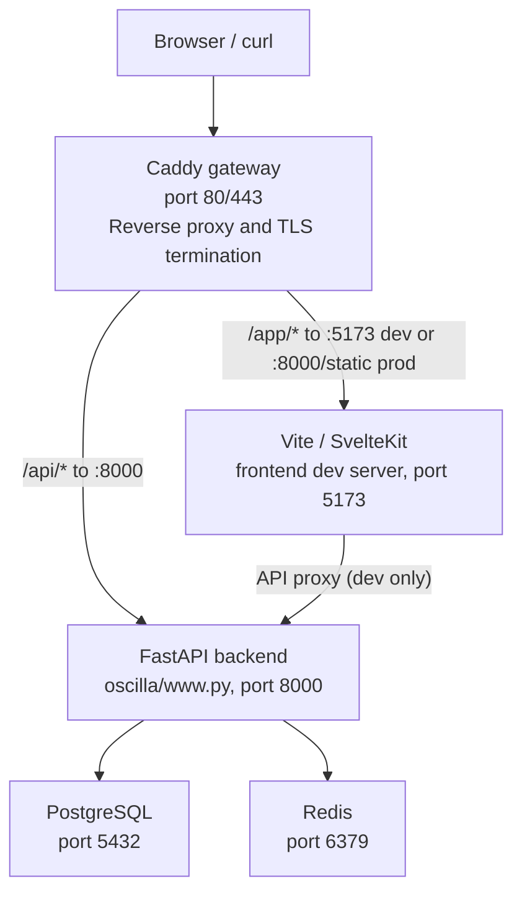
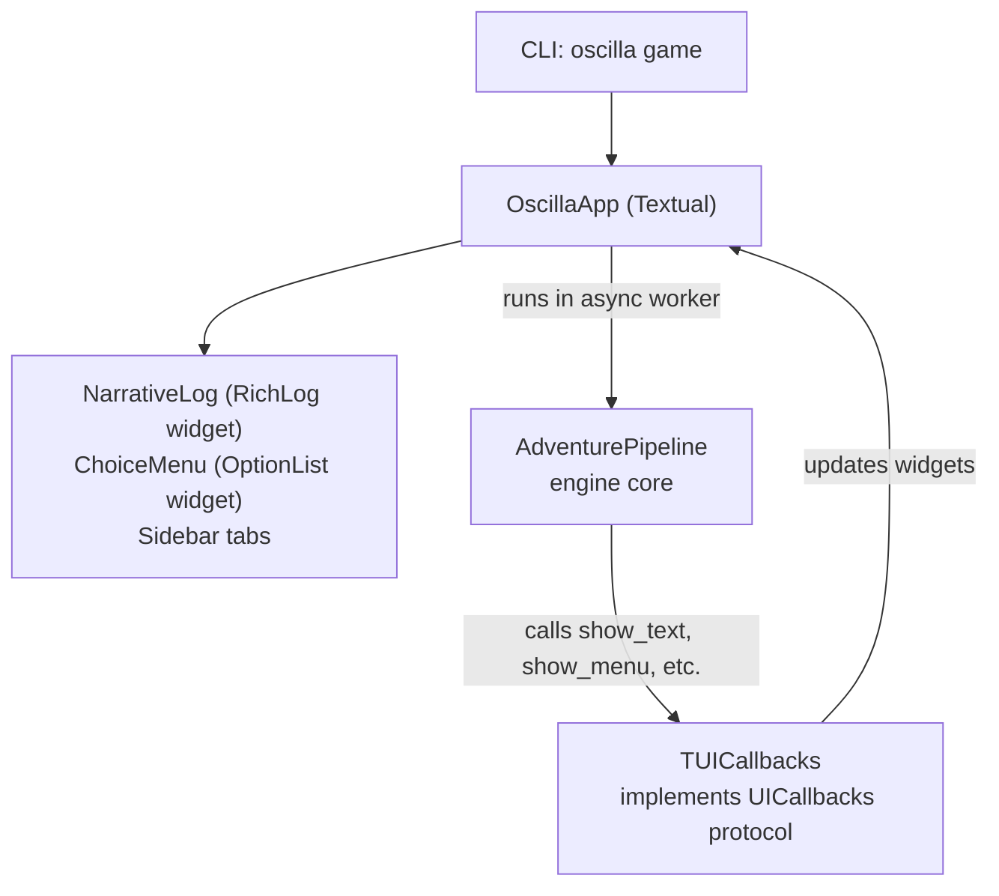
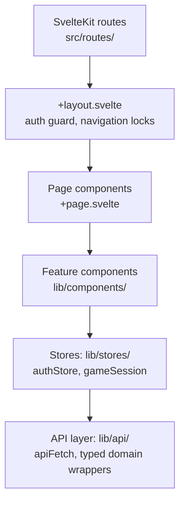
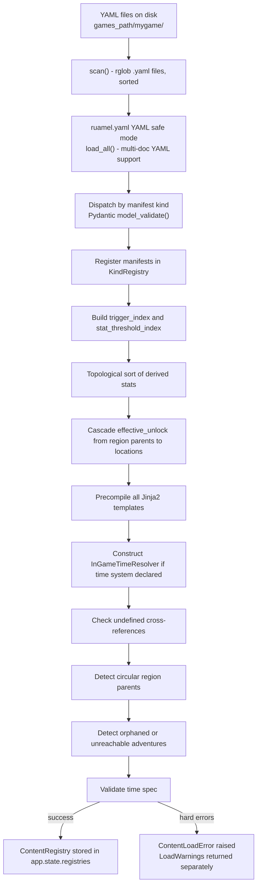
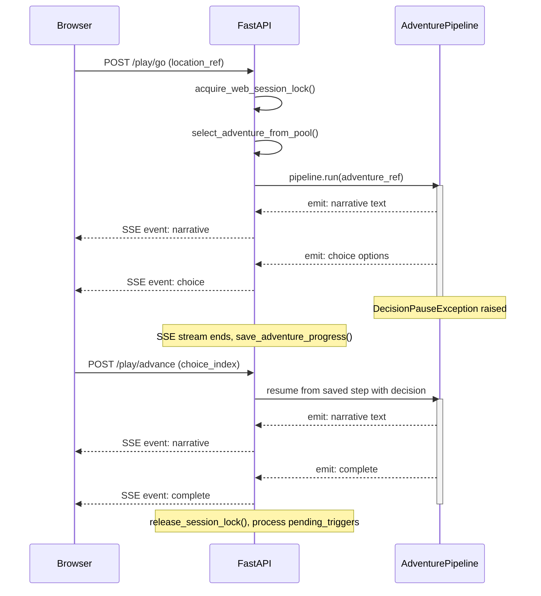
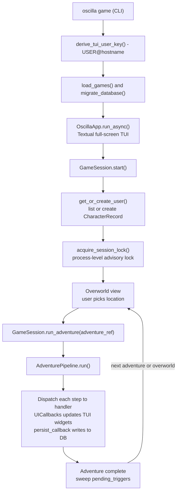
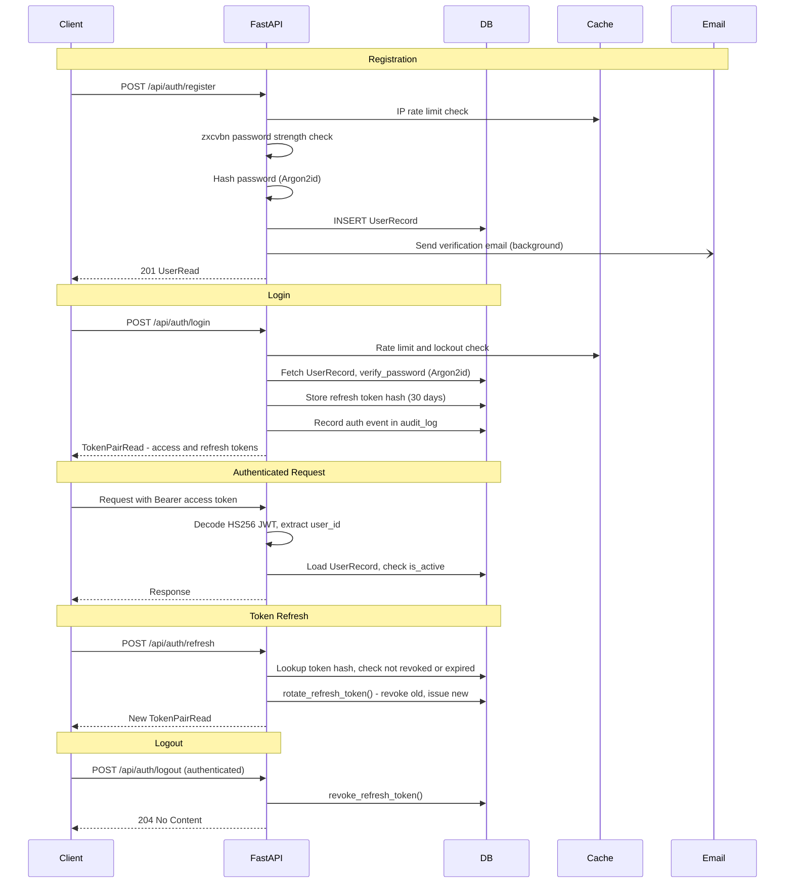
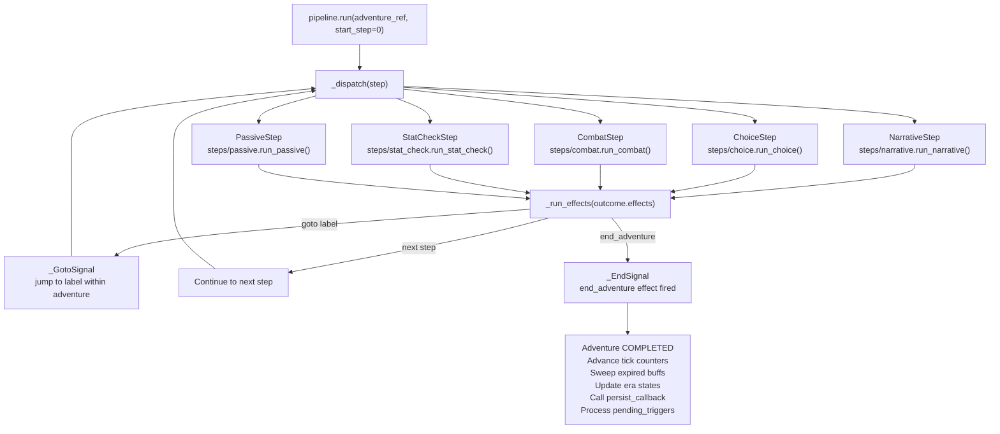
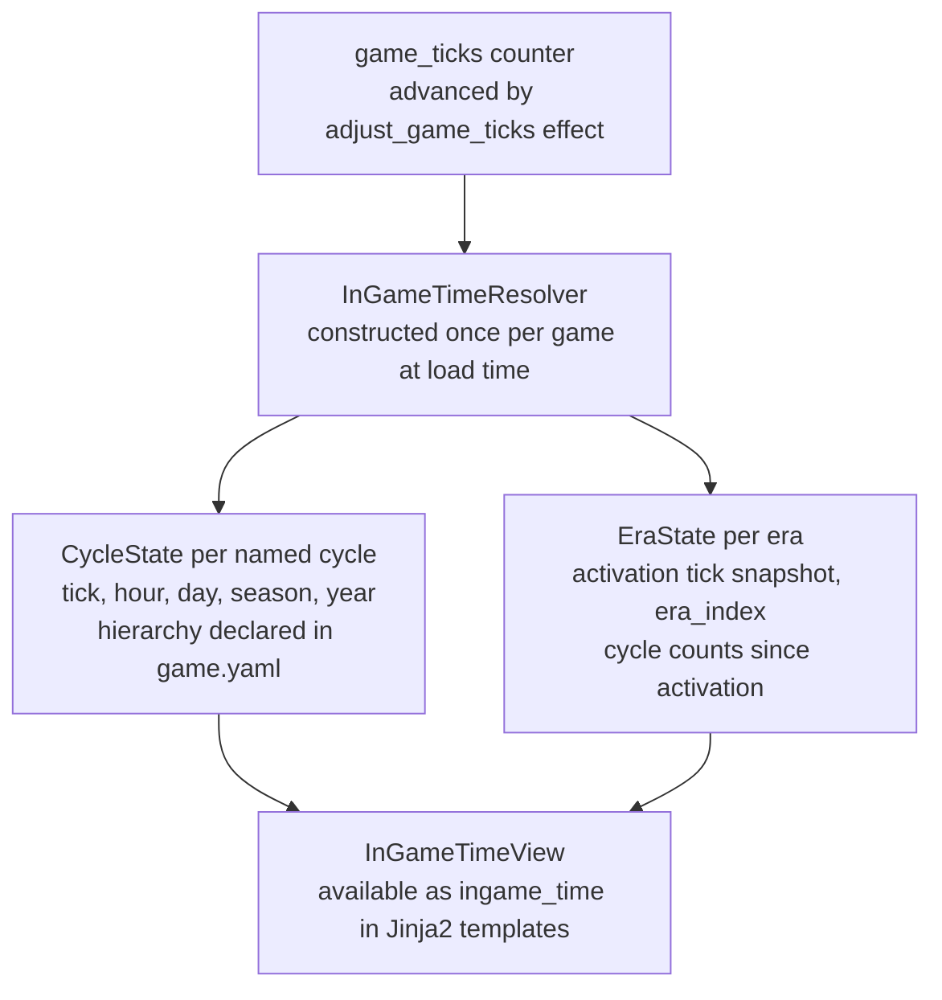
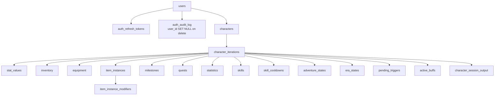

# System Overview

This document is the single-stop reference for understanding how Oscilla works end-to-end. It is intended for contributors and AI agents who need enough architectural context to propose meaningful changes to the system.

For narrower topics, follow the cross-reference links throughout. For a complete index of all documentation, see the [docs root](README.md).

---

## Table of Contents

- [What Oscilla Is](#what-oscilla-is)
- [Deployment Topology](#deployment-topology)
- [Package Structure](#package-structure)
- [Layer-by-Layer Architecture](#layer-by-layer-architecture)
  - [Configuration and Settings](#configuration-and-settings)
  - [Database and Cache](#database-and-cache)
  - [Middleware](#middleware)
  - [API Layer](#api-layer)
  - [Authentication System](#authentication-system)
  - [Game Engine](#game-engine)
  - [TUI Interface](#tui-interface)
  - [Frontend](#frontend)
- [Data Flow Diagrams](#data-flow-diagrams)
  - [Content Loading Pipeline](#content-loading-pipeline)
  - [Web Adventure Execution](#web-adventure-execution)
  - [TUI Adventure Execution](#tui-adventure-execution)
  - [Authentication Flow](#authentication-flow)
- [Key Subsystems](#key-subsystems)
  - [Content Manifest Model](#content-manifest-model)
  - [Condition Evaluator](#condition-evaluator)
  - [Effect System](#effect-system)
  - [Character State](#character-state)
  - [Adventure Pipeline](#adventure-pipeline)
  - [Trigger System](#trigger-system)
  - [In-Game Time System](#in-game-time-system)
  - [Session Locking](#session-locking)
  - [SSE Streaming and Crash Recovery](#sse-streaming-and-crash-recovery)
- [Database Schema](#database-schema)
- [Contribution Guide](#contribution-guide)

---

## What Oscilla Is

Oscilla is a game engine and platform for text-based adventure games defined entirely by YAML content manifests. It ships two interfaces over the same engine core:

- **A web application** — SvelteKit SPA frontend communicating with a FastAPI backend over a REST + SSE API.
- **A TUI (terminal UI)** — Textual-based full-screen terminal app that runs entirely locally against a local SQLite database.

The engine deliberately separates the **platform** (FastAPI, auth, database, frontend) from the **content** (YAML manifests defining regions, adventures, items, enemies, etc.). This means the same engine can host multiple completely different games side-by-side.

See [Design Philosophy](dev/design-philosophy.md) for the principles behind these choices.

---

## Deployment Topology



In production, the SvelteKit app is pre-built and served by FastAPI from `oscilla/static/` (mounted at `/app`). In development, Vite's dev server handles the frontend and proxies API calls to FastAPI.

Both `PostgreSQL` and `Redis` are optional: Oscilla falls back to `SQLite` (file-backed via [platformdirs](dev/database.md)) and an in-memory cache (`SimpleMemoryCache`) when connection details are not configured.

See [Docker](dev/docker.md) and [Deployment Guide](hosting/deployment.md) for setup details.

---

## Package Structure

```
oscilla/
├── www.py              # FastAPI app factory — assembles the full application
├── cli.py              # Typer CLI root — game, version, validate, test_data
├── cli_content.py      # Typer sub-app — oscilla content (list, show, trace, etc.)
├── settings.py         # Thin shim: `settings = Settings()`
├── conf/
│   ├── settings.py     # Main Settings class (pydantic-settings, .env-backed)
│   ├── db.py           # DatabaseSettings mixin
│   └── cache.py        # CacheSettings mixin
├── dependencies/
│   ├── auth.py         # get_current_user, get_verified_user FastAPI deps
│   └── games.py        # get_registry FastAPI dep
├── engine/             # Pure game engine — no FastAPI, no SQLAlchemy
│   ├── models/         # Pydantic manifest models (Adventure, Item, Enemy, ...)
│   ├── loader.py       # load_from_disk → ContentRegistry
│   ├── registry.py     # ContentRegistry, KindRegistry
│   ├── character.py    # CharacterState dataclass
│   ├── pipeline.py     # AdventurePipeline, UICallbacks protocol
│   ├── session.py      # GameSession (TUI flow) + WebPersistCallback
│   ├── web_callbacks.py# WebCallbacks (SSE/web UICallbacks implementation)
│   ├── tui.py          # OscillaApp (Textual TUI + TUICallbacks)
│   ├── conditions.py   # evaluate(condition, player, registry) → bool
│   ├── templates.py    # GameTemplateEngine (sandboxed Jinja2)
│   ├── ingame_time.py  # InGameTimeResolver
│   ├── graph.py        # build_world_graph → WorldGraph
│   ├── semantic_validator.py  # Cross-ref validation
│   ├── steps/
│   │   ├── effects.py  # run_effect — all effect types
│   │   ├── combat.py   # run_combat — turn-based loop
│   │   ├── narrative.py
│   │   ├── choice.py
│   │   ├── stat_check.py
│   │   └── passive.py
│   └── ...             # graph_renderers, tracer, scaffolder, schema_export, ...
├── middleware/
│   ├── logging.py      # RequestLoggingMiddleware
│   └── security.py     # SecurityHeadersMiddleware
├── models/
│   ├── base.py         # SQLAlchemy Base
│   ├── user.py         # UserRecord
│   ├── auth.py         # AuthRefreshTokenRecord
│   ├── auth_audit_log.py
│   ├── character.py    # CharacterRecord
│   ├── character_iteration.py  # CharacterIterationRecord + all child tables
│   ├── character_session_output.py
│   └── api/            # Pydantic response/request models (not ORM)
├── routers/
│   ├── health.py       # GET /health, GET /ready
│   ├── auth.py         # POST /api/auth/*
│   ├── games.py        # GET /api/games/*
│   ├── characters.py   # CRUD /api/characters/*
│   ├── play.py         # POST /api/characters/{id}/play/* (SSE)
│   └── overworld.py    # GET /api/characters/{id}/overworld
└── services/
    ├── auth.py         # Password hashing, JWT, refresh tokens, lockout, email
    ├── cache.py        # configure_caches, get_cache, NoOpCache
    ├── character.py    # Load/save character state from/to DB
    ├── db.py           # Engine, session factory, migrations, test_data
    ├── email.py        # send_email (aiosmtplib)
    ├── jinja.py        # Email template Jinja2 env
    ├── user.py         # derive_tui_user_key, get_or_create_user
    ├── password_strength.py  # zxcvbn validation
    └── rate_limit.py   # Cache-backed rate limiting
```

---

## Layer-by-Layer Architecture

### Configuration and Settings

All configuration lives in `oscilla/conf/settings.py` using [pydantic-settings](dev/settings.md). The `Settings` class inherits from two mixins:

- `DatabaseSettings` (`conf/db.py`) — `database_url`, `games_path`
- `CacheSettings` (`conf/cache.py`) — Redis connection details, TTLs, `cache_enabled` kill-switch

Key setting groups:

| Group         | Settings                                                                                                                                              |
| ------------- | ----------------------------------------------------------------------------------------------------------------------------------------------------- |
| Database      | `database_url` (auto-derived as local SQLite when unset), `games_path`                                                                                |
| Cache         | `cache_enabled`, `cache_redis_host/port`, `cache_default_ttl` (300 s), `cache_persistent_ttl` (3600 s)                                                |
| Auth tokens   | `jwt_secret` (SecretStr), `access_token_expire_minutes` (15), `refresh_token_expire_days` (30)                                                        |
| Email tokens  | `email_verify_token_expire_hours` (24), `password_reset_token_expire_hours` (1)                                                                       |
| SMTP          | `smtp_host/port/user/password`, `smtp_from_address`, `smtp_use_tls`                                                                                   |
| Rate limiting | `max_login_attempts_per_hour` (10), `max_login_attempts_before_lockout` (5), `lockout_duration_minutes` (15), `max_registrations_per_hour_per_ip` (5) |
| Password      | `min_password_strength` (zxcvbn score 0–4, default 2)                                                                                                 |
| Session       | `stale_session_threshold_minutes` (10) — threshold for force-taking a web session lock                                                                |
| CORS          | `cors_origins`                                                                                                                                        |
| App           | `base_url`, `debug`, `require_email_verification`, `uvicorn_workers`, `log_level`                                                                     |

Settings are loaded once at startup and exposed globally via `from oscilla.settings import settings`.

### Database and Cache

**Database:** SQLAlchemy 2.0 async ORM. The engine is created in `services/db.py` with `PRAGMA journal_mode=WAL` applied for SQLite. Alembic handles schema migrations (run automatically on startup via `migrate_database()`). See [Database](dev/database.md).

**Cache:** aiocache with two named aliases registered in `services/cache.py`:

- `"default"` — `SimpleMemoryCache` (or `NoOpCache` when disabled). Used for rate limiting and lockout counters.
- `"persistent"` — `RedisCache` when `cache_redis_host` is set; falls back to `SimpleMemoryCache`. Used for longer-lived data.

`NoOpCache` is a drop-in that silently discards all writes and returns misses on all reads, allowing the app to run without a cache backend. See [Cache](dev/cache.md).

### Middleware

Three middleware layers wrap every request (outermost first at request time):

1. **`RequestLoggingMiddleware`** — assigns a `request_id` UUID to `request.state`, logs request start/end with method, path, status code, duration in milliseconds, and authenticated `user_id` when present.

2. **`SecurityHeadersMiddleware`** — injects `Strict-Transport-Security`, `X-Content-Type-Options`, `X-Frame-Options: DENY`, `Content-Security-Policy`, and `Referrer-Policy` headers on every response.

3. **`CORSMiddleware`** (Starlette built-in) — permits cross-origin requests from `settings.cors_origins`.

### API Layer

`oscilla/www.py` is the FastAPI app factory. Key assembly steps:

1. `lifespan` startup event:
   - Calls `configure_caches()` to register cache backends.
   - Iterates `settings.games_path`; loads each directory containing a `game.yaml` with `load_from_disk()`, stores the resulting `ContentRegistry` in `app.state.registries[game_name]`.

2. Middleware stack added (outermost first): `SecurityHeadersMiddleware`, `RequestLoggingMiddleware`, `CORSMiddleware`.

3. Routers mounted under `/api`:

| Router       | Mount               | Requires Auth       |
| ------------ | ------------------- | ------------------- |
| `health`     | `/health`, `/ready` | No                  |
| `auth`       | `/api/auth`         | No (most endpoints) |
| `games`      | `/api/games`        | No                  |
| `characters` | `/api/characters`   | Yes                 |
| `play`       | `/api`              | Yes                 |
| `overworld`  | `/api`              | Yes                 |

1. Static files mounted at `/static` and `/app` (SvelteKit build). Root `/` redirects to `/app`.

The OpenAPI docs are available at `/api/docs` (Swagger UI), `/api/redoc`, and `/api/openapi.json`. See [API](dev/api.md).

### Authentication System

Oscilla uses two identity models:

- **Web users** — identified by email address + password; registered via `POST /api/auth/register`
- **TUI users** — identified by `USER@hostname` key; auto-created on first `oscilla game` run

Both identity types share the same `UserRecord` table.

**Token architecture:**

- **Access tokens** — HS256 JWT, 15-minute lifetime, held in memory only (never `localStorage`).
- **Refresh tokens** — opaque UUID, stored in the browser's `sessionStorage`, SHA-256 hash stored in the database. Rotated on every use (one-time tokens).
- **Email/reset tokens** — HMAC-signed via `itsdangerous`, short-lived (1–24 hours).

**Security hardening:**

- Argon2id password hashing via `argon2-cffi`
- Per-IP registration rate limiting (5/hour)
- Per-email login rate limiting (10/hour) with account lockout after 5 failures (15-minute lockout window)
- zxcvbn password strength enforcement
- All security events (login, logout, registration, password change) written to `auth_audit_log`

See [Authentication](dev/authentication.md) for the full specification.

### Game Engine

The engine (`oscilla/engine/`) is intentionally **pure**: it has no FastAPI imports, no SQLAlchemy imports, and no direct I/O. Everything is passed in as dependencies. This makes the engine independently testable and reusable across both the web and TUI interfaces.

The engine consists of several cooperating subsystems:

| Subsystem       | Location                  | Purpose                                                     |
| --------------- | ------------------------- | ----------------------------------------------------------- |
| Content models  | `engine/models/`          | Pydantic manifest classes for all YAML kinds                |
| Loader          | `engine/loader.py`        | Parses YAML files → `ContentRegistry`                       |
| Registry        | `engine/registry.py`      | Typed in-memory index of all loaded manifests               |
| Character state | `engine/character.py`     | `CharacterState` dataclass — the mutable game state         |
| Pipeline        | `engine/pipeline.py`      | Executes adventure steps, dispatches to step handlers       |
| Step handlers   | `engine/steps/`           | Individual step type logic (combat, choice, narrative, …)   |
| Conditions      | `engine/conditions.py`    | Pure boolean evaluator against `CharacterState`             |
| Effects         | `engine/steps/effects.py` | Mutates `CharacterState` based on effect definitions        |
| Templates       | `engine/templates.py`     | Sandboxed Jinja2 for narrative text and numeric expressions |
| In-game time    | `engine/ingame_time.py`   | Converts `game_ticks` to cycle/era state                    |
| Session         | `engine/session.py`       | TUI game session lifecycle + `WebPersistCallback`           |
| TUI             | `engine/tui.py`           | Textual terminal application                                |
| Web callbacks   | `engine/web_callbacks.py` | SSE event queue for the web interface                       |

See [Game Engine](dev/game-engine.md) for developer documentation.

### TUI Interface

The TUI is a [Textual](https://textual.textualize.io/) full-screen terminal application defined in `engine/tui.py`. The architecture is a three-layer stack:



The pipeline runs in an async worker thread managed by Textual. See [TUI Interface](dev/tui.md).

### Frontend

The frontend is a SvelteKit SPA built with `adapter-static` and served from `/app`. In development, Vite proxies `/api` to the FastAPI backend.

**Architecture layers:**



**Key stores:**

- `authStore` — manages `{ user, accessToken, initialized }`. Access token held in memory; refresh token in `sessionStorage`. Handles automatic token refresh on 401.
- `gameSession` — manages adventure state: `mode` transitions (`idle → loading → adventure → complete → overworld`), `narrativeLog`, `pendingEvent`. Wraps SSE stream consumption and event application.

See [Frontend](dev/frontend.md).

---

## Data Flow Diagrams

### Content Loading Pipeline

This happens once per game at server startup (or CLI invocation).



See [Load Warnings](dev/load-warnings.md) for the warning system.

### Web Adventure Execution

The web play flow uses Server-Sent Events (SSE) to stream adventure steps to the browser in real time.



On browser disconnect or crash, the session output is persisted to the `character_session_output` table. `GET /play/current` allows the browser to recover the most recent session state on reconnect.

### TUI Adventure Execution



### Authentication Flow



---

## Key Subsystems

### Content Manifest Model

All game content is described by YAML manifests. Every manifest follows the same envelope:

```yaml
apiVersion: oscilla/v1
kind: Adventure # determines which Pydantic model validates the spec
metadata:
  name: my-adventure # unique slug within the kind, used as a cross-reference key
spec:
  # kind-specific fields
```

Supported manifest kinds and their primary spec fields:

| Kind              | Purpose                    | Key Spec Fields                                                                          |
| ----------------- | -------------------------- | ---------------------------------------------------------------------------------------- |
| `Game`            | Game-level configuration   | `displayName`, `time`, `triggers`, `passives`, `equipment_slots`, `character_creation`   |
| `CharacterConfig` | Starting stat definitions  | `stats: List[StatDefinition]`, `equipment_slots`, `skill_category_rules`                 |
| `Region`          | World hierarchy node       | `displayName`, `parent`, `unlock` (Condition)                                            |
| `Location`        | Explorable place           | `displayName`, `region`, `unlock`, `adventures` (weighted pool)                          |
| `Adventure`       | Sequence of steps          | `steps`, `ticks`, `trigger_adventures`, `repeat_limit`, `repeat_cooldown`                |
| `CombatSystem`    | Pluggable combat ruleset   | `defeat_conditions`, `damage_formulas`, `turn_order`, `player_turn_mode`, `combat_stats` |
| `Enemy`           | Combat opponent            | `stats` (free-form dict), `on_defeat_effects`, `loot`, `skills`                          |
| `Item`            | Inventory object           | `category`, `stackable`, `equip` (slots, stat_modifiers), `use_effects`, `charges`       |
| `Skill`           | Activatable ability        | `contexts`, `cost`, `cooldown`, `use_effects`, `requires`                                |
| `Buff`            | Timed combat modifier      | `duration`, `modifiers`, `per_turn_effects`                                              |
| `Quest`           | Multi-stage storyline      | `entry_stage`, `stages` (DAG with advance_on, terminal)                                  |
| `Archetype`       | Persistent character state | `gain_effects`, `lose_effects`, `passive_effects`                                        |
| `LootTable`       | Reusable drop table        | `groups` (weighted/unique sampling)                                                      |
| `Recipe`          | Crafting formula           | `inputs`, `output`                                                                       |

A single YAML file may contain multiple manifests separated by `---` (multi-document YAML).

See [Adventures](authors/adventures.md), [Items](authors/items.md), [Enemies](authors/enemies.md), [Combat Systems](authors/combat-systems.md), etc. for full authoring references.

### Condition Evaluator

The condition evaluator (`engine/conditions.py`) is the universal gate used everywhere a boolean check is needed: adventure `requires`, location unlock, choice visibility, item equip gates, quest advancement, passive effect guards, etc.

```python
evaluate(condition: Condition | None, player: CharacterState, registry: ContentRegistry) -> bool
```

`None` → `True` (unconditional).

Conditions are Pydantic union types discriminated by a `type` field. The evaluator is a pure recursive `match`/`case` dispatch — no side effects. Logical combinators (`all`, `any`, `not`) allow arbitrarily nested expressions.

Condition categories:

| Category        | Examples                                                                                              |
| --------------- | ----------------------------------------------------------------------------------------------------- |
| Progression     | `level`, `prestige_count`, `adventures_completed`, `enemies_defeated`                                 |
| Milestones      | `milestone`, `milestone_ticks_elapsed`                                                                |
| Stats           | `character_stat`                                                                                      |
| Inventory       | `item`, `item_equipped`, `any_item_equipped`, `item_held_label`                                       |
| Quests          | `quest_stage`                                                                                         |
| Skills          | `skill`                                                                                               |
| Archetypes      | `has_archetype`, `has_all_archetypes`, `archetype_count`, `archetype_ticks_elapsed`                   |
| Identity        | `name_equals`, `pronouns`                                                                             |
| Real-world time | `date_is`, `date_between`, `day_of_week_is`, `month_is`, `season_is`, `moon_phase_is`, `time_between` |
| In-game time    | `game_calendar_cycle`, `game_calendar_era`, `game_calendar_time`                                      |
| Logic           | `all` (AND), `any` (OR), `not`                                                                        |
| Reuse           | `custom` — references a named `CustomCondition` manifest resolved via the registry                    |

See [Conditions](authors/conditions.md) for the authoring reference, including [Custom Conditions](authors/conditions.md#custom-conditions).

### Effect System

Effects (`engine/steps/effects.py`) are the only place `CharacterState` is mutated during gameplay. `run_effect(effect, player, registry, tui, combat, ctx)` dispatches on the effect `type` field.

Effect categories:

| Category   | Types                                       |
| ---------- | ------------------------------------------- |
| Stats      | `stat_change`, `stat_set`                   |
| Items      | `item_drop`, `use_item`                     |
| Milestones | `milestone_grant`                           |
| Skills     | `skill_grant`, `skill_revoke`               |
| Archetypes | `archetype_add`, `archetype_remove`         |
| Quests     | `quest_activate`, `quest_fail`              |
| Combat     | `heal`, `apply_buff`, `dispel`              |
| Time       | `adjust_game_ticks`                         |
| Flow       | `end_adventure`, `emit_trigger`, `prestige` |
| Identity   | `set_name`, `set_pronouns`                  |

Side-effect chains triggered by effects:

- `stat_change` / `stat_set` → `_recompute_derived_stats()` → `_fire_threshold_triggers()`
- `milestone_grant` → quest stage advancement check → quest fail condition re-evaluation
- `archetype_add` → fires `gain_effects` of the archetype
- `archetype_remove` → fires `lose_effects` of the archetype

See [Effects](authors/effects.md) for the authoring reference.

### Character State

`CharacterState` (`engine/character.py`) is a plain Python dataclass — not an ORM model and not a Pydantic model. It is the runtime representation of all mutable game state for a single character iteration.

Key fields:

| Field              | Type                             | Description                                        |
| ------------------ | -------------------------------- | -------------------------------------------------- |
| `stats`            | `Dict[str, int \| bool \| None]` | All stored stat values by name                     |
| `inventory`        | `Dict[str, int]`                 | Stackable item counts (ref → count)                |
| `item_instances`   | `Dict[str, ItemInstance]`        | Non-stackable items keyed by UUID                  |
| `equipment`        | `Dict[str, str]`                 | Equipment slot → instance UUID                     |
| `milestones`       | `Dict[str, GrantRecord]`         | Named boolean milestones with tick metadata        |
| `archetypes`       | `Dict[str, GrantRecord]`         | Active archetypes                                  |
| `known_skills`     | `Set[str]`                       | Skills the character has learned                   |
| `active_buffs`     | `List[StoredBuff]`               | Persistent cross-combat buff state                 |
| `quest_log`        | `Dict[str, QuestLogEntry]`       | Active/completed/failed quests                     |
| `statistics`       | `CharacterStatistics`            | Event counters (enemies defeated, etc.)            |
| `active_adventure` | `AdventurePosition \| None`      | Current adventure position (for resume)            |
| `internal_ticks`   | `int`                            | Engine tick counter (each adventure costs `ticks`) |
| `game_ticks`       | `int`                            | In-game time ticks (separate from internal)        |
| `pending_triggers` | `List[str]`                      | Queue of deferred adventure refs to run            |
| `prestige_count`   | `int`                            | Number of prestige cycles completed                |

Key methods:

- `effective_stats(registry)` — applies equipment stat modifiers and passive bonuses on top of raw stored stats
- `available_skills(registry)` — union of `known_skills`, equipment-granted skills, and passive-granted skills
- `is_adventure_eligible(registry, adventure_ref)` — checks repeat limits, cooldowns, `requires` condition
- `sweep_expired_buffs()` — removes buffs whose tick/real-time expiry has passed

Persistence is handled entirely in `services/character.py`, which maps `CharacterState` to and from the database tables.

### Adventure Pipeline

`AdventurePipeline` (`engine/pipeline.py`) executes a single adventure:



The pipeline is interface-agnostic. It communicates with the UI through the `UICallbacks` protocol, which has three implementations:

| Implementation | Location                   | Used by            |
| -------------- | -------------------------- | ------------------ |
| `TUICallbacks` | `engine/tui.py`            | Textual TUI        |
| `WebCallbacks` | `engine/web_callbacks.py`  | FastAPI SSE routes |
| `MockTUI`      | `tests/engine/conftest.py` | Automated tests    |

The web implementation (`WebCallbacks`) raises a `DecisionPauseException` at each decision point (choice, text input, skill menu) to unwind the call stack and end the SSE stream. The adventure position is persisted to the database, and the next HTTP request resumes execution from that point.

### Trigger System

Triggers are adventures fired automatically in response to game events. They are defined in `game.yaml`:

```yaml
triggers:
  - name: on_character_create
    adventure: intro-adventure
  - name: on_stat_threshold
    stat: reputation
    threshold: 50
    mode: highest
    adventure: reputation-milestone
```

Trigger types:

| Type                                  | Fires when                                                                        |
| ------------------------------------- | --------------------------------------------------------------------------------- |
| Named trigger (`emit_trigger` effect) | An adventure step fires `emit_trigger: trigger_name`                              |
| `on_character_create`                 | A new character is created                                                        |
| `on_stat_threshold`                   | A stat crosses a defined threshold (modes: `each` crossing, or `highest` reached) |
| `on_game_rejoin`                      | A user resumes playing (web session reconnect)                                    |

Trigger adventures are enqueued in `CharacterState.pending_triggers` and processed immediately after the current adventure completes.

### In-Game Time System

The in-game time system (`engine/ingame_time.py`) is opt-in, declared in `game.yaml`. It converts a `game_ticks` counter into a structured calendar view.



`game_ticks` advances via the `adjust_game_ticks` effect and is separate from `internal_ticks` — one adventure can cost 1 internal tick but advance game time by an entire day.

Era transitions are evaluated after each completed adventure in `pipeline.py`.

See [In-Game Time System](authors/ingame-time.md) and the [Cookbook: In-Game Time Patterns](authors/cookbook/ingame-time-patterns.md).

### Session Locking

Because both the TUI and web interfaces write to the same database, Oscilla uses a soft advisory lock to prevent two sessions from advancing the same character simultaneously.

- **TUI lock** — `acquire_session_lock()` / `release_session_lock()` — process-level, not stored in the database.
- **Web lock** — `session_token` UUID + `session_token_acquired_at` columns on `CharacterIterationRecord`. A running web session holds this token. `force_acquire_web_session_lock()` allows stealing a stale lock (threshold: `settings.stale_session_threshold_minutes`).
- **Conflict resolution** — `POST /play/resolve-lock` allows the browser to force-take a stale lock. The previous session's in-flight adventure is abandoned.

### SSE Streaming and Crash Recovery

Web adventure execution streams events to the browser as Server-Sent Events. Each event is a JSON payload with a `type` field:

| Event type     | Payload                                            |
| -------------- | -------------------------------------------------- |
| `narrative`    | `{ text }`                                         |
| `choice`       | `{ prompt, options }`                              |
| `combat_round` | `{ player_hp, enemy_hp, player_name, enemy_name }` |
| `ack`          | `{}` — wait for user acknowledgment                |
| `text_input`   | `{ prompt }`                                       |
| `skill_menu`   | `{ skills }`                                       |
| `complete`     | `{ adventure_ref }` — adventure finished           |
| `error`        | `{ message }`                                      |

All events are persisted to `character_session_output` as they fire. `GET /api/characters/{id}/play/current` returns the full event log plus the current pending decision event, enabling the browser to reconstruct the adventure display after a page refresh or crash.

---

## Database Schema

### Entity Relationship Overview



### Key Design Decisions

**`CharacterRecord` vs `CharacterIterationRecord`:** A `CharacterRecord` is the permanent identity (name, owner). A `CharacterIterationRecord` is one prestige cycle's run state. Prestige creates a new iteration at `iteration+1`; the old iteration is archived (never deleted by default). Only one iteration may be active at a time, enforced by a partial unique index: `UNIQUE (character_id) WHERE is_active IS TRUE`.

**Optimistic concurrency control:** `CharacterIterationRecord.version` is a SQLAlchemy OCC column. Concurrent writes from two processes on the same iteration will cause a `StaleDataError` rather than silently overwriting data.

**No JSON columns (with one exception):** All character state is stored in normalized child tables using primitive types for maximum portability across SQLite and PostgreSQL. The only exception is `adventure_step_state` (JSON), which stores ephemeral mid-step pipeline state for adventure resumption.

**`auth_audit_log` orphan retention:** The `user_id` FK is `SET NULL` on user deletion rather than `CASCADE DELETE`. This preserves audit history for compliance purposes even after account deletion.

See the [Database](dev/database.md) developer doc.

---

## Contribution Guide

### Development Setup

1. Install dependencies: `make install`
2. Copy `.env.example` to `.env` and configure (database, SMTP, etc.)
3. Start services: `docker compose up -d`
4. Run tests: `make pytest`
5. Run all checks: `make tests`
6. Auto-fix formatting: `make chores`

For a full reference of every `make` target, see [Makefile](dev/makefile.md). For Docker service topology and hot-reload, see [Docker](dev/docker.md).

### How to Add a New API Endpoint

1. Identify the correct router in `oscilla/routers/` or create a new one.
2. Define Pydantic request and response models in `oscilla/models/api/` (separate `Create`/`Read`/`Update` models per resource).
3. Implement the route handler; inject `get_current_user` for auth, `get_registry` for game context.
4. Register a new router in `oscilla/www.py` under the `/api` prefix.
5. Write tests under `tests/routers/` mirroring the module path.
6. If a new database table is needed, add an ORM model in `oscilla/models/` and run `make create_migration MESSAGE="description"`.

See [API](dev/api.md), [Authentication](dev/authentication.md), and [Database](dev/database.md).

### How to Add a New Engine Feature

The engine (`oscilla/engine/`) has no framework dependencies. Changes here affect both the TUI and web interfaces simultaneously.

**New condition type:**

1. Add a new Pydantic model to `engine/models/` and include it in the `Condition` union type.
2. Add a `case` branch in `engine/conditions.py`.
3. Add tests in `tests/engine/` using in-memory `CharacterState` instances (no YAML, no DB).

**New effect type:**

1. Add a new Pydantic model and include it in the `Effect` union type.
2. Add a `case` branch in `engine/steps/effects.py`.
3. Tests in `tests/engine/steps/test_effects.py`.

**New step type:**

1. Add a Pydantic step model and include it in the `Step` union.
2. Implement a handler module in `engine/steps/`.
3. Add a dispatch case in `pipeline.py`.
4. Add a `UICallbacks` method if the step requires user interaction and implement it in all three callback implementations (`TUICallbacks`, `WebCallbacks`, `MockTUI`).

**New manifest kind:**

1. Add a Pydantic model in `engine/models/`.
2. Register it in `MANIFEST_REGISTRY` in `engine/loader.py`.
3. Add a typed `KindRegistry[T]` to `ContentRegistry`.
4. Add semantic validation checks to `engine/semantic_validator.py`.
5. Add authoring documentation in `docs/authors/` and update the [Authors README](authors/README.md) table of contents.

### How to Extend the Frontend

See [Frontend](dev/frontend.md) for the SvelteKit project structure. The key patterns:

- Add API types to `frontend/src/lib/api/types.ts` first.
- Add a typed API wrapper in the appropriate `frontend/src/lib/api/` module.
- New pages go in `frontend/src/routes/` following SvelteKit file-based routing.
- Shared state goes in a new store under `frontend/src/lib/stores/`.
- Run `make frontend_check` for type errors; `make frontend_test` for unit tests.

### Adding Content (Game Author Tasks)

Content changes (new adventures, items, enemies, etc.) do not require any code changes. See:

- [Getting Started](authors/getting-started.md) — build a minimal working game
- [Author CLI Reference](authors/cli.md) — validate, test, scaffold, and visualize content
- [World Building](authors/world-building.md), [Adventures](authors/adventures.md), [Items](authors/items.md), etc.

### Testing Practices

See [Testing](dev/testing.md) for the full testing guide. Key principles:

- Tests live in `tests/` mirroring the `oscilla/` package structure.
- All shared fixtures must be in `tests/conftest.py`.
- Engine unit tests construct `CharacterState` and manifest models directly in Python — no YAML loading, no database.
- Integration tests that exercise the loader use minimal fixture sets in `tests/fixtures/content/<scenario>/`, never the `content/` game library.
- Use the `mock_tui` fixture for all pipeline tests — no real terminal output.
- Use the FastAPI test client (with a test DB fixture backed by in-memory SQLite) for router tests.

### CI/CD

All checks run in GitHub Actions. The full local equivalent is `make tests`. See [GitHub Actions](dev/github.md) for the workflow matrix.

Pre-commit hooks: `make pre-commit`.

### Proposing Changes (OpenSpec)

Oscilla uses an OpenSpec workflow for proposing and implementing larger changes. A proposal consists of `proposal.md`, `design.md`, and `tasks.md` placed under `openspec/changes/<change-name>/`. Before writing a proposal:

1. Read this document and the relevant existing docs.
2. Pull current library docs via Context7 for any libraries whose APIs are relevant.
3. Review at least one recent `design.md` in `openspec/changes/archive/` to calibrate detail level.
4. Proposals must include a Documentation Plan and Testing Philosophy section — these are reviewed with the same rigor as the implementation plan.
