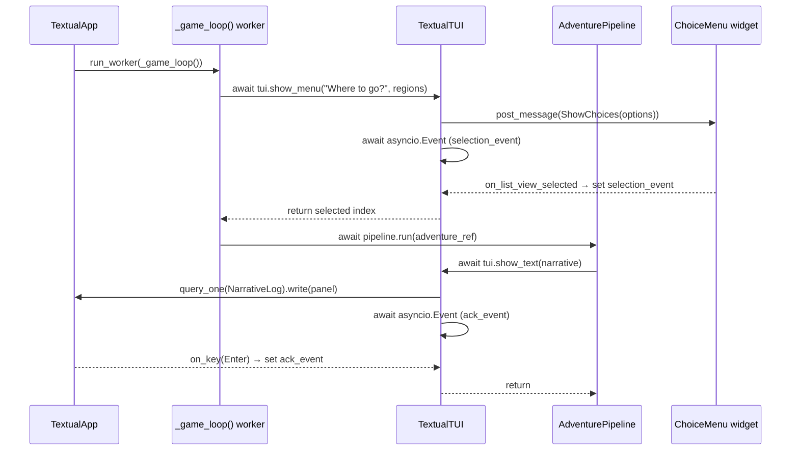

## Context

The current game TUI is a synchronous blocking REPL built on Rich's `IntPrompt.ask()` and `Prompt.ask()`. Everything scrolls — player status is printed at the top of each iteration and immediately lost as the game produces more output. Menus require typing a number and pressing Enter. The entire pipeline (`AdventurePipeline`, all step handlers, `TUICallbacks`) is synchronous, which makes it impossible to reuse in an async context (FastAPI WebSocket sessions, future multiplayer server-side sessions).

This change replaces the synchronous pipeline and REPL TUI with a fully async pipeline and a full-screen Textual application that maintains a persistent sidebar.

## Goals / Non-Goals

**Goals:**

- Make `TUICallbacks`, `AdventurePipeline`, and all step handlers fully `async`
- Replace `RichTUI` + scrolling REPL with a Textual `App` featuring a persistent player status sidebar and region context panel
- Support arrow-key menu navigation instead of number entry
- Maintain a scrollable narrative log as the primary left-panel content
- Enable the same `AdventurePipeline` to be driven by a future `WebSocketTUI` without any pipeline changes
- Enable `asyncio_mode = "auto"` across the test suite

**Non-Goals:**

- Persist player state across game sessions (out of scope for this change)
- Multiplayer or server-side sessions (future work enabled by this change)
- A web-based UI (future work)
- Reusing any code from the old `RichTUI` or `show_status()` function

## Decisions

### Decision: Fully async pipeline over worker-thread bridge

**Choice:** Make every layer of the pipeline `async def` end-to-end.

**Rationale:** A worker-thread bridge (running the sync pipeline in a `threading.Thread` and using `queue.Queue` to pass messages to Textual) works but creates two execution contexts that share mutable `PlayerState`. Threading + mutable shared state is a correctness hazard. Full async is simpler, safer, and directly enables the FastAPI WebSocket TUI that is an explicit future goal. The conversion is mechanical — every `def` becomes `async def`, every call becomes `await`.

**Alternative considered:** Keep `TUICallbacks` sync and use `run_in_executor` to wrap Rich's blocking prompts. Rejected: this is throwaway code — we'd undo it when building the Textual TUI anyway, and it leaves the thread-safety problem open for FastAPI reuse.

### Decision: Textual as the TUI library

**Choice:** Use [Textual](https://textual.textualize.io/) backed by Rich.

**Rationale:** Textual is maintained by the same team as Rich (already a dependency), runs on the same event loop as our async pipeline, has first-class async widget support, and is specifically designed for exactly this use case. No other terminal UI library has the same combination of async native support and Rich compatibility.

**Alternative considered:** `curses` / `urwid` — lower level, no Rich integration, significantly more implementation work.

### Decision: Game loop runs as a Textual async worker

**Choice:** The adventure game loop runs as `app.run_worker(self._game_loop(), exclusive=True)`.

**Rationale:** Textual workers are plain `async def` coroutines scheduled on the app's event loop. The `_game_loop()` coroutine calls `await tui.show_menu(...)` which posts a message to the UI and then `await`s an `asyncio.Event`. When the player makes a selection the event fires and the game loop resumes — clean, no threads, no queues, no bridges.

**Alternative considered:** Scheduling via `asyncio.create_task` outside Textual's worker system — this works but loses Textual's built-in worker lifecycle management (cancellation on app exit, error propagation).

### Decision: Inline `_select_region` / `_select_location` into the Textual game worker

**Choice:** The standalone `_select_region` and `_select_location` functions in `cli.py` are absorbed into the Textual app's `_game_loop()` worker method.

**Rationale:** These functions exist solely to implement the region/location flow of the REPL game loop. With no backwards compatibility to preserve, inlining them eliminates two helper functions that only existed as a decomposition of the old `while True` loop. The Textual app _is_ the game entry point now; its methods own this logic.

### Decision: Status sidebar uses reactive refresh, not polling

**Choice:** `TextualTUI` holds a reference to `PlayerState`. After each `await tui.*` call returns, and before the game loop moves on, the app calls `self._refresh_status()`. This is explicit reactive push, not polling.

**Rationale:** Polling (e.g., `set_interval`) introduces a delay between state changes and visible refresh, and runs on a background timer that outlives the game loop. An explicit refresh in the `TextualTUI` methods guarantees the sidebar is current before anything new is displayed, with zero timer overhead.

### Decision: Replace `asyncio_mode = "auto"` project-wide

**Choice:** Add `asyncio_mode = "auto"` to `[tool.pytest.ini_options]` in `pyproject.toml`.

**Rationale:** With the pipeline and step handler tests all becoming `async def`, the `@pytest.mark.asyncio` decorator on every test function becomes mechanical noise. `asyncio_mode = "auto"` makes every `async def test_*` function automatically async without any marker. The project already has `asyncio_default_fixture_loop_scope = "function"` set, which is the companion setting. The existing async tests in `tests/services/test_cache.py` are unaffected.

### Decision: `asyncio_mode = "auto"` replaces explicit markers

**Choice:** Remove `@pytest.mark.asyncio` from all tests when enabling `asyncio_mode = "auto"`.

**Rationale:** Mixing auto mode with explicit markers is redundant. Consistent removal is cleaner.

## Layout Design

Normal view:

```
┌─ Oscilla ────────────────────────────────────────────────────────────────┐
│                                                                           │
│  ┌─ Narrative Log (scrollable) ───────────┐  ┌─ Player ───────────────┐  │
│  │                                        │  │ Hero          Level 3  │  │
│  │  You stand at the entrance of the      │  │ HP  ████████░░  45/50  │  │
│  │  dungeon. Torchlight flickers across   │  │ XP  ████░░░░░░ 120/300 │  │
│  │  ancient stone walls...                │  │                        │  │
│  │                                        │  │ Strength:   12         │  │
│  │  > You chose: Investigate the chest    │  │ Dexterity:   8         │  │
│  │                                        │  ├────────────────────────┤  │
│  │  You find a rusty sword on the floor.  │  │ Region                 │  │
│  │                                        │  │ The Kingdom            │  │
│  │                                        │  │                        │  │
│  │                                        │  │ A sprawling kingdom of │  │
│  ├────────────────────────────────────────┤  │ stone towers and       │  │
│  │  What do you do?                       │  │ cobblestone streets.   │  │
│  │                                        │  └────────────────────────┘  │
│  │  ▶  Take the sword                     │                              │
│  │     Leave it alone                     │                              │
│  │     Examine it closely                 │                              │
│  │                                        │                              │
│  └────────────────────────────────────────┘                              │
│                                                                           │
└─ [↑↓] Navigate  [Enter] Confirm  [ctrl+q] Quit  [?] Help ────────────────┘
```

Help overlay (shown when `?` is pressed, dismissed with `?` or `Escape`):

```
┌─ Oscilla ────────────────────────────────────────────────────────────────┐
│                                                                           │
│  ┌─ Narrative Log (scrollable) ───────────┐  ┌─ Player ───────────────┐  │
│  │                         ┌─ Help ───────┴──┴──────────────────────┐ │  │
│  │  You stand at the entra │                                         │ │  │
│  │  dungeon. Torchlight fl │  Navigation                             │ │  │
│  │  ancient stone walls... │  ↑ / ↓          Move selection up/down │ │  │
│  │                         │  Enter           Confirm selection      │ │  │
│  │  > You chose: Investiga │                                         │ │  │
│  │                         │  Narrative Log                          │ │  │
│  │  You find a rusty sword │  PgUp / PgDn     Scroll log up/down    │ │  │
│  │                         │  Home / End      Jump to top/bottom     │ │  │
│  ├─────────────────────────│                                         │─┤  │
│  │  What do you do?        │  Application                            │ │  │
│  │                         │  ?               Toggle this help       │ │  │
│  │  ▶  Take the sword      │  ctrl+q / Esc    Quit game              │ │  │
│  │     Leave it alone      │                                         │ │  │
│  │     Examine it closely  └─────────────────────────────────────────┘ │  │
│  │                                        │  │ cobblestone streets.   │  │
│  └────────────────────────────────────────┘  └────────────────────────┘  │
│                                                                           │
└─ [↑↓] Navigate  [Enter] Confirm  [ctrl+q] Quit  [?] Help ────────────────┘
```

- `NarrativeLog` — a scrollable `RichLog` widget. Each `show_text()` call appends a Rich `Panel` to the log. History persists for the whole session. PgUp/PgDn and Home/End scroll the log.
- `ChoiceMenu` — a `ListView` widget that replaces its items for each `show_menu()` call. Arrow keys move the cursor; Enter confirms.
- `StatusPanel` — a static `Static` widget with Rich markup. Refreshed explicitly before each new display event.
- `RegionPanel` — a static `Static` widget showing the current region name and description. Set by the game loop as the player navigates.
- `HelpOverlay` — a Textual `ModalScreen` (or floating widget) toggled by pressing `?`. Displays all key bindings grouped by category. Dismissed with `?` or `Escape`. The footer bar always shows `[?] Help` as a discoverable hint.

## Async Control Flow



## Risks / Trade-offs

- **Risk: Textual app is hard to test** → Mitigation: The Textual `App` itself is not unit-tested. The `AdventurePipeline` and step handlers are tested via `MockTUI` exactly as before (just `async def` now). Textual's own test harness (`Pilot`) may be used for integration tests of the app in a future change.
- **Risk: `asyncio.Event` per TUI call is verbose** → Mitigation: `TextualTUI` encapsulates this; step handlers and the pipeline never see it. Internal complexity is hidden behind the clean async protocol.
- **Risk: Worker cancellation leaves game in mid-state** → The worker is `exclusive=True` so Textual cancels it on app exit. `PlayerState` is in-memory only (no persistence this phase), so abandoned state is harmless.
- **Trade-off: `asyncio_mode = "auto"` changes existing test behaviour** → The existing `@pytest.mark.asyncio` markers in `tests/services/test_cache.py` become redundant but harmless when auto mode is on. They should be removed at the same time to keep the codebase consistent.

## Documentation Plan

| Document          | Audience            | Topics to cover                                                                                                                                                                                                                                                                                            |
| ----------------- | ------------------- | ---------------------------------------------------------------------------------------------------------------------------------------------------------------------------------------------------------------------------------------------------------------------------------------------------------- |
| `docs/dev/tui.md` | Engine contributors | New Textual app architecture; `TextualTUI` class and its async protocol; widget inventory (`NarrativeLog`, `ChoiceMenu`, `StatusPanel`, `RegionPanel`); how the game loop worker interacts with widgets via `asyncio.Event`; how to implement a future `WebSocketTUI`; removed `RichTUI` / `show_status()` |

No new documents are needed. The existing `docs/dev/tui.md` is updated in full.

## Testing Philosophy

### Test tiers

| Tier                   | What it covers                                                                                                        | Tooling                     |
| ---------------------- | --------------------------------------------------------------------------------------------------------------------- | --------------------------- |
| Unit (step handlers)   | Each handler (`run_narrative`, `run_choice`, `run_combat`, `run_stat_check`, `run_effect`) in isolation via `MockTUI` | `pytest` + `pytest-asyncio` |
| Integration (pipeline) | `AdventurePipeline.run()` against fixture content registries via `MockTUI`                                            | `pytest` + `pytest-asyncio` |
| Smoke (Textual app)    | Not in this change — Textual Pilot tests are future work                                                              | —                           |

### Fixtures

- `MockTUI` remains the sole test double for `TUICallbacks`. Its methods become `async def` with identical logic (record call, return pre-seeded response). No structural change beyond `async`.
- All existing content fixtures (`minimal`, `combat-pipeline`, `condition-gates`, `region-chain`) are used unchanged. No new fixture content is needed.
- Tests MUST NOT reference `content/` directory — only `tests/fixtures/content/`.

### Behaviours verified per tier

**Step handler unit tests** (in `tests/engine/steps/`):

- `run_choice`: eligible option filtering, correct branch invocation, empty-options fallback
- `run_combat`: win path, flee path, defeat path, enemy HP persistence in `step_state`
- `run_narrative`: text displayed, `wait_for_ack` called, effects fired
- `run_stat_check`: pass/fail branch routing (no TUI calls — sync logic, still goes `async def`)
- `run_effect`: each effect type mutates `PlayerState` correctly (no TUI calls)

**Pipeline integration tests** (in `tests/engine/test_pipeline.py`):

- Adventure completes with `COMPLETED` outcome
- Adventure completes with `FLED` / `DEFEATED` outcomes
- XP, milestones, and statistics are recorded correctly
- `active_adventure` is cleared after run
- `_GotoSignal` resolves to the correct step
- Step index is tracked in `active_adventure.step_state`

### pytest configuration

`asyncio_mode = "auto"` is set in `pyproject.toml`. All `async def test_*` functions are automatically treated as async tests without `@pytest.mark.asyncio`. The companion setting `asyncio_default_fixture_loop_scope = "function"` is already present and remains unchanged.

## Open Questions

None — all decisions are resolved. The `WebSocketTUI` implementation is explicitly deferred to a future change.
