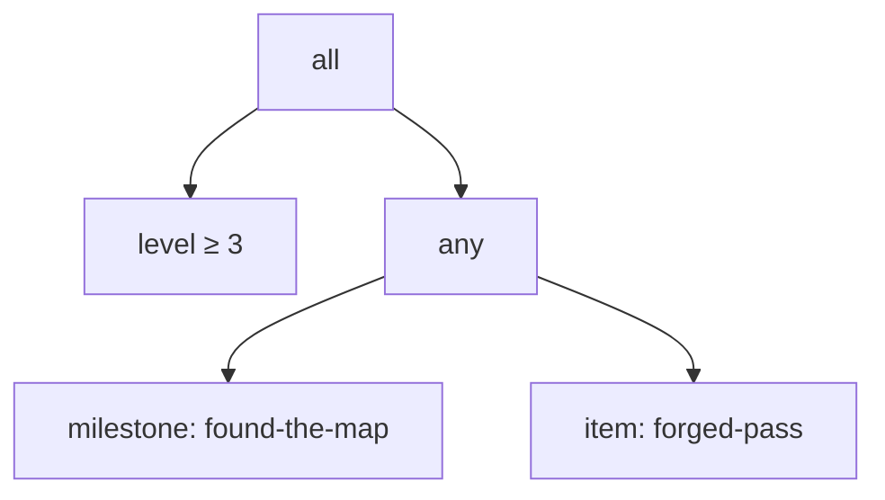
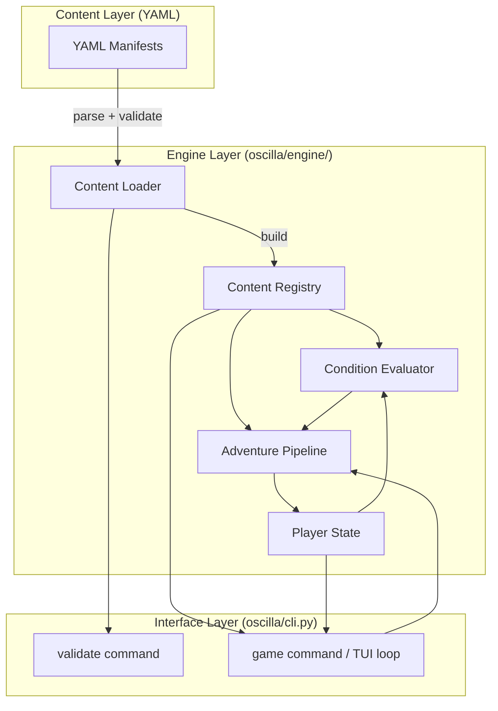

# Context

The project is a greenfield Python service built on a FastAPI + SQLAlchemy + Typer template. The goal of this phase is to produce a fully playable game accessible via the CLI, with no web interface and no database persistence yet. The engine must be cleanly separated from content so third parties can provide their own content packages.

The reference inspiration is Kingdom of Loathing: a text-based RPG where players spend adventures exploring zones, fighting enemies in turn-based combat, completing quests, crafting items, and levelling up. Game content is rich but the mechanical interactions are straightforward.

## Goals / Non-Goals

**Goals:**

- A manifest system (YAML) that fully describes all game entities
- A content loader that validates manifests and resolves cross-references at startup
- A condition evaluator usable at runtime to gate locations, adventures, and items
- An adventure pipeline that executes composable, ordered steps (narrative, combat, choice, loot, etc.)
- An in-memory player state model covering all data needed to play through the game
- A menu-driven TUI game loop using Rich + Typer
- A `validate` CLI command for content creators
- A POC default content package (fantasy kingdom)

**Non-Goals:**

- Database persistence (Phase 3, future proposal)
- Web interface (future proposal)
- Character classes with mechanical effects (placeholder only in this phase)
- Player-vs-player, clans, economy/trading
- Rollover / daily adventure limits
- Prestige / ascension mechanics (data model stub only)
- Save/load across CLI sessions (game state is lost on exit this phase)

## Decisions

### Decision 1: Engine / Content separation via configurable content path

**Choice**: The engine resolves a content directory at startup via a settings value (defaulting to a bundled `content/` package). Any valid directory of manifests can be loaded.

**Alternatives considered**:

- Hardcoded path to bundled content: simple but locks out third-party content.
- Installable content packages via entry points: powerful but overengineers v1.

**Rationale**: A configurable path is the simplest form that meets the "content is separate" requirement, and it's forward-compatible with entry-point discovery later.

---

### Decision 2: Manifest format — Kubernetes-style YAML

**Choice**: Each manifest file follows an `apiVersion / kind / metadata / spec` envelope:

```yaml
apiVersion: game/v1
kind: Location
metadata:
  name: dark-forest
  labels:
    region: wilderness
spec:
  displayName: "The Dark Forest"
  ...
```

**Alternatives considered**:

- Flat YAML with implicit type detection from filename: simpler files but harder to mix types in one directory and harder to version.
- TOML: already used for `pyproject.toml` in this project, but less expressive for nested structures and not as familiar to game content creators.

**Rationale**: The k8s envelope gives us versioning (`apiVersion`), a typed registry (`kind`), a consistent identity key (`metadata.name`), and a clean place for cross-cutting metadata (labels, annotations). Content creators who know k8s won't be surprised.

---

### Decision 3: Region / Location inheritance — compile-time aggregation

**Choice**: At content load time, the loader walks the region tree and computes each location's *effective unlock conditions* by merging ancestor conditions with `all` semantics. A location is only accessible if every condition in the merged chain passes.

**Alternatives considered**:

- Runtime chain evaluation: evaluates each ancestor at query time. Correct but slower and more complex.
- Explicit condition duplication in each location: simple but creates maintenance burden and drift.

**Rationale**: Compile-time aggregation means the condition evaluator only ever sees a single flat condition tree per entity. It also catches broken region references at load time rather than at player runtime.

---

### Decision 4: Condition evaluator — recursive tree with typed leaf nodes

**Choice**: Conditions are a recursive data structure of `all`, `any`, `not` logical operators with typed leaf predicates.

Leaf types for v1: `level`, `milestone`, `item`, `character_stat`, `class` (no-op placeholder), `prestige_count`, `enemies_defeated`, `locations_visited`, `adventures_completed`.

**Alternatives considered**:

- Expression language (e.g., mini-DSL string): more expressive but requires a parser and is harder for content creators to write correctly.
- Flat list of conditions with implicit `all`: simple but can't express `any` (OR) logic.

**Rationale**: The tree structure maps cleanly to Python dataclasses and is trivially evaluatable recursively. It's also the natural output of YAML nested mappings.

#### Condition YAML Examples

**Simple leaf — level gate:**

```yaml
unlock:
  level: 3
```

**Compound — must meet level AND either have a milestone OR carry an item:**

```yaml
unlock:
  all:
    - level: 3
    - any:
        - milestone: found-the-map
        - item: forged-pass
```

Visualised:



**Character stat comparison — strength check with NOT:**

```yaml
unlock:
  all:
    - character_stat:
        name: strength
        gte: 50
    - not:
        milestone: banished-from-guild
```

**Prestige gate — location only available on a second run:**

```yaml
unlock:
  prestige_count:
    gte: 1
```

**Class placeholder (no-op in v1, evaluates true for everyone):**

```yaml
unlock:
  class: warrior
```

#### Condition YAML Schema

Every condition value is one of:

| Key | Value type | Semantics |
|---|---|---|
| `all` | list of conditions | logical AND |
| `any` | list of conditions | logical OR |
| `not` | single condition | logical NOT |
| `level` | int | `player.level >= value` |
| `milestone` | string | `name in player.milestones` |
| `item` | string | `item_ref in player.inventory` |
| `character_stat` | `{name, gt\|gte\|lt\|lte\|eq\|mod}` | numeric comparison on a CharacterConfig-defined stat |
| `prestige_count` | `{gt\|gte\|lt\|lte\|eq\|mod}` | numeric comparison on prestige_count |
| `class` | string | always true (v1 no-op) |
| `enemies_defeated` | `{name, gt\|gte\|lt\|lte\|eq\|mod}` | comparison on `player.statistics.enemies_defeated[name]` |
| `locations_visited` | `{name, gt\|gte\|lt\|lte\|eq\|mod}` | comparison on `player.statistics.locations_visited[name]` |
| `adventures_completed` | `{name, gt\|gte\|lt\|lte\|eq\|mod}` | comparison on `player.statistics.adventures_completed[name]` |

A missing or `null` `unlock` block is always satisfied.

---

### Decision 5: Adventure pipeline — step list with typed step dataclasses

**Choice**: An adventure's `steps` is an ordered list of step objects. Each step has a `type` discriminator and type-specific fields. The runner iterates steps, dispatching to a step handler by type. Branching (`choice`, `stat_check`) steps embed sub-step lists for each branch.

**Alternatives considered**:

- Graph / DAG of steps with explicit edges: more flexible but far harder to author in YAML.
- Scripting language (Lua, etc.): maximum flexibility but requires embedding an interpreter and is a significant security surface.

**Rationale**: Linear step lists with embedded branching cover the vast majority of adventure patterns without requiring game designers to think in graphs. It's also directly serializable to/from YAML with Pydantic discriminated unions.

Within this model, steps are split into **events** (things that produce a player-facing screen) and **effects** (silent mechanical consequences — XP, loot, milestone flags). Three narrative events produce exactly three screens; mechanical side-effects never inflate the screen count.

#### Step Type Reference

**Events** produce a player-facing screen or interaction. **Effects** are silent mechanical outcomes attached to events — they fire after the event resolves but never produce a screen of their own.

---

**Events:**

**`narrative`** — Display text to the player, wait for acknowledgement. Optional `effects` fire silently after the acknowledgement.

```yaml
- type: narrative
  text: |
    You push through a tangle of roots and emerge into a moonlit clearing.
    Something glints in the mud near the old well.
  effects:
    - type: milestone_grant
      milestone: entered-the-clearing
```

---

**`combat`** — Turn-based fight. Player attacks first each round. `on_win`, `on_defeat`, and `on_flee` are **outcome branches**: each fires its `effects` then runs its nested `steps` (or jumps via `goto`) before the adventure continues or concludes. Steps may carry a `label` so that outcome branches elsewhere can jump to them using `goto`.

```yaml
# Three bosses that share the same defeat and flee handling via goto.
- type: combat
  enemy: boss-one
  on_win:
    effects:
      - type: xp_grant
        amount: 200
    steps:
      - type: narrative
        text: "The first seal breaks open."
  on_defeat:
    goto: shared-defeat    # jumps to the labeled step below
  on_flee:
    goto: shared-flee

- type: combat
  enemy: boss-two
  on_win:
    effects:
      - type: xp_grant
        amount: 250
    steps:
      - type: narrative
        text: "The second seal crumbles."
  on_defeat:
    goto: shared-defeat
  on_flee:
    goto: shared-flee

- type: combat
  enemy: boss-three
  on_win:
    effects:
      - type: xp_grant
        amount: 300
    steps:
      - type: narrative
        text: "The final seal shatters."
  on_defeat:
    goto: shared-defeat
  on_flee:
    goto: shared-flee

- label: shared-defeat
  type: narrative
  text: "You fall before the ancient power. The dungeon spits you back out."

- label: shared-flee
  type: narrative
  text: "You run until your lungs give out. The dungeon door slams shut behind you."
```

`goto` and `steps` are mutually exclusive in an outcome branch. Effects may accompany either: when used with `goto`, effects fire before the jump. Labels must be unique across all top-level steps in the adventure and are validated at load time.

---

**`choice`** — Present a menu. Each option has an optional `requires` condition, an `effects` list, and either a nested `steps` list or a `goto` label. Options with unmet conditions are hidden. Effects fire before nested steps or before the jump.

```yaml
- type: choice
  prompt: "The old chest is locked. What do you do?"
  options:
    - label: "Use the rusty key (requires item)"
      requires:
        item: rusty-key
      effects:
        - type: item_drop
          count: 1
          loot:
            - item: ancient-amulet
              weight: 100
        - type: milestone_grant
          milestone: opened-old-chest

    - label: "Force it open (requires strength ≥ 30)"
      requires:
        character_stat:
          name: strength
          gte: 30
      effects:
        - type: item_drop
          count: 1
          loot:
            - item: gold-coins
              weight: 70
            - item: broken-lock
              weight: 30
      steps:
        - type: narrative
          text: "You wrench the lid off. The hinges give way with a crack."

    - label: "I've seen this before"
      goto: already-opened    # jump to a labeled step elsewhere in the adventure

    - label: "Leave it alone"
      steps:
        - type: narrative
          text: "Probably cursed anyway. You walk away."
```

---

**`stat_check`** — Evaluate a condition silently and branch. `on_pass` and `on_fail` are outcome branches with effects and steps.

```yaml
- type: stat_check
  condition:
    character_stat:
      name: dexterity
      gte: 40
  on_pass:
    effects:
      - type: milestone_grant
        milestone: bluffed-the-gate
    steps:
      - type: narrative
        text: "You charm the guard with a disarming smile. He waves you through."
  on_fail:
    steps:
      - type: narrative
        text: "The guard looks you up and down and shakes his head. 'Not today.'"
```

---

**Effects (attached to events and outcome branches):**

**`xp_grant`** — Award XP. A level-up notification may appear inline. Negative values are valid (XP penalty).

```yaml
effects:
  - type: xp_grant
    amount: 150
```

**`item_drop`** — Roll a weighted loot table `count` times independently and add results to inventory.

```yaml
effects:
  - type: item_drop
    count: 1
    loot:
      - item: iron-sword
        weight: 10
      - item: leather-gloves
        weight: 25
      - item: healing-potion
        weight: 65
```

**`milestone_grant`** — Set a named boolean flag on the player. No-op if already held.

```yaml
effects:
  - type: milestone_grant
    milestone: cleared-goblin-cave
```

**`end_adventure`** — Immediately terminate the adventure with the given outcome. Useful for story branches where a narrative choice or a trap ends the run without going through combat. `outcome` defaults to `completed`; use `defeated` or `fled` for failure endings. Effects that appear before `end_adventure` in the same list still fire.

```yaml
# A choice path where refusing to cooperate ends the adventure in defeat:
effects:
  - type: milestone_grant
    milestone: refused-to-yield
  - type: end_adventure
    outcome: defeated
```

---

#### Full Adventure Example — "The Goblin Ambush"

A complete adventure using the events/effects separation: opening narrative, combat with outcome branches that carry effects and a nested stat-check event.

```yaml
apiVersion: game/v1
kind: Adventure
metadata:
  name: goblin-ambush
spec:
  displayName: "Goblin Ambush"
  description: "A goblin scout leaps from the undergrowth!"
  steps:
    - type: narrative
      text: |
        A rustling in the bushes. Before you can react, a goblin scout
        bursts from cover, rusty blade raised high.

    - type: combat
      enemy: goblin-scout
      on_win:
        effects:
          - type: xp_grant
            amount: 80
          - type: item_drop
            count: 1
            loot:
              - item: goblin-ear
                weight: 80
              - item: rusty-dagger
                weight: 15
              - item: shiny-button
                weight: 5
          - type: milestone_grant
            milestone: defeated-first-goblin
        steps:
          # Bonus XP if the player was already tracking bounties before this fight
          - type: stat_check
            condition:
              milestone: hunting-bounties
            on_pass:
              effects:
                - type: xp_grant
                  amount: 20
              steps:
                - type: narrative
                  text: |
                    You remember the bounty board back in town. Goblin ears fetch
                    a fair price this season.
```

#### Adventure Pool Selection

Each location holds a weighted pool of adventure references, each with an optional `requires` condition:

```yaml
spec:
  adventures:
    - ref: goblin-ambush
      weight: 50
    - ref: lost-merchant      # non-combat
      weight: 30
    - ref: ancient-ruins-find
      weight: 15
      requires:
        milestone: heard-the-legend
    - ref: rare-herb-patch
      weight: 5
      requires:
        character_stat:
          name: wisdom
          gte: 20
    - ref: goblin-veteran-showdown  # only after killing 3+ goblin scouts
      weight: 10
      requires:
        enemies_defeated:
          name: goblin-scout
          gte: 3
    - ref: bounty-board-weekly   # compound: level 5 AND either a milestone OR kill count
      weight: 8
      requires:
        all:
          - level: 5
          - any:
              - milestone: joined-the-guild
              - enemies_defeated:
                  name: goblin-scout
                  gte: 10
```

All `requires` fields accept the full condition tree — `all`, `any`, `not`, and every leaf type — so the same flexibility applies to adventure pool entries, `choice` step options, and adventure top-level requirements.

---

### Decision 6: In-memory player state only for Phase 1+2

**Choice**: Player state is a Python dataclass held in memory for the duration of a CLI session. It is not persisted between sessions.

**Rationale**: We cannot design the DB schema without knowing the full shape of player state first. Building the in-memory model first validates the data model before committing it to migrations. Phase 3 will add SQLAlchemy models that mirror the in-memory model.

#### Player State Shape

```python
@dataclass
class AdventurePosition:
    adventure_ref: str
    step_index: int
    step_state: Dict[str, Any]   # mid-step scratch space (e.g., enemy HP)

@dataclass
class PlayerStatistics:
    enemies_defeated: Dict[str, int]      # enemy_ref → lifetime kill count
    locations_visited: Dict[str, int]     # location_ref → visit count
    adventures_completed: Dict[str, int]  # adventure_ref → completion count

@dataclass
class PlayerState:
    player_id: UUID
    name: str
    character_class: str | None
    level: int                     # starts at 1
    xp: int                        # cumulative XP
    hp: int
    max_hp: int
    prestige_count: int            # number of completed prestige runs
    current_location: str | None   # manifest name of current location
    milestones: Set[str]           # one-time boolean story/quest flags
    statistics: PlayerStatistics   # gameplay event counters (auto-tracked)
    inventory: Dict[str, int]      # item_ref → quantity
    equipment: Dict[str, str]      # slot_name → item_ref
    active_quests: Dict[str, str]  # quest_ref → current stage name
    completed_quests: Set[str]
    active_adventure: AdventurePosition | None
    stats: Dict[str, int | float | str | bool | None]  # populated dynamically from CharacterConfig; not Any (see Persistence Readiness)
```

#### Milestone System

Milestones are **named boolean flags** that record one-time story and quest progression events. A milestone is either held or not — there is no count, no expiry, and no removal. Granting an already-held milestone is always a no-op.

Milestones are the right tool for:

- Story checkpoints (`entered-the-dungeon`, `met-the-king`)
- One-time quest events (`received-the-quest`, `delivered-the-package`)
- Content gates that should appear only once (`opened-the-portal`)

Milestones are **not** the right tool for counting repetitions, tracking how many times something happened, or accumulating progress — use the statistics system for those.

Naming convention: kebab-case past-tense verb phrases describing a completed event (`cleared-goblin-cave`, `found-the-map`, `bluffed-the-gate`).

#### Statistics System

Statistics are **per-entity event counters** that record how many times a player has interacted with a specific named entity. They are automatically maintained by the engine and never require manual `milestone_grant` steps. Statistics answer "how many times?" — milestones answer "did it happen?".

Three counter categories are tracked:

| Category | Incremented when | Key |
|---|---|---|
| `enemies_defeated` | A `combat` step ends with player victory | Enemy manifest name |
| `locations_visited` | A player enters a location (each visit) | Location manifest name |
| `adventures_completed` | An adventure pipeline runs to completion | Adventure manifest name |

All counters start at 0 (absent keys are implicitly 0) and only ever increase. Example state after a short session:

```python
PlayerStatistics(
    enemies_defeated={"goblin-scout": 4, "orc-warrior": 1},
    locations_visited={"village-square": 3, "goblin-camp": 2},
    adventures_completed={"goblin-ambush": 3, "lost-merchant": 1},
)
```

Statistics are conditionable — they appear as leaf predicates in any condition tree, including `unlock`, `requires`, and `stat_check` conditions. They form the natural basis for kill-count gates, grinding thresholds, and prestige carry-over decisions.

---

### Decision 7: Rich for TUI rendering

**Choice**: Use the `rich` library for all TUI output (panels, tables, prompts, menus).

**Alternatives considered**:

- `textual`: full TUI framework with widgets — too heavy for a menu-driven experience and a large new dependency surface.
- Plain `typer.echo` / `input()`: works but produces ugly output and is hard to maintain.

**Rationale**: `rich` is the standard modern Python TUI library, integrates naturally with Typer, and covers our needs (formatted text, tables, panels, prompts) without requiring async event loops.

## Manifest Catalogue

A reference for every supported `kind`, showing the full YAML structure with realistic examples.

---

### `Game` — global settings

One per content package. Defines XP thresholds, base HP formula, and flavour metadata. Referenced by the engine at startup; not referenced by other manifests.

```yaml
apiVersion: game/v1
kind: Game
metadata:
  name: the-kingdom
spec:
  displayName: "The Kingdom of Somewhere"
  description: "A humble hero ventures forth into a generic but earnestly dangerous kingdom."
  # XP required to reach each level. Index 0 = XP to reach level 2, etc.
  xp_thresholds: [100, 250, 500, 900, 1400, 2100, 3000, 4200, 5800]
  # base_hp + (level - 1) * hp_per_level
  hp_formula:
    base_hp: 20
    hp_per_level: 10
  base_adventure_count: null   # null = unlimited (Phase 2 default)
```

---

### `CharacterConfig` — stat definitions

One per content package. Defines the full set of stats that player characters can have, split into `public` (visible in the UI) and `hidden` (internal engine use only). The engine uses this manifest to initialise player state dynamically — content creators are not locked into a fixed stat list.

Stat value types: `int`, `float`, `str`, `bool`. All stats default to `null` unless a `default` is explicitly provided.

```yaml
apiVersion: game/v1
kind: CharacterConfig
metadata:
  name: default-character
spec:
  public_stats:
    # Core combat stats — visible on the player status panel
    - name: strength
      type: int
      default: 10
      description: "Physical power. Affects melee damage and max HP."

    - name: dexterity
      type: int
      default: 10
      description: "Agility and finesse. Affects dodge chance and attack speed."

    - name: wisdom
      type: int
      default: 10
      description: "Insight and arcane knowledge. Affects spell power and max MP."

    - name: gold
      type: int
      default: 0
      description: "Currency. Used for buying and crafting."

  hidden_stats:
    # Internal flags and counters not shown to the player.
    # IMPORTANT: hidden_stats are content-author-defined and content-dependent.
    # Engine-internal tracking fields (e.g. adventure session counters for rollover)
    # must NOT be placed here — they belong as direct fields on PlayerState so the
    # engine can rely on their existence regardless of what a content package defines.
    - name: bounties_completed
      type: int
      default: 0
      description: "Tracks total bounties completed for achievement/quest logic."

    - name: npc_affinity_elder
      type: int
      default: null
      description: "Relationship score with the village elder (null = never met)."
```

The engine reads `CharacterConfig` at startup to build the player state template. `public_stats` are rendered in the status panel and inspectable by the player. `hidden_stats` are never shown in the UI but are available to the condition evaluator via the `character_stat` leaf predicate. Both sets are available as targets for `stat_check` adventure steps.

A stat referenced in any condition or step that does not appear in `CharacterConfig` SHALL cause a validation error at content-load time.

The `CharacterConfigSpec` Pydantic model enforces that stat names are globally unique — no name may appear more than once across both lists, since the engine merges them into a flat dict on the player:

```python
# oscilla/engine/models/character_config.py
from typing import List, Set
from pydantic import BaseModel, Field, model_validator

class StatDefinition(BaseModel):
    name: str
    type: Literal["int", "float", "str", "bool"]
    default: int | float | str | bool | None = None
    description: str = ""

class CharacterConfigSpec(BaseModel):
    public_stats: List[StatDefinition] = []
    hidden_stats: List[StatDefinition] = []

    @model_validator(mode="after")
    def validate_unique_stat_names(self) -> "CharacterConfigSpec":
        all_names = [s.name for s in self.public_stats] + [s.name for s in self.hidden_stats]
        seen: Set[str] = set()
        duplicates: List[str] = []
        for name in all_names:
            if name in seen:
                duplicates.append(name)
            seen.add(name)
        if duplicates:
            raise ValueError(
                f"Duplicate stat names in CharacterConfig: {sorted(set(duplicates))!r}. "
                "Each stat name must be unique across public_stats and hidden_stats."
            )
        return self
```

---

### `Class` — character class (placeholder)

Class mechanics are not enforced in v1. The manifest is loaded and stored so that content can reference class names in conditions without errors.

```yaml
apiVersion: game/v1
kind: Class
metadata:
  name: warrior
spec:
  displayName: "Warrior"
  description: "A stalwart fighter who relies on strength and endurance."
  primary_stat: strength
```

---

### `Region` — zone container with optional parent

Regions form a tree. Each region can have a parent reference and its own `unlock` condition. Location accessibility is determined by the full ancestor chain.

```yaml
apiVersion: game/v1
kind: Region
metadata:
  name: wilderness
spec:
  displayName: "The Wilderness"
  description: "Dense forest and rocky hills beyond the town walls."
  parent: kingdom          # references Region metadata.name
  unlock:
    level: 3
```

Root region (no parent, no unlock — always accessible):

```yaml
apiVersion: game/v1
kind: Region
metadata:
  name: kingdom
spec:
  displayName: "The Kingdom"
  description: "The inhabited lands surrounding the capital."
```

---

### `Location` — a place players visit

Locations belong to a region and carry a weighted adventure pool. Effective unlock = own `unlock` AND all ancestor region unlocks.

```yaml
apiVersion: game/v1
kind: Location
metadata:
  name: goblin-caves
spec:
  displayName: "The Goblin Caves"
  description: "A labyrinth of damp tunnels reeking of goblin."
  region: wilderness        # references Region metadata.name
  unlock:
    milestone: heard-about-the-caves
  adventures:
    - ref: goblin-ambush
      weight: 50
    - ref: goblin-campfire   # non-combat
      weight: 30
    - ref: goblin-chief-fight
      weight: 10
      requires:
        milestone: cleared-entrance
    - ref: cave-treasure-room
      weight: 10
      requires:
        all:
          - milestone: cleared-entrance
          - item: cave-map
```

---

### `Enemy` — combat opponent

```yaml
apiVersion: game/v1
kind: Enemy
metadata:
  name: goblin-scout
spec:
  displayName: "Goblin Scout"
  description: "A wiry goblin with a rusty blade and an unearned confidence."
  hp: 25
  attack: 8          # base damage per round
  defense: 3         # damage reduction
  xp_reward: 80      # granted via xp_grant step or inline on win
  loot:
    - item: goblin-ear
      weight: 80
    - item: rusty-dagger
      weight: 15
    - item: shiny-button
      weight: 5
```

---

### `Item` — anything that can be in inventory

Item kinds: `consumable`, `weapon`, `armor`, `accessory`, `quest`, `material`, `currency`.

**Consumable:**

```yaml
apiVersion: game/v1
kind: Item
metadata:
  name: healing-potion
spec:
  displayName: "Healing Potion"
  description: "A bubbling red liquid. Tastes like cherries and regret."
  kind: consumable
  effect:
    heal: 30          # restores 30 HP when used
  stackable: true
  value: 50           # gold value (for future shop use)
```

**Weapon:**

```yaml
apiVersion: game/v1
kind: Item
metadata:
  name: iron-sword
spec:
  displayName: "Iron Sword"
  description: "Heavier than it looks. Perfect for hitting things."
  kind: weapon
  slot: weapon
  stats:
    attack: 12
  stackable: false
  value: 120
```

**Armor:**

```yaml
apiVersion: game/v1
kind: Item
metadata:
  name: leather-armour
spec:
  displayName: "Leather Armour"
  description: "Won't stop a determined goblin, but it helps."
  kind: armor
  slot: armor
  stats:
    defense: 5
  stackable: false
  value: 80
```

**Quest item:**

```yaml
apiVersion: game/v1
kind: Item
metadata:
  name: elder-seal
spec:
  displayName: "The Elder's Seal"
  description: "An official wax seal. Whatever it's for, it looks important."
  kind: quest
  stackable: false
  droppable: false   # cannot be traded or discarded
  value: 0
```

**Crafting material:**

```yaml
apiVersion: game/v1
kind: Item
metadata:
  name: goblin-ear
spec:
  displayName: "Goblin Ear"
  description: "Still warm. Useful for alchemy, apparently."
  kind: material
  stackable: true
  value: 15
```

---

### `Recipe` — crafting formula

```yaml
apiVersion: game/v1
kind: Recipe
metadata:
  name: brew-healing-potion
spec:
  displayName: "Brew Healing Potion"
  description: "Mix cave mushrooms and spring water into a serviceable remedy."
  inputs:
    - item: cave-mushroom
      quantity: 2
    - item: spring-water
      quantity: 1
  output:
    item: healing-potion
    quantity: 1
```

---

### `Quest` — multi-stage story arc

Quests are tracked on the player as `{quest_ref: current_stage}`. Stage advancement is triggered by milestone grants within adventures. A stage's `advance_on` field lists milestone names that move the player to `next_stage`.

```yaml
apiVersion: game/v1
kind: Quest
metadata:
  name: the-missing-merchant
spec:
  displayName: "The Missing Merchant"
  description: "Old Gregor hasn't returned from the wilderness. Find out what happened."
  entry_stage: search-begun
  stages:
    - name: search-begun
      description: "Head into the wilderness and look for clues."
      advance_on:
        - milestone: found-gregor-camp
      next_stage: camp-found

    - name: camp-found
      description: "Gregor's camp was ransacked. Track down who did it."
      advance_on:
        - milestone: defeated-bandit-leader
      next_stage: complete

    - name: complete
      description: "Justice served. Report back to the village elder."
      terminal: true   # quest is complete at this stage
```

Quest start is triggered by a `milestone_grant` in an adventure (e.g., `milestone: started-the-missing-merchant-quest`) combined with engine logic that checks quest entry conditions. The precise quest-start trigger mechanism is an implementation detail for the engine's quest manager.

The `QuestSpec` Pydantic model enforces stage graph integrity at load time so these errors are caught immediately rather than at player runtime:

```python
# oscilla/engine/models/quest.py
from typing import List, Set
from pydantic import BaseModel, model_validator

class QuestStage(BaseModel):
    name: str
    description: str = ""
    advance_on: List[str] = []    # milestone names that trigger advancement
    next_stage: str | None = None # name of stage to advance to (None only for terminal)
    terminal: bool = False        # True = quest complete at this stage

class QuestSpec(BaseModel):
    displayName: str
    description: str = ""
    entry_stage: str
    stages: List[QuestStage]

    @model_validator(mode="after")
    def validate_stage_graph(self) -> "QuestSpec":
        stage_names: List[str] = [s.name for s in self.stages]

        # Unique stage names
        seen: Set[str] = set()
        for name in stage_names:
            if name in seen:
                raise ValueError(f"Duplicate quest stage name: {name!r}")
            seen.add(name)

        # entry_stage must reference a real stage
        if self.entry_stage not in seen:
            raise ValueError(
                f"entry_stage {self.entry_stage!r} is not a defined stage. "
                f"Available: {stage_names!r}"
            )

        for stage in self.stages:
            if stage.terminal:
                # Terminal stages must not have next_stage or advance_on —
                # these fields imply further progression that will never happen
                if stage.next_stage is not None:
                    raise ValueError(
                        f"Stage {stage.name!r} is terminal but has next_stage={stage.next_stage!r}"
                    )
                if stage.advance_on:
                    raise ValueError(
                        f"Stage {stage.name!r} is terminal but has advance_on={stage.advance_on!r}"
                    )
            else:
                # Non-terminal stages must declare where they go next
                if stage.next_stage is None:
                    raise ValueError(
                        f"Stage {stage.name!r} is not terminal but has no next_stage"
                    )
                # next_stage must reference a real stage
                if stage.next_stage not in seen:
                    raise ValueError(
                        f"Stage {stage.name!r} → next_stage={stage.next_stage!r} is not a defined stage"
                    )

        return self
```

---

### `Adventure` — the full structure

Showing all field types in one place for reference. An adventure is a `kind: Adventure` manifest whose `steps` list is the core authored content.

```yaml
apiVersion: game/v1
kind: Adventure
metadata:
  name: abandoned-shrine
spec:
  displayName: "The Abandoned Shrine"
  description: "A crumbling shrine in the woods. Something still stirs within."
  # Top-level requires: adventure won't appear in any location pool unless met
  requires:
    level: 4
  steps:
    - type: narrative
      text: |
        Moss-covered stones form a rough circle around a weathered altar.
        The air is cold here, even in summer.

    - type: stat_check
      condition:
        character_stat:
          name: wisdom
          gte: 25
      on_pass:
        effects:
          - type: milestone_grant
            milestone: sensed-shrine-magic
        steps:
          - type: narrative
            text: |
              You sense a residual enchantment on the altar. It's dormant —
              but not dead.
      on_fail:
        steps:
          - type: narrative
            text: "Just old rocks. Creepy old rocks."

    - type: choice
      prompt: "A sealed chest sits behind the altar. What do you do?"
      options:
        - label: "Open it (requires item: shrine-key)"
          requires:
            item: shrine-key
          effects:
            - type: item_drop
              count: 2
              loot:
                - item: ancient-coin
                  weight: 50
                - item: mystic-shard
                  weight: 30
                - item: healing-potion
                  weight: 20
            - type: milestone_grant
              milestone: opened-shrine-chest
          steps:
            - type: narrative
              text: "The lock turns smoothly. Inside: offerings left long ago."

        - label: "Force it open (requires strength ≥ 40)"
          requires:
            character_stat:
              name: strength
              gte: 40
          steps:
            - type: combat
              enemy: shrine-guardian   # awakened by the desecration
              on_win:
                effects:
                  - type: item_drop
                    count: 1
                    loot:
                      - item: ancient-coin
                        weight: 80
                      - item: broken-relic
                        weight: 20

        - label: "Leave it undisturbed"
          steps:
            - type: narrative
              text: "Some things are better left alone. You back away slowly."

    - type: narrative
      text: "You leave the shrine behind, your mind full of questions."
      effects:
        - type: xp_grant
          amount: 120
```

## Implementation Detail

This section covers how the major components are actually implemented — data structures, class shapes, error handling strategies, and internal conventions.

---

### Pydantic Manifest Models

Each manifest kind has its own Pydantic model in `oscilla/engine/models/`. All models share a common envelope defined in `base.py`.

#### Envelope and Metadata

```python
# oscilla/engine/models/base.py
from typing import Literal
from pydantic import BaseModel, Field


class Metadata(BaseModel):
    name: str = Field(description="Unique identifier for this entity within its kind.")


class ManifestEnvelope(BaseModel):
    apiVersion: Literal["game/v1"]
    kind: str
    metadata: Metadata
    spec: dict  # replaced by each kind's typed spec model
```

Each kind subclasses `ManifestEnvelope` and overrides `spec` with a strongly-typed spec model and a `Literal` `kind` discriminator:

```python
# oscilla/engine/models/region.py
from typing import Literal
from pydantic import BaseModel

from oscilla.engine.models.base import ManifestEnvelope, Metadata
from oscilla.engine.models.conditions import Condition


class RegionSpec(BaseModel):
    displayName: str
    description: str = ""
    parent: str | None = None      # metadata.name of parent Region
    unlock: Condition | None = None


class RegionManifest(ManifestEnvelope):
    kind: Literal["Region"]
    spec: RegionSpec
```

The `kind` field as a `Literal` means Pydantic's discriminated union dispatch works cleanly — no custom validators required.

#### Condition Tree as a Discriminated Union

All condition nodes are expressed as a single Python type alias. Branch nodes and leaf nodes are separate `BaseModel` subclasses, unified under `Annotated[..., Field(discriminator="type")]`:

```python
# oscilla/engine/models/conditions.py
from __future__ import annotations
from typing import Annotated, List, Literal, Union
from pydantic import BaseModel, Field, model_validator


class ModComparison(BaseModel):
    divisor: int = Field(ge=1, description="Divisor for the modulo check. Must be >= 1 — zero would cause a ZeroDivisionError at runtime.")
    remainder: int = Field(default=0, ge=0, description="Expected remainder. Must be in [0, divisor-1].")

    @model_validator(mode="after")
    def validate_remainder_in_range(self) -> "ModComparison":
        # divisor >= 1 is already enforced by Field(ge=1), so remainder < divisor is the only cross-field rule
        if self.remainder >= self.divisor:
            raise ValueError(
                f"mod.remainder must be in [0, divisor-1]; "
                f"got remainder={self.remainder}, divisor={self.divisor} — this condition can never be satisfied"
            )
        return self


# --- Leaf nodes ---

class LevelCondition(BaseModel):
    type: Literal["level"]
    value: int = Field(ge=1, description="Level threshold. Must be >= 1 — players start at level 1, so 0 or below would always pass.")

class MilestoneCondition(BaseModel):
    type: Literal["milestone"]
    name: str

class ItemCondition(BaseModel):
    type: Literal["item"]
    name: str               # item manifest name; true if quantity > 0

class CharacterStatCondition(BaseModel):
    type: Literal["character_stat"]
    name: str               # CharacterConfig stat name
    gt: int | float | None = None
    gte: int | float | None = None
    lt: int | float | None = None
    lte: int | float | None = None
    eq: int | float | None = None
    mod: ModComparison | None = None

    @model_validator(mode="after")
    def require_comparator(self) -> "CharacterStatCondition":
        if self.gt is None and self.gte is None and self.lt is None and self.lte is None and self.eq is None and self.mod is None:
            raise ValueError("character_stat condition must specify at least one of: gt, gte, lt, lte, eq, mod")
        return self

class PrestigeCountCondition(BaseModel):
    type: Literal["prestige_count"]
    gt: int | None = None
    gte: int | None = None
    lt: int | None = None
    lte: int | None = None
    eq: int | None = None
    mod: ModComparison | None = None

    @model_validator(mode="after")
    def require_comparator(self) -> "PrestigeCountCondition":
        if self.gt is None and self.gte is None and self.lt is None and self.lte is None and self.eq is None and self.mod is None:
            raise ValueError("prestige_count condition must specify at least one of: gt, gte, lt, lte, eq, mod")
        return self

class ClassCondition(BaseModel):
    type: Literal["class"]
    name: str               # always evaluates true in v1

class EnemiesDefeatedCondition(BaseModel):
    type: Literal["enemies_defeated"]
    name: str               # enemy manifest name
    gt: int | None = None
    gte: int | None = None
    lt: int | None = None
    lte: int | None = None
    eq: int | None = None
    mod: ModComparison | None = None   # e.g. mod: {divisor: 5} triggers every 5th defeat

    @model_validator(mode="after")
    def require_comparator(self) -> "EnemiesDefeatedCondition":
        if self.gt is None and self.gte is None and self.lt is None and self.lte is None and self.eq is None and self.mod is None:
            raise ValueError("enemies_defeated condition must specify at least one of: gt, gte, lt, lte, eq, mod")
        return self

class LocationsVisitedCondition(BaseModel):
    type: Literal["locations_visited"]
    name: str
    gt: int | None = None
    gte: int | None = None
    lt: int | None = None
    lte: int | None = None
    eq: int | None = None
    mod: ModComparison | None = None

    @model_validator(mode="after")
    def require_comparator(self) -> "LocationsVisitedCondition":
        if self.gt is None and self.gte is None and self.lt is None and self.lte is None and self.eq is None and self.mod is None:
            raise ValueError("locations_visited condition must specify at least one of: gt, gte, lt, lte, eq, mod")
        return self

class AdventuresCompletedCondition(BaseModel):
    type: Literal["adventures_completed"]
    name: str
    gt: int | None = None
    gte: int | None = None
    lt: int | None = None
    lte: int | None = None
    eq: int | None = None
    mod: ModComparison | None = None

    @model_validator(mode="after")
    def require_comparator(self) -> "AdventuresCompletedCondition":
        if self.gt is None and self.gte is None and self.lt is None and self.lte is None and self.eq is None and self.mod is None:
            raise ValueError("adventures_completed condition must specify at least one of: gt, gte, lt, lte, eq, mod")
        return self


# --- Branch nodes (forward-reference safe via model_rebuild) ---

class AllCondition(BaseModel):
    type: Literal["all"]
    # min_length=1: an empty all-condition is vacuously true and almost certainly an authoring error
    conditions: List["Condition"] = Field(min_length=1)

class AnyCondition(BaseModel):
    type: Literal["any"]
    # min_length=1: Python's any([]) returns False, which would silently block every player
    conditions: List["Condition"] = Field(min_length=1)

class NotCondition(BaseModel):
    type: Literal["not"]
    condition: "Condition"


Condition = Annotated[
    Union[
        AllCondition, AnyCondition, NotCondition,
        LevelCondition, MilestoneCondition, ItemCondition,
        CharacterStatCondition, PrestigeCountCondition, ClassCondition,
        EnemiesDefeatedCondition, LocationsVisitedCondition, AdventuresCompletedCondition,
    ],
    Field(discriminator="type"),
]

AllCondition.model_rebuild()
AnyCondition.model_rebuild()
NotCondition.model_rebuild()
```

**YAML → Python mapping**: Because the content YAML uses bare keys (e.g., `level: 3`, not `type: level / value: 3`), the loader converts flat YAML condition dicts into the `type`-tagged form before passing them to Pydantic. A small normalisation function handles this translation:

```python
def normalise_condition(raw: dict) -> dict:
    """Convert bare YAML condition keys to the type-tagged form Pydantic expects.

    e.g. {"level": 3} → {"type": "level", "value": 3}
         {"all": [...]} → {"type": "all", "conditions": [...]}

    If raw already has a "type" key it is returned as-is (already normalised).

    Raises ValueError if raw contains more than one recognised condition key —
    e.g. {"level": 3, "milestone": "foo"} is always an authoring mistake. A
    flat condition dict has exactly one semantic key; extra keys suggest the
    author mis-indented or merged two conditions.
    """
    ...
```

This keeps the YAML ergonomic for content authors while keeping the Python model explicit.

#### Effects and Events

The adventure model defines two discriminated unions: `Effect` (silent mechanical outcomes) and `Step` (player-facing events). Both use `type` as a discriminator.

```python
# oscilla/engine/models/adventure.py
from __future__ import annotations
from typing import Annotated, Dict, List, Literal, Union
from pydantic import BaseModel, Field, model_validator

from oscilla.engine.models.conditions import Condition


# ─────────────────────────────────────────────
# Effects — silent mechanical outcomes (no screen produced)
# ─────────────────────────────────────────────

class ItemDropEntry(BaseModel):
    item: str
    # ge=1: weight=0 makes this entry unreachable; negative weight breaks weighted selection entirely
    weight: int = Field(ge=1)

class XpGrantEffect(BaseModel):
    type: Literal["xp_grant"]
    # ne=0: zero grants nothing and is always an authoring mistake; negative values are valid (XP penalty)
    amount: int = Field(ne=0)

class ItemDropEffect(BaseModel):
    type: Literal["item_drop"]
    count: int = Field(default=1, ge=1, description="Number of independent loot rolls. Must be >= 1.")
    # min_length=1: an empty loot table would crash the weighted selector
    loot: List[ItemDropEntry] = Field(min_length=1)

class MilestoneGrantEffect(BaseModel):
    type: Literal["milestone_grant"]
    milestone: str

class EndAdventureEffect(BaseModel):
    type: Literal["end_adventure"]
    # Defaults to "completed"; use "defeated" or "fled" for failure endings.
    # This allows story logic to terminate the adventure without combating the player.
    outcome: Literal["completed", "defeated", "fled"] = "completed"

Effect = Annotated[
    Union[XpGrantEffect, ItemDropEffect, MilestoneGrantEffect, EndAdventureEffect],
    Field(discriminator="type"),
]


# ─────────────────────────────────────────────
# OutcomeBranch — effects + sub-steps shared by all branching events
# ─────────────────────────────────────────────

class OutcomeBranch(BaseModel):
    """Container for effects and steps that fire when an event resolves.

    Effects fire first (silent state mutations), then either:
    - `steps` runs as further events, OR
    - `goto` jumps to the top-level step with that label.
    `goto` and `steps` are mutually exclusive; `effects` may accompany either.
    An empty branch (no effects, steps, or goto) is a valid no-op.
    """
    effects: List[Effect] = []
    steps: List["Step"] = []
    goto: str | None = None  # label of a top-level step to jump to

    @model_validator(mode="after")
    def goto_and_steps_are_exclusive(self) -> "OutcomeBranch":
        if self.goto is not None and self.steps:
            raise ValueError(
                "OutcomeBranch cannot have both 'goto' and 'steps'. "
                "Use 'goto' to jump to a labeled step or 'steps' for inline continuation."
            )
        return self


# ─────────────────────────────────────────────
# Events — each produces one or more player-facing screens
# ─────────────────────────────────────────────

class NarrativeStep(BaseModel):
    type: Literal["narrative"]
    label: str | None = None  # unique identifier for goto targeting; only valid on top-level steps
    # min_length=1: blank text would display an empty panel to the player
    text: str = Field(min_length=1)
    # effects fire silently after the player acknowledges the text
    effects: List[Effect] = []

class CombatStep(BaseModel):
    type: Literal["combat"]
    label: str | None = None
    enemy: str   # Enemy manifest name
    on_win: OutcomeBranch = Field(default_factory=OutcomeBranch)
    on_defeat: OutcomeBranch = Field(default_factory=OutcomeBranch)
    on_flee: OutcomeBranch = Field(default_factory=OutcomeBranch)

class ChoiceOption(BaseModel):
    label: str   # display label shown to the player (not a goto identifier)
    requires: Condition | None = None
    effects: List[Effect] = []  # fire before nested steps or before goto jump
    steps: List["Step"] = []
    goto: str | None = None  # label of a top-level step to jump to

    @model_validator(mode="after")
    def goto_and_steps_are_exclusive(self) -> "ChoiceOption":
        if self.goto is not None and self.steps:
            raise ValueError(
                "ChoiceOption cannot have both 'goto' and 'steps'. "
                "Use 'goto' to jump to a labeled step or 'steps' for inline continuation."
            )
        return self

class ChoiceStep(BaseModel):
    type: Literal["choice"]
    label: str | None = None
    prompt: str
    # min_length=1: an empty options list leaves the player with no way to progress
    options: List[ChoiceOption] = Field(min_length=1)

class StatCheckStep(BaseModel):
    type: Literal["stat_check"]
    label: str | None = None
    condition: Condition
    on_pass: OutcomeBranch = Field(default_factory=OutcomeBranch)
    on_fail: OutcomeBranch = Field(default_factory=OutcomeBranch)


Step = Annotated[
    Union[NarrativeStep, CombatStep, ChoiceStep, StatCheckStep],
    Field(discriminator="type"),
]

OutcomeBranch.model_rebuild()
ChoiceOption.model_rebuild()
ChoiceStep.model_rebuild()
StatCheckStep.model_rebuild()


class AdventureSpec(BaseModel):
    displayName: str
    description: str = ""
    requires: Condition | None = None
    steps: List[Step]

    @model_validator(mode="after")
    def validate_unique_labels(self) -> "AdventureSpec":
        """Labels on top-level steps must be unique — they are goto jump targets."""
        seen: Dict[str, int] = {}
        for i, step in enumerate(self.steps):
            lbl = step.label
            if lbl is None:
                continue
            if lbl in seen:
                raise ValueError(
                    f"Duplicate step label {lbl!r} at step indices {seen[lbl]} and {i}. "
                    "Step labels must be unique within an adventure."
                )
            seen[lbl] = i
        return self
```

---

### Content Loader Pipeline

The loader runs in four sequential phases. It accumulates all errors across all phases before raising — the caller always gets a complete error list, not just the first failure.

#### Phase 1: File Scan

```python
# oscilla/engine/loader.py
import time
from logging import getLogger
from ruamel.yaml import YAML
from ruamel.yaml.error import YAMLError
from pathlib import Path
from typing import List

logger = getLogger(__name__)
_yaml = YAML(typ="safe")

def scan(content_dir: Path) -> List[Path]:
    """Return all .yaml / .yml files found recursively under content_dir."""
    return sorted(
        p for p in content_dir.rglob("*")
        if p.suffix in {".yaml", ".yml"}
    )
```

Files are sorted for deterministic ordering, which makes error messages stable across runs.

#### Phase 2: Parse and Schema Validation

Each file is loaded with `ruamel.yaml` in safe mode and immediately dispatched to the appropriate Pydantic model. **Parse errors are accumulated, not raised immediately**:

```python
from collections import defaultdict
from pydantic import ValidationError

from oscilla.engine.models import MANIFEST_REGISTRY   # kind → Pydantic model class


@dataclass
class LoadError:
    file: Path
    message: str


def parse(paths: List[Path]) -> Tuple[List[ManifestEnvelope], List[LoadError]]:
    manifests: List[ManifestEnvelope] = []
    errors: List[LoadError] = []

    for path in paths:
        try:
            raw = _yaml.load(path.read_text(encoding="utf-8"))
        except YAMLError as exc:
            errors.append(LoadError(file=path, message=f"YAML parse error: {exc}"))
            continue

        kind = raw.get("kind", "<missing>")
        model_cls = MANIFEST_REGISTRY.get(kind)
        if model_cls is None:
            errors.append(LoadError(file=path, message=f"Unknown kind: {kind!r}"))
            continue

        try:
            manifests.append(model_cls.model_validate(raw))
        except ValidationError as exc:
            for err in exc.errors():
                loc = " → ".join(str(x) for x in err["loc"])
                errors.append(LoadError(file=path, message=f"{loc}: {err['msg']}"))

    return manifests, errors
```

`MANIFEST_REGISTRY` is a plain dict mapping kind strings to their Pydantic model class:

```python
# oscilla/engine/models/__init__.py
from oscilla.engine.models.region import RegionManifest
from oscilla.engine.models.location import LocationManifest
# ... etc.

MANIFEST_REGISTRY: Dict[str, Type[ManifestEnvelope]] = {
    "Region": RegionManifest,
    "Location": LocationManifest,
    "Adventure": AdventureManifest,
    "Enemy": EnemyManifest,
    "Item": ItemManifest,
    "Recipe": RecipeManifest,
    "Quest": QuestManifest,
    "Class": ClassManifest,
    "Game": GameManifest,
    "CharacterConfig": CharacterConfigManifest,
}
```

#### Phase 3: Cross-Reference Validation

After all files are parsed, the loader checks that every name referenced in a manifest actually exists in the parsed set. This phase also accumulates all errors before returning:

```python
def validate_references(
    manifests: List[ManifestEnvelope],
) -> List[LoadError]:
    # Build name sets per kind for efficient O(1) lookup
    names_by_kind: Dict[str, Set[str]] = defaultdict(set)
    for m in manifests:
        names_by_kind[m.kind].add(m.metadata.name)

    errors: List[LoadError] = []

    for m in manifests:
        match m.kind:
            case "Location":
                if m.spec.region not in names_by_kind["Region"]:
                    errors.append(LoadError(..., f"Unknown region: {m.spec.region!r}"))
                for entry in m.spec.adventures:
                    if entry.ref not in names_by_kind["Adventure"]:
                        errors.append(LoadError(..., f"Unknown adventure: {entry.ref!r}"))
            case "Adventure":
                for step in m.spec.steps:
                    _validate_step_refs(step, names_by_kind, errors, m)
            case "Recipe":
                for ing in m.spec.inputs:
                    if ing.item not in names_by_kind["Item"]:
                        errors.append(LoadError(...))
                if m.spec.output.item not in names_by_kind["Item"]:
                    errors.append(LoadError(...))
            # ... other kinds
    return errors
```

Stat names used in `character_stat` conditions and `stat_check` steps are validated against the `CharacterConfig` manifest's `public_stats + hidden_stats` names at this phase.

The names in statistical leaf conditions are also cross-referenced: `enemies_defeated.name` must match a known `Enemy` manifest, `locations_visited.name` must match a known `Location`, and `adventures_completed.name` must match a known `Adventure`. A typo in these names would otherwise silently evaluate against a counter that is always 0, making the condition either always pass or always block depending on its comparator.

The loader also enforces singleton manifest kinds at this phase: only one `Game` and one `CharacterConfig` manifest may exist in a content package. A second occurrence raises an error immediately — the registry's `build()` method silently overwrites, so the check must happen here while the full manifest list is still available.

`goto` targets in `OutcomeBranch` and `ChoiceOption` are also validated here. For each `Adventure` manifest, the validator collects every `goto` string found in any outcome branch or choice option and checks it against the set of labels on that adventure's top-level steps. An unresolved `goto` label is a `LoadError` — it would cause a `KeyError` at runtime.

#### Phase 4: Effective Condition Compilation

The loader walks the region tree and builds each location's compiled `effective_unlock` condition by wrapping all ancestor `unlock` conditions (plus the location's own) in a single top-level `all` node. Circular parent references are detected here and reported as errors. The compiled condition replaces the location's `unlock` field in the registry — the evaluator never needs to traverse the region tree at runtime.

```python
def build_effective_conditions(
    manifests: List[ManifestEnvelope],
) -> Tuple[List[ManifestEnvelope], List[LoadError]]:
    regions: Dict[str, RegionManifest] = {
        m.metadata.name: m for m in manifests if m.kind == "Region"
    }
    errors: List[LoadError] = []

    def collect_ancestor_conditions(region_name: str, visited: Set[str]) -> List[Condition]:
        """Walk up the parent chain, detecting cycles."""
        if region_name in visited:
            errors.append(LoadError(..., f"Circular region parent: {region_name!r}"))
            return []
        visited.add(region_name)
        region = regions.get(region_name)
        if region is None:
            return []
        chain = collect_ancestor_conditions(region.spec.parent, visited) if region.spec.parent else []
        if region.spec.unlock:
            chain.append(region.spec.unlock)
        return chain

    for m in manifests:
        if m.kind != "Location":
            continue
        chain = collect_ancestor_conditions(m.spec.region, set())
        if m.spec.unlock:
            chain.append(m.spec.unlock)
        m.spec.effective_unlock = AllCondition(type="all", conditions=chain) if chain else None

    return manifests, errors
```

#### Error Accumulation and the `validate` Command

All four phases run in sequence. Errors from each phase are concatenated. **Phase 2 errors do not prevent Phase 3 from running on successfully parsed manifests** — Phase 3 is skipped only if no manifests parsed at all.

```python
class ContentLoadError(Exception):
    def __init__(self, errors: List[LoadError]) -> None:
        self.errors = errors
        lines = "\n".join(f"  {e.file}: {e.message}" for e in errors)
        super().__init__(f"{len(errors)} content error(s):\n{lines}")


def load(content_dir: Path) -> "ContentRegistry":
    t0 = time.perf_counter()
    paths = scan(content_dir)
    manifests, parse_errors = parse(paths)

    ref_errors = validate_references(manifests) if manifests else []
    manifests, compile_errors = build_effective_conditions(manifests)

    all_errors = parse_errors + ref_errors + compile_errors
    if all_errors:
        raise ContentLoadError(all_errors)

    registry = ContentRegistry.build(manifests)
    elapsed_ms = (time.perf_counter() - t0) * 1000
    logger.info("Content loaded in %.1f ms (%d manifests)", elapsed_ms, len(manifests))
    return registry
```

The `validate` CLI command calls `load()`, catches `ContentLoadError`, and prints every error with its source file and a non-zero exit code. On success it prints a summary count by kind and exits 0:

```
✓ Loaded 3 regions, 10 locations, 18 adventures, 12 enemies, 27 items, 5 recipes, 2 quests
```

```
✗ 3 error(s) found:

  content/adventures/goblin-ambush.yaml: combat.enemy: Unknown enemy 'goblin-scot' (did you mean 'goblin-scout'?)
  content/locations/goblin-caves.yaml: unlock → character_stat.name: Stat 'wisodm' not defined in CharacterConfig
  content/regions/dungeon.yaml: Circular region parent: dungeon → wilderness → dungeon
```

---

### Content Registry

The registry is the single authoritative in-memory store for all parsed manifests. It is built once at startup and is read-only for the rest of the process lifetime.

```python
# oscilla/engine/registry.py
from typing import Dict, Generic, Iterator, Type, TypeVar

T = TypeVar("T", bound=ManifestEnvelope)


class KindRegistry(Generic[T]):
    """Typed in-memory store for one manifest kind."""

    def __init__(self) -> None:
        self._store: Dict[str, T] = {}

    def register(self, manifest: T) -> None:
        self._store[manifest.metadata.name] = manifest

    def get(self, name: str) -> T | None:
        return self._store.get(name)

    def require(self, name: str, kind: str) -> T:
        """Fetch by name, raising a clear error if missing (for use in the pipeline)."""
        obj = self._store.get(name)
        if obj is None:
            raise KeyError(f"No {kind} named {name!r} in registry")
        return obj

    def all(self) -> Iterator[T]:
        return iter(self._store.values())

    def __len__(self) -> int:
        return len(self._store)


class ContentRegistry:
    """Aggregated read-only store of all loaded manifests, one KindRegistry per kind."""

    def __init__(self) -> None:
        self.regions: KindRegistry[RegionManifest] = KindRegistry()
        self.locations: KindRegistry[LocationManifest] = KindRegistry()
        self.adventures: KindRegistry[AdventureManifest] = KindRegistry()
        self.enemies: KindRegistry[EnemyManifest] = KindRegistry()
        self.items: KindRegistry[ItemManifest] = KindRegistry()
        self.recipes: KindRegistry[RecipeManifest] = KindRegistry()
        self.quests: KindRegistry[QuestManifest] = KindRegistry()
        self.classes: KindRegistry[ClassManifest] = KindRegistry()
        self.game: GameManifest | None = None
        self.character_config: CharacterConfigManifest | None = None

    @classmethod
    def build(cls, manifests: List[ManifestEnvelope]) -> "ContentRegistry":
        registry = cls()
        for m in manifests:
            match m.kind:
                case "Region":    registry.regions.register(m)
                case "Location":  registry.locations.register(m)
                case "Adventure": registry.adventures.register(m)
                case "Enemy":     registry.enemies.register(m)
                case "Item":      registry.items.register(m)
                case "Recipe":    registry.recipes.register(m)
                case "Quest":     registry.quests.register(m)
                case "Class":     registry.classes.register(m)
                case "Game":      registry.game = m
                case "CharacterConfig": registry.character_config = m
        return registry
```

The registry is passed by reference throughout the engine — loader → pipeline → step handlers. It is never mutated after `build()`.

---

### Condition Evaluator

The evaluator is a single pure function and a set of helpers, with no class or state of its own.

```python
# oscilla/engine/conditions.py
from oscilla.engine.models.conditions import (
    Condition, AllCondition, AnyCondition, NotCondition,
    LevelCondition, MilestoneCondition, ItemCondition,
    CharacterStatCondition, PrestigeCountCondition, ClassCondition,
    EnemiesDefeatedCondition, LocationsVisitedCondition, AdventuresCompletedCondition,
)
from oscilla.engine.player import PlayerState


def evaluate(condition: Condition | None, player: PlayerState) -> bool:
    """Evaluate a condition tree against the given player state.

    Returns True if condition is None (no gate) or every node evaluates to True.
    """
    if condition is None:
        return True

    match condition:
        # --- Branch nodes ---
        case AllCondition(conditions=children):
            return all(evaluate(c, player) for c in children)
        case AnyCondition(conditions=children):
            return any(evaluate(c, player) for c in children)
        case NotCondition(condition=child):
            return not evaluate(child, player)

        # --- Player attribute leaves ---
        case LevelCondition(value=v):
            return player.level >= v
        case MilestoneCondition(name=n):
            return n in player.milestones
        case ItemCondition(name=n):
            return player.inventory.get(n, 0) > 0
        case ClassCondition():
            return True  # no-op in v1
        case PrestigeCountCondition() as c:
            return _numeric_compare(player.prestige_count, c)

        # --- CharacterConfig stat leaves ---
        case CharacterStatCondition(name=n) as c:
            return _numeric_compare(player.stats.get(n, 0), c)

        # --- Statistics leaves ---
        case EnemiesDefeatedCondition(name=n) as c:
            return _numeric_compare(player.statistics.enemies_defeated.get(n, 0), c)
        case LocationsVisitedCondition(name=n) as c:
            return _numeric_compare(player.statistics.locations_visited.get(n, 0), c)
        case AdventuresCompletedCondition(name=n) as c:
            return _numeric_compare(player.statistics.adventures_completed.get(n, 0), c)


def _numeric_compare(value: int | float, condition: object) -> bool:
    """Apply gt / gte / lt / lte / eq / mod comparisons from a condition object.

    Raises ValueError if none of the comparators are set. This should already
    be caught by the Pydantic model_validator at load time; this check is a
    last-resort guard against conditions constructed outside the normal loader.
    """
    if (condition.gt is None and condition.gte is None
            and condition.lt is None and condition.lte is None
            and condition.eq is None and condition.mod is None):
        raise ValueError(
            f"Numeric condition {condition!r} has none of gt / gte / lt / lte / eq / mod set — "
            "at least one comparator is required."
        )
    result = True
    if condition.gt is not None:
        result = result and value > condition.gt
    if condition.gte is not None:
        result = result and value >= condition.gte
    if condition.lt is not None:
        result = result and value < condition.lt
    if condition.lte is not None:
        result = result and value <= condition.lte
    if condition.eq is not None:
        result = result and value == condition.eq
    if condition.mod is not None:
        result = result and value % condition.mod.divisor == condition.mod.remainder
    return result
```

Python's structural pattern matching on the discriminated union models makes this both exhaustive and readable. Adding a new leaf type requires only adding a new `case` branch — it is impossible to forget to handle a type that Pydantic already accepts, since mypy will flag the unhandled case.

---

### Player State In-Memory Representation

`PlayerState` and its nested types are plain Python `dataclass` objects — no ORM, no Pydantic, no serialization layer at this phase. The `default_factory` on collection fields ensures instances never share mutable state.

```python
# oscilla/engine/player.py
from __future__ import annotations
from dataclasses import dataclass, field
from typing import Any, Dict, Set
from uuid import UUID, uuid4


@dataclass
class AdventurePosition:
    adventure_ref: str
    step_index: int
    step_state: Dict[str, Any] = field(default_factory=dict)


@dataclass
class PlayerStatistics:
    enemies_defeated: Dict[str, int] = field(default_factory=dict)
    locations_visited: Dict[str, int] = field(default_factory=dict)
    adventures_completed: Dict[str, int] = field(default_factory=dict)

    def _increment(self, mapping: Dict[str, int], key: str) -> None:
        mapping[key] = mapping.get(key, 0) + 1

    def record_enemy_defeated(self, enemy_ref: str) -> None:
        self._increment(self.enemies_defeated, enemy_ref)

    def record_location_visited(self, location_ref: str) -> None:
        self._increment(self.locations_visited, location_ref)

    def record_adventure_completed(self, adventure_ref: str) -> None:
        self._increment(self.adventures_completed, adventure_ref)


@dataclass
class PlayerState:
    player_id: UUID
    name: str
    character_class: str | None
    level: int
    xp: int
    hp: int
    max_hp: int
    prestige_count: int
    current_location: str | None
    milestones: Set[str] = field(default_factory=set)
    statistics: PlayerStatistics = field(default_factory=PlayerStatistics)
    inventory: Dict[str, int] = field(default_factory=dict)
    equipment: Dict[str, str] = field(default_factory=dict)
    active_quests: Dict[str, str] = field(default_factory=dict)
    completed_quests: Set[str] = field(default_factory=set)
    active_adventure: AdventurePosition | None = None
    # Dynamic stats from CharacterConfig — typed int | float | str | bool | None, not Any.
    # Phase 3 stores this as a JSON column; the narrow type keeps serialization unambiguous.
    stats: Dict[str, int | float | str | bool | None] = field(default_factory=dict)

    # --- Factory ---

    @classmethod
    def new_player(
        cls,
        name: str,
        game_manifest: "GameManifest",
        character_config: "CharacterConfigManifest",
    ) -> "PlayerState":
        all_stats = character_config.spec.public_stats + character_config.spec.hidden_stats
        initial_stats: Dict[str, int | float | str | bool | None] = {
            s.name: s.default for s in all_stats
        }
        base_hp = game_manifest.spec.hp_formula.base_hp
        return cls(
            player_id=uuid4(),
            name=name,
            character_class=None,
            level=1,
            xp=0,
            hp=base_hp,
            max_hp=base_hp,
            prestige_count=0,
            current_location=None,
            stats=initial_stats,
        )

    # --- Inventory ---

    def add_item(self, ref: str, quantity: int = 1) -> None:
        self.inventory[ref] = self.inventory.get(ref, 0) + quantity

    def remove_item(self, ref: str, quantity: int = 1) -> None:
        current = self.inventory.get(ref, 0)
        if current < quantity:
            raise ValueError(
                f"Cannot remove {quantity}x {ref!r}: only {current} in inventory"
            )
        new_qty = current - quantity
        if new_qty == 0:
            del self.inventory[ref]
        else:
            self.inventory[ref] = new_qty

    def has_item(self, ref: str) -> bool:
        return self.inventory.get(ref, 0) > 0

    # --- Milestones ---

    def grant_milestone(self, name: str) -> None:
        self.milestones.add(name)  # set.add is a no-op for duplicates

    def has_milestone(self, name: str) -> bool:
        return name in self.milestones

    # --- XP / levelling ---

    def add_xp(self, amount: int, xp_thresholds: List[int], hp_per_level: int) -> List[int]:
        """Add XP and auto-level-up. Returns list of levels gained (empty if none)."""
        self.xp += amount
        levels_gained: List[int] = []
        while self.level - 1 < len(xp_thresholds) and self.xp >= xp_thresholds[self.level - 1]:
            self.level += 1
            self.max_hp += hp_per_level  # maximum HP grows permanently with each level
            levels_gained.append(self.level)
        return levels_gained

    # --- Equipment ---

    def equip(self, item_ref: str, slot: str) -> None:
        if not self.has_item(item_ref):
            raise ValueError(f"Cannot equip {item_ref!r}: not in inventory")
        displaced = self.equipment.get(slot)
        if displaced:
            self.add_item(displaced)
        self.remove_item(item_ref)
        self.equipment[slot] = item_ref
```

**Why `dataclass` not Pydantic here?** `PlayerState` is mutable runtime state, not a schema-validated input. Pydantic is used at the manifest boundary (untrusted YAML); once data is in the engine it's internal and trusted. Using `dataclass` keeps mutation straightforward and avoids Pydantic's copy-on-validate semantics.

---

### Adventure Pipeline

The pipeline is a class that holds references to the registry, condition evaluator, and a `TUICallbacks` protocol — allowing step handlers to emit output and collect input without being directly coupled to Rich:

```python
# oscilla/engine/pipeline.py
from typing import Protocol

from oscilla.engine.player import PlayerState
from oscilla.engine.registry import ContentRegistry


class TUICallbacks(Protocol):
    def show_text(self, text: str) -> None: ...
    def show_menu(self, prompt: str, options: List[str]) -> int: ...
    def show_combat_round(self, player_hp: int, enemy_hp: int, player_name: str, enemy_name: str) -> None: ...
    def wait_for_ack(self) -> None: ...


class AdventureOutcome(Enum):
    COMPLETED = "completed"
    DEFEATED = "defeated"
    FLED = "fled"


class AdventurePipeline:
    def __init__(
        self,
        registry: ContentRegistry,
        player: PlayerState,
        tui: TUICallbacks,
    ) -> None:
        self._registry = registry
        self._player = player
        self._tui = tui
        self._root_steps: List[Step] = []
        self._label_index: Dict[str, int] = {}

    def run(self, adventure_ref: str) -> AdventureOutcome:
        adventure = self._registry.adventures.require(adventure_ref, "Adventure")
        self._root_steps = adventure.spec.steps
        # Build a label → step index map for O(1) goto resolution
        self._label_index = {
            step.label: i
            for i, step in enumerate(self._root_steps)
            if step.label is not None
        }
        self._player.active_adventure = AdventurePosition(
            adventure_ref=adventure_ref,
            step_index=0,
            step_state={},
        )
        start = 0
        while True:
            try:
                outcome = self._run_from(start)
                break
            except _GotoSignal as sig:
                # A goto fired somewhere in the tree; jump to the labeled step
                start = self._label_index[sig.label]
            except _EndSignal as sig:
                # An end_adventure effect fired; convert string to enum and stop immediately
                outcome = AdventureOutcome(sig.outcome)
                break
        self._player.active_adventure = None
        if outcome == AdventureOutcome.COMPLETED:
            self._player.statistics.record_adventure_completed(adventure_ref)
        return outcome

    def _run_from(self, start_index: int) -> AdventureOutcome:
        """Run root steps from start_index through the end."""
        for i in range(start_index, len(self._root_steps)):
            step = self._root_steps[i]
            if self._player.active_adventure:
                self._player.active_adventure.step_index = i
            outcome = self._dispatch(step)
            if outcome != AdventureOutcome.COMPLETED:
                return outcome
        return AdventureOutcome.COMPLETED

    def _run_steps(self, steps: List[Step]) -> AdventureOutcome:
        """Run a nested step list (outcome branch or choice option inline steps).
        GotoSignal propagates naturally up to run() if raised inside.
        """
        for step in steps:
            outcome = self._dispatch(step)
            if outcome != AdventureOutcome.COMPLETED:
                return outcome
        return AdventureOutcome.COMPLETED

    def _dispatch(self, step: Step) -> AdventureOutcome:
        match step:
            case NarrativeStep():  return run_narrative(step, self._player, self._tui, self._run_effects)
            case CombatStep():     return run_combat(step, self._player, self._registry, self._tui, self._run_outcome_branch)
            case ChoiceStep():     return run_choice(step, self._player, self._tui, self._run_outcome_branch)
            case StatCheckStep():  return run_stat_check(step, self._player, self._run_outcome_branch)

    def _run_effects(self, effects: List[Effect]) -> None:
        """Apply effects silently — no TUI call, no screen."""
        for effect in effects:
            run_effect(effect, self._player, self._registry)

    def _run_outcome_branch(self, branch: OutcomeBranch) -> AdventureOutcome:
        """Fire effects, then either run inline steps or raise a goto signal."""
        self._run_effects(branch.effects)
        if branch.goto is not None:
            raise _GotoSignal(branch.goto)  # caught by run(); never escapes the pipeline
        return self._run_steps(branch.steps)


```

`_GotoSignal` and `_EndSignal` are defined in `engine/signals.py`, a module shared by `pipeline.py` and `steps/effects.py`. This avoids a circular import: `pipeline.py` imports `run_effect` from `steps/effects.py`, so both must share a common location for these control-flow exceptions.

```python
# oscilla/engine/signals.py


class _GotoSignal(Exception):
    """Jump to the top-level adventure step with the given label.

    Raised by _run_outcome_branch or run_choice_option when a goto target is
    set. Propagates up through any nested _run_steps calls to the run() loop,
    which handles the jump by restarting _run_from() at the target step index.
    Never escapes AdventurePipeline.
    """
    def __init__(self, label: str) -> None:
        self.label = label


class _EndSignal(Exception):
    """Terminate the current adventure immediately with the given outcome.

    Raised by run_effect() when an EndAdventureEffect is processed. Propagates
    up through _run_effects, _run_outcome_branch, _run_steps, and _run_from to
    the run() loop, which catches it and returns the requested outcome.
    Never escapes AdventurePipeline.
    """
    def __init__(self, outcome: str) -> None:
        self.outcome = outcome
```

Step handlers are free functions in their own modules and receive only what they need. Event handlers receive `_run_outcome_branch` as a callable to process outcome branches — this fires effects and recurses into nested steps without coupling the handlers to the pipeline class. `effects.py` provides a single `run_effect()` dispatcher that handles all four effect types.

#### Combat Step Detail

```python
# oscilla/engine/steps/combat.py

def run_combat(
    step: CombatStep,
    player: PlayerState,
    registry: ContentRegistry,
    tui: TUICallbacks,
    run_outcome_branch: "Callable[[OutcomeBranch], AdventureOutcome]",
) -> AdventureOutcome:
    enemy = registry.enemies.require(step.enemy, "Enemy")
    # Resume persisted mid-combat HP if restoring a saved adventure; otherwise start fresh.
    # step_state is kept in sync after every HP change so a save between rounds is safe.
    if player.active_adventure and "enemy_hp" in player.active_adventure.step_state:
        enemy_hp: int = player.active_adventure.step_state["enemy_hp"]
    else:
        enemy_hp = enemy.spec.hp
        if player.active_adventure:
            player.active_adventure.step_state["enemy_hp"] = enemy_hp

    while True:
        tui.show_combat_round(player.hp, enemy_hp, player.name, enemy.spec.displayName)
        action = tui.show_menu("Your move:", ["Attack", "Flee"])

        if action == 1:  # Flee
            run_outcome_branch(step.on_flee)
            return AdventureOutcome.FLED

        # Player attacks first
        player_damage = max(0, player.stats.get("strength", 10) - enemy.spec.defense)
        enemy_hp -= player_damage
        if player.active_adventure:
            player.active_adventure.step_state["enemy_hp"] = enemy_hp  # keep in sync

        if enemy_hp <= 0:
            player.statistics.record_enemy_defeated(step.enemy)
            run_outcome_branch(step.on_win)
            return AdventureOutcome.COMPLETED

        # Enemy attacks
        incoming = max(0, enemy.spec.attack - player.stats.get("dexterity", 10) // 5)
        player.hp = max(0, player.hp - incoming)

        if player.hp <= 0:
            run_outcome_branch(step.on_defeat)
            return AdventureOutcome.DEFEATED
```

The `step_state` dict on `AdventurePosition` stores the live enemy HP. This makes the combat state serializable if Phase 3 needs to persist mid-combat state.

---

### TUI Game Loop

The TUI layer consists of two distinct parts: the `RichTUI` class that implements the `TUICallbacks` protocol consumed by the adventure pipeline, and the game loop in `oscilla/cli.py` that orchestrates the full interactive session. These are separated because the protocol is **pipeline-scoped** (called once per adventure step) while the game loop is **session-scoped** (spans many adventures, manages region and location navigation, and owns the player state lifecycle).

#### TUICallbacks Protocol

`TUICallbacks` is defined in `pipeline.py` as a structural Protocol. Step handlers depend only on this interface — they never import `RichTUI` and have no knowledge of Rich. This allows tests to inject `MockTUI` and the web phase (Phase 3+) to inject a different renderer without touching any step logic.

```python
# oscilla/engine/pipeline.py
from typing import List, Protocol


class TUICallbacks(Protocol):
    def show_text(self, text: str) -> None:
        """Display a narrative passage. Called by NarrativeStep after the text is rendered."""
        ...

    def show_menu(self, prompt: str, options: List[str]) -> int:
        """Display a numbered list of options and return the 1-based index of the chosen item.

        Must loop until a valid integer in [1, len(options)] is entered.
        """
        ...

    def show_combat_round(
        self, player_hp: int, enemy_hp: int, player_name: str, enemy_name: str
    ) -> None:
        """Display combat state before each player action in the turn loop."""
        ...

    def wait_for_ack(self) -> None:
        """Pause for the player to acknowledge before advancing to the next step."""
        ...
```

#### RichTUI — Concrete TUICallbacks Implementation

`oscilla/engine/tui.py` contains `RichTUI`, the only class in the engine that imports `rich`. A module-level `Console` instance is created once and shared between `RichTUI` and the standalone helpers in the same module.

```python
# oscilla/engine/tui.py
from __future__ import annotations

import random
from logging import getLogger
from typing import Dict, List

from rich.console import Console
from rich.panel import Panel
from rich.prompt import IntPrompt, Prompt
from rich.table import Table

from oscilla.engine.pipeline import AdventureOutcome, TUICallbacks
from oscilla.engine.player import PlayerState
from oscilla.engine.registry import ContentRegistry

logger = getLogger(__name__)
console = Console()


class RichTUI:
    """Concrete TUICallbacks implementation backed by the Rich library.

    This is the only class in the engine that imports rich directly.
    All step handlers depend on TUICallbacks (the protocol), so substituting
    this class — e.g. MockTUI in tests — requires no changes to any step module.
    """

    def show_text(self, text: str) -> None:
        """Render a narrative passage inside a bordered panel with comfortable padding."""
        console.print(Panel(text, padding=(1, 2)))

    def show_menu(self, prompt: str, options: List[str]) -> int:
        """Display a numbered menu and return the 1-based index of the chosen option.

        Loops indefinitely on invalid input so the player cannot proceed without
        making a valid selection. The 1-based return value aligns with the option
        list displayed to the player.
        """
        console.print()
        for i, option in enumerate(options, start=1):
            console.print(f"  [bold cyan][{i}][/bold cyan] {option}")
        console.print()
        while True:
            choice = IntPrompt.ask(f"[bold]{prompt}[/bold]")
            if 1 <= choice <= len(options):
                return choice
            console.print(
                f"[red]Invalid choice. Enter a number between 1 and {len(options)}.[/red]"
            )

    def show_combat_round(
        self,
        player_hp: int,
        enemy_hp: int,
        player_name: str,
        enemy_name: str,
    ) -> None:
        """Render a two-row HP table showing both combatants before the player acts."""
        table = Table(title="Combat", show_header=True, header_style="bold red")
        table.add_column("Combatant", style="bold")
        table.add_column("HP", justify="right", style="green")
        table.add_row(player_name, str(player_hp))
        table.add_row(enemy_name, str(enemy_hp))
        console.print(table)

    def wait_for_ack(self) -> None:
        """Pause for the player to read the current screen before advancing."""
        Prompt.ask(
            "[dim]Press Enter to continue[/dim]",
            default="",
            show_default=False,
        )
```

#### Player Status Panel

`show_status()` is a **standalone function** in `tui.py`, not a method on `RichTUI`. It is called directly from the game loop at the start of each iteration and is never invoked by the adventure pipeline — it is session-level information, not a per-step event.

The panel renders from two sources: fixed fields on `PlayerState` (level, HP, XP), and the dynamic public stats defined in `CharacterConfig`. Hidden stats are never shown.

XP to next level is derived from the game manifest's `xp_thresholds` list. A player at the maximum level (index beyond the list) sees "max level" instead of a progress bar.

```python
def show_status(
    player: PlayerState,
    registry: ContentRegistry,
) -> None:
    """Render the player status panel to the shared console.

    Reads public_stats from CharacterConfig to build the stat display
    dynamically — the engine does not hard-code the stat list.
    Hidden stats are never shown; they exist only for condition evaluation.
    """
    game = registry.game
    char_config = registry.character_config

    # XP progress line
    thresholds = game.spec.xp_thresholds
    if player.level - 1 < len(thresholds):
        xp_needed = thresholds[player.level - 1]
        xp_line = f"XP: [cyan]{player.xp}[/cyan] / {xp_needed}"
    else:
        xp_line = f"XP: [cyan]{player.xp}[/cyan]  [dim](max level)[/dim]"

    # Public stat rows
    stat_lines: List[str] = []
    for stat_def in char_config.spec.public_stats:
        value = player.stats.get(stat_def.name, stat_def.default)
        label = stat_def.description or stat_def.name
        stat_lines.append(f"  {label}: [yellow]{value}[/yellow]")

    lines: List[str] = [
        f"[bold]{player.name}[/bold]   Level [bold cyan]{player.level}[/bold cyan]",
        f"HP: [green]{player.hp}[/green] / {player.max_hp}",
        xp_line,
        "",
        *stat_lines,
    ]
    console.print(
        Panel(
            "\n".join(lines),
            title="[bold]Player Status[/bold]",
            padding=(1, 2),
        )
    )
```

#### Game Loop Helpers

The game command is decomposed into private helper functions to keep each concern readable. All helpers reside in `oscilla/cli.py` alongside the Typer app.

**Content loading:**

```python
# oscilla/cli.py

def _load_content() -> ContentRegistry:
    """Load and validate the content package from CONTENT_PATH.

    Prints all validation errors and exits with code 1 on failure so the
    CLI exit code is reliable and shell scripts can detect content errors.
    """
    from oscilla.conf.settings import get_settings

    settings = get_settings()
    loader = ContentLoader(content_path=settings.content_path)
    try:
        return loader.load()
    except ContentLoadError as exc:
        console.print("[bold red]Content validation failed:[/bold red]")
        for error in exc.errors:
            console.print(f"  [red]•[/red] {error}")
        raise SystemExit(1)
```

**Region selection:**

The condition evaluator filters regions to those whose `effective_unlock` is satisfied by the current player. `effective_unlock` is pre-compiled by `ContentLoader.build_effective_conditions()` to include the full ancestor chain, so the evaluator only receives a single condition per region.

```python
def _select_region(
    player: PlayerState,
    registry: ContentRegistry,
    evaluator: ConditionEvaluator,
    tui: TUICallbacks,
) -> str | None:
    """Display accessible regions and return the chosen region ref.

    Returns None if the player selects Quit.
    Exits with code 1 if no regions are accessible — this indicates a content
    authoring error since the root region must have no unlock condition.
    """
    accessible = [
        region
        for region in registry.regions.all()
        if evaluator.evaluate(region.spec.effective_unlock, player)
    ]
    if not accessible:
        console.print(
            "[bold red]Error: no accessible regions found.[/bold red] "
            "Ensure your root region has no unlock condition."
        )
        raise SystemExit(1)

    options = [r.spec.displayName for r in accessible] + ["Quit"]
    choice = tui.show_menu("Where would you like to go?", options)
    if choice == len(options):
        return None  # Quit
    return accessible[choice - 1].metadata.name
```

**Location selection:**

Locations are filtered by both their region membership and their effective unlock condition. The region's display name and description are shown as a header before the location menu.

```python
def _select_location(
    player: PlayerState,
    registry: ContentRegistry,
    evaluator: ConditionEvaluator,
    region_ref: str,
    tui: TUICallbacks,
) -> str | None:
    """Display accessible locations in the given region and return the chosen location ref.

    Returns None if the player selects Back, or if no locations are accessible
    (treated as Back — the player is not trapped).
    """
    region = registry.regions.require(region_ref, "Region")
    accessible = [
        loc
        for loc in registry.locations.all()
        if loc.spec.region == region_ref
        and evaluator.evaluate(loc.spec.effective_unlock, player)
    ]

    if not accessible:
        tui.show_text(
            f"There are no accessible locations in {region.spec.displayName} yet."
        )
        return None

    header = (
        f"{region.spec.displayName}\n"
        f"{region.spec.description}\n\n"
        "Choose a location:"
    )
    tui.show_text(header)

    options = [loc.spec.displayName for loc in accessible] + ["Back"]
    choice = tui.show_menu("Location:", options)
    if choice == len(options):
        return None  # Back
    return accessible[choice - 1].metadata.name
```

**Weighted adventure dispatch:**

The adventure pool is filtered to entries whose `requires` condition passes for the current player. The surviving entries are then drawn using `random.choices()` with their declared weights. This matches the weighted pool model described in the Adventure Pool Selection section.

```python
def _pick_adventure(
    player: PlayerState,
    registry: ContentRegistry,
    evaluator: ConditionEvaluator,
    location_ref: str,
) -> str | None:
    """Return a randomly drawn adventure ref from the filtered, weighted pool.

    Returns None if no pool entries pass their requires condition.
    The caller must handle None by informing the player and skipping the
    location visit counter — no visit is recorded for an empty-pool result.
    """
    location = registry.locations.require(location_ref, "Location")
    eligible = [
        entry
        for entry in location.spec.adventures
        if evaluator.evaluate(entry.requires, player)
    ]
    if not eligible:
        return None

    weights = [entry.weight for entry in eligible]
    # random.choices with k=1 returns a list; unpack the single result.
    (chosen,) = random.choices(eligible, weights=weights, k=1)
    return chosen.ref
```

**Outcome display:**

```python
_OUTCOME_MESSAGES: Dict[AdventureOutcome, str] = {
    AdventureOutcome.COMPLETED: "Adventure complete!",
    AdventureOutcome.DEFEATED: "You were defeated and barely escaped...",
    AdventureOutcome.FLED: "You fled from battle.",
}


def _show_outcome(outcome: AdventureOutcome, tui: TUICallbacks) -> None:
    """Display the adventure result via the shared TUI interface.

    Using tui.show_text() rather than console.print() keeps cli.py free of
    direct Rich imports and makes outcome display testable via MockTUI.
    """
    message = _OUTCOME_MESSAGES.get(outcome, f"Adventure ended: {outcome.value}")
    tui.show_text(message)
```

#### Character Creation

The `new_player()` factory requires both the `GameManifest` and `CharacterConfigManifest` from the content registry. These are retrieved from the registry at startup:

```python
player = PlayerState.new_player(
    name=Prompt.ask("[bold]Character name[/bold]"),
    game_manifest=registry.game,
    character_config=registry.character_config,
)
```

This sets `level=1`, `xp=0`, `hp=base_hp`, `max_hp=base_hp`, and initialises `player.stats` with the default value of every stat defined in `CharacterConfig` (both public and hidden). The character class is set to `None` in Phase 1 — the POC content ships only one class and class mechanics are not yet enforced.

#### The `game` Command

The complete `game` command wires all the above together. A new `AdventurePipeline` instance is created per adventure — the pipeline is stateless between runs because `active_adventure` is cleared from the player at the end of every `run()` call.

```python
# oscilla/cli.py

import random
from logging import getLogger
from typing import Dict

import typer
from rich.prompt import Prompt

from oscilla.engine.conditions import ConditionEvaluator
from oscilla.engine.loader import ContentLoader, ContentLoadError
from oscilla.engine.pipeline import AdventureOutcome, AdventurePipeline, TUICallbacks
from oscilla.engine.player import PlayerState
from oscilla.engine.registry import ContentRegistry
from oscilla.engine.tui import RichTUI, console, show_status

logger = getLogger(__name__)
app = typer.Typer()


@app.command()
def game() -> None:
    """Load content and start the interactive game loop."""
    registry: ContentRegistry = _load_content()
    evaluator = ConditionEvaluator()

    player = PlayerState.new_player(
        name=Prompt.ask("[bold]Character name[/bold]"),
        game_manifest=registry.game,
        character_config=registry.character_config,
    )
    tui = RichTUI()

    while True:
        show_status(player=player, registry=registry)

        region_ref = _select_region(player=player, registry=registry, evaluator=evaluator, tui=tui)
        if region_ref is None:
            break  # player chose Quit

        location_ref = _select_location(
            player=player, registry=registry, evaluator=evaluator, region_ref=region_ref, tui=tui
        )
        if location_ref is None:
            continue  # player chose Back — return to region selection

        adventure_ref = _pick_adventure(
            player=player, registry=registry, evaluator=evaluator, location_ref=location_ref
        )
        if adventure_ref is None:
            tui.show_text("No adventures are available here right now.")
            continue  # empty pool — do not record a visit

        # Record the visit only once we know an adventure will run.
        player.statistics.record_location_visited(location_ref)

        pipeline = AdventurePipeline(registry=registry, player=player, tui=tui)
        outcome = pipeline.run(adventure_ref)
        _show_outcome(outcome=outcome, tui=tui)

    console.print("\n[bold]Goodbye![/bold]")
```

The game loop is fully synchronous — all I/O is terminal I/O and all engine calls are in-process. The `@syncify` decorator is not needed here. Future async commands (web API, database writes) will continue to use `@syncify` as defined in `cli.py`.

#### MockTUI — Test Stub

`MockTUI` is the test counterpart to `RichTUI`. It satisfies `TUICallbacks` without importing `rich`, records every call for assertion, and feeds scripted menu responses from a pre-loaded list. It lives in `tests/engine/conftest.py` and is exposed as a pytest fixture.

```python
# tests/engine/conftest.py
from __future__ import annotations

from typing import List, Tuple

import pytest

from oscilla.engine.pipeline import TUICallbacks


class MockTUI:
    """TUICallbacks stub for pipeline tests.

    Pre-load menu_responses before running a pipeline. Each call to
    show_menu() pops the next value from the front of the list. If the
    list runs out before the pipeline finishes, show_menu() raises
    AssertionError with a diagnostic message so the test fails clearly.

    Calls are recorded in typed lists for assertion after the run.
    No terminal output is ever produced.
    """

    def __init__(self, menu_responses: List[int] | None = None) -> None:
        self.responses: List[int] = list(menu_responses or [])
        self.texts: List[str] = []
        self.combat_rounds: List[Tuple[int, int, str, str]] = []
        self.ack_count: int = 0

    def show_text(self, text: str) -> None:
        self.texts.append(text)

    def show_menu(self, prompt: str, options: List[str]) -> int:
        if not self.responses:
            raise AssertionError(
                f"MockTUI.show_menu called but response queue is empty.\n"
                f"  prompt={prompt!r}\n"
                f"  options={options!r}"
            )
        return self.responses.pop(0)

    def show_combat_round(
        self,
        player_hp: int,
        enemy_hp: int,
        player_name: str,
        enemy_name: str,
    ) -> None:
        self.combat_rounds.append((player_hp, enemy_hp, player_name, enemy_name))

    def wait_for_ack(self) -> None:
        self.ack_count += 1


@pytest.fixture
def mock_tui() -> MockTUI:
    """MockTUI with an empty response queue. Tests must pre-load responses via mock_tui.responses."""
    return MockTUI()
```

**Using MockTUI in pipeline tests:**

```python
# tests/engine/test_pipeline.py

def test_narrative_adventure_completes(base_player: PlayerState, minimal_registry: ContentRegistry) -> None:
    """A narrative-only adventure (no menus) completes without any menu responses."""
    tui = MockTUI()
    pipeline = AdventurePipeline(registry=minimal_registry, player=base_player, tui=tui)

    outcome = pipeline.run("test-narrative-adventure")

    assert outcome == AdventureOutcome.COMPLETED
    assert len(tui.texts) == 2          # two narrative steps
    assert tui.ack_count == 2           # one wait_for_ack per narrative step
    assert base_player.active_adventure is None   # cleared after run


def test_combat_win_records_kill(base_player: PlayerState, minimal_registry: ContentRegistry) -> None:
    """Selecting Attack every round against a weak enemy results in a win and a kill counter."""
    # The combat loop calls show_menu once per round; always choosing option 1 = Attack.
    tui = MockTUI(menu_responses=[1, 1, 1, 1, 1])   # enough for at most 5 rounds
    pipeline = AdventurePipeline(registry=minimal_registry, player=base_player, tui=tui)

    outcome = pipeline.run("test-combat-easy")

    assert outcome == AdventureOutcome.COMPLETED
    assert base_player.statistics.enemies_defeated.get("test-enemy", 0) >= 1
    # Verify combat state was tracked round by round
    assert len(tui.combat_rounds) >= 1
    first_round = tui.combat_rounds[0]
    player_hp, enemy_hp, player_name, enemy_name = first_round
    assert player_name == base_player.name
    assert enemy_hp > 0   # enemy was alive at the start of round 1


def test_flee_adventure(base_player: PlayerState, minimal_registry: ContentRegistry) -> None:
    """Selecting Flee on the first combat round ends the adventure with FLED."""
    tui = MockTUI(menu_responses=[2])   # option 2 = Flee
    pipeline = AdventurePipeline(registry=minimal_registry, player=base_player, tui=tui)

    outcome = pipeline.run("test-combat-easy")

    assert outcome == AdventureOutcome.FLED
```

#### Edge Cases

- **No accessible regions** — the root region must have no unlock condition in any valid content package. If the filtered region list is somehow empty, `_select_region()` prints an error and calls `raise SystemExit(1)`. Content authors are alerted via the `validate` command if the root region inadvertently gains an unlock condition.
- **No accessible locations** — treated as an implicit Back: the player is not trapped at an empty region. A yellow notice is printed and the loop returns to region selection.
- **Empty adventure pool** — a yellow notice is printed and the loop returns to location selection. The location visit counter is **not** incremented. This is expected during early game when some locations have not yet unlocked their full pool.
- **Unexpected pipeline exception** — let it propagate; the Typer/Click framework will print the traceback. Phase 1 does not attempt crash recovery or session restore from an in-flight adventure.

---

## Architecture Overview



## Package Structure

```
oscilla/
├── engine/
│   ├── __init__.py
│   ├── loader.py          # ContentLoader: scan, parse, validate, build registry
│   ├── registry.py        # ContentRegistry: typed in-memory store of all entities
│   ├── conditions.py      # Condition dataclasses + evaluate(condition, player) -> bool
│   ├── pipeline.py        # AdventurePipeline: step runner
│   ├── signals.py         # _GotoSignal, _EndSignal — shared control-flow exceptions
│   ├── quest.py           # QuestManager: handles quest activation and stage advancement triggered by milestone grants
│   ├── tui.py             # RichTUI (implements TUICallbacks) + show_status() helper; the only module that imports rich directly
│   ├── steps/             # One module per event type; effects.py handles all effects
│   │   ├── narrative.py
│   │   ├── combat.py
│   │   ├── choice.py
│   │   ├── stat_check.py
│   │   └── effects.py     # run_effect() dispatcher for XpGrantEffect, ItemDropEffect, MilestoneGrantEffect, EndAdventureEffect
│   ├── player.py          # PlayerState dataclass
│   └── models/            # Pydantic manifest schemas (one per Kind)
│       ├── base.py        # ManifestEnvelope, Metadata, common fields
│       ├── region.py
│       ├── location.py
│       ├── adventure.py
│       ├── enemy.py
│       ├── item.py
│       ├── recipe.py
│       ├── quest.py
│       └── game_class.py
content/                   # Default POC content (configurable path)
│   ├── game.yaml
│   ├── regions/
│   ├── locations/
│   ├── adventures/
│   ├── enemies/
│   ├── items/
│   ├── recipes/
│   └── quests/
```

## Testing Philosophy

Tests in this project are divided by layer, mirroring the documentation split. Engine tests cover the loader, condition evaluator, player state, and adventure pipeline — everything below the `TUICallbacks` boundary. CLI tests cover the game loop helpers and CLI commands — behaviour specific to the terminal interface. Neither layer's tests reference the `content/` directory or produce real terminal output.

Two firm rules apply across all layers: **no test may reference the `content/` directory**, and **no test may produce real terminal output**. Every test that needs a `ContentRegistry` or YAML manifests constructs its own minimal fixture. All pipeline and game loop tests interact with any TUI behaviour exclusively via `MockTUI`.

`MockTUI` satisfies the `TUICallbacks` protocol that the engine defines. It therefore belongs to engine testing — it is the standard tool for driving pipeline integration tests — but it is also injected directly into CLI helper tests, which accept `tui: TUICallbacks` as a parameter. Its definition in `tests/engine/conftest.py` makes it available to both `tests/engine/` and `tests/test_cli.py`.

### Two Fixture Tiers

**Tier 1 — Pure Python (unit tests)**

For components that operate on already-loaded objects — the condition evaluator, player state methods, and pipeline step handlers — tests construct Pydantic models and dataclasses directly in Python. No YAML is involved. This keeps unit tests fast, self-contained, and readable:

```python
# tests/engine/test_conditions.py
from oscilla.engine.models.conditions import LevelCondition
from oscilla.engine.player import PlayerState

def test_level_condition_pass(base_player: PlayerState) -> None:
    condition = LevelCondition(type="level", value=3)
    base_player.level = 5
    assert evaluate(condition, base_player) is True
```

**Tier 2 — YAML mini-games (integration tests)**

For components that operate on loaded content — the loader itself, registry construction, and end-to-end pipeline runs — tests use small, purpose-built YAML fixture sets. Each scenario gets its own subdirectory under `tests/fixtures/content/`:

```
tests/
├── fixtures/
│   └── content/
│       ├── minimal/           # smallest valid full content set (one of each required kind)
│       ├── region_chain/      # unlock propagation through a 3-deep region tree
│       ├── combat_pipeline/   # single combat adventure, one enemy, one item
│       ├── broken_refs/       # invalid manifests for loader error-accumulation tests
│       └── condition_gates/   # adventures gated by each leaf condition type
```

Fixture content is **authored code, not game content**. Keep it minimal and purpose-built — a fixture directory should contain only the manifests required for its specific test scenario and nothing more.

### Conftest Fixtures

`tests/conftest.py` and `tests/engine/conftest.py` provide the standard building blocks shared across the test suite:

```python
# tests/engine/conftest.py
import pytest
from pathlib import Path
from uuid import uuid4
from oscilla.engine.loader import load
from oscilla.engine.player import PlayerState, PlayerStatistics
from oscilla.engine.registry import ContentRegistry


@pytest.fixture
def base_player() -> PlayerState:
    """A level-1 player with empty inventory and no milestones."""
    return PlayerState(
        player_id=uuid4(),
        name="Tester",
        character_class=None,
        level=1,
        xp=0,
        hp=20,
        max_hp=20,
        prestige_count=0,
        current_location=None,
    )


@pytest.fixture
def minimal_registry() -> ContentRegistry:
    """A ContentRegistry loaded from tests/fixtures/content/minimal/."""
    fixture_dir = Path(__file__).parent / "fixtures" / "content" / "minimal"
    return load(fixture_dir)


@pytest.fixture
def mock_tui() -> MockTUI:
    """MockTUI with an empty response queue.

    Pre-load expected menu choices via mock_tui.responses before running the
    pipeline. The full MockTUI class definition and usage examples are in the
    TUI Game Loop → MockTUI section above.
    """
    return MockTUI()
```

The `mock_tui` fixture is the only approved way to interact with TUI behavior in tests — it captures all calls and feeds scripted menu choices back without producing real terminal output. See the TUI Game Loop → MockTUI section for the full class definition and test examples covering narrative completion, combat, and flee scenarios.

### TUI and Game Loop Testing

**`RichTUI` is not unit-tested.** It is a thin adapter over the Rich library. Testing terminal output formatting would require console-capture infrastructure not worth building in Phase 1. Correctness of the rendered output is verified visually during POC content validation (task 9.10).

**All adventure pipeline behavior is tested via `MockTUI`.** Step handlers depend on `TUICallbacks` (the protocol), not `RichTUI`, so `MockTUI` substitution requires no changes to any step module. The `mock_tui` fixture is the only approved interaction point.

**Game loop helpers are directly unit-testable** because `_select_region()`, `_select_location()`, and `_pick_adventure()` each accept a `tui: TUICallbacks` parameter. Tests inject `MockTUI` pre-loaded with scripted choices, directly calling the helper as a regular function:

```python
# tests/test_cli.py — game loop helper unit tests

def test_select_region_quit_returns_none(
    base_player: PlayerState, minimal_registry: ContentRegistry
) -> None:
    evaluator = ConditionEvaluator()
    # minimal fixture: 1 region + Quit → Quit is option 2
    tui = MockTUI(menu_responses=[2])
    result = _select_region(
        player=base_player, registry=minimal_registry, evaluator=evaluator, tui=tui
    )
    assert result is None


def test_select_location_back_returns_none(
    base_player: PlayerState, minimal_registry: ContentRegistry
) -> None:
    evaluator = ConditionEvaluator()
    # 1 location + Back → Back is option 2
    tui = MockTUI(menu_responses=[2])
    result = _select_location(
        player=base_player, registry=minimal_registry, evaluator=evaluator,
        region_ref="test-region-root", tui=tui,
    )
    assert result is None


def test_pick_adventure_returns_none_for_empty_pool(
    base_player: PlayerState, condition_gates_registry: ContentRegistry
) -> None:
    evaluator = ConditionEvaluator()
    base_player.level = 1   # all pool entries require level 5
    ref = _pick_adventure(
        player=base_player, registry=condition_gates_registry,
        evaluator=evaluator, location_ref="test-location-level-gated",
    )
    assert ref is None
```

**The visit counter timing rule is explicitly tested.** `record_location_visited` must only be called after `_pick_adventure()` returns a non-`None` result — an empty pool must not record a visit:

```python
def test_location_visit_not_recorded_for_empty_pool(
    base_player: PlayerState, condition_gates_registry: ContentRegistry
) -> None:
    evaluator = ConditionEvaluator()
    base_player.level = 1
    ref = _pick_adventure(
        player=base_player, registry=condition_gates_registry,
        evaluator=evaluator, location_ref="test-location-level-gated",
    )
    # Simulate the game loop guard: only record if ref is not None
    if ref is not None:
        base_player.statistics.record_location_visited("test-location-level-gated")
    assert base_player.statistics.locations_visited == {}
```

**`_show_outcome()` is testable** because it calls `tui.show_text()` rather than `console.print()`. The outcome message is captured by `MockTUI.texts`:

```python
def test_show_outcome_completed(mock_tui: MockTUI) -> None:
    _show_outcome(outcome=AdventureOutcome.COMPLETED, tui=mock_tui)
    assert len(mock_tui.texts) == 1
    assert "complete" in mock_tui.texts[0].lower()


def test_show_outcome_defeated(mock_tui: MockTUI) -> None:
    _show_outcome(outcome=AdventureOutcome.DEFEATED, tui=mock_tui)
    assert "defeated" in mock_tui.texts[0].lower()
```

**The `game` CLI command** is tested end-to-end using Typer’s `CliRunner`. `RichTUI` is replaced with `MockTUI` via `unittest.mock.patch`. Character name input is supplied via the runner’s `input` kwarg (stdin). A `minimal_content_dir: Path` fixture provides the path to the minimal fixture directory for the `CONTENT_PATH` env var:

```python
# tests/test_cli.py — full game command end-to-end test

from typer.testing import CliRunner
from unittest.mock import patch
from oscilla.cli import app

runner = CliRunner()


def test_game_command_quit_exits_cleanly(minimal_content_dir: Path) -> None:
    """Selecting Quit at the region menu exits with code 0."""
    # input: character name (via stdin). menu: 1 region shown → Quit is option 2.
    mock = MockTUI(menu_responses=[2])
    with patch("oscilla.cli.RichTUI", return_value=mock):
        result = runner.invoke(
            app, ["game"],
            input="Hero\n",
            env={"CONTENT_PATH": str(minimal_content_dir)},
        )
    assert result.exit_code == 0
```

### Naming Convention for Fixture Content

Fixture manifest names use a `test-` prefix followed by the **kind or role**, not a content-flavoured name. This makes fixtures unambiguously structural — they describe what engine slot they fill, not a character or story beat. It also prevents the temptation to build narrative coherence across fixtures.

```yaml
metadata:
  name: test-enemy          # not test-goblin or test-orc
  name: test-item           # not test-sword or test-potion
  name: test-region-root    # root region in a chain fixture
  name: test-region-child   # child region
  name: test-location       # not test-dark-forest
  name: test-adventure      # not test-goblin-ambush
```

When a fixture scenario needs multiple instances of the same kind, add a descriptor that explains what makes that instance distinct for the test — its role, a key attribute, or the behaviour being exercised: `test-enemy-weak`, `test-enemy-armored`, `test-item-stackable`, `test-item-quest`. Never use bare numbers as suffixes (`test-enemy-1`): if you can't name it, you probably don't need two of them.

### Content vs Fixture Boundary

| | `content/` | `tests/fixtures/content/` |
|---|---|---|
| Purpose | POC playable game | Engine test scenarios |
| Audience | Players and content authors | Engine developers |
| Changed by | Content proposals | Engine proposals |
| Referenced in tests | **Never** | For all integration tests |

---

## Documentation Plan

The game engine introduces three distinct documentation audiences: engine developers who work on the core machinery, interface developers who build new ways to play the game (CLI today, web API and frontend later), and content authors who write YAML. These audiences have fundamentally different concerns and must not be collapsed into a single document.

The guiding principle is **layered documentation that mirrors layered architecture**. The engine doc covers only what lives below the `TUICallbacks` protocol boundary — that is, the machinery that is identical regardless of how the game is presented. Each interface layer (CLI, REST API, web frontend) gets its own separate document. Content authors get their own space entirely.

This structure is designed to scale without modification to existing documents:

- Adding a REST API interface in Phase 3 → add `docs/dev/api.md`; do not touch `docs/dev/game-engine.md`
- Adding a web frontend → add `docs/dev/frontend.md`
- Adding new engine capabilities (step types, condition leaves) → update `docs/dev/game-engine.md` only
- Adding new manifest kinds or YAML features → update `docs/authors/content-authoring.md` only

### `docs/dev/game-engine.md`

For developers working on engine internals. Covers **only** the machinery below the `TUICallbacks` protocol — everything here is equally relevant whether the interface is a TUI, a REST API, or a WebSocket server.

- Architecture: how the content loader, registry, condition evaluator, adventure pipeline, and player state fit together; what each component owns; how data flows from YAML files to player state changes
- Package layout: what lives in each module in `oscilla/engine/` and why
- The `TUICallbacks` protocol: this is the engine's **output boundary** — the interface any rendering layer must satisfy; defined here because it belongs to the engine, not to any specific renderer; covers the four methods, their contracts (1-based return from `show_menu`, loop-on-invalid-input), and why `show_status()` is outside the protocol (session scope vs step scope)
- `MockTUI`: the test double for `TUICallbacks`; using `MockTUI` to drive pipeline tests; what fields are recorded and how to assert on them; this section belongs here because `MockTUI` is a tool for testing the engine, not the CLI
- Signal protocol: when and why `_GotoSignal` and `_EndSignal` are raised and where they are caught; never escaping `AdventurePipeline`
- Extension guides: adding a new step event type (models, handler, dispatcher case, tests); adding a new effect type; adding a new condition leaf type; adding a new manifest kind
- Testing engine components: Tier 1 (pure Python unit tests) and Tier 2 (YAML mini-game integration tests) — the fixture structure and naming rules from the Testing Philosophy section

### `docs/dev/tui.md`

For developers working on the CLI/TUI interface layer. Covers **only** what is specific to the Rich-backed terminal experience — the engine internals are the engine doc's concern.

- What this interface is: a menu-driven, synchronous, fully-terminal game experience; how it differs from future interface layers (no async, no persistence calls, no HTTP)
- `RichTUI`: the concrete `TUICallbacks` implementation; why it is the only module that imports `rich`; how Rich markup is applied in `show_text()`, `show_menu()`, `show_combat_round()`, and `wait_for_ack()`
- `show_status()`: why it is a standalone function rather than a protocol method; what it renders and how it reads `CharacterConfig.public_stats` dynamically
- Game loop structure: the `_select_region` / `_select_location` / `_pick_adventure` helper pattern; the `tui: TUICallbacks` parameter on each helper and why (testability, not interface coupling); the visit-counter timing rule; the `_show_outcome` function
- CLI commands: `game` command startup and main loop; `validate` command and exit code contract
- Testing CLI code: injecting `MockTUI` directly into helpers; testing the `game` command end-to-end with `typer.testing.CliRunner` and `patch("oscilla.cli.RichTUI")`; the `minimal_content_dir` fixture
- Extending the loop: what to change (and not change in the engine) to add new navigation options, add a quit confirmation prompt, or restructure the region/location hierarchy display

### `docs/authors/content-authoring.md`

For content authors (game designers writing YAML). Lives in `docs/authors/` — a separate directory from `docs/dev/` because content authors are not expected to understand or navigate developer internals. Covers:

- Manifest envelope format: `apiVersion`, `kind`, `metadata.name`
- Every manifest kind with its full field reference and a minimal working example
- All condition types with YAML examples
- All step event types with YAML examples (narrative, combat, choice, stat_check)
- All effect types with YAML examples (xp_grant, item_drop, milestone_grant, end_adventure)
- `goto` / `label` step linking
- The `validate` CLI command and how to interpret its output
- Common authoring mistakes and how the validator surfaces them

### `docs/dev/README.md`

Add a **Game Engine** subsection linking to `docs/dev/game-engine.md` and a **CLI Interface** subsection linking to `docs/dev/tui.md`. Both subsections should carry a one-sentence summary of their scope so developers can immediately identify which doc applies to their task. Reserve space in the index for future **REST API** and **Frontend** subsections so it is obvious where new interface docs will land.

### `docs/authors/README.md`

`docs/authors/content-authoring.md` must be linked from the authors index, which already exists as the entry point for that audience.

---

## Risks / Trade-offs

**Stateless CLI sessions** → Players lose all progress on exit.
Mitigation: This is explicit and documented. Phase 3 adds persistence. The in-memory model is designed to be trivially serializable.

**Persistence readiness of PlayerState** → Several fields need careful handling when SQLAlchemy models are added in Phase 3:

- `stats: Dict[str, int | float | str | bool | None]` is content-driven (names and types come from `CharacterConfig`) and cannot be expressed as a fixed SQL schema. It will become a JSON column. The type is constrained to avoid `Any` so the JSON mapping is unambiguous.
- `step_state: Dict[str, Any]` on `AdventurePosition` is a mid-step scratch space. It will also become a JSON column. The only current consumer is combat, which stores and restores `enemy_hp`.
- `active_adventure` represents a mid-adventure save point. The pipeline supports resuming via `_run_from(step_index)`, and `run_combat` now initialises from `step_state["enemy_hp"]` when present, so restoration is fully supported at the step boundary.
- `inventory`, `milestones`, `equipment`, `active_quests`, `completed_quests`, and `statistics` all use manifest names as string keys. If content is updated between sessions (items renamed, enemies renamed), persisted references become orphaned. A content-versioning strategy is needed before Phase 3 ships.
- `AdventureOutcome` is a plain `Enum`. Phase 3 should change it to `StrEnum` so the string value persists directly to a database column without requiring explicit serialization boilerplate.

**No class mechanics** → Class selection is a no-op in v1.
Mitigation: The manifest schema includes `kind: Class` and player state includes a `character_class` field so content can reference classes; the condition evaluator handles `class:` leaf nodes by no-op pass. Full class mechanics are a well-scoped future proposal.

**Rich as a new dependency** → Adds ~1MB to the installed package.
Mitigation: Rich is the de facto standard for Python CLI rendering. The risk of it being abandoned or breaking is negligible.

**YAML parsing security** → YAML `!!python/object` injection.
Mitigation: All YAML is loaded with `ruamel.yaml` in safe mode (`YAML(typ="safe")`), which disables arbitrary Python object deserialization. All parsed content passes through Pydantic schema validation before entering the registry.

**Content cross-reference errors discovered at runtime** → A bad manifest ref could crash mid-game.
Mitigation: The loader's validation phase resolves and checks all cross-references (location → region, adventure → enemies/items, etc.) at startup. The `validate` command surfaces these before the game is run.
