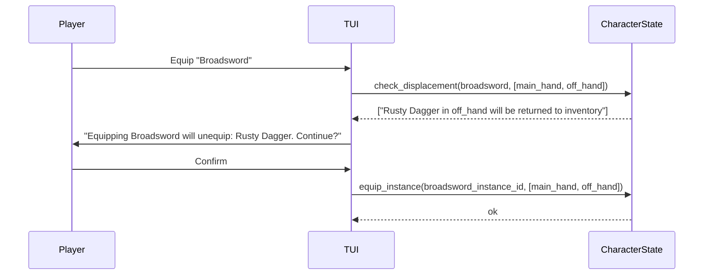
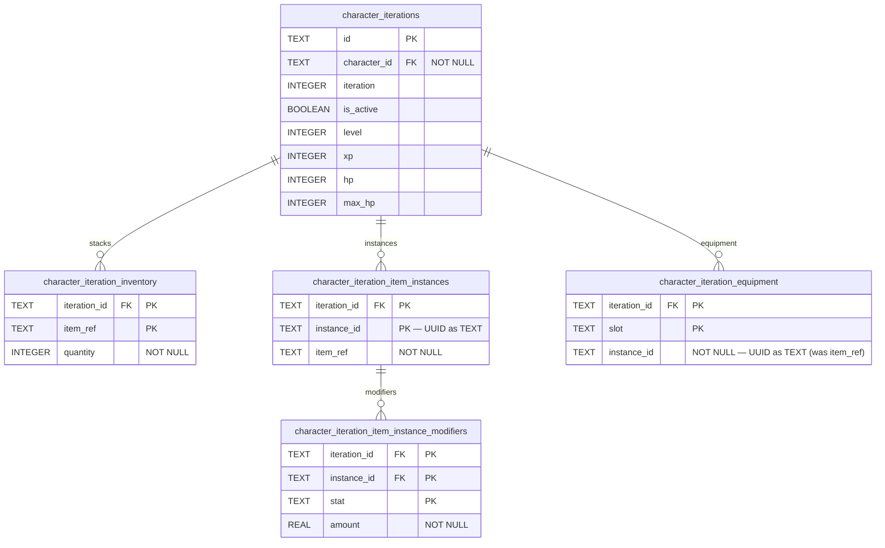

## Context

The engine already has `ItemSpec` with `kind`, `slot`, `stats: Dict`, and `effect: Dict` — all of these are either category labels or untyped blobs. The adventure effect system (`HealEffect`, `StatChangeEffect`, etc.) is a clean typed discriminated union with a working dispatcher in `effects.py`. `CharacterState` already has `inventory: Dict[str, int]`, `equipment: Dict[str, str]`, and a `equip()` method, but nothing computes bonuses from equipped items and nothing can use a consumable.

The goal is to give items real mechanics using the existing effect grammar, introduce a split inventory model that won't require a schema break when unique item modifiers land later, and wire up the TUI inventory screen.

Equipment changes (equipping/unequipping gear) are **not** allowed inside adventures — this keeps adventure content deterministic and avoids mid-combat gear-swap dialogs. However, stat bonuses from already-equipped items are always active: `effective_stats()` is used throughout the adventure pipeline (combat calculations, condition evaluation, adventure pool filtering) so a sword equipped before entering a dungeon raises the player's effective stats during every combat inside it. Only item consumption (via `UseItemEffect`) is a new in-adventure action.

## Goals / Non-Goals

**Goals:**

- Typed consumable effects using the same `Effect` union as adventure steps
- Equippable items with flat stat modifier slots that contribute to effective stats
- Flat stat modifier bonuses from equipped items apply in combat (attack/defense) via `effective_stats()`
- Conditional equipment slots defined in `CharacterConfig` (slot unlocks, species slots, etc.)
- Split inventory model separating fungible stacks from unique instances
- `effective_stats()` on `CharacterState` for on-the-fly modifier computation
- `CharacterStatCondition` evaluating effective stats when the registry is available
- `UseItemEffect` for in-adventure item consumption (consuming potions, firing wand charges, etc.)
- TUI inventory screen accessible both inside and outside adventures
- "Ask first" confirmation when equipping a multi-slot item displaces existing gear
- DB schema updated for instances and instance-keyed equipment

**Non-Goals:**

- Item modifier rolling / reforging (Terraria-style) — deferred to a future change
- Percentage-based stat modifiers — flat deltas only in this change
- Equipping items during adventure steps
- Per-item-kind modifier eligibility restrictions
- Complex combat-specific item mechanics (elemental resistances, critical hit modifiers, conditional damage bonuses) — flat stat additions via `effective_stats()` apply to combat but no special-case combat logic is added for items

## Decisions

### D1: `category` replaces `kind` as a display-only field

`kind` on `ItemSpec` has historically implied behavioral meaning (`kind: consumable` was supposed to mean "this item can be used"). That coupling is removed. Behavior is now determined entirely by the presence of `use_effects` (consumable) or an `equip` spec (equippable). `category` is a free-form string used by the TUI to group items in the inventory display and by loot tables to filter drops by type (e.g., "drop a weapon"). No engine logic branches on `category`.

**Validation rule**: `category` is required. No item may omit it.

**Alternative considered:** Keep `kind` as a required discriminator with a fixed enum (`consumable`, `weapon`, `armor`, `material`, `quest`). Rejected: a closed enum requires engine code changes every time a game package needs a new item category, and even with an enum the actual behavior still needs to come from `use_effects` or `equip` — making `kind` purely presentational is simpler and more content-author-friendly.

**Alternative considered:** A `behaviors: List[Literal["usable", "equippable"]]` field derived from the presence of `use_effects` and `equip`. Rejected: redundant — the presence of those fields already self-documents the behavior without an additional list.

### D2: `use_effects` + `consumed_on_use` drives consumable mechanics

```python
class ItemSpec(BaseModel):
    category: str
    displayName: str
    description: str = ""
    use_effects: List[Effect] = []
    consumed_on_use: bool = True
    equip: EquipSpec | None = None
    stackable: bool = True
    droppable: bool = True
    value: int = Field(default=0, ge=0)
```

Any item with a non-empty `use_effects` list can be used. The same `Effect` union and `run_effect()` dispatcher from adventure steps is reused without modification. `consumed_on_use` defaults to `True` — a healing potion that doesn't disappear when drunk requires an explicit `consumed_on_use: false`. Items with no `use_effects` are not "usable" and the Use button is absent from the inventory UI.

Example YAML for a healing potion:

```yaml
apiVersion: oscilla/v1
kind: Item
metadata:
  name: healing-potion
spec:
  category: consumable
  displayName: Healing Potion
  description: Restores 30 HP when consumed.
  use_effects:
    - type: heal
      amount: 30
  consumed_on_use: true
  stackable: true
  value: 50
```

**Alternative considered:** A separate `ConsumableSpec` model (analogous to `EquipSpec`) containing the effect list. Rejected: all the information is already in the `Effect` union and dispatch infrastructure. Wrapping it in a nested model adds indirection without value.

**Alternative considered:** Dispatching item use by calling the adventure pipeline's step executor rather than `run_effect()` directly. Rejected: item use is not a pipeline step — it is a side effect triggered by player action or by an adventure effect. Sharing `run_effect()` directly avoids creating a second dispatcher for the same effect grammar.

### D3: `EquipSpec` uses list-form stat modifiers

```python
class StatModifier(BaseModel):
    stat: str
    amount: int | float

class EquipSpec(BaseModel):
    slots: List[str] = Field(min_length=1)
    stat_modifiers: List[StatModifier] = []
```

The list form (rather than a flat dict) is chosen to enable future expansion — v2 may add `target_condition: Condition | None` to `StatModifier` for conditional bonuses ("this sword does +5 strength but only against goblin enemies"). A dict cannot carry that metadata.

Example YAML for an iron sword:

```yaml
apiVersion: oscilla/v1
kind: Item
metadata:
  name: iron-sword
spec:
  category: weapon
  displayName: Iron Sword
  description: A reliable iron blade.
  equip:
    slots:
      - main_hand
    stat_modifiers:
      - stat: strength
        amount: 2
  stackable: false
  value: 100
```

**Validation rule**: `stackable: true` items may not have an `equip` spec. A stacking sword makes no sense.

**Alternative considered:** `stat_modifiers: Dict[str, int | float]` (flat dict, stat name → amount). Rejected: chosen list form allows v2 to attach per-modifier metadata (e.g., `target_condition`) without a breaking schema change.

**Alternative considered:** Storing stat bonuses directly on `CharacterState` when the item is equipped (denormalized). Rejected: on-the-fly computation via `effective_stats()` avoids the synchronization hazard of keeping derived data in sync with the equipment state.

### D4: `SlotDefinition` in `CharacterConfigSpec` with conditional slots

```python
class SlotDefinition(BaseModel):
    name: str
    displayName: str
    accepts: List[str] = []        # item categories; empty = accepts all
    requires: Condition | None = None
    show_when_locked: bool = False
```

Slot definitions live in `CharacterConfig` because they describe "what a character sheet looks like" — this already varies by game, class, and species. `requires` is evaluated using **base stats only** (not effective stats) to avoid circular reasoning: the slot determines what is equipped, and what is equipped determines effective stats.

`show_when_locked: bool = False` — when `False`, slots whose `requires` condition is unmet are hidden in the TUI inventory screen entirely. When `True`, they render with a locked indicator and the display name, helping content authors hint at future progression ("◈ Saddle slot — requires: Owns a Horse").

**Slot reconciliation rule**: If a player's equipped item is in a slot whose `requires` condition is no longer satisfied (e.g., the milestone was revoked), the item remains in the slot and a warning is logged. The TUI status panel surfaces this as a visible anomaly so the player is aware. Items are never silently returned to inventory.

Example YAML equipment slots in a character config:

```yaml
equipment_slots:
  - name: head
    displayName: Head
    accepts:
      - helmet
  - name: main_hand
    displayName: Main Hand
    accepts:
      - weapon
  - name: off_hand
    displayName: Off Hand
    accepts:
      - weapon
      - shield
  - name: armor
    displayName: Body Armor
    accepts:
      - armor
  - name: saddle
    displayName: Mount Saddle
    accepts:
      - saddle
    requires:
      type: milestone
      name: owns-horse
    show_when_locked: true
```

**Alternative considered:** Defining equipment slots globally in the game manifest (not per `CharacterConfig`). Rejected: slots are intrinsically tied to character body shape — a wolf-form character has different slots than a human-form character. Keeping them in `CharacterConfig` allows class or species configs to define their own slot sets.

**Alternative considered:** Silently unequipping items when their slot's `requires` condition becomes unmet (returning them to inventory). Rejected: silent inventory mutations are never player-friendly; a player who equipped a saddle-slot item should be told explicitly what happened rather than finding items mysteriously rearranged. The keep-and-warn approach gives the player information and lets content authors decide how to handle the edge case in their game logic.

### D5: Split inventory model

```python
@dataclass
class ItemInstance:
    instance_id: UUID
    item_ref: str
    modifiers: Dict[str, int | float] = field(default_factory=dict)  # empty in v1
```

`CharacterState` changes from:

```python
inventory: Dict[str, int]         # item_ref → quantity
equipment: Dict[str, str]          # slot → item_ref
```

to:

```python
stacks: Dict[str, int]             # item_ref → quantity (stackable items only)
instances: List[ItemInstance]      # non-stackable items
equipment: Dict[str, UUID]         # slot → instance_id
```

When an item's `stackable` field is `True` it goes into `stacks`; when `False` it becomes an `ItemInstance` in `instances`. `effective_stats()` iterates over `equipment.values()`, looks up each `instance_id` in `instances`, fetches the `ItemManifest` from the registry, and sums all `stat_modifiers`. Instances in `instances` but absent from `equipment` are carried items not currently worn.

The `modifiers` dict on `ItemInstance` is intentionally a placeholder — always `{}` in v1. When the modifier rolling system ships, it will carry the per-instance stat deltas for the "Legendary Iron Sword" use case.

The full `CharacterState` changes are:

```python
@dataclass
class CharacterState:
    # ... existing fields unchanged ...
    stacks: Dict[str, int] = field(default_factory=dict)         # stackable items: item_ref → quantity
    instances: List[ItemInstance] = field(default_factory=list)  # non-stackable items by UUID
    equipment: Dict[str, UUID] = field(default_factory=dict)     # slot → instance_id

    def add_item(self, ref: str, quantity: int, registry: ContentRegistry) -> None:
        """Route to stacks or instances based on item's stackable flag."""
        manifest = registry.items[ref]
        if manifest.spec.stackable:
            self.stacks[ref] = self.stacks.get(ref, 0) + quantity
        else:
            if quantity != 1:
                raise ValueError(f"Cannot add {quantity} of non-stackable item {ref!r}")
            self.instances.append(ItemInstance(instance_id=uuid4(), item_ref=ref))

    def effective_stats(self, registry: ContentRegistry) -> Dict[str, int | float | bool | None]:
        """Return base stats plus all equipped item modifiers. Never mutates self.stats."""
        result = dict(self.stats)
        seen_instance_ids: set[UUID] = set()
        for instance_id in self.equipment.values():
            if instance_id in seen_instance_ids:
                continue
            seen_instance_ids.add(instance_id)
            instance = next((i for i in self.instances if i.instance_id == instance_id), None)
            if instance is None:
                continue
            item_spec = registry.items[instance.item_ref].spec
            if item_spec.equip is not None:
                for modifier in item_spec.equip.stat_modifiers:
                    result[modifier.stat] = result.get(modifier.stat, 0) + modifier.amount
        return result
```

**Alternative considered:** Keeping a single `inventory: Dict[str, int | List[ItemInstance]]` collection and branching on type. Rejected: a heterogeneous collection makes type annotations difficult and every inventory operation must branch on the item type. Two clean fields are more explicit and simpler to iterate.

**Alternative considered:** Dropping `stacks` entirely and tracking all items as `ItemInstance` objects (even stackable ones) — each unit of a stackable item would be its own instance. Rejected: this creates enormous instance lists for common stackables (potions, materials) and makes quantity display awkward.

**Alternative considered:** Introducing the split model as `inventory` (backward-compat list containing both stacks and instances). Rejected: a backward-compatible alias on a breaking schema is a maintenance trap. The rename to `stacks` is an intentional clean break documented in the tasks.

### D6: Multi-slot equipping — "ask first"

A two-handed sword with `slots: [main_hand, off_hand]` displaces whatever is currently in both slots. The interaction is:



This confirmation only occurs in the TUI inventory screen. Equipping and consuming are entirely separate operations — `UseItemEffect` is a consumption action (drink a potion, fire a wand charge) and has nothing to do with the equipment system.

```python
def check_displacement(
    self, instance_id: UUID, slots: List[str]
) -> List[str]:
    """Return human-readable descriptions of items displaced by equipping this instance.

    Used by the TUI to decide whether to show a confirmation dialog.
    Returns an empty list when no existing items would be displaced.
    """

def equip_instance(self, instance_id: UUID, slots: List[str]) -> None:
    """Equip an item instance to the given slots.

    For each slot: if another instance is currently there, remove all of
    that instance's slots from equipment and return it to self.instances.
    Then write self.equipment[slot] = instance_id for all slots.
    Raises ValueError if instance_id is not found in self.instances or
    in the current equipment (it must be present somewhere).
    """

def unequip_slot(self, slot: str) -> None:
    """Unequip the instance in the given slot.

    Removes all equipment dict entries for the instance occupying slot
    (the item may span multiple slots) and returns the instance to self.instances.
    """
```

**Alternative considered:** Automatically displace and equip without a confirmation step. Rejected: silent gear displacement is surprising and anti-player. For single-slot items that don't displace anything, no dialog is needed and none is shown — the dialog only appears when displacement would actually occur.

**Alternative considered:** Requiring a separate `unequip` call before equipping to a slot already occupied. Rejected: forces two clicks for a common operation (swap weapons). "Ask first" gives one confirmation and handles both unequip and equip atomically.

### D7: Condition evaluator receives optional `registry`

```python
def evaluate(
    condition: Condition | None,
    player: CharacterState,
    registry: ContentRegistry | None = None,
) -> bool:
```

All existing call sites pass no `registry` and continue to work. When `registry` is provided, `CharacterStatCondition` calls `player.effective_stats(registry)` rather than reading `player.stats` directly. All other condition types are unaffected — they do not consult equipped items.

The adventure pipeline already holds a `ContentRegistry`. It will pass the registry to `evaluate()` when filtering adventure pools and checking step conditions, so equipped bonuses naturally count.

The combat step handler likewise uses `player.effective_stats(registry)` rather than `player.stats` for its attack and defense calculations. An iron sword that grants +2 strength will raise the player's effective strength during combat — the registry is already available in the pipeline and the same `effective_stats()` call is used uniformly. There is no separate code path for combat.

**Alternative considered:** Always computing effective stats in `CharacterStatCondition` regardless of whether a registry is provided, by storing a registry reference on `CharacterState`. Rejected: `CharacterState` is a plain dataclass and should not hold a registry reference — that would create a coupling between data and content that makes unit testing harder and breaks the clean boundary between engine state and the content layer.

**Alternative considered:** A separate `evaluate_effective()` function alongside the existing `evaluate()`. Rejected: this forks the condition evaluation surface and forces call sites to choose between two functions. An optional parameter keeps the API unified.

**Alternative considered:** Evaluating slot `requires` conditions using effective stats. Rejected by design: the slot determines what is equipped, and what is equipped determines effective stats — using effective stats for slot gating creates a circular dependency. Slot conditions always use base stats.

### D8: `UseItemEffect` in the adventure effect union

```python
class UseItemEffect(BaseModel):
    type: Literal["use_item"]
    item: str  # item_ref
```

The dispatcher in `run_effect()` handles it:

1. Look up `item_ref` in `registry.items`. If not found, log warning and return without mutation.
2. Check player inventory (`stacks` for stackable, `instances` for non-stackable). If not present, show TUI error and return without mutation.
3. Run each effect in `item_manifest.spec.use_effects` through `run_effect()` recursively.
4. If `consumed_on_use: true`, remove one unit from stacks or remove the matching instance.

Equipping cannot happen via adventure effects by design — only consumption is allowed inside adventures.

The recursive `run_effect()` call for each `use_effect` raises a natural stack overflow guard via Python's default recursion limit. An item whose `use_effects` list references another `UseItemEffect` for a different item will work correctly; a circular chain (item A uses item B which uses item A) would recurse until the limit hits. This edge case is left as a content authoring concern — no special protection is added in v1.

**Alternative considered:** Resolving item use inline in the adventure pipeline step handler rather than as an `Effect` type. Rejected: making it an `Effect` means it composes naturally with other effects — an adventure step can grant a potion and immediately use it in one step list.

**Alternative considered:** Restricting `UseItemEffect` to stackable items only (consumables). Rejected: a non-stackable item with `use_effects` and `consumed_on_use: false` is a perfectly valid design (e.g., a reusable wand). The dispatcher handles both inventory paths.

### D9: Database — new instance table, updated equipment column

The existing `character_iteration_equipment` table stores `item_ref TEXT`. This needs to become `instance_id TEXT` (UUID as text). Two new tables track non-stackable item instances and their per-instance modifiers:

```sql
CREATE TABLE character_iteration_item_instances (
    instance_id TEXT NOT NULL,
    iteration_id TEXT NOT NULL REFERENCES character_iterations(id),
    item_ref TEXT NOT NULL,
    PRIMARY KEY (iteration_id, instance_id)
);

CREATE TABLE character_iteration_item_instance_modifiers (
    iteration_id TEXT NOT NULL,
    instance_id TEXT NOT NULL,
    stat TEXT NOT NULL,
    amount REAL NOT NULL,
    PRIMARY KEY (iteration_id, instance_id, stat),
    FOREIGN KEY (iteration_id, instance_id)
        REFERENCES character_iteration_item_instances(iteration_id, instance_id)
        ON DELETE CASCADE
);
```

`character_iteration_equipment` is recreated with `instance_id TEXT NOT NULL` replacing `item_ref TEXT NOT NULL`. Migrating `item_ref`-keyed equipment rows to `instance_id`-keyed rows requires knowing the UUID for each equipped item — since the equip feature is new (no existing live equipment rows), the migration can safely drop and recreate the equipment table without preserving any rows.

`add_item_instance()` writes both tables atomically: it inserts the instance row, then inserts one row per modifier into `character_iteration_item_instance_modifiers`. In v1 the modifiers list is always empty, so the modifier table will be populated by the future modifier-rolling system. `remove_item_instance()` deletes from `character_iteration_item_instances`; the modifiers rows are removed automatically via `ON DELETE CASCADE`.

The targeted service functions for the new tables are:

| Operation | Service function | Table written |
|---|---|---|
| Add an instance | `add_item_instance(session, iteration_id, instance)` | `character_iteration_item_instances` — INSERT; `character_iteration_item_instance_modifiers` — INSERT per modifier |
| Remove an instance | `remove_item_instance(session, iteration_id, instance_id)` | `character_iteration_item_instances` — DELETE (modifiers cascade) |
| Equip to a slot | `equip_item(session, iteration_id, slot, instance_id)` | `character_iteration_equipment` — UPSERT |
| Unequip a slot | `unequip_item(session, iteration_id, slot)` | `character_iteration_equipment` — DELETE |
| Stack inventory | `set_inventory_item(session, iteration_id, item_ref, quantity)` | `character_iteration_inventory` — unchanged |

`add_item_instance()` and `remove_item_instance()` use `INSERT` / `DELETE` (not upsert) because each `instance_id` is globally unique; duplicate inserts should not be silently ignored.

**Alternative considered:** Storing `instances` as a JSON array on `character_iterations`. Rejected: JSON columns cannot be efficiently queried or indexed; adding, removing, or looking up a single instance requires deserializing the entire array. The composite-PK table pattern used for all other iteration child data is consistent and correct here.

**Alternative considered:** Storing per-instance modifiers as a JSON object in a `modifiers TEXT` column on `character_iteration_item_instances`. Rejected: a JSON column cannot be efficiently queried, indexed, or joined against; any read of a single modifier stat requires deserializing the entire blob. The normalized child-table approach is consistent with the project's other iteration patterns and enables future queries such as "find all characters holding an item with a +strength modifier" without a full table scan and deserialization pass.

**Alternative considered:** Reusing existing `character_iteration_inventory` with a `NULL` quantity to represent instances. Rejected: conflates two semantically different concepts (quantity of a fungible item vs. identity of a unique instance) in a single table, making queries and serialization logic harder.

**Alternative considered:** Migrating existing equipment rows (keyed by `item_ref`) by synthesizing UUIDs for them. Rejected: the equip mechanics are entirely new in this change — no equipment rows exist in any live database. A clean drop-and-recreate is simpler and less error-prone.

### D10: TUI Inventory Screen

The inventory screen is a new Textual widget accessible from:

- Outside adventures: a persistent `[I] Inventory` button in the main game screen
- Inside adventures: a contextual `[I] Inventory` button present between steps

```
┌─ INVENTORY ─────────────────────────────────────────────────────────┐
│  EQUIPPED                          BACKPACK                          │
│  ────────────────────────          ──────────────────────────       │
│  Head       (empty)                healing-potion   ×3  [Use]       │
│  Main Hand  Iron Sword [Unequip]   strong-potion    ×1  [Use]       │
│  Off Hand   (empty)                wolf-tooth-neck. ×1  [Equip]     │
│  Armor      Leather Armour[Unequip]                                  │
│                                                                      │
│  [Close]                                                             │
└──────────────────────────────────────────────────────────────────────┘
```

In-adventure, the `[Equip]` button is hidden for all instances. Only `[Use]` is present.

Locked slots (`requires` unmet, `show_when_locked: true`) render as:

```
  Saddle      ◈ locked
```

Slot reconciliation warnings (a slot whose `requires` condition is no longer met while an item is equipped in it) are surfaced in the TUI status panel rather than as a modal — they are informational, not blocking. The warning text is: `"Warning: [slot displayName] has an equipped item but its unlock condition is no longer met."`.

**Alternative considered:** A dedicated full-screen inventory mode (separate Textual `Screen` rather than a widget/overlay). Rejected: switching to a full screen loses the adventure context visible beneath the overlay; an in-place modal panel is less disorienting.

**Alternative considered:** Making the inventory accessible at any point during an adventure step (including mid-dialog). Rejected: item use during an active step could interact unpredictably with step state. Gating inventory access to between steps (after step outcome is resolved) keeps adventure logic deterministic.

## Documentation Plan

### `docs/authors/content-authoring.md` — Update

**Audience**: Content authors writing YAML manifests for game packages.

**Topics to add/update**:

- Full `ItemSpec` schema reference: `category`, `use_effects`, `consumed_on_use`, `equip`, `stackable`, `droppable`, `value`
- `EquipSpec` and `StatModifier` field reference with examples
- `equipment_slots` in `CharacterConfig`: `SlotDefinition` fields, `requires` condition, `show_when_locked`
- Worked example: healing potion with `use_effects: [{type: heal, amount: 30}]`
- Worked example: iron sword with `equip: {slots: [main_hand], stat_modifiers: [{stat: strength, amount: 2}]}`
- Worked example: two-handed broadsword with `slots: [main_hand, off_hand]`
- Worked example: conditional slot using a milestone condition
- How `UseItemEffect` is used inside adventures

### `docs/dev/game-engine.md` — Update

**Audience**: Engine developers.

**Topics to add/update**:

- Split inventory model (`stacks` vs `instances`), `ItemInstance` dataclass
- `effective_stats(registry)` — how modifiers are computed and when to use it vs. `stats`
- `evaluate()` signature change — `registry` parameter, when to pass it
- `UseItemEffect` dispatch flow
- Slot reconciliation behavior (keep + warn) and TUI status surfacing
- Multi-slot equip flow and confirmation dialog
- Note on `ItemInstance.modifiers` as placeholder for future modifier system; persisted to `character_iteration_item_instance_modifiers` (not JSON)

### `docs/dev/database.md` — Regenerate

Run `make document_schema` after the migration; no manual edits needed. Verify the new `character_iteration_item_instances`, `character_iteration_item_instance_modifiers` tables and updated `character_iteration_equipment` schema appear correctly.

## Testing Philosophy

### Tier 1: Pure unit tests (no DB, no TUI, no YAML loading)

Construct `CharacterState`, `ItemInstance`, `ItemSpec`/`EquipSpec` objects directly in Python.

- `tests/engine/test_inventory_split.py`
  - Adding a stackable item increments `stacks`
  - Adding a non-stackable item appends to `instances`
  - Removing a stackable item decrements `stacks`
  - Removing the last instance of a non-stackable item removes it from `instances`
  - Serialization round-trip (`to_dict()` / `from_dict()`) preserves both stacks and instances
  - `from_dict()` drops unknown instance refs with a warning (content-drift resilience)

- `tests/engine/test_effective_stats.py`
  - `effective_stats()` with an empty equipment dict returns base stats unchanged
  - Equipping a sword with `strength: +2` increases effective strength by 2
  - Equipping two items with overlapping stats sums both deltas
  - Multi-slot item occupying both slots counts its modifiers only once (deduplicated by instance_id)
  - `effective_stats()` does not mutate `player.stats`

- `tests/engine/test_equipment.py`
  - `equip_instance()` moves instance from `instances` (if carried) to `equipment`
  - `equip_instance()` on a multi-slot item sets all slots
  - `equip_instance()` displacing a single-slot item returns the displaced instance to `instances`
  - `equip_instance()` displacing a multi-slot item vacates all its slots
  - `unequip_slot()` returns the instance to `instances` and vacates all slots the instance occupied
  - Equipping an item in a slot that doesn't accept its category raises `ValueError`

- `tests/engine/test_conditions_registry.py`
  - `evaluate(CharacterStatCondition, player, registry=None)` uses base stats
  - `evaluate(CharacterStatCondition, player, registry=registry)` uses effective stats (equipped bonus makes the condition pass)
  - All other condition types are unaffected by passing a registry

- `tests/engine/test_consumable_effects.py`
  - `UseItemEffect` runs `use_effects` from the item manifest
  - `UseItemEffect` with `consumed_on_use: true` removes the item from inventory
  - `UseItemEffect` with `consumed_on_use: false` leaves the item in inventory
  - `UseItemEffect` for an item not in inventory shows TUI error and returns without mutation
  - `UseItemEffect` for an unknown item ref logs warning and returns

### Tier 2: Integration tests using minimal fixture content

Use `tests/fixtures/content/` fixtures; no reference to `content/` directory.

- `tests/engine/test_item_loader.py`
  - Item manifest with valid `use_effects` loads and parses `use_effects` correctly
  - Item manifest with `equip` spec and valid slot + stat refs validates correctly
  - Item with `stackable: true` and an `equip` spec raises `LoadError`
  - Item with `equip.slots` referencing a slot not defined in `CharacterConfig` raises `LoadError`
  - Item with `stat_modifiers[].stat` referencing an unknown stat raises `LoadError`
  - `SlotDefinition` with a `requires` condition loads and parses correctly

- `tests/engine/test_tui_inventory.py`
  - Inventory screen renders expected stacks
  - Inventory screen renders expected instances with Equip button
  - In-adventure inventory screen hides Equip button
  - Locked slot with `show_when_locked: false` is absent from rendered slots
  - Locked slot with `show_when_locked: true` renders with locked indicator
  - Use button triggers consumable effects and removes item (consumed_on_use: true)
  - Equipping a single-slot item with no displacement proceeds without confirmation
  - Equipping a multi-slot item that displaces gear shows confirmation dialog
  - Confirming displacement proceeds; canceling leaves state unchanged

### Tier 3: Persistence tests (SQLite in-memory)

- `tests/engine/test_character_persistence_instances.py`
  - `save_character()` persists instances in `character_iteration_item_instances`
  - `save_character()` persists instance modifiers in `character_iteration_item_instance_modifiers` (one row per stat)
  - `load_character()` reconstructs instances with correct `instance_id`, `item_ref`, `modifiers`
  - Removing an instance also removes its modifier rows (ON DELETE CASCADE)
  - `save_character()` persists equipment as `instance_id` in `character_iteration_equipment`
  - `load_character()` reconstructs `equipment` as `Dict[str, UUID]`
  - Round-trip preserves `stacks` separately from `instances`

---

## Schema

### Updated Data Model — Entity-Relationship Diagram



Only the tables affected by this change are shown. All other tables from the player-persistence schema remain unchanged.

### New ORM Model: `CharacterIterationItemInstanceRecord`

This model lives in `oscilla/models/character_iteration.py` alongside the existing child table ORM classes.

```python
from sqlalchemy import ForeignKey, String
from sqlalchemy.orm import Mapped, mapped_column

from oscilla.models.base import Base


class CharacterIterationItemInstanceRecord(Base):
    __tablename__ = "character_iteration_item_instances"

    iteration_id: Mapped[str] = mapped_column(
        ForeignKey("character_iterations.id"), primary_key=True
    )
    instance_id: Mapped[str] = mapped_column(String, primary_key=True)  # UUID as TEXT
    item_ref: Mapped[str] = mapped_column(String, nullable=False)


class CharacterIterationItemInstanceModifierRecord(Base):
    __tablename__ = "character_iteration_item_instance_modifiers"

    iteration_id: Mapped[str] = mapped_column(String, primary_key=True)
    instance_id: Mapped[str] = mapped_column(String, primary_key=True)  # UUID as TEXT
    stat: Mapped[str] = mapped_column(String, primary_key=True)
    amount: Mapped[float] = mapped_column(nullable=False)
```

### Updated ORM Model: `CharacterIterationEquipmentRecord`

The existing `CharacterIterationEquipmentRecord` in `oscilla/models/character_iteration.py` stores `item_ref`. This changes to `instance_id` (UUID as TEXT):

```python
class CharacterIterationEquipmentRecord(Base):
    __tablename__ = "character_iteration_equipment"

    iteration_id: Mapped[str] = mapped_column(
        ForeignKey("character_iterations.id"), primary_key=True
    )
    slot: Mapped[str] = mapped_column(String, primary_key=True)
    # Changed from item_ref to instance_id (UUID as TEXT).
    # One row per slot; multi-slot items produce multiple rows all sharing the same instance_id.
    instance_id: Mapped[str] = mapped_column(String, nullable=False)
```

### New Pydantic Models: `StatModifier`, `EquipSpec`, updated `ItemSpec`

These live in `oscilla/engine/models/item.py`:

```python
from typing import List
from pydantic import BaseModel, Field, model_validator

from oscilla.engine.models.adventure import Effect  # Effect union


class StatModifier(BaseModel):
    stat: str
    amount: int | float


class EquipSpec(BaseModel):
    slots: List[str] = Field(min_length=1)
    stat_modifiers: List[StatModifier] = []


class ItemSpec(BaseModel):
    category: str
    displayName: str
    description: str = ""
    use_effects: List[Effect] = []
    consumed_on_use: bool = True
    equip: EquipSpec | None = None
    stackable: bool = True
    droppable: bool = True
    value: int = Field(default=0, ge=0)

    @model_validator(mode="after")
    def validate_stackable_equip(self) -> "ItemSpec":
        if self.stackable and self.equip is not None:
            raise ValueError(
                "An item cannot be both stackable and equippable. "
                "Set stackable: false to use an equip spec."
            )
        return self
```

### New Pydantic Model: `SlotDefinition`, updated `CharacterConfigSpec`

These live in `oscilla/engine/models/character_config.py`:

```python
from typing import List
from pydantic import BaseModel, model_validator

from oscilla.engine.conditions import Condition  # Condition union


class SlotDefinition(BaseModel):
    name: str
    displayName: str
    accepts: List[str] = []         # empty = accepts all item categories
    requires: Condition | None = None
    show_when_locked: bool = False


class CharacterConfigSpec(BaseModel):
    # ... existing fields unchanged ...
    equipment_slots: List[SlotDefinition] = []

    @model_validator(mode="after")
    def validate_unique_slot_names(self) -> "CharacterConfigSpec":
        names = [slot.name for slot in self.equipment_slots]
        if len(names) != len(set(names)):
            seen: set[str] = set()
            for name in names:
                if name in seen:
                    raise ValueError(
                        f"equipment_slots contains duplicate slot name: {name!r}"
                    )
                seen.add(name)
        return self
```

### New Dataclass: `ItemInstance`

This lives in `oscilla/engine/character.py` above the `CharacterState` class:

```python
from dataclasses import dataclass, field
from uuid import UUID, uuid4
from typing import Dict


@dataclass
class ItemInstance:
    instance_id: UUID
    item_ref: str
    # Empty dict in v1. Populated by the future modifier rolling system.
    # Persisted to character_iteration_item_instance_modifiers (one row per stat),
    # not as a JSON blob.
    modifiers: Dict[str, int | float] = field(default_factory=dict)

    def to_dict(self) -> Dict[str, object]:
        return {
            "instance_id": str(self.instance_id),
            "item_ref": self.item_ref,
            "modifiers": self.modifiers,
        }

    @classmethod
    def from_dict(cls, data: Dict[str, object]) -> "ItemInstance":
        return cls(
            instance_id=UUID(str(data["instance_id"])),
            item_ref=str(data["item_ref"]),
            modifiers=dict(data.get("modifiers", {})),  # type: ignore[arg-type]
        )
```
