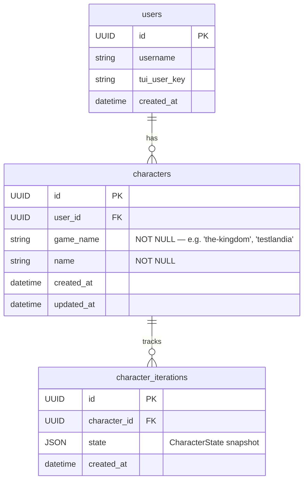

## Context

### Current State

`CONTENT_PATH` points to the root of a single game package. The `load(content_dir)` function in `oscilla/engine/loader.py` scans that directory recursively, parses every `.yaml`/`.yml` file into manifest Pydantic models, cross-validates references, compiles effective unlock conditions, and returns a single `ContentRegistry`. The `Settings` class holds both `content_path: Path` and the database `DatabaseSettings`, with a `model_validator` on `DatabaseSettings` that auto-derives the SQLite path as `content_path.parent / "saves.db"`. Character persistence in `oscilla/models/character.py` has a `UNIQUE(user_id, name)` constraint — entirely unscoped to any game concept.

The `oscilla game` CLI command calls `_load_content()`, which calls `load(settings.content_path)` and raises `SystemExit(1)` on any error. The loaded `ContentRegistry` is passed directly into `OscillaApp` (Textual). There is no game-selection screen; the only resolution happens at the character level.

### What This Change Addresses

This design covers four interlocking improvements delivered as one combined change:

1. **Multi-game library** — restructure the content root into a library of named game subdirectories; add `load_games()` to the loader; add a TUI game-selection screen; scope character persistence to a game via a new `game_name` column.
2. **Stat-mutation effects** — add `stat_change` and `stat_set` adventure effect types with load-time type validation against `CharacterConfig`.
3. **Level-down** — make `add_xp()` bidirectional: negative XP can de-level, with an XP floor at 0 and level floor at 1.
4. **Testlandia** — a new developer game at `content/testlandia/` exercising every engine feature across structured realms.

## Goals / Non-Goals

**Goals:**

- Any number of game packages can live under one library root.
- The CLI presents a game-selection screen when multiple games are available.
- Characters are isolated per game; a name collision across games is not an error.
- Developers can exercise every major engine feature without touching The Kingdom.
- Stat values can be assigned or incremented by adventure effects.
- XP can be removed and levels can be lost, with clear floor guardrails.

**Non-Goals:**

- Cross-game character transfer or shared inventories.
- Live reload of game packages without restarting.
- Integer overflow/underflow hardening (noted in ROADMAP.md; future work).
- A web or API interface for game selection.
- Automated test coverage of Testlandia YAML content itself (content is for manual testing; engine behaviour is covered by unit tests using inline fixtures).

## Decisions

### D1 — Directory Structure: Mandatory Subdirectory Layout

`GAMES_PATH` always points to a game library root — a directory whose immediate subdirectories are game packages. There is no single-game fallback. A directory is treated as a game package if and only if it contains a `game.yaml` at its top level. Subdirectories without `game.yaml` are silently skipped.

```
content/                   ← GAMES_PATH default
  the-kingdom/             ← game package (contains game.yaml)
    game.yaml
    character_config.yaml
    regions/
    classes/
    recipes/
  testlandia/              ← game package (contains game.yaml)
    game.yaml
    character_config.yaml
    regions/
```

`git mv content/ content/the-kingdom/` moves the existing package. The `GAMES_PATH` default resolves to the project root's `content/` directory (the new parent), which is a one-level-up shift from the current default.

**Alternatives considered:**

- *Auto-detect*: If `game.yaml` exists directly under the configured root, treat it as single-game mode; otherwise scan subdirs. Rejected — this creates two code paths in the loader and CLI. Any developer who forgets to restructure gets silent single-game behaviour instead of a clear error.
- *Explicit index file* (`games.yaml` listing enabled packages): Rejected — directory presence is sufficient; an extra manifest introduces ordering/maintenance overhead with no benefit.

### D2 — Loader API: `load_games()` Returns a Dict

A new top-level public function is added to `oscilla/engine/loader.py`. The existing `load(content_dir)` is retained as an internal helper and called per-subdir.

```python
def load_games(library_root: Path) -> Dict[str, ContentRegistry]:
    """Scan library_root immediate subdirectories for game packages.

    A subdirectory is a game package if it contains a game.yaml.
    Subdirectories without game.yaml are silently skipped.

    Calls load() for each package and accumulates all errors under that
    package's name before re-raising as a single ContentLoadError.

    Returns a dict keyed by GameManifest.metadata.name.
    Returns {} if no valid packages are found (CLI handles the empty case).
    """
    games: Dict[str, ContentRegistry] = {}
    all_errors: List[LoadError] = []

    for subdir in sorted(library_root.iterdir()):
        if not subdir.is_dir():
            continue
        if not (subdir / "game.yaml").exists():
            continue
        try:
            registry = load(subdir)
        except ContentLoadError as exc:
            # Tag errors with the package directory name for reporting.
            tagged = [
                LoadError(file=e.file, message=f"[{subdir.name}] {e.message}")
                for e in exc.errors
            ]
            all_errors.extend(tagged)
            continue
        game_name = registry.game.metadata.name if registry.game else subdir.name
        games[game_name] = registry

    if all_errors:
        raise ContentLoadError(all_errors)

    return games
```

`ContentLoadError` propagates errors from all packages simultaneously — the developer sees every broken manifest across every game in one invocation, rather than fixing one game and re-running.

**Alternative considered:** Return `List[Tuple[str, ContentRegistry]]`. Rejected — dict lookup by `--game` flag value is O(1) and the caller never needs order.

**Alternative considered:** Have `load_games()` silently skip packages with errors rather than raising. Rejected — silent partial loading masks real content bugs; explicit `--game` flag makes targeted single-game loading available when needed.

### D3 — `GAMES_PATH` / `games_path` Setting; DatabaseSettings Derivation

Two settings classes are updated.

**`oscilla/conf/settings.py`** — rename field and update the default:

```python
from pathlib import Path
from pydantic import Field
from .cache import CacheSettings
from .db import DatabaseSettings

# Default: the content/ directory at the project root is the library root.
_DEFAULT_GAMES_PATH = Path(__file__).parent.parent.parent / "content"


class Settings(DatabaseSettings, CacheSettings):
    project_name: str = "oscilla"
    debug: bool = False
    games_path: Path = Field(
        default=_DEFAULT_GAMES_PATH,
        description="Path to the game library root directory containing game package subdirectories.",
    )
```

**`oscilla/conf/db.py`** — the `model_validator` previously derived the SQLite path from `content_path`. Because `content_path` is gone, the validator now uses `games_path`. The SQLite file lives alongside the library root directory (i.e. `content/../saves.db` → `saves.db` at the project root), which is unchanged from the current behaviour:

```python
class DatabaseSettings(BaseSettings):
    model_config = SettingsConfigDict(env_file=".env", env_file_encoding="utf-8", extra="ignore")

    database_url: str | None = Field(
        default=None,
        description=(
            "Full async-driver database URL. When unset, auto-derived from games_path "
            "as sqlite+aiosqlite:///<games_path.parent>/saves.db."
        ),
    )
    games_path: Path = Field(
        default=Path("content"),
        description="Path to the game library root directory.",
    )

    @model_validator(mode="after")
    def derive_sqlite_url(self) -> "DatabaseSettings":
        if self.database_url is None:
            db_path = self.games_path.parent / "saves.db"
            self.database_url = f"sqlite+aiosqlite:///{db_path.resolve()}"
        return self
```

The SQLite path (`saves.db` beside `content/`) is identical to today's path. Existing developer databases are reused without re-migration just from this rename.

**Note:** `DatabaseSettings` and `Settings` both declare `games_path` because `DatabaseSettings` is resolved independently by Alembic (`db/env.py`). The fields must remain in sync. `Settings` inherits from `DatabaseSettings`, so the field is inherited — only the default override differs. This pattern is unchanged from the current `content_path` arrangement.

**`CONTENT_PATH` removal:** The env var is simply no longer declared. Pydantic-settings with `extra="ignore"` means any remaining `.env` file entries for `CONTENT_PATH` are silently ignored. No runtime warning is emitted. Documented as a breaking change in the README and `.env.example`.

### D4 — Character Scoping: `game_name` Column on `CharacterRecord`

#### ORM Model Change

A `game_name: Mapped[str]` column is added to `CharacterRecord`. The unique constraint is replaced:

```python
class CharacterRecord(Base):
    __tablename__ = "characters"
    __table_args__ = (
        # Old constraint removed: UniqueConstraint("user_id", "name", name="uq_character_user_name")
        UniqueConstraint("user_id", "game_name", "name", name="uq_character_user_game_name"),
    )

    id: Mapped[UUID] = mapped_column(primary_key=True, default=uuid4)
    user_id: Mapped[UUID] = mapped_column(ForeignKey("users.id"), nullable=False)
    game_name: Mapped[str] = mapped_column(String, nullable=False)
    name: Mapped[str] = mapped_column(String, nullable=False)
    created_at: Mapped[datetime] = mapped_column(...)
    updated_at: Mapped[datetime] = mapped_column(...)
    iterations: Mapped[List["CharacterIterationRecord"]] = relationship(...)
```

`game_name` is populated from `GameManifest.metadata.name` (the `metadata.name` field in `game.yaml`, e.g. `"the-kingdom"`, `"testlandia"`). This is a stable identifier defined by the content author.

**Alternative considered:** A separate `games` table with a UUID FK. Rejected — the game name is defined by content manifests, not by the application. A FK would require inserting a `games` row either at startup (coupling content loading to persistence) or at character creation (implicit upsert logic). The name-as-string approach is self-contained: any game package that has a `metadata.name` can be used without prior DB registration.

#### Service Function Signatures

All character service functions that accept `user_id` gain a required `game_name: str` parameter. No function has a default value for this parameter — callers must always specify which game they are operating on. mypy typing enforces this at every call site.

```python
async def save_character(
    session: AsyncSession,
    state: "CharacterState",
    user_id: UUID,
    game_name: str,          # NEW — required
) -> None: ...

async def list_characters_for_user(
    session: AsyncSession,
    user_id: UUID,
    game_name: str,          # NEW — required
) -> List[CharacterRecord]: ...

async def delete_user_characters(
    session: AsyncSession,
    user_id: UUID,
    game_name: str,          # NEW — required; deletes only this game's characters
) -> int: ...

async def get_character_by_name(
    session: AsyncSession,
    user_id: UUID,
    name: str,
    game_name: str,          # NEW — required
) -> "CharacterRecord | None": ...
```

All query `where` clauses gain an `and_(CharacterRecord.game_name == game_name, ...)` condition.

### D5 — CLI: `--game` Flag, Validate Changes, `--reset-db` Scoping

#### `oscilla game`

The `game` command gains a `--game` flag:

```python
@app.command(help="Start the interactive game loop.")
@syncify
async def game(
    game_name: Annotated[
        str | None, typer.Option("--game", "-g", help="Game to load by manifest name.")
    ] = None,
    character_name: Annotated[
        str | None, typer.Option("--character-name", "-c", help="Character name to load or create.")
    ] = None,
    reset_db: Annotated[
        bool,
        typer.Option("--reset-db/--no-reset-db", help="Delete saved characters for the selected game."),
    ] = False,
) -> None:
```

The `_load_content()` helper is replaced by `_load_games()` returning `Dict[str, ContentRegistry]`. If the dict is empty, print an error and exit 1. The `game_name` is resolved either from `--game`, or by `OscillaApp` after the selection screen. `reset_db` runs only after game selection so the confirmation prompt can name the specific game.

#### `oscilla validate`

```python
@app.command(help="Validate game packages and report any errors.")
def validate(
    game_name: Annotated[
        str | None, typer.Option("--game", "-g", help="Validate only this game package.")
    ] = None,
) -> None:
```

When `--game` is omitted, all packages are validated and a per-game summary is printed:

```
✓ the-kingdom  — 4 regions, 12 locations, 24 adventures, ...
✓ testlandia   — 5 regions, 14 locations, 22 adventures, ...
```

On failure, errors are prefixed with the game name:

```
✗ testlandia
  • <stat-workshop>: stat_change targets unknown stat: "nonexistent"
```

#### `--reset-db` Scope

`delete_user_characters` previously deleted all characters for a user. After this change it accepts `game_name` and deletes only that game's characters. The CLI confirmation prompt names the game:

```
This will permanently delete all saved characters for "testlandia". Continue? [y/N]:
```

### D6 — TUI: `GameSelectScreen`

A new `GameSelectScreen(ModalScreen[str])` is added to `oscilla/engine/tui.py`. It is shown by `OscillaApp` when `game_name` was not supplied via CLI and more than one game is loaded.

```python
class GameSelectScreen(ModalScreen[str]):
    """Modal game-selection screen. Returns the selected game's metadata.name."""

    DEFAULT_CSS = """
    GameSelectScreen {
        align: center middle;
    }
    GameSelectScreen > Vertical {
        width: 60;
        height: auto;
        border: thick $primary;
        padding: 1 2;
    }
    """

    def __init__(self, games: Dict[str, "ContentRegistry"]) -> None:
        super().__init__()
        self._games = games  # keyed by metadata.name

    def compose(self) -> ComposeResult:
        with Vertical():
            yield Static("[bold]Select a Game[/bold]", classes="title")
            yield OptionList(*[
                Option(
                    f"[bold]{reg.game.spec.displayName}[/bold]\n{reg.game.spec.description}",
                    id=name,
                )
                for name, reg in self._games.items()
                if reg.game is not None
            ])

    def on_option_list_option_selected(self, event: OptionList.OptionSelected) -> None:
        self.dismiss(event.option.id)
```

`OscillaApp` calls `await self.push_screen_wait(GameSelectScreen(games))` to suspend until a game is chosen, then proceeds with the selected `ContentRegistry`. When only one game is present, the screen is skipped and the single registry is used directly.

`OscillaApp.__init__` signature changes from `registry: ContentRegistry` to `games: Dict[str, ContentRegistry], game_name: str | None = None` to support both the pre-selected (`--game`) and selection-screen paths.

### D7 — `add_xp()` Level-Down

#### Current Signature and Behaviour

```python
def add_xp(self, amount: int, xp_thresholds: List[int], hp_per_level: int) -> List[int]:
    self.xp += amount
    levels_gained: List[int] = []
    while self.level - 1 < len(xp_thresholds) and self.xp >= xp_thresholds[self.level - 1]:
        self.level += 1
        self.max_hp += hp_per_level
        levels_gained.append(self.level)
    return levels_gained
```

#### Updated Signature and Behaviour

```python
def add_xp(
    self,
    amount: int,
    xp_thresholds: List[int],
    hp_per_level: int,
) -> tuple[List[int], List[int]]:
    """Add or remove XP, updating level and max_hp as thresholds are crossed.

    Returns (levels_gained, levels_lost). Both lists contain the level numbers
    crossed (e.g. losing from level 3 to level 1 → levels_lost = [3, 2]).

    XP floor: 0. Level floor: 1. HP is capped at new max_hp after de-levelling.
    """
    self.xp += amount
    levels_gained: List[int] = []
    levels_lost: List[int] = []

    # Level-up loop (existing logic)
    while (
        self.level - 1 < len(xp_thresholds)
        and self.xp >= xp_thresholds[self.level - 1]
    ):
        self.level += 1
        self.max_hp += hp_per_level
        levels_gained.append(self.level)

    # Level-down loop (new)
    while self.level > 1 and self.xp < xp_thresholds[self.level - 2]:
        levels_lost.append(self.level)
        self.level -= 1
        self.max_hp -= hp_per_level

    # Clamp XP and HP
    if self.xp < 0:
        self.xp = 0
    self.hp = min(self.hp, self.max_hp)

    return levels_gained, levels_lost
```

**The level-down loop condition:** `xp_thresholds[self.level - 2]` is the XP needed to *enter* the current level (the threshold for `level - 1 → level`). When XP falls below that value, the character loses a level. The loop continues until XP is enough to be at the current level, or until level 1 is reached.

**XP clamping:** After both loops, if `self.xp < 0`, it is set to 0. This handles the case of being at level 1 with low XP and receiving a large negative grant.

**HP clamping:** `self.hp = min(self.hp, self.max_hp)` — executed after all de-levels. If the character was at full HP, they end at the new (lower) max HP.

#### Call Site Update in `effects.py`

```python
case XpGrantEffect(amount=amount):
    game = registry.game
    thresholds = game.spec.xp_thresholds if game else []
    hp_per = game.spec.hp_formula.hp_per_level if game else 0

    levels_gained, levels_lost = player.add_xp(
        amount=amount, xp_thresholds=thresholds, hp_per_level=hp_per
    )
    await tui.show_text(f"{'Gained' if amount > 0 else 'Lost'} {abs(amount)} XP.")
    for level in levels_gained:
        await tui.show_text(f"[bold]Level up![/bold] You are now level {level}!")
    for level in levels_lost:
        await tui.show_text(f"[bold red]Level down![/bold red] You are now level {level - 1}.")
```

This is the only call site of `add_xp()`. The return-type change is contained.

### D8 — New Effect Types: `stat_change` and `stat_set`

#### Pydantic Models

Two new models are added to `oscilla/engine/models/adventure.py` and included in the `Effect` discriminated union:

```python
class StatChangeEffect(BaseModel):
    type: Literal["stat_change"]
    stat: str = Field(description="Stat name as declared in CharacterConfig. Must be int or float type.")
    amount: int | float = Field(description="Signed delta. Non-zero.")

    @field_validator("amount")
    @classmethod
    def amount_not_zero(cls, v: int | float) -> int | float:
        if v == 0:
            raise ValueError("stat_change amount cannot be zero")
        return v


class StatSetEffect(BaseModel):
    type: Literal["stat_set"]
    stat: str = Field(description="Stat name as declared in CharacterConfig.")
    value: int | float | str | bool | None = Field(
        description="New value; must be type-compatible with the stat's declared type."
    )


Effect = Annotated[
    Union[
        XpGrantEffect,
        ItemDropEffect,
        MilestoneGrantEffect,
        EndAdventureEffect,
        HealEffect,
        StatChangeEffect,   # NEW
        StatSetEffect,      # NEW
    ],
    Field(discriminator="type"),
]
```

#### YAML Syntax

```yaml
# Increment an int stat
- type: stat_change
  stat: strength
  amount: 2

# Decrement a float stat
- type: stat_change
  stat: speed
  amount: -0.5

# Set any typed stat to an explicit value
- type: stat_set
  stat: is_blessed
  value: true

- type: stat_set
  stat: title
  value: "Champion"
```

#### Load-time Validation in `validate_references()`

The existing `validate_references()` function already collects `stat_names` from `CharacterConfig`. New validation is added in the `"Adventure"` case of the same function. A helper walks the step tree and collects all `StatChangeEffect` and `StatSetEffect` instances:

```python
def _collect_stat_effects(step: Step, results: List[Effect]) -> None:
    """Recursively collect StatChangeEffect and StatSetEffect from a step tree."""
    ...

# In the "Adventure" case of validate_references():
stat_effects: List[Effect] = []
for step in adv.spec.steps:
    _collect_stat_effects(step, stat_effects)

for effect in stat_effects:
    if isinstance(effect, StatChangeEffect):
        if effect.stat not in stat_names:
            errors.append(LoadError(..., f"stat_change references unknown stat: {effect.stat!r}"))
        else:
            # Check stat type — must be int or float
            stat_def = _get_stat_def(cc, effect.stat)  # looks up CharacterConfigStatDef
            if stat_def.type not in ("int", "float"):
                errors.append(LoadError(..., f"stat_change: stat {effect.stat!r} is type {stat_def.type!r}; must be int or float"))
    elif isinstance(effect, StatSetEffect):
        if effect.stat not in stat_names:
            errors.append(LoadError(..., f"stat_set references unknown stat: {effect.stat!r}"))
        else:
            stat_def = _get_stat_def(cc, effect.stat)
            if not _value_compatible(effect.value, stat_def.type):
                errors.append(LoadError(..., f"stat_set: value {effect.value!r} incompatible with stat {effect.stat!r} (type {stat_def.type!r})"))
```

`_value_compatible(value, type_str)` returns `True` if: `type_str == "int"` and `isinstance(value, int)` (not `bool`); `type_str == "float"` and `isinstance(value, (int, float))` (not `bool`); `type_str == "bool"` and `isinstance(value, bool)`; `type_str == "str"` and `isinstance(value, str)` or `value is None`; `None` is compatible with any type (represents an unset stat).

**Note on bool/int overlap:** Python's `bool` is a subclass of `int`. The type checks must test `bool` before `int` to avoid accepting `true`/`false` as an integer stat value.

#### Effect Dispatch in `effects.py`

```python
case StatChangeEffect(stat=stat, amount=amount):
    current = player.stats.get(stat, 0) or 0
    player.stats[stat] = current + amount
    await tui.show_text(f"[italic]{stat}[/italic] changed by {amount:+} → {player.stats[stat]}")

case StatSetEffect(stat=stat, value=value):
    player.stats[stat] = value
    display = repr(value) if value is not None else "—"
    await tui.show_text(f"[italic]{stat}[/italic] set to {display}")
```

No clamping is applied to stat values at runtime — stat-level floors/ceilings are tracked as future work in `ROADMAP.md`.

### D9 — Testlandia Content Package

#### `game.yaml`

```yaml
apiVersion: game/v1
kind: Game
metadata:
  name: testlandia
spec:
  displayName: "Testlandia"
  description: "A developer sandbox for manually exercising engine features. No plot, no rules — just levers."
  xp_thresholds: [100, 250, 500, 900, 1400, 2100, 3000, 4200, 5800, 8000]
  hp_formula:
    base_hp: 100
    hp_per_level: 20
  base_adventure_count: null
```

High base HP (100) reduces the chance of dying during combat tests. High `hp_per_level` (20) makes level-up/down HP changes visible. `base_adventure_count: null` allows unlimited adventures per session.

#### `character_config.yaml`

```yaml
apiVersion: game/v1
kind: CharacterConfig
metadata:
  name: testlandia-character
spec:
  public_stats:
    - name: strength
      type: int
      default: 10
      description: "Standard int stat. Target for stat_change and stat_set tests."
    - name: speed
      type: float
      default: 1.0
      description: "Float stat. Tests float delta and set operations."
    - name: is_blessed
      type: bool
      default: false
      description: "Bool stat. Tests stat_set toggle to true/false."
    - name: gold
      type: int
      default: 0
      description: "Standard int currency stat."
  hidden_stats:
    - name: title
      type: str
      default: null
      description: "Null-default str stat. Tests stat_set on unset string."
    - name: debug_counter
      type: int
      default: 0
      description: "Hidden int. Incremented by condition-lab adventures."
```

#### Realm Structure

```
testlandia/
  game.yaml
  character_config.yaml
  regions/
    character/
      character.yaml             Region: "Character Realm"
      locations/
        heal/
          heal.yaml
          adventures/
            full-heal.yaml       → heal: full
            partial-heal.yaml    → heal: 10
        xp-lab/
          xp-lab.yaml
          adventures/
            gain-xp-small.yaml   → xp_grant: 50
            gain-xp-level-up.yaml → xp_grant: 9999
            lose-xp-delevel.yaml  → xp_grant: -9999
        stat-workshop/
          stat-workshop.yaml
          adventures/
            bump-strength.yaml   → stat_change: strength +1
            drop-strength.yaml   → stat_change: strength -1
            bump-speed.yaml      → stat_change: speed +0.5
            set-strength.yaml    → stat_set: strength 15
            bless.yaml           → stat_set: is_blessed true
            unbless.yaml         → stat_set: is_blessed false
            set-title.yaml       → stat_set: title "Champion"
    combat/
      combat.yaml                Region: "Combat Realm"
      enemies/
        glass-dummy.yaml         → very low HP, 0 damage — never defeats player
        iron-golem.yaml          → very high HP, heavy damage — likely defeats L1 char
      locations/
        easy-arena/
          easy-arena.yaml
          adventures/
            easy-fight.yaml      → combat: glass-dummy
        hard-arena/
          hard-arena.yaml
          adventures/
            hard-fight.yaml      → combat: iron-golem
        flee-arena/
          flee-arena.yaml
          adventures/
            flee-test.yaml       → combat with clear on_flee narrative
    conditions/
      conditions.yaml            Region: "Conditions Realm"
      locations/
        badge-issuer/
          badge-issuer.yaml
          adventures/
            get-badge.yaml       → milestone_grant: dev-badge
        milestone-gate/
          milestone-gate.yaml    → unlock: milestone: dev-badge
          adventures/
            milestone-locked.yaml → narrative confirming access
        stat-gate/
          stat-gate.yaml         → unlock: stat_gte: {stat: strength, value: 15}
          adventures/
            stat-gated.yaml      → narrative confirming access
        condition-lab/
          condition-lab.yaml
          adventures/
            and-condition.yaml   → stat_check: requires milestone AND strength
            or-condition.yaml    → choice branching testing inline conditions
    choices/
      choices.yaml               Region: "Choices Realm"
      locations/
        decision-lab/
          decision-lab.yaml
          adventures/
            binary-choice.yaml   → choice: 2 options, distinct outcomes
            nested-choice.yaml   → choice whose branch contains another choice
            stat-check-branch.yaml → stat_check: strength >= 12 pass/fail branches
            goto-demo.yaml       → narrative with label + goto loop
    items/
      items.yaml                 Region: "Items Realm"
      items/
        test-widget.yaml         → minimal item manifest
      locations/
        item-lab/
          item-lab.yaml
          adventures/
            gain-item.yaml       → item_drop: test-widget, weight 100
            multi-item.yaml      → item_drop: count 3
```

All enemies are defined within the `combat/` region directory. The `glass-dummy` has 1 HP and 0 attack — it cannot defeat the player under any circumstances, making `easy-fight` reliably winnable at level 1. The `iron-golem` has 9999 HP and high attack — intended to reliably defeat a fresh character to test the defeat branch.

### D10 — DB Migration

No production database has ever been deployed, so there are no existing rows to migrate. The column is added as `NOT NULL` without a server default — if a developer's local `saves.db` exists, it must be deleted and recreated (or the migration will fail on SQLite's inability to add a `NOT NULL` column without a default to a non-empty table).

```python
# db/versions/<revision>_add_game_name_to_characters.py

def upgrade() -> None:
    # No server default: no production data exists, and "the-kingdom" may not
    # always be a valid game name. Developers with a local saves.db should
    # delete it and let the app recreate the schema from scratch.
    op.add_column(
        "characters",
        sa.Column("game_name", sa.String(), nullable=False),
    )
    # Step 2: Drop the old constraint
    op.drop_constraint("uq_character_user_name", "characters", type_="unique")
    # Step 3: Add the new constraint
    op.create_unique_constraint(
        "uq_character_user_game_name", "characters", ["user_id", "game_name", "name"]
    )


def downgrade() -> None:
    op.drop_constraint("uq_character_user_game_name", "characters", type_="unique")
    op.drop_column("characters", "game_name")
    op.create_unique_constraint(
        "uq_character_user_name", "characters", ["user_id", "name"]
    )
```

**Rollback safety:** The downgrade works if and only if no user has characters with the same name in two different games. If such duplicates exist, the `UNIQUE(user_id, name)` re-creation will fail. This is an acceptable constraint for a pre-1.0 project; operators can clear testlandia characters before downgrading.

**SQLite note:** SQLite does not support `ALTER TABLE ... DROP CONSTRAINT`. Alembic uses the `batch_alter_table` context manager for SQLite constraint changes. The migration must use `with op.batch_alter_table("characters") as batch_op:` to be compatible with both SQLite and PostgreSQL.

## Schema

### `characters` Table After Migration



The `game_name` column is plain `VARCHAR NOT NULL`. The new unique constraint `uq_character_user_game_name` spans `(user_id, game_name, name)`, replacing `uq_character_user_name` which spanned `(user_id, name)`.

## Risks / Trade-offs

- **Breaking `CONTENT_PATH`** → Any existing `.env` files or CI configs using `CONTENT_PATH` will silently fall back to the default and load whatever is at `GAMES_PATH`. Mitigation: README and `.env.example` are updated; the old var name emits no warning (acceptable for a pre-1.0 project).
- **`delete_user_characters` scope change** → Existing callers that expect all-game deletion will now only delete one game's characters. Mitigation: the function signature change is explicit (`game_name` is a required parameter); callers that omit it will get a type error.
- **`add_xp()` return type change** → Any code unpacking the old `List[int]` directly will break. Mitigation: only `effects.py` calls this; the change is contained.
- **Testlandia content instability** → Developer content will evolve freely and may break as engine features change. Mitigation: no automated tests reference Testlandia YAML; engine tests use inline fixtures.

## Migration Plan

The full Alembic migration Python code is specified in **D10** above. Summary:

1. Update `CharacterRecord` ORM model to add `game_name` and replace the unique constraint.
2. Run `make create_migration MESSAGE="add game_name to characters"`. Alembic auto-generates the migration from the ORM diff; verify it matches the D10 template before committing.
3. The migration runs on `docker compose up` via `db/env.py`'s `run_migrations_offline/online` hooks, and also on application startup via `alembic upgrade head` in the container `prestart.sh`.
4. **Developer SQLite databases**: no `server_default` is set. SQLite cannot add a `NOT NULL` column to an existing non-empty table without a default. Any developer with a local `saves.db` must delete it before running migrations. This is acceptable — no production data exists.
5. **Rollback constraints**: see D10 for the rollback safety caveat regarding duplicate character names across games.

## Open Questions

- Should `stat_change` have a stat-level floor/ceiling? For now: no clamping beyond XP/level rules. Floor hardening is tracked in ROADMAP.md.
- Should Testlandia ship with a `prestige` test location? Prestige already works; leaving it as future Testlandia content.

## Documentation Plan

| Document | Audience | Topics to cover |
|---|---|---|
| `README.md` | Players and developers | Rename `CONTENT_PATH` → `GAMES_PATH`; new `--game` CLI flag; multi-game directory layout example; updated `--reset-db` scope note |
| `docs/dev/game-engine.md` | Engine developers | `load_games()` API; `stat_change`/`stat_set` effect YAML syntax and validation rules; `add_xp()` return type change; level-down mechanics |
| `docs/dev/settings.md` | Developers | `games_path` setting; `GAMES_PATH` env var; removal of `CONTENT_PATH` |
| `docs/dev/testing.md` | Developers | Testlandia usage guide: which realm covers which feature; how to run a manual test session; note that Testlandia YAML is never imported in automated tests |
| `docs/authors/content-authoring.md` | Content authors | New multi-package library structure; `stat_change`/`stat_set` effect reference with typed examples; level-down XP rules |
| `ROADMAP.md` | All | Integer overflow/underflow as a future hardening item for XP, stats, and inventory quantities |

## Testing Philosophy

Tests never reference `content/`, `content/the-kingdom/`, or `content/testlandia/`. Changing or removing the POC content package must never break any test. Fixture manifests reside in `tests/fixtures/content/<scenario>/` and use `test-` prefixed names (e.g. `test-game`, `test-character`, `test-stat-enemy`) — never content-flavoured names.

### Tier 1 — Unit Tests (pure Python, no I/O)

Construct Pydantic models and `CharacterState` dataclasses directly. No YAML files. No database.

| Test | File | Assertions |
|---|---|---|
| `add_xp` level-down basic | `tests/engine/test_character.py` | Given `level=3`, `xp=250`, applying `-200` XP crosses back below `xp_thresholds[1]` → `levels_lost=[3]`, `level=2` |
| `add_xp` level-down multi-level | same | Applying enough negative XP to drop two levels → `levels_lost=[3, 2]` in correct order |
| `add_xp` XP floor clamp | same | At `level=1, xp=10`, apply `-999` → `xp=0`, `level=1`, `levels_lost=[]` |
| `add_xp` HP clamped after de-level | same | `hp > new_max_hp` after de-level → `hp == new_max_hp` |
| `add_xp` level-up unchanged | same | Positive XP still produces `levels_gained`, `levels_lost=[]` |
| `add_xp` no crossing | same | Small negative XP, still above threshold for current level → `([], [])` |
| `add_xp` return type | same | Return value is `tuple[List[int], List[int]]` not bare list |
| `StatChangeEffect` non-zero validator | `tests/engine/test_stat_effects.py` (new) | `amount=0` raises `ValidationError` |
| `StatSetEffect` construction | same | Accepts `int`, `float`, `bool`, `str`, `None` for `value` |
| `Effect` discriminator routing | same | YAML `type: stat_change` deserializes to `StatChangeEffect`; `type: stat_set` to `StatSetEffect` |

### Tier 2 — Loader Integration Tests (inline fixture YAMLs)

Use minimal YAML files in `tests/fixtures/content/<scenario>/`. Never use `load_games(settings.games_path)` — always pass the fixture directory directly.

| Test | Fixture dir | What is verified |
|---|---|---|
| `load_games` returns two registries | `tests/fixtures/content/multi-game-library/` | Two subdirs with valid `game.yaml`; returns `{"test-alpha": registry, "test-beta": registry}` |
| `load_games` skips non-game subdirs | same (add an `extras/` dir with no `game.yaml`) | `extras/` is absent from the result dict |
| `load_games` single-game library | `tests/fixtures/content/single-game-library/` | Returns dict with one entry |
| `load_games` empty library | `tests/fixtures/content/empty-library/` | Returns `{}` |
| `load_games` propagates errors with prefix | `tests/fixtures/content/broken-game-library/` | `ContentLoadError` message includes the package dir name as prefix |
| `stat_change` valid int stat | `tests/fixtures/content/stat-effects/` | Adventure with `stat_change: strength, amount: 1` loads without errors |
| `stat_change` on bool stat → error | same | `stat_change` targeting a `bool` stat emits a `LoadError` for wrong type |
| `stat_change` unknown stat → error | same | Stat name not in `CharacterConfig` emits a `LoadError` |
| `stat_set` valid any-type assignment | same | `stat_set` targeting `str`, `bool`, `int`, `float` all load cleanly |
| `stat_set` type-incompatible value → error | same | Assigning `"hello"` to an `int` stat emits a `LoadError` |
| `stat_set` unknown stat → error | same | Unknown name emits `LoadError` |
| `stat_set` null value on nullable stat | same | `null` assigned to a stat with `default: null` loads cleanly |

### Tier 3 — Persistence Tests (in-memory SQLite)

Use the test database fixture (memory-backed SQLite) and the FastAPI/service fixture chain defined in `tests/conftest.py` and `tests/engine/conftest.py`.

| Test | File | Assertions |
|---|---|---|
| Character isolation across games | `tests/engine/test_character_persistence.py` | Two characters named `"hero"` in games `"test-alpha"` and `"test-beta"` coexist; UNIQUE constraint not violated |
| `get_character_by_name` game scoped | same | Returns correct character when `game_name` matches; returns `None` for wrong `game_name` |
| `list_characters_for_user` game scoped | same | Returns only characters belonging to the specified `game_name` |
| `delete_user_characters` game scoped | same | Deletes characters from `"test-alpha"` only; `"test-beta"` characters survive |
| Migration upgrade/downgrade | Alembic test or separate migration test | `upgrade()` runs cleanly on empty DB; `downgrade()` removes the column and restores the old constraint |

### Fixture File Structure

```
tests/
  fixtures/
    content/
      multi-game-library/
        test-alpha/
          game.yaml         # metadata.name: test-alpha
          character_config.yaml
        test-beta/
          game.yaml         # metadata.name: test-beta
          character_config.yaml
        extras/             # no game.yaml — skipped by load_games()
      single-game-library/
        test-only/
          game.yaml
          character_config.yaml
      empty-library/        # empty — no subdirs
      broken-game-library/
        test-broken/
          game.yaml         # references a nonexistent location
          character_config.yaml
      stat-effects/
        test-stat-game/
          game.yaml
          character_config.yaml  # declares: strength (int), speed (float), is_blessed (bool), title (str, null default)
          regions/
            test-stat-region/
              test-stat-region.yaml
              locations/
                stat-lab/
                  stat-lab.yaml
                  adventures/
                    valid-int-change.yaml
                    invalid-bool-change.yaml
                    invalid-unknown-stat.yaml
                    valid-any-set.yaml
                    invalid-type-set.yaml
```

`test-alpha/game.yaml` and `test-beta/game.yaml` are minimal — only `apiVersion`, `kind`, `metadata.name`, and required `spec` fields. No regions, no complex content. The goal is to test the loader scan logic, not full registry construction.

`stat-effects/` fixtures contain exactly the adventures needed to exercise each validation scenario. Each adventure is its own YAML file so tests can invoke the loader against the full directory and check that exactly the expected errors are reported.

### What Is Not Tested

- Testlandia YAML content — this is a developer-operated sandbox; its files are not loaded during any automated test.
- `GameSelectScreen` TUI rendering — Textual screen layout is a developer UX concern; the `mock_tui` fixture bypasses actual terminal rendering for pipeline tests.
- The actual `--game` flag CLI path — CLI command wiring is smoke-tested in `tests/test_cli.py` at an invocation level, not by asserting on specific game selection UI behaviour.
