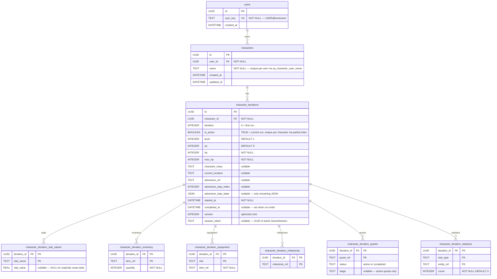
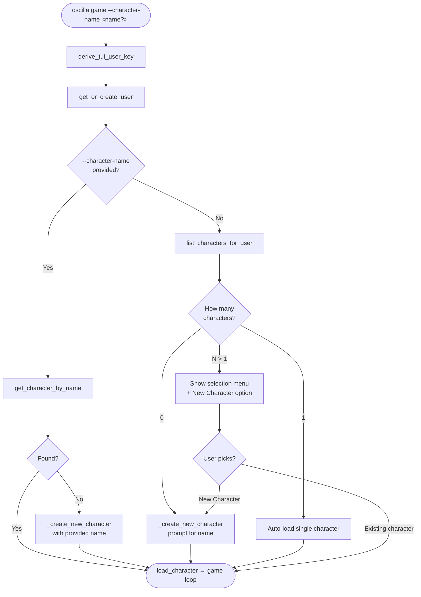
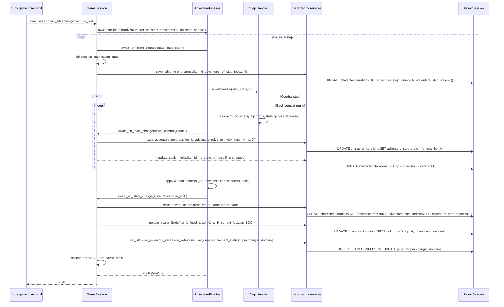
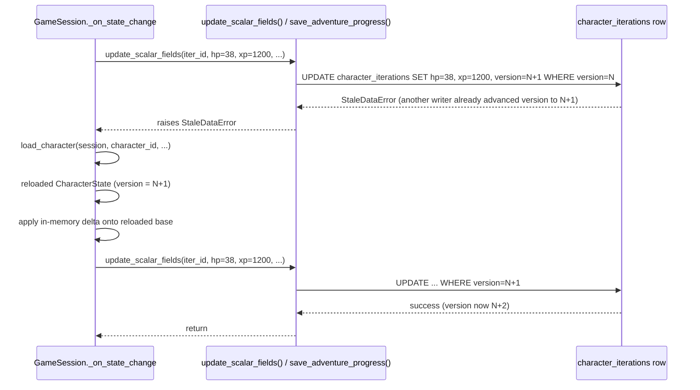
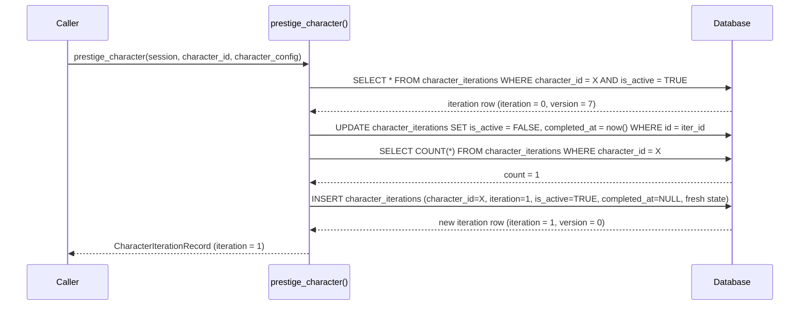
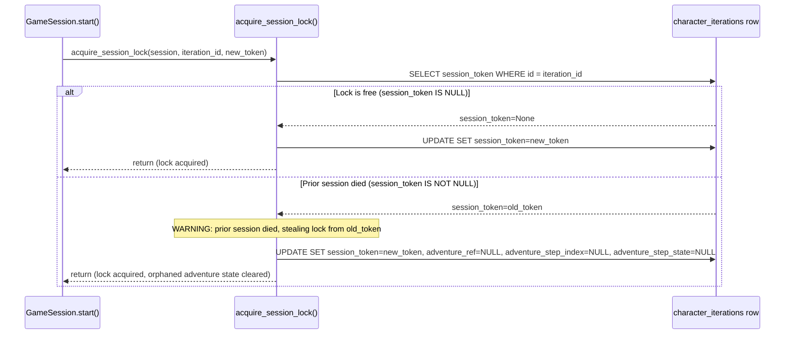

## Context

The engine currently runs entirely in memory: `CharacterState` (currently named `PlayerState`, renamed in this change — see task 0) is a plain Python dataclass, `AdventurePipeline` is a stateless executor, and `oscilla/models/` contains only `Base = declarative_base()` with no subclasses and no migrations. The supporting infrastructure — async SQLAlchemy engine, Alembic, scheme remapping (`sqlite→aiosqlite`, `postgresql→asyncpg`) — is already in place and waiting.

The persistence layer must stay content-agnostic. A given Oscilla installation may run any game content package. A character's dynamic data (stats, inventory, equipment, milestones, quests) is defined by that content package, not by the engine. The schema cannot have per-stat columns.

Two deployment contexts drive different behavior:

- **TUI**: one SQLite file per content package installation; single-user, created implicitly from system identity
- **Web** (`www.py` / FastAPI): PostgreSQL; multi-user; web auth is deferred to a future change

## Goals / Non-Goals

**Goals:**

- Persist `CharacterState` across TUI sessions and web requests
- Mid-adventure checkpointing so a crash during combat is recoverable
- Optimistic locking to prevent concurrent web requests from silently overwriting each other
- Content-drift resilience: saves survive content package updates
- Auto-derive SQLite path from `content_path` so TUI users need zero DB configuration
- Lazy-create a stable TUI user identity from `USER@hostname`
- Character selection on TUI startup (0 → create, 1 → auto-load, N → menu)
- `[+] New Character` always available in the selection menu
- `--character-name` CLI flag to address a specific character by name

**Non-Goals:**

- Web authentication (deferred)
- Leaderboards or cross-user SQL queries on JSON columns
- Save-file encryption or export
- Supporting more than one content package simultaneously on one server

## Decisions

### D1: Normalized relational schema — identity, iteration, and iteration data

Character persistence is split across nine tables:

- **`users`**: Human identity. `id`, `user_key` (UNIQUE), `created_at`.
- **`characters`**: Character identity across all prestige runs. `id`, `user_id` (FK → users, NOT NULL), `name`, `created_at`, `updated_at`.
- **`character_iterations`**: One row per prestige run. `id`, `character_id` (FK → characters), `iteration` (0 = first run, 1 = after first prestige, …), `is_active` (BOOLEAN — TRUE for the current run; enforced unique per character by partial index), scalar run stats (`level`, `xp`, `hp`, `max_hp`, `character_class`, `current_location`), active adventure scalars (`adventure_ref`, `adventure_step_index`), `adventure_step_state` (JSON — the only remaining JSON column; see below), `started_at`, `completed_at` (NULL = active run), `version`.
- **`character_iteration_stat_values`**: EAV table for content-defined character stats. `(iteration_id, stat_name)` composite PK; `stat_value` REAL nullable (NULL for stats whose value is explicitly unset).
- **`character_iteration_inventory`**: `(iteration_id, item_ref)` composite PK; `quantity` INTEGER.
- **`character_iteration_equipment`**: `(iteration_id, slot)` composite PK; `item_ref` TEXT.
- **`character_iteration_milestones`**: `(iteration_id, milestone_ref)` composite PK. One row per milestone held.
- **`character_iteration_quests`**: `(iteration_id, quest_ref)` composite PK; `status` TEXT ("active" or "completed"); `stage` TEXT nullable (current stage name — only set for active quests).
- **`character_iteration_statistics`**: `(iteration_id, stat_type, entity_ref)` composite PK; `count` INTEGER. `stat_type` is one of "enemies_defeated", "locations_visited", or "adventures_completed".

`adventure_step_state` is the only JSON column remaining. It holds mid-step combat scratch space (e.g., enemy HP between combat rounds) whose keys and shape are determined by the step handler at runtime — genuinely too dynamic for a fixed schema. It is always `NULL` between adventures and cleared at adventure end, so it never grows unboundedly.

All other character data lives in properly typed, indexable columns. Using composite primary keys on child tables avoids extra `id` columns and auto-indexes every lookup by `iteration_id`.

The content-defined stat EAV (`character_iteration_stat_values`) stores `stat_value` as a native REAL column (nullable). All content-defined stats carry an explicit numeric type (`int` or `float`) in the CharacterConfig manifest; Python `int` and `float` values map directly to REAL without encoding. NULL is used for stats whose default is explicitly unset (e.g. relationship scores before first interaction). No encoding or decoding step is required.

Separating `characters` from `character_iterations` means a prestige operation keeps the old iteration row and all its child rows intact (for aggregate lifetime-stats queries) while inserting a new iteration row with fresh children. `is_active = TRUE` on `character_iterations` marks the current run; a partial unique index on `(character_id) WHERE is_active = TRUE` enforces at most one active run per character at the DB level, with no circular FK. The `iteration` ordinal on each row is 0-indexed and is derived at insert time by counting existing iteration rows for the character — no separate denormalized counter is needed.

**Alternative considered:** Storing all iterations as an array in a single JSON column on `characters`. Rejected: impossible to query individual iteration data without deserializing all iterations in application code; also makes aggregate calculations fragile.

**Alternative considered:** Using JSON for all content-defined fields instead of child tables. Rejected: JSON columns cannot be indexed or queried without full deserialization; a quest completion query would require loading and parsing JSON for every character rather than a simple `SELECT`.

### D2: Optimistic locking via `version` column on `character_iterations`

`CharacterIterationRecord` uses SQLAlchemy's built-in `version_id_col` feature (integer increment on every UPDATE). The hot write path is through `character_iterations`. The `characters` identity row is written on initial creation and when `updated_at` is refreshed (at `adventure_end` and prestige) — see D10. It never needs optimistic locking of its own. On concurrent save, the second writer gets a `StaleDataError`. The handler reloads the current iteration from DB and re-applies only the delta.

**Alternative considered:** Row-level DB locks (`SELECT FOR UPDATE`). Rejected: not supported uniformly across SQLite and PostgreSQL without driver-specific workarounds, and pessimistic locking degrades throughput unnecessarily for a game.

Note: `version_id_col` detects concurrent writes from live processes but cannot detect a process that died with `adventure_ref` still set. That problem is addressed by the session soft-lock in D11.

### D3: Content-drift resilience in `CharacterState.from_dict()`

When loading a saved character, the deserializer reconciles saved data against the current `CharacterConfig`:

- Stats present in config but missing in save → injected with default value
- Stats in save but removed from config → silently dropped
- If `active_adventure.adventure_ref` does not exist in the current registry → `active_adventure` is cleared and a warning is logged; the character is returned to location selection
- **Numeric type fidelity:** SQLite returns Python `float` for REAL columns. `from_dict()` MUST cast each stat value to the `type` declared in `CharacterConfig` (e.g. `int(v)` for `type: int` stats) so in-memory equality checks (`stats["strength"] == 10`) remain correct after a round-trip through the database.

This logic lives in `CharacterState.from_dict(character_config, registry, data)` — testable without a DB.

**Alternative considered:** Strict mode (reject load on any drift). Rejected: breaks saves whenever content is updated, unacceptable UX for a game.

### D4: Event-tagged `PersistCallback` protocol on `AdventurePipeline`

```python
class PersistCallback(Protocol):
    async def __call__(
        self,
        state: "CharacterState",
        event: Literal["step_start", "combat_round", "adventure_end"],
    ) -> None: ...
```

`AdventurePipeline.__init__` accepts `on_state_change: PersistCallback | None = None`. The pipeline makes calls at:

- Start of each step dispatch (`step_start`)
- After each combat round resolves (`combat_round`)
- After adventure outcome is determined and effects applied (`adventure_end`)

`None` means no persistence — tests use this default.

**Alternative considered:** Subclassing `AdventurePipeline` with a persistent variant. Rejected: composition (protocol injection) is simpler and keeps tests free of DB concerns.

### D5: `GameSession` orchestrator for the TUI

A new `GameSession` class (`oscilla/engine/session.py`) ties together content loading, user identity, character state, database persistence, and adventure pipeline execution for the TUI:

```python
import asyncio
from typing import List, Literal
from uuid import UUID, uuid4

from sqlalchemy.ext.asyncio import AsyncSession

from oscilla.engine.character import CharacterState
from oscilla.engine.registry import ContentRegistry
from oscilla.engine.tui import TUICallbacks
from oscilla.models.character import CharacterRecord


class GameSession:
    def __init__(
        self,
        registry: ContentRegistry,
        tui: TUICallbacks,
        db_session: AsyncSession,
        character_name: str | None = None,
    ) -> None:
        self.registry = registry
        self.tui = tui
        self.db_session = db_session
        self.character_name = character_name
        self._character: CharacterState | None = None
        # _last_saved_state is set to the CharacterState returned by
        # load_character() or save_character() at the end of start().
        # _on_state_change diffs against this snapshot to find changed domains.
        self._last_saved_state: CharacterState | None = None
        # Unique token for this process's session — used as the soft-lock identity.
        self._session_token: str = str(uuid4())
        self._iteration_id: UUID | None = None

    async def __aenter__(self) -> "GameSession":
        return self

    async def __aexit__(self, *_: object) -> None:
        await self.close()

    async def close(self) -> None:
        """Release the session soft-lock on clean exit.

        Safe to call multiple times and even if start() was never called.
        """
        if self._iteration_id is not None:
            await release_session_lock(
                session=self.db_session,
                iteration_id=self._iteration_id,
                token=self._session_token,
            )

    async def start(self) -> None:
        """Resolve user identity, select or create a character, begin game loop.

        At the end of start(), _character and _last_saved_state are both set
        to the loaded or newly created CharacterState before any game loop
        logic runs.
        """

    async def run_adventure(self, adventure_ref: str) -> None:
        """Build AdventurePipeline with self._on_state_change and run to completion."""

    async def _on_state_change(
        self,
        state: CharacterState,
        event: Literal["step_start", "combat_round", "adventure_end"],
    ) -> None:
        """PersistCallback implementation. Diffs state, calls targeted writes, retries once on StaleDataError."""

    async def _create_new_character(self, name: str | None) -> CharacterState:
        """Prompt for name if not given, call CharacterState.new_character(), save immediately."""

    async def _select_character(self, characters: List[CharacterRecord]) -> CharacterState:
        """Show selection menu for N > 1 characters. Returns the loaded CharacterState."""
```

`start()` acquires the session lock immediately after loading (or creating) the character. The `async with GameSession(...) as session:` pattern in the CLI guarantees `close()` is called even if an exception propagates out of `run_adventure()`.

FastAPI (web) does not use `GameSession` — it uses the service layer directly, with SQLAlchemy sessions managed by FastAPI's DI (`get_session_depends()`).

### D6: Auto-derive SQLite URL from `content_path`

`DatabaseSettings` in `oscilla/conf/db.py` is extended with a `@model_validator` that derives the SQLite path from `content_path` whenever `DATABASE_URL` is not explicitly set:

```python
from pathlib import Path

from pydantic import Field, model_validator
from pydantic_settings import BaseSettings, SettingsConfigDict


class DatabaseSettings(BaseSettings):
    model_config = SettingsConfigDict(env_file=".env", env_file_encoding="utf-8", extra="ignore")

    database_url: str | None = Field(
        default=None,
        description=(
            "Full database URL. When unset, auto-derived from content_path as "
            "sqlite+aiosqlite:///<content_path.parent>/saves.db."
        ),
    )
    content_path: Path = Field(
        default=Path("content"),
        description="Path to the loaded content package directory.",
    )

    @model_validator(mode="after")
    def derive_sqlite_url(self) -> "DatabaseSettings":
        if self.database_url is None:
            db_path = self.content_path.parent / "saves.db"
            self.database_url = f"sqlite+aiosqlite:///{db_path.resolve()}"
        return self
```

The validator runs after all fields are populated, so `content_path` is available. Web deployments set `DATABASE_URL` via environment variable — the validator short-circuits when the field is already set. `db/env.py` (Alembic) reads `DatabaseSettings()` directly and gets the same auto-derived path automatically.

### D7: TUI user identity from `USER@hostname`

```python
import os
import socket


def derive_tui_user_key() -> str:
    """Resolution order: USER → LOGNAME → "unknown", always suffixed with @hostname."""
    user = os.environ.get("USER") or os.environ.get("LOGNAME") or "unknown"
    return f"{user}@{socket.gethostname()}"
```

`users.user_key` has a UNIQUE constraint. `get_or_create_user(session, user_key)` uses an `INSERT ... ON CONFLICT DO NOTHING` upsert so concurrent first-creates are safe. The `--character-name` CLI flag sets the _character name_, not the user key.

### D8: `users` table with deferred web population

```
users:               id (UUID PK), user_key (TEXT UNIQUE NOT NULL), created_at
characters:          id (UUID PK), user_id (UUID FK → users.id NOT NULL), name (UNIQUE per user via uq_character_user_name), created_at, updated_at
character_iterations: id (UUID PK), character_id (UUID FK → characters.id NOT NULL), iteration (INTEGER), is_active (BOOLEAN), level, xp, hp, max_hp, …, started_at, completed_at (nullable), version
```

`get_or_create_user()` always runs at TUI startup and its returned `UUID` is passed to `save_character()`, so `user_id` is always populated — NOT NULL at the DB level. Web auth is a separate future proposal; when it lands a user record will likewise be created before any character is saved.

### D9: Prestige creates a new `character_iterations` row; old row is preserved

When a character prestiges, `prestige_character(session, character_id, character_config)` SHALL:

1. Load the active iteration row via `WHERE character_id = X AND is_active = TRUE`.
2. Set `is_active = FALSE, completed_at = now()` on that row.
3. Count existing iteration rows for `character_id` to derive the new `iteration` ordinal.
4. Insert a new `character_iterations` row with `iteration = count`, `is_active = TRUE`, `completed_at = NULL`, and a fresh state seeded from `character_config` defaults.

Old iteration rows are never deleted. This enables aggregate queries (total XP earned, milestone counts across all prestige runs, per-run comparisons) without any historical reconstruction.

**`CharacterState.iteration` maps to `character_iterations.iteration`:** The in-memory `CharacterState` has an `iteration: int` field (renamed from `prestige_count` in task 0 of this change) whose value is loaded from `character_iterations.iteration`. `to_dict()` serializes it as `"iteration"` and `from_dict()` restores it from that key. The ordinal is 0-indexed (0 = first run, 1 = after first prestige, etc.) — no separate counter column is needed.

`prestige_character()` is defined in the persistence service layer as part of this change but is not wired to any CLI or TUI action yet — the prestige trigger belongs to a future game-mechanic change.

**Enforcing single active iteration:** A partial unique index on `(character_id) WHERE is_active = TRUE` ensures at most one row per character can be active at any time. SQLAlchemy's dialect-specific `sqlite_where` / `postgresql_where` kwargs on `Index` allow the same definition to work on both backends. Within the prestige transaction, the old row is flipped to `is_active = FALSE` before the new `is_active = TRUE` row is inserted, so the constraint is never violated mid-transaction.

**Alternative considered:** `active_iteration_id` FK on `characters` pointing to the active iteration row. Rejected: creates a circular reference (`characters → character_iterations → characters`) requiring `use_alter=True` in Alembic and `post_update=True` in SQLAlchemy to resolve INSERT ordering — significant ORM complexity for no benefit over the `is_active` partial index approach.

**Alternative considered:** Keeping a denormalized `prestige_count` integer on `characters`. Rejected: duplicates information already queryable from `COUNT(character_iterations)` and must be kept in sync manually.

**Alternative considered:** Deleting the old iteration row and storing history externally. Rejected: history loss is irreversible; the per-row storage cost for completed iterations is negligible.

### D10: Targeted writes per data domain — no full-state flush

`save_character()` is used only for the initial INSERT (creating a new `CharacterRecord`, the first `CharacterIterationRecord`, and seeding all child rows with defaults). All subsequent updates use dedicated service functions scoped to the data domain that changed:

| Domain                                                         | Service function                  | Table written                                                                     |
| -------------------------------------------------------------- | --------------------------------- | --------------------------------------------------------------------------------- |
| Scalar run fields (`level`, `xp`, `hp`, `current_location`, …) | `update_scalar_fields()`          | `character_iterations` — triggers `version_id_col` increment                      |
| One content-defined stat                                       | `set_stat()`                      | One `character_iteration_stat_values` upsert                                      |
| One inventory stack                                            | `set_inventory_item()`            | One `character_iteration_inventory` upsert or delete                              |
| One equipment slot                                             | `equip_item()` / `unequip_item()` | One `character_iteration_equipment` upsert or delete                              |
| One milestone                                                  | `add_milestone()`                 | One `character_iteration_milestones` insert                                       |
| One quest                                                      | `set_quest()`                     | One `character_iteration_quests` upsert                                           |
| One entity counter                                             | `increment_statistic()`           | One `character_iteration_statistics` upsert-increment                             |
| Active adventure progress                                      | `save_adventure_progress()`       | `character_iterations` — only function that touches `adventure_step_state` (JSON) |
| Character last-played timestamp                                | `touch_character_updated_at()`    | `characters.updated_at` — refreshed at `adventure_end` and on prestige            |

`GameSession._on_state_change()` holds a `_last_saved_state: CharacterState | None` snapshot of the last successfully persisted state. On each `PersistCallback` event it diffs the incoming state against the snapshot and calls only the targeted write functions for fields that differ. Stable data (milestone set, completed quests, unchanged stats) is never re-written during the adventure. At `adventure_end`, `_on_state_change()` also calls `touch_character_updated_at(session, character_id)` so that `list_characters_for_user()` reflects the most recent session. `prestige_character()` likewise updates `characters.updated_at`.

Child table upserts use `INSERT ... ON CONFLICT DO UPDATE` (SQLAlchemy dialect-agnostic via `insert().on_conflict_do_update()` or Core `merge`), making concurrent upserts to the same composite-PK row idempotent without requiring application-level locking.

`save_adventure_progress()` is the only service function that touches `adventure_step_state`. It is called on `step_start` (advancing `adventure_step_index`, clearing stale step state), `combat_round` (updating `adventure_step_state` with the round's scratch values), and `adventure_end` (setting all three adventure fields to `NULL`). The JSON column remains strictly bounded — it is always cleared before the pipeline returns.

**Alternative considered:** Dirty-flag proxy collections on `CharacterState` that auto-emit writes on mutation. Rejected: deeply couples the in-memory state object to persistence concerns and makes unit testing without a DB harder.

**Alternative considered:** Sending the entire state on every `PersistCallback` event and letting the service layer diff against a cached copy. Rejected: moves caching complexity into the service layer and requires a persistent in-process cache not available to stateless web handlers.

### D11: Session soft-lock for dead-process recovery

Optimistic locking (D2) prevents two live processes from silently overwriting each other. It does not handle the complementary problem: a process that owns a mid-adventure character and then dies, leaving `adventure_ref` and `adventure_step_state` set in the database with no live process to clear them. The next player session would load a character that appears perpetually mid-adventure.

`character_iterations` gains one new nullable column:

- `session_token TEXT | None` — a per-`GameSession` UUID string written at lock acquisition and cleared on clean exit.

**Lock acquisition is always successful** — a new session is never blocked. `acquire_session_lock(session, iteration_id, token)`:

1. Load `session_token` from the active iteration row.
2. **Free** — token is `NULL`: write `session_token = token`.
3. **Prior session died** — token is non-`NULL`: the previous process exited without cleaning up. Log a `WARNING` naming the old token so operators can correlate with crash logs, clear `adventure_ref`, `adventure_step_index`, and `adventure_step_state` to `NULL`, then write `session_token = token`.

There is no concept of a "fresh" (blocking) lock. Concurrent live sessions are already handled by `version_id_col` raising `StaleDataError` — that is the correct concurrency mechanism. The session token exists solely to detect and recover from dead processes.

**Clearing adventure state on recovery** is the correct tradeoff. The alternative — replaying an adventure — risks applying outcome effects (XP, inventory, milestones) a second time because those effects are committed to child tables incrementally during the adventure. Losing an in-progress adventure on crash is the safer failure mode.

**Lock release** — `GameSession.close()` (called from `__aexit__` and any `finally` block) calls `release_session_lock()`, which sets `session_token = NULL` conditionally on the token matching. A clean exit never leaves the lock dirty. No background task is required.

**Alternative considered:** Heartbeat column (`session_heartbeat_at`) updated by a background `asyncio.Task`, with staleness-threshold logic to distinguish dead sessions from fresh ones. Rejected: unnecessary complexity. A new session starting always means the previous process has ended (or the user has intentionally started a new one), so the always-takeover approach is correct and simpler.

**Alternative considered:** OS-level mechanisms (lock files, `EXCLUSIVE` SQLite transactions, PID signals). Rejected: not portable across SQLite and PostgreSQL; lock files do not survive container restarts; the in-DB approach works uniformly across both backends with no OS dependency.

**Known limitation — non-atomic acquisition:** `acquire_session_lock()` is a read-then-UPDATE pair, not a single atomic operation. For the single-process TUI this is harmless. When web auth lands and multiple simultaneous requests may race on the same character, this should be replaced with an atomic `UPDATE ... WHERE session_token IS NULL RETURNING session_token` pattern that combines the read and the write in one statement.

---

## Schema

### Entity-Relationship Diagram



`(character_id, iteration)` has a `UNIQUE` constraint on `character_iterations`. A partial unique index on `(character_id) WHERE is_active = TRUE` enforces at most one active run per character. A `UNIQUE(user_id, name)` constraint on `characters` ensures `get_character_by_name()` is unambiguous and `--character-name` selection is deterministic. All child tables use composite primary keys, which both enforce uniqueness and provide the index needed for iteration-scoped lookups.

### `oscilla/models/user.py`

```python
from datetime import datetime, timezone
from uuid import UUID, uuid4

from sqlalchemy import DateTime, String
from sqlalchemy.orm import Mapped, mapped_column

from oscilla.models.base import Base


class UserRecord(Base):
    __tablename__ = "users"

    id: Mapped[UUID] = mapped_column(primary_key=True, default=uuid4)
    user_key: Mapped[str] = mapped_column(String, unique=True, nullable=False)
    created_at: Mapped[datetime] = mapped_column(
        DateTime(timezone=True),
        nullable=False,
        default=lambda: datetime.now(tz=timezone.utc),
    )
```

### `oscilla/models/character.py`

```python
from datetime import datetime, timezone
from uuid import UUID, uuid4

from sqlalchemy import DateTime, ForeignKey, String, UniqueConstraint
from sqlalchemy.orm import Mapped, mapped_column, relationship

from oscilla.models.base import Base


class CharacterRecord(Base):
    __tablename__ = "characters"
    # Enforces one name per user — makes --character-name selection unambiguous.
    __table_args__ = (
        UniqueConstraint("user_id", "name", name="uq_character_user_name"),
    )

    id: Mapped[UUID] = mapped_column(primary_key=True, default=uuid4)
    user_id: Mapped[UUID] = mapped_column(ForeignKey("users.id"), nullable=False)
    name: Mapped[str] = mapped_column(String, nullable=False)
    created_at: Mapped[datetime] = mapped_column(
        DateTime(timezone=True),
        nullable=False,
        default=lambda: datetime.now(tz=timezone.utc),
    )
    updated_at: Mapped[datetime] = mapped_column(
        DateTime(timezone=True),
        nullable=False,
        default=lambda: datetime.now(tz=timezone.utc),
        onupdate=lambda: datetime.now(tz=timezone.utc),
    )

    iterations: Mapped[List["CharacterIterationRecord"]] = relationship(
        "CharacterIterationRecord",
        back_populates="character",
        order_by="CharacterIterationRecord.iteration",
    )
```

### `oscilla/models/character_iteration.py`

All nine iteration-scoped ORM models live in this file. Composite primary keys are used on child tables — they enforce uniqueness and provide the `iteration_id`-prefixed index needed for all lookups without extra `id` columns.

```python
from datetime import datetime, timezone
from typing import Any, Dict, List
from uuid import UUID, uuid4

from sqlalchemy import Boolean, DateTime, Float, ForeignKey, Index, Integer, JSON, String, UniqueConstraint
from sqlalchemy.orm import Mapped, mapped_column, relationship
from sqlalchemy import text

from oscilla.models.base import Base


class CharacterIterationRecord(Base):
    __tablename__ = "character_iterations"
    __table_args__ = (
        UniqueConstraint("character_id", "iteration", name="uq_character_iteration"),
        # Partial unique index — only one is_active=TRUE row allowed per character.
        # Both SQLite and PostgreSQL support partial indexes; dialect kwargs are
        # required because the WHERE syntax differs slightly.
        Index(
            "uq_active_iteration_per_character",
            "character_id",
            unique=True,
            postgresql_where=text("is_active IS TRUE"),
            sqlite_where=text("is_active = 1"),
        ),
    )

    id: Mapped[UUID] = mapped_column(primary_key=True, default=uuid4)
    character_id: Mapped[UUID] = mapped_column(ForeignKey("characters.id"), nullable=False)
    iteration: Mapped[int] = mapped_column(Integer, nullable=False)
    # Exactly one row per character has is_active = True, enforced by
    # uq_active_iteration_per_character partial unique index.
    is_active: Mapped[bool] = mapped_column(Boolean, nullable=False, default=False)

    # Scalar run stats — indexed and queryable directly
    level: Mapped[int] = mapped_column(Integer, nullable=False, default=1)
    xp: Mapped[int] = mapped_column(Integer, nullable=False, default=0)
    hp: Mapped[int] = mapped_column(Integer, nullable=False)
    max_hp: Mapped[int] = mapped_column(Integer, nullable=False)
    character_class: Mapped[str | None] = mapped_column(String, nullable=True)
    current_location: Mapped[str | None] = mapped_column(String, nullable=True)

    # Active adventure — scalar identifiers live as columns; step_state is the
    # only JSON column because its keys and shape are set by the step handler at
    # runtime (e.g., {"enemy_hp": 12}). All three are NULL between adventures.
    adventure_ref: Mapped[str | None] = mapped_column(String, nullable=True)
    adventure_step_index: Mapped[int | None] = mapped_column(Integer, nullable=True)
    adventure_step_state: Mapped[Dict[str, Any] | None] = mapped_column(JSON, nullable=True)

    # Run lifecycle
    started_at: Mapped[datetime] = mapped_column(
        DateTime(timezone=True),
        nullable=False,
        default=lambda: datetime.now(tz=timezone.utc),
    )
    # Set when the run ends (prestige); NULL while this is the active run.
    completed_at: Mapped[datetime | None] = mapped_column(DateTime(timezone=True), nullable=True)
    version: Mapped[int] = mapped_column(Integer, nullable=False, default=0)

    # Session soft-lock — detects and recovers from dead processes (see D11).
    # session_token is a per-GameSession UUID written at lock acquisition and
    # cleared on clean exit.  If a new session finds this non-NULL it concludes
    # the previous process died, steals the lock, and clears any orphaned adventure state.
    session_token: Mapped[str | None] = mapped_column(String, nullable=True)

    # Child table relationships — cascade keeps orphans from accumulating on delete
    stat_values: Mapped[List["CharacterIterationStatValue"]] = relationship(
        "CharacterIterationStatValue", back_populates="iteration", cascade="all, delete-orphan"
    )
    inventory_rows: Mapped[List["CharacterIterationInventory"]] = relationship(
        "CharacterIterationInventory", back_populates="iteration", cascade="all, delete-orphan"
    )
    equipment_rows: Mapped[List["CharacterIterationEquipment"]] = relationship(
        "CharacterIterationEquipment", back_populates="iteration", cascade="all, delete-orphan"
    )
    milestone_rows: Mapped[List["CharacterIterationMilestone"]] = relationship(
        "CharacterIterationMilestone", back_populates="iteration", cascade="all, delete-orphan"
    )
    quest_rows: Mapped[List["CharacterIterationQuest"]] = relationship(
        "CharacterIterationQuest", back_populates="iteration", cascade="all, delete-orphan"
    )
    statistic_rows: Mapped[List["CharacterIterationStatistic"]] = relationship(
        "CharacterIterationStatistic", back_populates="iteration", cascade="all, delete-orphan"
    )
    character: Mapped["CharacterRecord"] = relationship(
        "CharacterRecord", back_populates="iterations"
    )

    __mapper_args__ = {"version_id_col": version}


class CharacterIterationStatValue(Base):
    """Content-defined character stat stored as a native REAL column.

    stat_value is NULL for stats whose default is explicitly unset (e.g.
    relationship scores before first interaction). int values are stored and
    returned as-is; float values likewise. No encoding or decoding is needed.
    Keys and their expected types come from the content package's CharacterConfig
    — content-drift handling (add missing / drop removed) happens in
    CharacterState.from_dict().
    """

    __tablename__ = "character_iteration_stat_values"

    iteration_id: Mapped[UUID] = mapped_column(
        ForeignKey("character_iterations.id"), primary_key=True, nullable=False
    )
    stat_name: Mapped[str] = mapped_column(String, primary_key=True)
    stat_value: Mapped[float | None] = mapped_column(Float, nullable=True)

    iteration: Mapped["CharacterIterationRecord"] = relationship(
        "CharacterIterationRecord", back_populates="stat_values"
    )


class CharacterIterationInventory(Base):
    """One row per item stack in the character's inventory."""

    __tablename__ = "character_iteration_inventory"

    iteration_id: Mapped[UUID] = mapped_column(
        ForeignKey("character_iterations.id"), primary_key=True, nullable=False
    )
    item_ref: Mapped[str] = mapped_column(String, primary_key=True)
    quantity: Mapped[int] = mapped_column(Integer, nullable=False)

    iteration: Mapped["CharacterIterationRecord"] = relationship(
        "CharacterIterationRecord", back_populates="inventory_rows"
    )


class CharacterIterationEquipment(Base):
    """One row per filled equipment slot."""

    __tablename__ = "character_iteration_equipment"

    iteration_id: Mapped[UUID] = mapped_column(
        ForeignKey("character_iterations.id"), primary_key=True, nullable=False
    )
    slot: Mapped[str] = mapped_column(String, primary_key=True)
    item_ref: Mapped[str] = mapped_column(String, nullable=False)

    iteration: Mapped["CharacterIterationRecord"] = relationship(
        "CharacterIterationRecord", back_populates="equipment_rows"
    )


class CharacterIterationMilestone(Base):
    """One row per milestone held by the character in this iteration."""

    __tablename__ = "character_iteration_milestones"

    iteration_id: Mapped[UUID] = mapped_column(
        ForeignKey("character_iterations.id"), primary_key=True, nullable=False
    )
    milestone_ref: Mapped[str] = mapped_column(String, primary_key=True)

    iteration: Mapped["CharacterIterationRecord"] = relationship(
        "CharacterIterationRecord", back_populates="milestone_rows"
    )


class CharacterIterationQuest(Base):
    """One row per active or completed quest in this iteration.

    status is "active" or "completed".
    stage is the current quest stage name — only meaningful for active quests,
    NULL for completed ones.
    """

    __tablename__ = "character_iteration_quests"

    iteration_id: Mapped[UUID] = mapped_column(
        ForeignKey("character_iterations.id"), primary_key=True, nullable=False
    )
    quest_ref: Mapped[str] = mapped_column(String, primary_key=True)
    status: Mapped[str] = mapped_column(String, nullable=False)  # "active" | "completed"
    stage: Mapped[str | None] = mapped_column(String, nullable=True)

    iteration: Mapped["CharacterIterationRecord"] = relationship(
        "CharacterIterationRecord", back_populates="quest_rows"
    )


class CharacterIterationStatistic(Base):
    """One row per named entity counter (enemies defeated, locations visited, etc.).

    stat_type discriminates the counter category:
      "enemies_defeated"     — maps to CharacterStatistics.enemies_defeated
      "locations_visited"    — maps to CharacterStatistics.locations_visited
      "adventures_completed" — maps to CharacterStatistics.adventures_completed

    entity_ref is the content-defined entity name (e.g., "goblin", "dungeon-entrance").
    """

    __tablename__ = "character_iteration_statistics"

    iteration_id: Mapped[UUID] = mapped_column(
        ForeignKey("character_iterations.id"), primary_key=True, nullable=False
    )
    stat_type: Mapped[str] = mapped_column(String, primary_key=True)
    entity_ref: Mapped[str] = mapped_column(String, primary_key=True)
    count: Mapped[int] = mapped_column(Integer, nullable=False, default=0)

    iteration: Mapped["CharacterIterationRecord"] = relationship(
        "CharacterIterationRecord", back_populates="statistic_rows"
    )
```

---

## Settings

### Auto-derived SQLite URL

`DatabaseSettings` in `oscilla/conf/db.py` gains a `@model_validator` that computes the SQLite path when `DATABASE_URL` is not set. The existing `services/db.py` scheme-remapping (`sqlite→sqlite+aiosqlite`) is no longer needed for the auto-derived URL since the validator writes the full driver scheme directly:

```python
from pathlib import Path

from pydantic import Field, model_validator
from pydantic_settings import BaseSettings, SettingsConfigDict


class DatabaseSettings(BaseSettings):
    model_config = SettingsConfigDict(env_file=".env", env_file_encoding="utf-8", extra="ignore")

    database_url: str | None = Field(
        default=None,
        description=(
            "Full async-driver database URL. When unset, auto-derived from content_path "
            "as sqlite+aiosqlite:///<content_path.parent>/saves.db."
        ),
    )
    content_path: Path = Field(
        default=Path("content"),
        description="Path to the loaded content package directory.",
    )

    @model_validator(mode="after")
    def derive_sqlite_url(self) -> "DatabaseSettings":
        if self.database_url is None:
            db_path = self.content_path.parent / "saves.db"
            self.database_url = f"sqlite+aiosqlite:///{db_path.resolve()}"
        return self
```

### SQLite WAL Mode

WAL mode is enabled for every new SQLite connection in `oscilla/services/db.py` via a SQLAlchemy sync-engine event listener:

```python
from typing import Any

from sqlalchemy import event
from sqlalchemy.ext.asyncio import AsyncEngine


def _enable_wal_if_sqlite(engine: AsyncEngine) -> None:
    """Enable WAL journal mode on every new SQLite connection.

    WAL allows concurrent reads alongside the single writer so that
    mid-adventure checkpoint writes don't block reads elsewhere in the session.
    This is a no-op for PostgreSQL connections.
    """
    @event.listens_for(engine.sync_engine, "connect")
    def set_wal(dbapi_conn: Any, _connection_record: Any) -> None:
        if "sqlite" in str(engine.url):
            dbapi_conn.execute("PRAGMA journal_mode=WAL")
```

---

## Serialization

### `CharacterState.to_dict()` output shape

`to_dict()` returns a single `Dict[str, Any]` passable directly to `json.dumps()`. Python-specific types are normalized to JSON primitives:

| Python type           | JSON representation                                                                |
| --------------------- | ---------------------------------------------------------------------------------- |
| `UUID`                | string (`"3fa85f64-…"`)                                                            |
| `set[str]`            | sorted `list[str]` (deterministic output)                                          |
| `AdventurePosition`   | `{"adventure_ref": str, "step_index": int, "step_state": dict}`                    |
| `CharacterStatistics` | `{"enemies_defeated": {…}, "locations_visited": {…}, "adventures_completed": {…}}` |

Example output for a character mid-adventure on iteration 0:

```json
{
  "character_id": "3fa85f64-5717-4562-b3fc-2c963f66afa6",
  "iteration": 0,
  "name": "Aragorn",
  "character_class": "warrior",
  "level": 5,
  "xp": 1200,
  "hp": 38,
  "max_hp": 50,
  "current_location": "dungeon-entrance",
  "milestones": ["found-the-map", "slew-first-goblin"],
  "inventory": { "iron-sword": 1, "healing-potion": 3 },
  "equipment": { "main_hand": "iron-sword" },
  "active_quests": { "retrieve-the-relic": "descended-into-dungeon" },
  "completed_quests": ["training-grounds"],
  "stats": { "strength": 14, "dexterity": 9, "intelligence": 6 },
  "statistics": {
    "enemies_defeated": { "goblin": 7, "wolf": 2 },
    "locations_visited": { "dungeon-entrance": 3 },
    "adventures_completed": { "scouting-run": 1 }
  },
  "active_adventure": {
    "adventure_ref": "goblin-ambush",
    "step_index": 2,
    "step_state": { "enemy_hp": 12 }
  }
}
```

`character_id` and `iteration` are included in the dict even though they originate from the `characters` / `character_iterations` tables — the dict is the authoritative in-memory snapshot passed to `save_character()`. `active_adventure` is `null` between adventures.

### `CharacterState.from_dict()` signature

```python
@classmethod
def from_dict(
    cls,
    data: Dict[str, Any],
    character_config: "CharacterConfigManifest",
    registry: "ContentRegistry | None" = None,
) -> "CharacterState":
    """Reconstruct CharacterState from a serialized dict with content-drift resilience.

    Stat reconciliation against the current CharacterConfig:
    - Stats present in config but absent in data → added with their default value from config.
    - Stats present in data but absent from config → dropped; WARNING logged per missing key.

    Adventure ref validation (only when registry is provided):
    - If active_adventure.adventure_ref is not in the registry →
      active_adventure is set to None and WARNING is logged.
    """
```

---

## Service Layer

All service functions are `async` and receive an `AsyncSession` as their first argument. The session is managed by the caller — `GameSession` for the TUI, FastAPI's `get_session_depends()` for web.

### `oscilla/services/user.py`

```python
import os
import socket
from logging import getLogger

from sqlalchemy.ext.asyncio import AsyncSession

from oscilla.models.user import UserRecord

logger = getLogger(__name__)


def derive_tui_user_key() -> str:
    """Build a stable user identity string from the system environment.

    Resolution order: USER → LOGNAME → "unknown", suffixed with @hostname.
    The result is stored in users.user_key and never changes for a given
    machine account, so saves survive content updates and game restarts.
    """
    user = os.environ.get("USER") or os.environ.get("LOGNAME") or "unknown"
    return f"{user}@{socket.gethostname()}"


async def get_or_create_user(session: AsyncSession, user_key: str) -> UserRecord:
    """Return the UserRecord for user_key, creating it on first encounter.

    Uses INSERT ... ON CONFLICT DO NOTHING so concurrent first-creates are safe
    and the existing row is returned without raising an integrity error.
    """
```

### `oscilla/services/character.py`

```python
from datetime import datetime, timezone
from logging import getLogger
from typing import TYPE_CHECKING, Any, Dict, List, Literal, TypedDict
from uuid import UUID

from sqlalchemy import and_, select
from sqlalchemy.dialects.sqlite import insert as sqlite_insert
from sqlalchemy.ext.asyncio import AsyncSession

from oscilla.models.character import CharacterRecord
from oscilla.models.character_iteration import CharacterIterationRecord

if TYPE_CHECKING:
    from oscilla.engine.character import CharacterState
    from oscilla.engine.models.character_config import CharacterConfigManifest
    from oscilla.engine.registry import ContentRegistry

logger = getLogger(__name__)


async def save_character(session: AsyncSession, state: "CharacterState") -> None:
    """INSERT a brand-new character — initial creation only.

    Creates one CharacterRecord, one CharacterIterationRecord at iteration = 0,
    and seeds all child rows (stat_values, inventory, equipment, milestones,
    quests, statistics) from the state's current values.

    Call this exactly once per character.  All subsequent state changes go
    through the targeted update functions below.

    Raises IntegrityError if state.character_id already exists in the DB.
    """


async def load_character(
    session: AsyncSession,
    character_id: UUID,
    character_config: "CharacterConfigManifest",
    registry: "ContentRegistry | None" = None,
) -> "CharacterState | None":
    """Load the active iteration and reconstruct a CharacterState.

    Selects CharacterIterationRecord WHERE is_active = TRUE, then eagerly
    loads all six child table relationships using selectinload to avoid N+1
    queries.  Delegates content-drift resolution to CharacterState.from_dict().

    Returns None if no CharacterRecord exists with the given id.
    """


async def list_characters_for_user(
    session: AsyncSession,
    user_id: UUID,
) -> List[CharacterRecord]:
    """Return all CharacterRecords belonging to user_id, ordered by updated_at DESC."""


async def get_character_by_name(
    session: AsyncSession,
    user_id: UUID,
    name: str,
) -> "CharacterRecord | None":
    """Return the CharacterRecord with the given name for user_id, or None."""


async def prestige_character(
    session: AsyncSession,
    character_id: UUID,
    character_config: "CharacterConfigManifest",
) -> CharacterIterationRecord:
    """Close the active iteration and open a new one.

    Steps:
    1. SELECT the iteration WHERE character_id = X AND is_active = TRUE.
    2. SET is_active = FALSE, completed_at = now() on that row.
    3. COUNT existing character_iterations for character_id to derive the new iteration ordinal.
    4. INSERT a new CharacterIterationRecord with iteration = count,
       is_active = TRUE, completed_at = NULL, and all child rows seeded from character_config defaults.

    Returns the newly inserted CharacterIterationRecord.
    """


async def load_all_iterations(
    session: AsyncSession,
    character_id: UUID,
) -> List[CharacterIterationRecord]:
    """Return all iteration rows for character_id ordered by iteration ASC.

    Includes both completed runs (non-null completed_at) and the active run.
    Used for aggregate lifetime-stats calculations across all prestige runs.
    """


# ---------------------------------------------------------------------------
# Session soft-lock functions (see D11)
# ---------------------------------------------------------------------------


async def acquire_session_lock(
    session: AsyncSession,
    iteration_id: UUID,
    token: str,
) -> None:
    """Acquire the session soft-lock on the active iteration row.

    Always succeeds — a new session is never blocked.

    Decision tree:
      - session_token is NULL        → lock is free; take it.
      - session_token is non-NULL    → previous process died without releasing.
          Log WARNING naming the old token, clear adventure state, take the lock.

    Clearing adventure state prevents double-applying outcome effects that were
    written to child tables before the process died.
    """


async def release_session_lock(
    session: AsyncSession,
    iteration_id: UUID,
    token: str,
) -> None:
    """Clear session_token on the iteration row.

    Only clears the lock if session_token still matches token, so a release
    from a zombie process after a new session has taken over is harmless.
    Called by GameSession.close() in a finally block.
    """


# ---------------------------------------------------------------------------
# Targeted update functions — call these after initial creation.
# Each function writes exactly the rows that changed; nothing more.
# ---------------------------------------------------------------------------


class ScalarFieldsUpdate(TypedDict, total=False):
    """Typed subset of character_iterations scalar columns for update_scalar_fields().

    All keys are optional (total=False) — only keys present in the dict are
    written.  Using a TypedDict instead of **kwargs prevents silent typos.
    """

    level: int
    xp: int
    hp: int
    max_hp: int
    character_class: str | None
    current_location: str | None


async def update_scalar_fields(
    session: AsyncSession,
    iteration_id: UUID,
    fields: ScalarFieldsUpdate,
) -> None:
    """Update named scalar columns on the character_iterations row.

    Only keys present in fields are written; omitted columns are unchanged.
    Adventure fields go through save_adventure_progress() instead.

    Updating the ORM object triggers the version_id_col increment automatically,
    so StaleDataError detection continues to work.
    """


async def set_stat(
    session: AsyncSession,
    iteration_id: UUID,
    stat_name: str,
    value: int | float | None,
) -> None:
    """Upsert one row in character_iteration_stat_values.

    value is stored directly as a REAL column; NULL is used for stats
    whose value is explicitly unset.
    """


async def set_inventory_item(
    session: AsyncSession,
    iteration_id: UUID,
    item_ref: str,
    quantity: int,
) -> None:
    """Upsert (quantity > 0) or delete (quantity == 0) one inventory row.

    Uses INSERT ... ON CONFLICT DO UPDATE to handle the race-free upsert path.
    """


async def equip_item(
    session: AsyncSession,
    iteration_id: UUID,
    slot: str,
    item_ref: str,
) -> None:
    """Upsert one character_iteration_equipment row (insert or replace slot)."""


async def unequip_item(
    session: AsyncSession,
    iteration_id: UUID,
    slot: str,
) -> None:
    """Delete the character_iteration_equipment row for slot, if it exists."""


async def add_milestone(
    session: AsyncSession,
    iteration_id: UUID,
    milestone_ref: str,
) -> None:
    """Insert one character_iteration_milestones row.

    Idempotent — uses INSERT OR IGNORE / ON CONFLICT DO NOTHING so calling this
    twice for the same milestone_ref is safe.
    """


async def set_quest(
    session: AsyncSession,
    iteration_id: UUID,
    quest_ref: str,
    status: Literal["active", "completed"],
    stage: "str | None" = None,
) -> None:
    """Upsert one character_iteration_quests row.

    status must be "active" or "completed".  stage should be None for completed quests.
    """


async def increment_statistic(
    session: AsyncSession,
    iteration_id: UUID,
    stat_type: Literal["enemies_defeated", "locations_visited", "adventures_completed"],
    entity_ref: str,
    delta: int = 1,
) -> None:
    """Upsert-increment one character_iteration_statistics row.

    If the row doesn't exist it is created with count = delta.  If it exists,
    count is incremented by delta.  Uses INSERT ... ON CONFLICT DO UPDATE SET
    count = count + excluded.count for an atomic increment without a read.
    """


async def save_adventure_progress(
    session: AsyncSession,
    iteration_id: UUID,
    adventure_ref: "str | None",
    step_index: "int | None",
    step_state: "Dict[str, Any] | None",
) -> None:
    """Update the three adventure columns on character_iterations.

    This is the ONLY service function that writes adventure_step_state (JSON).
    Pass all three as None to clear the active adventure at adventure_end.

    Called by GameSession._on_state_change() on:
      "step_start"    — adventure_ref and step_index advance; step_state is {}.
      "combat_round"  — step_state is updated with round scratch values.
      "adventure_end" — all three set to NULL.
    """
```

---

## Control Flow

### TUI Startup — Character Selection



### Mid-Adventure Persistence — Save Event Sequence



### Optimistic Locking — Stale Write Retry



Note: child table upserts (`set_stat()`, `set_inventory_item()`, etc.) are idempotent by composite PK and do not go through `version_id_col`. Only `update_scalar_fields()` and `save_adventure_progress()` — which write to the `character_iterations` row directly — trigger the ORM version check.

### Prestige Lifecycle



### Session Lock Acquisition and Dead-Process Recovery



On clean exit, `GameSession.close()` (via `__aexit__`) calls `release_session_lock()`, which sets `session_token = NULL` only if the token still matches — protecting against a delayed release from a former session trying to clear a lock already taken by a new one.

---

## Risks / Trade-offs

**SQLite write contention for mid-adventure saves**
→ Each adventure step triggers a write. SQLite serializes all writes via file lock; for single-user TUI this is harmless. Mitigation: `PRAGMA journal_mode=WAL` is set on the SQLite engine to allow concurrent readers.

**`StaleDataError` during concurrent write**
→ `GameSession._on_state_change()` catches `StaleDataError` on targeted scalar writes, reloads the active iteration, and retries the targeted write once. Child table upserts do not go through `version_id_col` and are idempotent by composite PK.

**Dead process leaves adventure state orphaned**
→ If a game process dies mid-adventure, `adventure_ref` and `adventure_step_state` remain set. The next session that loads the character calls `acquire_session_lock()`, detects a non-NULL token left by the dead process, clears all three adventure columns, and takes ownership. The in-progress adventure is lost but no double-rewards can occur because the cleared adventure state is treated as if it never reached `adventure_end`.

**`adventure_step_state` JSON column in PostgreSQL**
→ `adventure_step_state` can grow if many combat rounds accumulate scratch. Mitigation: `adventure_step_state` is cleared when the adventure ends; it is bounded by the number of combat rounds in a single adventure. All other character data uses typed scalar columns — this is the only remaining JSON column.

**Content-drift produces silent data loss**
→ Dropping removed stats silently could confuse content authors debugging saves. Mitigation: log a `WARNING` for each dropped stat key at load time.

**SQLite path collision if two content packages share a parent directory**
→ Two game packages in sibling directories (`~/games/game-a/content/` and `~/games/game-b/content/`) would each get `~/games/*/saves.db` — correctly isolated. But two packages at `~/content-a/` and `~/content-b/` sharing `~/` as parent would both produce `~/saves.db` — a collision. Mitigation: document that each content package should live in its own directory with `content/` as a subdirectory. The auto-derive uses `content_path.parent`, so `~/game-a/content → ~/game-a/saves.db`.

## Migration Plan

1. Run `make create_migration MESSAGE="add persistence schema"` to autogenerate `db/versions/001_initial_schema.py`
2. Review the generated file: verify all nine tables (`users`, `characters`, `character_iterations`, and all six `character_iteration_*` child tables); the `UNIQUE(character_id, iteration)` constraint on `character_iterations`; composite PKs on all child tables; the NOT NULL `user_id` FK on `characters`; and the nullable `session_token` column on `character_iterations`
3. Run `make run_migrations` in development to apply
4. Docker Compose `prestart.sh` already runs `alembic upgrade head` on container start — no change needed

Rollback: `alembic downgrade -1` drops all nine tables (they are created in a single migration). No data loss concern since persistence is a new capability with no existing saves.

## Open Questions

_None — all design questions resolved during exploration._

---

## Documentation Plan

| Document                                    | Audience   | Topics to Cover                                                                                                                                                                                                     |
| ------------------------------------------- | ---------- | ------------------------------------------------------------------------------------------------------------------------------------------------------------------------------------------------------------------- |
| `docs/dev/database.md` (update existing)    | Developers | Three-table schema overview with ER diagram; column layout rationale (hybrid scalar/JSON); prestige iteration lifecycle; migration workflow; optimistic locking behavior and retry; SQLite WAL mode                 |
| `docs/dev/game-engine.md` (update existing) | Developers | `GameSession` class and lifecycle; `PersistCallback` protocol and event taxonomy (`step_start`, `combat_round`, `adventure_end`); `CharacterState.to_dict()` / `from_dict()` API; content-drift resilience behavior |
| `docs/dev/settings.md` (update existing)    | Developers | Auto-derive SQLite URL behavior; `DATABASE_URL` env var override; `content_path` setting; TUI vs web configuration differences                                                                                      |
| `docs/dev/cli.md` (update existing)         | Developers | `--character-name` flag; character selection flow (0/1/N logic); user identity derivation (`USER@hostname`)                                                                                                         |

---

## Testing Philosophy

### Tier 1 — Unit tests (no DB required)

Fixtures: construct `CharacterState`, `CharacterConfigManifest`, and content models directly in Python — no YAML, no DB, no real TUI.

**`tests/engine/test_character_persistence.py`**

| Test                                       | What it verifies                                                                     |
| ------------------------------------------ | ------------------------------------------------------------------------------------ |
| `test_to_dict_round_trip`                  | `CharacterState.to_dict()` produces JSON-serializable output with all fields present |
| `test_from_dict_matching_config`           | `from_dict()` with matching config produces an identical state                       |
| `test_from_dict_new_stat_added`            | Stat present in config but absent from save → gets default value (drift: add)        |
| `test_from_dict_stat_removed`              | Stat present in save but absent from config → dropped from result (drift: drop)      |
| `test_from_dict_removed_stat_logs_warning` | Dropped stat key → `WARNING` is logged per key                                       |
| `test_from_dict_unknown_adventure_ref`     | Unknown `active_adventure.adventure_ref` → `active_adventure = None`, WARNING logged |

**`tests/engine/test_pipeline_persist.py`**

| Test                          | What it verifies                                                            |
| ----------------------------- | --------------------------------------------------------------------------- |
| `test_no_callback_runs_clean` | Pipeline with `on_state_change=None` completes without error                |
| `test_step_start_fires`       | `"step_start"` callback fires before each step dispatch (N steps → N calls) |
| `test_combat_round_fires`     | `"combat_round"` fires after each combat round (M rounds → M calls)         |
| `test_adventure_end_fires`    | `"adventure_end"` fires exactly once, after `active_adventure` is cleared   |

### Tier 2 — Service/integration tests (in-memory SQLite)

Fixtures: `async_session` fixture using `sqlite+aiosqlite:///:memory:` with all migrations applied via `alembic upgrade head` against the in-memory engine. No content YAML files — no reference to `content/`.

**`tests/services/test_user_service.py`**

| Test                                    | What it verifies                                              |
| --------------------------------------- | ------------------------------------------------------------- |
| `test_derive_user_key_format`           | Returns `USER@hostname` format                                |
| `test_derive_user_key_logname_fallback` | Falls back to `LOGNAME` when `USER` is unset                  |
| `test_derive_user_key_unknown_fallback` | Returns `unknown@hostname` when neither env var is set        |
| `test_get_or_create_user_creates`       | First call inserts a `UserRecord` row                         |
| `test_get_or_create_user_idempotent`    | Second call with same key returns the same row (no duplicate) |

**`tests/services/test_character_service.py`**

| Test                                    | What it verifies                                                                             |
| --------------------------------------- | -------------------------------------------------------------------------------------------- |
| `test_save_character_initial_insert`    | `save_character()` inserts `CharacterRecord` + `CharacterIterationRecord` at iteration 0     |
| `test_save_character_integrity_error`   | Calling `save_character()` a second time for the same `character_id` raises `IntegrityError` |
| `test_load_character_none`              | `load_character()` returns `None` for unknown `character_id`                                 |
| `test_load_character_round_trip`        | Loaded state matches the saved state field-for-field                                         |
| `test_concurrent_save_raises_stale`     | Manually bumping `version` before second save raises `StaleDataError`                        |
| `test_prestige_closes_active_iteration` | `prestige_character()` sets `is_active = FALSE` and `completed_at` on iteration 0            |
| `test_prestige_creates_new_iteration`   | New iteration 1 row exists with `is_active = TRUE`, `completed_at = NULL`, and fresh stats   |
| `test_prestige_is_active_flags`         | Only the new iteration has `is_active = TRUE`; the old one has `is_active = FALSE`           |
| `test_load_all_iterations_ordered`      | `load_all_iterations()` returns all rows ordered by `iteration ASC`                          |
| `test_acquire_session_lock_free`        | `acquire_session_lock()` sets `session_token` when it is NULL                                |
| `test_acquire_session_lock_steal`       | Non-NULL token: adventure columns cleared, WARNING logged, new token written                 |
| `test_release_session_lock_match`       | `release_session_lock()` clears `session_token` when token matches                           |
| `test_release_session_lock_no_match`    | `release_session_lock()` is a no-op when token does not match                                |

### Tier 3 — GameSession integration tests

Uses `mock_tui` fixture (from `conftest.py`) and in-memory SQLite. Constructs minimal fixture manifests from `tests/fixtures/content/` — no reference to `content/`.

**`tests/engine/test_game_session.py`**

| Test                                 | What it verifies                                                                      |
| ------------------------------------ | ------------------------------------------------------------------------------------- |
| `test_start_no_characters`           | `start()` with no existing characters creates user, character, and iteration 0 rows   |
| `test_start_one_character`           | `start()` with one character auto-loads it; no TUI selection menu shown               |
| `test_start_multiple_characters`     | `start()` with N characters invokes the TUI selection callback                        |
| `test_character_name_flag_matches`   | `--character-name` matching an existing character loads it without menu               |
| `test_character_name_flag_no_match`  | `--character-name` not matching → creates new character with that name                |
| `test_run_adventure_saves_at_events` | DB state updated after `step_start`, `combat_round`, and `adventure_end` callbacks    |
| `test_crash_recovery`                | Seed DB with mid-step `active_adventure`; `start()` loads it with `step_state` intact |
| `test_stale_error_retry`             | `_on_state_change()` with forced stale version reloads and retries successfully       |

### What is NOT tested here

- Real PostgreSQL concurrency (covered by CI environment if ever configured)
- TUI terminal rendering (covered by existing TUI tests)
- Content YAML loading (covered by `test_loader.py`)
- Alembic migration SQL validity against real PostgreSQL (manual verification step in the migration plan)
