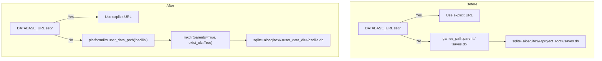

## Context

The application currently derives its SQLite database path from `games_path` inside `DatabaseSettings` (`oscilla/conf/db.py`):

```python
@model_validator(mode="after")
def derive_sqlite_url(self) -> "DatabaseSettings":
    if self.database_url is None:
        db_path = self.games_path.parent / "saves.db"
        self.database_url = f"sqlite+aiosqlite:///{db_path.resolve()}"
    return self
```

Since `games_path` defaults to `content/` at the project root, `saves.db` lands at the project root. The result is that `saves.db` and any backup files (`saves.bak.*`) appear in `git status`, polluting the working tree. More fundamentally, the derivation couples an unrelated concern — where user save data lives — to the location of game content. A user could set `GAMES_PATH` to a shared NFS library or a different machine mount, and their personal save data would silently follow.

The same `games_path` coupling exists in two other places: `oscilla/cli.py` `_configure_logging()` derives `oscilla.log` from `settings.games_path.parent`, and `oscilla/services/crash.py` `write_crash_report()` derives `oscilla-crash-<timestamp>.log` from the same path. Both are brought into scope here — all user-owned files produced by Oscilla should live in the same platform data directory.

`platformdirs` (a drop-in Python library implementing the XDG Base Directory Specification and OS-native equivalents) is already present as a transitive dependency (v4.9.4 as of March 2026). It is currently not an explicit direct dependency in `pyproject.toml`.

Two deployment contexts exist and have different behaviors today and after this change:

- **TUI / local dev**: SQLite, single-user. `DATABASE_URL` is currently not set; derivation runs. After this change, the derived path moves to the platform data directory.
- **Docker / production** (`compose.yaml`): `DATABASE_URL=postgresql://...` is set explicitly. The validator short-circuits immediately — this change has zero effect.

## Goals / Non-Goals

**Goals:**

- Move the default derived SQLite database to `<user_data_path('oscilla')>/oscilla.db`.
- Decouple `DATABASE_URL` derivation from `games_path`.
- Move `oscilla.log` to `user_data_path('oscilla') / "oscilla.log"`.
- Move crash reports to `user_data_path('oscilla') / "oscilla-crash-<timestamp>.log"`.
- Ensure the data directory is created automatically (`mkdir(parents=True, exist_ok=True)`) before the URL is constructed, so first-run works without manual setup.
- Declare `platformdirs` as an explicit direct dependency in `pyproject.toml`.
- Add an `oscilla data-path` CLI command that prints the data directory path to stdout for scripting (backup, reset, inspection).
- Update all documentation and `.env.example` to reflect the new default.

**Non-Goals:**

- Migrating existing `saves.db` files — no deployed installations exist; this is a clean break.
- Any change when `DATABASE_URL` is explicitly set — behavior is unchanged for Docker/production.
- Web authentication or multi-user data isolation — deferred to a future change.

## Decisions

### D1: Use `platformdirs.user_data_path()` over `user_config_path`, `user_state_path`, or a manual `~/.oscilla/` directory

The XDG Base Directory Specification carves out four distinct categories. Save data — game characters, progress, run history — is persistent, user-created data:

| `platformdirs` function | XDG variable | macOS | Linux (default) | Correct for saves? |
|---|---|---|---|---|
| `user_data_path` | `XDG_DATA_HOME` | `~/Library/Application Support/oscilla/` | `~/.local/share/oscilla/` | ✅ |
| `user_config_path` | `XDG_CONFIG_HOME` | `~/Library/Application Support/oscilla/` | `~/.config/oscilla/` | ❌ config is preferences |
| `user_state_path` | `XDG_STATE_HOME` | `~/Library/Application Support/oscilla/` | `~/.local/state/oscilla/` | ❌ state is logs/history |
| `user_cache_path` | `XDG_CACHE_HOME` | `~/Library/Caches/oscilla/` | `~/.cache/oscilla/` | ❌ cache is regeneratable |
| `~/.oscilla/` (manual) | — | `~/.oscilla/` | `~/.oscilla/` | ❌ dotfile convention, no XDG |

On macOS, `user_data_path`, `user_config_path`, and `user_state_path` all resolve to the same physical path (`~/Library/Application Support/oscilla/`). The distinction is meaningful on Linux, where they diverge. Using the semantically correct category ensures Oscilla integrates correctly with package managers, backup tools, and dotfile managers that respect XDG.

**Alternative considered:** `~/.oscilla/` with a manual `Path.home() / ".oscilla"`. Rejected: violates XDG, pollutes the home directory with a dotfile, and is not respected by tools that back up `~/.local/share/`.

### D2: Database filename `oscilla.db` (not `saves.db` or `characters.db`)

`oscilla.db` names the application rather than describing a domain subset of its data. This is the conventional pattern for applications that have one primary database living inside a named data directory (e.g. `~/Library/Application Support/AppName/AppName.db`). If the schema grows beyond characters in a future change, the filename remains accurate.

`saves.db` is a game-flavored informal name that describes a subset of what is stored (it also holds users). `characters.db` is also too narrow — users and potentially other future entities live in the same database.

**Alternative considered:** `data.db`. Rejected: too generic; provides no signal about which application owns the file if a user browses the directory.

### D3: Derive data directory inside `DatabaseSettings.derive_sqlite_url()` — not at the `Settings` level

The derivation is a database-specific concern. `DatabaseSettings` owns `database_url` and already encapsulates the derivation logic. Lifting it into `Settings` would expose a database implementation detail to the top-level settings class.

The updated `derive_sqlite_url` validator looks like:

```python
from pathlib import Path

import platformdirs
from pydantic import Field, model_validator
from pydantic_settings import BaseSettings, SettingsConfigDict


class DatabaseSettings(BaseSettings):
    model_config = SettingsConfigDict(env_file=".env", env_file_encoding="utf-8", extra="ignore")

    database_url: str | None = Field(
        default=None,
        description=(
            "Full async-driver database URL. When unset, auto-derived as "
            "sqlite+aiosqlite:///<user_data_path('oscilla')>/oscilla.db."
        ),
    )
    games_path: Path = Field(
        default=Path("content"),
        description="Path to the game library root directory containing game package subdirectories.",
    )

    @model_validator(mode="after")
    def derive_sqlite_url(self) -> "DatabaseSettings":
        if self.database_url is None:
            data_dir = platformdirs.user_data_path("oscilla")
            data_dir.mkdir(parents=True, exist_ok=True)
            self.database_url = f"sqlite+aiosqlite:///{data_dir / 'oscilla.db'}"
        return self
```

`games_path` remains on `DatabaseSettings` unchanged — it is used by other parts of `Settings` (which inherits from `DatabaseSettings`). The two fields are simply no longer coupled in the derivation.

**Alternative considered:** Adding a separate `data_path` field to `Settings` that defaults to `platformdirs.user_data_path('oscilla')` and letting `derive_sqlite_url` reference `self.data_path`. Rejected: adds an env-overridable field for internal path resolution that users should not need to configure separately. The `DATABASE_URL` override already handles all explicit-path cases.

### D4: `mkdir()` is called inside the validator — not deferred to DB engine startup

Side effects in Pydantic validators are unusual, but in this case it is the correct location. `DatabaseSettings` is constructed once at module import time (via `settings = Settings()` in `oscilla/settings.py`). The call happens before any code path touches the database: before SQLAlchemy creates the engine, before `alembic upgrade head` runs in `prestart.sh`, and before any CLI command executes. Deferring the `mkdir` call to engine startup would require every code path that touches the DB to ensure the directory exists, resulting in scattered `mkdir` calls or an easy-to-miss runtime failure on first run.

The directory creation is:

- Idempotent (`exist_ok=True`) — safe to call multiple times.
- Fast — a `stat` call followed by nothing if the directory exists.
- Guarded by `if self.database_url is None` — only runs when we own the derivation; explicit `DATABASE_URL` (Docker/PostgreSQL) never triggers it.

**Alternative considered:** Using an `@asynccontextmanager` lifespan hook in the FastAPI app to create the directory at startup. Rejected: the TUI does not go through the FastAPI lifespan, so the directory would not be created for local play.

### D5: Log file and crash report paths move to the data directory

`oscilla/cli.py` `_configure_logging()` currently computes:

```python
log_path = settings.games_path.parent / "oscilla.log"
```

`oscilla/services/crash.py` `write_crash_report()` currently computes:

```python
crash_path = settings.games_path.parent / f"oscilla-crash-{timestamp}.log"
```

Both are changed to use `platformdirs.user_data_path("oscilla")` directly:

```python
# cli.py _configure_logging()
log_path = platformdirs.user_data_path("oscilla") / "oscilla.log"

# services/crash.py write_crash_report()
crash_path = platformdirs.user_data_path("oscilla") / f"oscilla-crash-{timestamp}.log"
```

The data directory is already guaranteed to exist by the time these functions run — `DatabaseSettings.derive_sqlite_url()` creates it at module import time (see D4). Neither function needs its own `mkdir` call.

`crash.py` currently imports `settings` (from `oscilla.settings`) to access `games_path`. After this change it imports `platformdirs` directly and no longer needs `settings` for path resolution.

**Alternative considered:** Using `user_log_path('oscilla')` (XDG: `~/.local/state/oscilla/` on Linux) for log files. Rejected: putting logs in a different directory than the database adds complexity with no user benefit at this scale. All Oscilla-owned files in one directory is simpler.

### D6: `data-path` CLI command prints the data directory, not the database file path

The data directory is the unit of management from a user's perspective: it can be backed up, deleted, or opened in a file browser as a whole. Scripts that want the exact database path can use `$(oscilla data-path)/oscilla.db`. The command output is stable even if additional files are stored in the data directory in future changes.

The command is synchronous (no async, no DB connection, no settings validation beyond reading `platformdirs`):

```python
@app.command(help="Print the path to the user data directory used by Oscilla.")
def data_path() -> None:
    typer.echo(str(platformdirs.user_data_path("oscilla")))
```

`import platformdirs` lives at the top of `cli.py` alongside other imports, per project conventions (`AGENTS.md` requires imports at the top of the file unless needed to prevent circular imports; no circular import concern exists here).

**Alternative considered:** Printing the full path to `oscilla.db` instead of the directory. Rejected: prints an implementation detail (filename) that may change; callers who want the full file path can construct it themselves.

## Path Derivation — Before and After



## Risks / Trade-offs

- **Developer expectation reset** → Any dev who had `saves.db` at the project root will start fresh on next run. This is intentional — no deployed installations exist, and the old path will simply be ignored. Mitigation: document the old and new paths clearly in `.env.example` and note the break in the PR description.
- **Side effect in Pydantic validator** → Calling `mkdir()` in a `model_validator` is an unusual side effect. Mitigation: the operation is idempotent, fast, and strictly guarded by `if self.database_url is None`. In tests that construct `DatabaseSettings` with an explicit `database_url` (e.g., pointing to in-memory SQLite), the side effect never runs.
- **Tests that construct `DatabaseSettings()` without overriding `database_url`** → Such tests would create a real directory at `user_data_path('oscilla')` on the test runner's machine. Mitigation: all existing tests use an explicit in-memory SQLite URL via the `db_session` fixture; new tests for the derivation logic should patch `platformdirs.user_data_path` or pass `database_url` to an isolated `DatabaseSettings` instance rooted in a `tmp_path`.
- **New direct dependency** → `platformdirs` is already a transitive dep (via `rich` and others). Declaring it direct makes the version constraint explicit and prevents silent removal if the transitive chain changes. No version pin beyond what `uv` resolves is needed.

## Migration Plan

1. Run `uv add platformdirs` to add it as a direct dependency; this updates `pyproject.toml` and `uv.lock`.
2. Update `oscilla/conf/db.py` — replace `games_path.parent / "saves.db"` derivation with the `platformdirs` implementation from D3.
3. Update `oscilla/cli.py` — add `import platformdirs` at the top; update `_configure_logging()` to use `user_data_path` from D5; add the `data-path` command from D6.
4. Update `oscilla/services/crash.py` — replace `settings.games_path.parent` with `platformdirs.user_data_path("oscilla")` per D5.
5. Update `.env.example` comment for `DATABASE_URL` and the debug log path.
6. Update `README.md`: env-var table and CLI section.
7. Update `docs/dev/database.md` and `docs/dev/settings.md`.
8. Delete `saves.db` and `saves.bak.*` from the project root.
9. Run `make tests` — all checks must pass before the change is considered complete.

No Alembic migration is needed. The SQLite file at the new path is created fresh by the engine on first connection; the old `saves.db` is simply abandoned.

## Documentation Plan

| Document | Audience | Topics to Cover |
|---|---|---|
| `.env.example` | Developers | Update the `DATABASE_URL` comment to describe the new default: "auto-derived as `sqlite+aiosqlite:///<user_data_path>/oscilla.db`"; give the concrete example path for macOS (`~/Library/Application Support/oscilla/oscilla.db`) and Linux (`~/.local/share/oscilla/oscilla.db`); note that the directory is created automatically on first run. Update the `DEBUG` comment to state that `oscilla.log` is written to the same platform data directory, not the project root. |
| `README.md` — Environment Variables table | End users, developers | Change the `DATABASE_URL` "Default" cell from "auto-derived SQLite path" to "auto-derived: `<platform data dir>/oscilla.db`"; link to `docs/dev/database.md` for full explanation |
| `README.md` — CLI section | End users, developers | Add a `data-path` subsection documenting the command, its output format, and a usage example showing how to use it in a shell pipeline (e.g., `ls $(oscilla data-path)`) |
| `docs/dev/database.md` | Developers | Update the "Development Configuration" section: replace the `export DATABASE_URL="sqlite:///./dev.db"` example with the new auto-derived path; add a paragraph explaining that the default SQLite path is `platformdirs.user_data_path('oscilla')/oscilla.db` and that the directory is created automatically; remove any references to `saves.db` |
| `docs/dev/settings.md` | Developers | Update the `DATABASE_URL` setting description to reference the new default derivation via `platformdirs`; specify the per-OS paths |

## Testing Philosophy

This change touches two independently testable units: the `DatabaseSettings` derivation logic and the `data-path` CLI command. No new test fixtures are needed, and no game content or database connections are required.

### Tier 1 — Unit: `DatabaseSettings.derive_sqlite_url()`

**Target file:** `tests/test_settings.py` (existing) or a new `tests/conf/test_db_settings.py` mirroring `oscilla/conf/db.py`.

Each test constructs a `DatabaseSettings` instance directly. To avoid writing to the real user data directory, tests should either:

- Pass an explicit in-memory `database_url` (to verify the guard condition), or
- Monkeypatch `platformdirs.user_data_path` within `oscilla.conf.db` to return a `tmp_path` fixture directory.

**Tests to add:**

| Test | What it verifies |
|---|---|
| `test_derives_oscilla_db_filename` | With no `DATABASE_URL`, the derived URL contains `oscilla.db` |
| `test_does_not_derive_saves_db` | With no `DATABASE_URL`, the derived URL does not contain `saves.db` |
| `test_derived_url_under_user_data_dir` | With no `DATABASE_URL`, the derived URL path is under `user_data_path('oscilla')` |
| `test_explicit_database_url_not_overridden` | When `database_url="sqlite+aiosqlite:///foo.db"` is passed, it is not changed by the validator |
| `test_games_path_does_not_affect_db_url` | Constructing `DatabaseSettings(games_path=Path("/custom/library"))` with no `DATABASE_URL` still derives a URL under `user_data_path('oscilla')` |
| `test_data_directory_is_created` | After constructing `DatabaseSettings()` (with `user_data_path` monkeypatched to a `tmp_path`), the directory exists on disk |

**Target file for log/crash path tests:** `tests/test_cli.py` (for `_configure_logging`) and `tests/services/test_crash.py` (for `write_crash_report`), or co-located with the CLI tests if a crash service test file does not yet exist.

| Test | What it verifies |
|---|---|
| `test_log_path_uses_data_dir` | `_configure_logging()` (with `debug=True` and `user_data_path` monkeypatched to `tmp_path`) writes `oscilla.log` inside the monkeypatched data directory |
| `test_crash_report_written_to_data_dir` | `write_crash_report()` (with `user_data_path` monkeypatched) writes the crash file inside the data directory, not `games_path.parent` |

### Tier 2 — CLI integration: `oscilla data-path`

**Target file:** `tests/test_cli.py` (existing).

Uses the existing `CliRunner` fixture pattern already present in `tests/test_cli.py`.

**Tests to add:**

| Test | What it verifies |
|---|---|
| `test_data_path_exits_zero` | `oscilla data-path` exits with code 0 |
| `test_data_path_output_matches_platformdirs` | The printed path matches `str(platformdirs.user_data_path('oscilla'))` |
| `test_data_path_output_is_parseable_as_path` | `Path(result.output.strip())` does not raise |

## Open Questions

None — all decisions are made.
