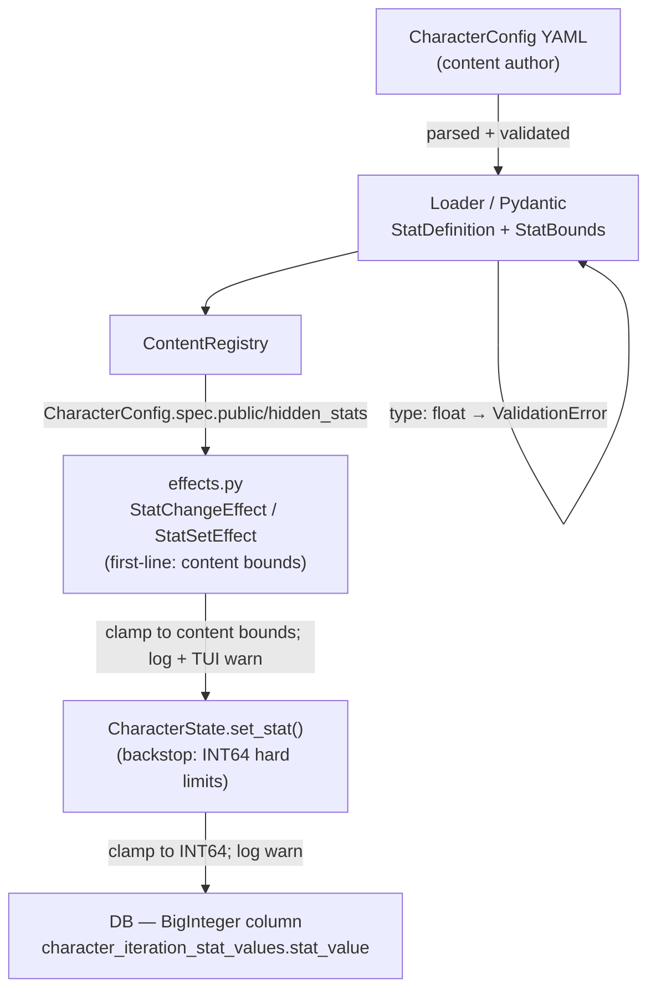

## Architecture Diagram



## Context

The character stat system (`CharacterConfig`, `CharacterState`, adventure effects) currently supports three stat types: `int`, `float`, and `bool`. In practice, no production content package uses `float` — only testlandia's `speed` stat, which was introduced explicitly to test float behavior. All stats in `the-example-kingdom` are `int` or `bool`.

Float stats create two compounding problems:

1. **Storage precision loss.** `character_iteration_stat_values.stat_value` is a `Float` (REAL / IEEE 754 double) column. Integers above 2^53 cannot be represented exactly in a double. A stat accumulated over many prestige runs (e.g., total-lifetime-gold) can silently lose precision.

2. **No bounds enforcement.** There is currently no mechanism to prevent adventurre effects from setting a stat to an arbitrary value. A content author could inadvertently write `stat_change: { stat: gold, amount: 999999999 }`, and the engine applies it without complaint.

The `_stat_to_float()` helper in `services/character.py` encodes all stat values (including bools stored as 0.0/1.0) through a float representation for DB storage. This round-trip works today only because no int value large enough to lose precision has ever been stored.

The item instance modifier column (`character_iteration_item_instance_modifiers.amount`) is also `REAL` but is outside the scope of this change — it is an engine-internal decimal that adjusts stat values, not a content-authored stat type.

## Goals / Non-Goals

**Goals:**

- Remove `float` from `StatType`. Valid types become `Literal["int", "bool"]`.
- Add `StatBounds` model with `min: int | None` and `max: int | None`.
- Add `bounds: StatBounds | None` to `StatDefinition`. Specifying `bounds` on a `bool` stat is a content load error.
- Default bounds when absent or `None`: min = −9,223,372,036,854,775,808 (INT64_MIN), max = 9,223,372,036,854,775,807 (INT64_MAX) — the PostgreSQL `BigInteger` (`BIGINT`) column ceiling.
- Change `character_iteration_stat_values.stat_value` from `Float` to `BigInteger`.
- Enforce bounds at effect application in `effects.py`: clamp, log a warning, and notify the player via the TUI (first-line enforcement).
- Add a hard INT64 floor/ceiling check inside `CharacterState` as a backstop for any caller that bypasses `effects.py`.
- Update testlandia content and all affected tests.

**Non-Goals:**

- Bounds on the item instance modifier REAL column — left unchanged.
- XP, HP, level, or inventory quantity bounds — these are separate first-class fields with their own guards, not content-defined stats.
- Any schema or behavioral change when `DATABASE_URL` points at PostgreSQL and the column is already `INTEGER` in production (no deployed instances exist; this is a clean break).
- Soft-cap or warn-threshold semantics beyond the hard clamp decided in exploration.

## Decisions

### D1: Remove `float` from `StatType` entirely rather than deprecating it

No production content uses `float`. The only usage is testlandia, which exists solely to test float behavior. The storage column mismatch (REAL for an `int` stat) is a latent correctness bug that silently appears only above 2^53 — not something a content author would notice unless they were specifically looking. A clean removal is safer and simpler than a deprecation period that would require continued maintenance of float-specific code paths in the loader, effects, and serialization layers.

**Alternative considered:** Keep `float` but add a deprecation warning at content load time. Rejected: extends the maintenance surface without benefit; all known float stat users are under our direct control.

#### `oscilla/engine/models/character_config.py` — before

```python
StatType = Literal["int", "float", "bool"]

class StatDefinition(BaseModel):
    name: str
    type: StatType
    default: int | float | bool | None = None
    description: str = ""
```

#### `oscilla/engine/models/character_config.py` — after

```python
from typing import List, Literal, Set

from pydantic import BaseModel, Field, model_validator

# "float" removed; bool is kept as a separate first-class type, not an int subtype.
StatType = Literal["int", "bool"]


class StatBounds(BaseModel):
    """Optional floor/ceiling for an integer stat.

    Both fields are optional so authors can specify only a minimum (e.g. gold ≥ 0)
    or only a maximum without requiring both.  The INT64 storage limit is the
    effective bound when either end is absent.
    """

    min: int | None = Field(default=None, description="Inclusive lower bound (default: INT64_MIN)")
    max: int | None = Field(default=None, description="Inclusive upper bound (default: INT64_MAX)")

    @model_validator(mode="after")
    def min_lte_max(self) -> "StatBounds":
        if self.min is not None and self.max is not None and self.min > self.max:
            raise ValueError(f"StatBounds.min ({self.min}) must not exceed max ({self.max})")
        return self


class StatDefinition(BaseModel):
    name: str
    type: StatType
    default: int | bool | None = None
    description: str = ""
    # Only valid when type == "int"; specifying bounds on a bool stat raises ValidationError.
    bounds: StatBounds | None = None

    @model_validator(mode="after")
    def no_bounds_on_bool(self) -> "StatDefinition":
        if self.type == "bool" and self.bounds is not None:
            raise ValueError(
                f"Stat {self.name!r}: bounds cannot be set on a bool stat. "
                "Bool stats are always exactly True or False."
            )
        return self
```

#### `oscilla/engine/models/adventure.py` — before

```python
class StatChangeEffect(BaseModel):
    type: Literal["stat_change"]
    stat: str = Field(description="Character stat name")
    amount: int | float = Field(description="Amount to add/subtract from stat; can be negative")


class StatSetEffect(BaseModel):
    type: Literal["stat_set"]
    stat: str = Field(description="Character stat name")
    value: int | float | bool | None = Field(description="New value for stat")
```

#### `oscilla/engine/models/adventure.py` — after

```python
class StatChangeEffect(BaseModel):
    type: Literal["stat_change"]
    stat: str = Field(description="Character stat name")
    # float removed; stat_change only applies to int stats.
    amount: int = Field(description="Amount to add/subtract from stat; can be negative")


class StatSetEffect(BaseModel):
    type: Literal["stat_set"]
    stat: str = Field(description="Character stat name")
    # float removed; value is either an integer, a boolean flag, or None (clear).
    value: int | bool | None = Field(description="New value for stat")
```

### D2: Bounds grouped as `StatBounds` object rather than flat `min`/`max` on `StatDefinition`

```yaml
# Grouped (chosen)
- name: gold
  type: int
  default: 0
  bounds:
    min: 0
    max: 1000000

# Flat (rejected)
- name: gold
  type: int
  default: 0
  min: 0
  max: 1000000
```

Three reasons favor grouping:

1. **Optional as a unit.** `bounds:` is either present or absent. Flat fields default to `None` individually, which requires the reader to always consider the asymmetric case where `min` is set but `max` is not (valid) vs. where neither is set (also valid). A grouped object makes presence or absence unambiguous.

2. **Validator locality.** The Pydantic `model_validator` that enforces `min <= max` and rejects `bounds` on `bool` stats lives on the two models themselves, not cluttering `CharacterConfigSpec`.

3. **Extensibility.** Future additions (e.g., `wrap: bool` for modular stats, `soft_cap` for a cap that can be exceeded by privileged effects) belong naturally inside `StatBounds`, not as further sibling fields on `StatDefinition`.

**Alternative considered:** Flat `min`/`max` on `StatDefinition`. Rejected: adds two nullable fields at the same level as `name`, `type`, and `default`, which dilutes the structure and invites partial-set confusion.

### D3: Default bounds = INT64 range (−9,223,372,036,854,775,808 to 9,223,372,036,854,775,807) when `bounds` is absent

The PostgreSQL `BigInteger` (`BIGINT`) column type is 64-bit signed. This is the binding constraint — SQLite would accept larger values, but a value that fits in SQLite must also fit in PostgreSQL. Defaulting to the column ceiling means the backstop in `CharacterState` (D5 below) and the default first-line enforcement in `effects.py` share the same value, so a stat without explicit bounds never fails the first-line check and only hits the backstop if something pathological happens.

The INT64 constants are defined as module-level values in `oscilla/engine/character.py` so they can be imported by tests:

```python
# oscilla/engine/character.py
_INT64_MIN: int = -(2**63)      # −9,223,372,036,854,775,808
_INT64_MAX: int = (2**63) - 1   # 9,223,372,036,854,775,807
```

**Alternative considered:** Default max = 2^53 (exact integer range of IEEE 754 double). Rejected: now that all stats are stored as `BigInteger`, the relevant precision boundary is INT64, not the float mantissa limit. Using 2^53 would allow content to silently write values the DB column cannot hold.

### D4: Failure mode = clamp + log + TUI notification (not an error/exception)

An out-of-bounds stat mutation is a content authoring mistake, not a fatal engine error. Crashing the adventure would be a worse experience than transparently clamping and informing the player. The log entry gives developers visibility for debugging; the TUI message gives players feedback that something was constrained.

The exact TUI message pattern follows the existing error display in `effects.py`:

```
[yellow]Warning: stat 'gold' clamped to 1000000 (attempted 9999999).[/yellow]
```

**Alternative considered:** Raise a `LoadError` at content load time if a `stat_change` or `stat_set` amount is statically out of bounds. Not suitable because amounts can be computed at runtime (e.g., from combat formulas) and are not always statically knowable at load time.

### D5: Defense in depth — `effects.py` as first line, `CharacterState.set_stat()` as backstop

`effects.py` is the correct first-line enforcer because it already has the registry and can read content-defined bounds from `CharacterConfig`. The backstop in `CharacterState` does not need the registry — it only enforces the hard physical storage limit. This ensures future callers that bypass `effects.py` (e.g., direct state restoration from save data) cannot write values the DB column cannot hold.

**Alternative considered:** Single enforcement point in `effects.py` only. Rejected: any code path that mutates `stats` directly (save restore, test helpers, future features) would bypass the protection entirely.

#### `oscilla/engine/character.py` — `CharacterState.set_stat()` (new method)

Add the INT64 constants at module level and the new method to `CharacterState`. The `stats` field annotation narrows from `int | float | bool | None` to `int | bool | None`.

```python
# Module-level constants — importable by tests and effects helpers.
_INT64_MIN: int = -(2**63)   # −9,223,372,036,854,775,808
_INT64_MAX: int = (2**63) - 1  # 9,223,372,036,854,775,807


@dataclass
class CharacterState:
    # ... existing fields ...

    # Dynamic stats from CharacterConfig; int | bool | None (float removed).
    stats: Dict[str, int | bool | None] = field(default_factory=dict)

    # ... existing methods (new_character, add_item, etc.) unchanged ...

    def set_stat(self, name: str, value: int) -> None:
        """Write an integer stat value, clamping to INT64 storage limits.

        This is the canonical mutation path for int stats.  It does NOT enforce
        content-defined bounds from StatBounds — that is effects.py's job.  This
        method is a backstop: it prevents values that the PostgreSQL BigInteger column
        cannot hold from ever reaching the DB, regardless of how the change arrived.

        Logs a warning when clamping occurs so developers can trace over-range writes
        back to their source.
        """
        clamped = max(_INT64_MIN, min(_INT64_MAX, value))
        if clamped != value:
            logger.warning(
                "Stat %r value %d clamped to %d (INT64 storage limit).",
                name,
                value,
                clamped,
            )
        self.stats[name] = clamped
```

#### `oscilla/engine/steps/effects.py` — `StatChangeEffect` and `StatSetEffect` handlers (before)

```python
        case StatChangeEffect(stat=stat, amount=amount):
            if stat not in player.stats:
                await tui.show_text(f"[red]Error: stat {stat!r} not found[/red]")
                return
            old_value = player.stats[stat]
            if isinstance(old_value, (int, float)) and isinstance(amount, (int, float)):
                new_value = old_value + amount
                player.stats[stat] = new_value
                await tui.show_text(f"Changed {stat}: {old_value} → {new_value}")
            else:
                await tui.show_text(f"[red]Error: cannot change non-numeric stat {stat!r}[/red]")

        case StatSetEffect(stat=stat, value=value):
            if stat not in player.stats:
                await tui.show_text(f"[red]Error: stat {stat!r} not found[/red]")
                return
            old_value = player.stats[stat]
            player.stats[stat] = value
            await tui.show_text(f"Set {stat}: {old_value} → {value}")
```

#### `oscilla/engine/steps/effects.py` — `StatChangeEffect` and `StatSetEffect` handlers (after)

A helper `_resolve_stat_bounds` is added near the top of the module (before `run_effect`) to keep the match block readable:

```python
from oscilla.engine.character import _INT64_MAX, _INT64_MIN
from oscilla.engine.models.character_config import StatBounds


def _resolve_stat_bounds(stat: str, registry: "ContentRegistry") -> tuple[int, int]:
    """Return the effective (min, max) bounds for a named stat.

    Looks up the stat in the registry's CharacterConfig.  If no CharacterConfig
    is loaded, or the stat has no explicit bounds, defaults to INT64_MIN/MAX.
    """
    char_config = registry.character_config
    if char_config is None:
        return _INT64_MIN, _INT64_MAX
    all_stats = char_config.spec.public_stats + char_config.spec.hidden_stats
    for stat_def in all_stats:
        if stat_def.name == stat:
            if stat_def.bounds is None:
                return _INT64_MIN, _INT64_MAX
            lo = stat_def.bounds.min if stat_def.bounds.min is not None else _INT64_MIN
            hi = stat_def.bounds.max if stat_def.bounds.max is not None else _INT64_MAX
            return lo, hi
    return _INT64_MIN, _INT64_MAX
```

The updated match cases:

```python
        case StatChangeEffect(stat=stat, amount=amount):
            if stat not in player.stats:
                await tui.show_text(f"[red]Error: stat {stat!r} not found[/red]")
                return
            old_value = player.stats[stat]
            # bool is a subclass of int; the isinstance guard remains correct.
            if not isinstance(old_value, int):
                await tui.show_text(f"[red]Error: cannot change non-numeric stat {stat!r}[/red]")
                return
            raw_new = old_value + amount
            lo, hi = _resolve_stat_bounds(stat=stat, registry=registry)
            new_value = max(lo, min(hi, raw_new))
            if new_value != raw_new:
                logger.warning(
                    "stat_change on %r: attempted %d, clamped to %d (bounds %d..%d).",
                    stat, raw_new, new_value, lo, hi,
                )
                await tui.show_text(
                    f"[yellow]Warning: stat {stat!r} clamped to {new_value} "
                    f"(attempted {raw_new}).[/yellow]"
                )
            player.set_stat(name=stat, value=new_value)
            await tui.show_text(f"Changed {stat}: {old_value} → {new_value}")

        case StatSetEffect(stat=stat, value=value):
            if stat not in player.stats:
                await tui.show_text(f"[red]Error: stat {stat!r} not found[/red]")
                return
            old_value = player.stats[stat]
            # bool set — bypass integer bounds entirely; True/False are always valid.
            if isinstance(value, bool):
                player.stats[stat] = value
                await tui.show_text(f"Set {stat}: {old_value} → {value}")
                return
            if value is None:
                player.stats[stat] = None
                await tui.show_text(f"Set {stat}: {old_value} → None")
                return
            lo, hi = _resolve_stat_bounds(stat=stat, registry=registry)
            clamped = max(lo, min(hi, value))
            if clamped != value:
                logger.warning(
                    "stat_set on %r: attempted %d, clamped to %d (bounds %d..%d).",
                    stat, value, clamped, lo, hi,
                )
                await tui.show_text(
                    f"[yellow]Warning: stat {stat!r} clamped to {clamped} "
                    f"(attempted {value}).[/yellow]"
                )
            player.set_stat(name=stat, value=clamped)
            await tui.show_text(f"Set {stat}: {old_value} → {clamped}")
```

### D6: DB migration uses `ROUND(stat_value)` for the column type change

The existing column is REAL. Any fractional values (from testlandia `speed` tests or development databases) must be rounded before becoming integers. `ROUND()` is safe and deterministic. A fresh production installation will have no fractional values because the only float stat was testlandia's `speed`, which only exists in local development databases.

The migration must be compatible with both SQLite and PostgreSQL. Alembic batch mode is required for SQLite (which does not support `ALTER COLUMN TYPE` directly). The migration is generated with `make create_migration MESSAGE="change stat_value from float to bigint"` and then the `upgrade()` and `downgrade()` bodies are filled in:

```python
import sqlalchemy as sa
from alembic import op


def upgrade() -> None:
    # PostgreSQL supports USING clause for casting REAL → BIGINT with rounding.
    # SQLite requires batch mode; its type affinity will truncate existing floats
    # to integer, which is acceptable since no production data exists.
    bind = op.get_bind()
    if bind.dialect.name == "postgresql":
        op.alter_column(
            "character_iteration_stat_values",
            "stat_value",
            type_=sa.BigInteger(),
            postgresql_using="ROUND(stat_value)::BIGINT",
            existing_nullable=True,
        )
    else:
        with op.batch_alter_table("character_iteration_stat_values") as batch_op:
            batch_op.alter_column(
                "stat_value",
                type_=sa.BigInteger(),
                existing_nullable=True,
            )


def downgrade() -> None:
    bind = op.get_bind()
    if bind.dialect.name == "postgresql":
        op.alter_column(
            "character_iteration_stat_values",
            "stat_value",
            type_=sa.Float(),
            postgresql_using="stat_value::DOUBLE PRECISION",
            existing_nullable=True,
        )
    else:
        with op.batch_alter_table("character_iteration_stat_values") as batch_op:
            batch_op.alter_column(
                "stat_value",
                type_=sa.Float(),
                existing_nullable=True,
            )
```

#### `oscilla/models/character_iteration.py` — `CharacterIterationStatValue` (before)

```python
class CharacterIterationStatValue(Base):
    """Content-defined character stat stored as a native REAL column."""

    __tablename__ = "character_iteration_stat_values"

    iteration_id: Mapped[UUID] = mapped_column(ForeignKey("character_iterations.id"), primary_key=True, nullable=False)
    stat_name: Mapped[str] = mapped_column(String, primary_key=True)
    stat_value: Mapped[float | None] = mapped_column(Float, nullable=True)
```

#### `oscilla/models/character_iteration.py` — `CharacterIterationStatValue` (after)

```python
class CharacterIterationStatValue(Base):
    """Content-defined character stat stored as a native BigInteger column.

    stat_value is NULL for stats whose default is explicitly unset (e.g.
    relationship scores before first interaction).  Bool stats are stored as
    0 (False) or 1 (True).  Keys and their expected types come from the content
    package's CharacterConfig; content-drift handling happens in
    CharacterState.from_dict().
    """

    __tablename__ = "character_iteration_stat_values"

    iteration_id: Mapped[UUID] = mapped_column(ForeignKey("character_iterations.id"), primary_key=True, nullable=False)
    stat_name: Mapped[str] = mapped_column(String, primary_key=True)
    stat_value: Mapped[int | None] = mapped_column(BigInteger, nullable=True)
```

The `Float` and `REAL` imports in `character_iteration.py` are removed and `BigInteger` is added to the `from sqlalchemy import ...` line once they are no longer / newly referenced by columns in the file.

#### `oscilla/services/character.py` — `_stat_to_float` → `_stat_to_int` (before)

```python
def _stat_to_float(value: "int | float | bool | None") -> float | None:
    """Encode a CharacterState stat value for storage in the Float DB column.

    Booleans are stored as 0.0/1.0. Numeric types are cast directly.
    NULL is preserved as NULL for unset stats.
    """
    if value is None:
        return None
    # bool must be checked before int because bool is a subclass of int
    if isinstance(value, bool):
        return float(int(value))
    return float(value)
```

#### `oscilla/services/character.py` — `_stat_to_int` (after)

```python
def _stat_to_int(value: "int | bool | None") -> int | None:
    """Encode a CharacterState stat value for storage in the BigInteger DB column.

    Booleans are stored as 0 (False) or 1 (True).
    NULL is preserved as NULL for unset stats.
    """
    if value is None:
        return None
    # bool must be checked before int because bool is a subclass of int
    if isinstance(value, bool):
        return int(value)
    return value
```

All call sites in `save_character` and any update helpers change `_stat_to_float(stat_value)` to `_stat_to_int(stat_value)`.

#### `oscilla/engine/conditions.py` — `_numeric_compare` and `CharacterStatCondition` (before)

```python
        case CharacterStatCondition(name=n) as c:
            stats = player.effective_stats(registry=registry) if registry is not None else player.stats
            value = stats.get(n, 0)
            if not isinstance(value, (int, float)):
                logger.warning(...)
                return _numeric_compare(0, c)
            return _numeric_compare(value, c)

def _numeric_compare(value: int | float, condition: object) -> bool:
    ...
```

#### `oscilla/engine/conditions.py` — after

```python
        case CharacterStatCondition(name=n) as c:
            stats = player.effective_stats(registry=registry) if registry is not None else player.stats
            value = stats.get(n, 0)
            # After float removal, stats are int | bool | None.
            # bool is a subclass of int so isinstance(True, int) is True — the
            # guard below accepts bool values without a special case.
            if not isinstance(value, int):
                logger.warning(
                    "character_stat condition on non-numeric stat %r (value=%r); treating as 0",
                    n,
                    value,
                )
                return _numeric_compare(0, c)
            return _numeric_compare(value, c)

def _numeric_compare(value: int, condition: object) -> bool:
    # signature narrowed from int | float to int; behavior is identical.
    ...
```

#### Testlandia content changes

`content/testlandia/character_config.yaml` — `speed` stat:

```yaml
# Before
- name: speed
  type: float
  default: 1.0
  description: "Float-type stat. Tests stat_set on float."

# After
- name: speed
  type: int
  default: 1
  description: "Integer stat. Tests stat_change on int."
```

`content/testlandia/regions/character/locations/bump-speed/adventures/bump-speed.yaml`:

```yaml
# Before
effects:
  - type: stat_change
    stat: speed
    amount: 0.5

# After
effects:
  - type: stat_change
    stat: speed
    amount: 1
```

## Risks / Trade-offs

- **BREAKING content change** → Any content package with `type: float` stats fails to load after this change. Mitigation: the only known instance is testlandia's `speed` stat, which is under our direct control and is updated as part of this change.
- **Existing development databases** → A developer with a local `saves.db` containing fractional `speed` values will have them rounded by the migration. Mitigation: document the migration behavior; local dev data is not expected to be preserved across schema changes.
- **`CharacterState.set_stat()` backstop needs a new method** → Direct dict assignment (`player.stats[stat] = value`) currently bypasses any future backstop check. The backstop requires introducing a `set_stat()` method and updating all callers. Mitigation: the only direct callers are `effects.py`, `session.py` (state restore), and `character.py` itself — all within the engine package.
- **Conditions using `isinstance(value, (int, float))`** → The `_numeric_compare` function in `conditions.py` accepts `int | float`. After this change, only `int` values appear in `stats`; the `float` branch becomes dead code. Mitigation: update the type annotations; the isinstance check still works correctly for `int`.

## Migration Plan

1. Create the Alembic migration for `stat_value` column type change.
2. Update `StatType`, `StatDefinition`, and add `StatBounds` in `oscilla/engine/models/character_config.py`.
3. Update `StatChangeEffect.amount` and `StatSetEffect.value` types in `oscilla/engine/models/adventure.py`.
4. Update `CharacterState.stats` type annotation; add `set_stat()` method with INT64 backstop in `oscilla/engine/character.py`.
5. Update `effects.py` — add bounds lookup and clamp/log/notify on `stat_change` and `stat_set`.
6. Update `loader.py` — remove float validation branches; add bounds-on-bool load error.
7. Update `oscilla/models/character_iteration.py` — change `Float` → `BigInteger`.
8. Replace `_stat_to_float()` with `_stat_to_int()` in `oscilla/services/character.py`; update all call sites.
9. Update `oscilla/engine/conditions.py` — narrow type annotations, remove float isinstance branches.
10. Update testlandia content: `speed` type → `int`; bump-speed adventures → integer amounts.
11. Update all tests; add new bounds-enforcement and validation tests.
12. Run `make tests` — all checks must pass.

No rollback strategy is defined: no deployed instances exist and this is a development-phase change.

## Documentation Plan

| Document | Audience | Topics to Cover |
|---|---|---|
| `docs/authors/content-authoring.md` | Content authors | Remove `float` from the stat type reference table; add a `bounds` subsection under stat definitions covering YAML syntax, what happens when bounds are omitted (defaults to INT64 range), the clamp+notify behavior when a stat would violate its bounds, and a concrete YAML example for a gold stat with `min: 0`; add a note that specifying `bounds` on a `bool` stat is an error caught at content load. |
| `docs/dev/game-engine.md` | Developers | Update the stat type system section: document that `StatType` is now `Literal["int", "bool"]`; describe the `StatBounds` model and its fields; explain the two-tier enforcement (effects.py + CharacterState backstop); note the INT64 default range and why it was chosen (PostgreSQL `BigInteger`/`BIGINT` column ceiling). |

## Testing Philosophy

This change touches four independently testable layers. No new fixture directories are needed beyond what already exists. Engine-level tests construct Pydantic models and dataclasses directly — no YAML loading required. Tests that exercise the loader use the existing testlandia fixture infrastructure.

The `mock_tui` fixture from `conftest.py` is used for all async effect tests. No test may reference the `content/` directory — only `tests/fixtures/content/` fixtures or inline model construction.

### Tier 1 — Model validation: `StatBounds` and `StatDefinition`

**Target file:** `tests/engine/models/test_character_config.py` (new, mirrors `oscilla/engine/models/character_config.py`).

```python
import pytest
from pydantic import ValidationError

from oscilla.engine.models.character_config import StatBounds, StatDefinition


def test_stat_bounds_min_gt_max_raises() -> None:
    """Constructing StatBounds where min > max is a Pydantic ValidationError."""
    with pytest.raises(ValidationError, match="must not exceed max"):
        StatBounds(min=10, max=5)


def test_stat_bounds_min_equal_max_is_valid() -> None:
    """A single allowed value (min == max) is a valid degenerate range."""
    b = StatBounds(min=0, max=0)
    assert b.min == 0
    assert b.max == 0


def test_stat_bounds_min_only_is_valid() -> None:
    """Specifying only a lower bound leaves max unconstrained (defaults to None)."""
    b = StatBounds(min=0)
    assert b.min == 0
    assert b.max is None


def test_stat_bounds_max_only_is_valid() -> None:
    """Specifying only an upper bound leaves min unconstrained (defaults to None)."""
    b = StatBounds(max=1000)
    assert b.min is None
    assert b.max == 1000


def test_stat_bounds_absent_is_valid() -> None:
    """A StatDefinition with no bounds field must validate successfully."""
    sd = StatDefinition(name="gold", type="int", default=0)
    assert sd.bounds is None


def test_float_stat_type_rejected() -> None:
    """A StatDefinition with type='float' must raise ValidationError after the removal."""
    with pytest.raises(ValidationError):
        StatDefinition(name="speed", type="float", default=1.0)  # type: ignore[arg-type]


def test_bounds_on_bool_stat_raises() -> None:
    """Setting bounds on a bool stat is a content error caught at parse time."""
    with pytest.raises(ValidationError, match="bounds cannot be set on a bool stat"):
        StatDefinition(name="is_blessed", type="bool", bounds=StatBounds(min=0, max=1))


def test_int_stat_with_bounds_is_valid() -> None:
    """An int stat with valid bounds must parse without error."""
    sd = StatDefinition(name="gold", type="int", default=0, bounds=StatBounds(min=0, max=1_000_000))
    assert sd.bounds is not None
    assert sd.bounds.min == 0
    assert sd.bounds.max == 1_000_000
```

### Tier 2 — `CharacterState` backstop

**Target file:** `tests/engine/test_character.py` (new or added to existing file).

The test constructs a minimal `CharacterState` directly using the dataclass —  no registry or YAML needed.

```python
from uuid import uuid4

import pytest

from oscilla.engine.character import CharacterState, _INT64_MAX, _INT64_MIN


def _make_player() -> CharacterState:
    return CharacterState(
        character_id=uuid4(),
        name="TestHero",
        character_class=None,
        level=1,
        xp=0,
        hp=20,
        max_hp=20,
        iteration=0,
        current_location=None,
        stats={"gold": 100},
    )


def test_set_stat_within_range_is_unchanged() -> None:
    """Values within INT64 range are stored exactly."""
    player = _make_player()
    player.set_stat(name="gold", value=500)
    assert player.stats["gold"] == 500


def test_set_stat_clamps_above_int32_max(caplog: pytest.LogCaptureFixture) -> None:
    """Values above INT64_MAX are clamped and a warning is logged."""
    player = _make_player()
    over = _INT64_MAX + 1
    with caplog.at_level("WARNING"):
        player.set_stat(name="gold", value=over)
    assert player.stats["gold"] == _INT64_MAX
    assert "clamped" in caplog.text


def test_set_stat_clamps_below_int32_min(caplog: pytest.LogCaptureFixture) -> None:
    """Values below INT64_MIN are clamped and a warning is logged."""
    player = _make_player()
    under = _INT64_MIN - 1
    with caplog.at_level("WARNING"):
        player.set_stat(name="gold", value=under)
    assert player.stats["gold"] == _INT64_MIN
    assert "clamped" in caplog.text


def test_set_stat_at_int32_boundary_is_not_clamped() -> None:
    """Exact boundary values must NOT be clamped."""
    player = _make_player()
    player.set_stat(name="gold", value=_INT64_MAX)
    assert player.stats["gold"] == _INT64_MAX
    player.set_stat(name="gold", value=_INT64_MIN)
    assert player.stats["gold"] == _INT64_MIN
```

### Tier 3 — Effects bounds enforcement

**Target file:** `tests/engine/test_stat_effects.py` (existing — update float tests, add bounds tests).

Constructs `StatChangeEffect` / `StatSetEffect` and `CharacterState` directly. Uses a minimal mock registry built from Pydantic models — no YAML fixture loading.

The `mock_tui` fixture from `conftest.py` must be used. It captures `show_text` calls in a list so tests can assert on TUI messages.

```python
import asyncio
from uuid import uuid4

import pytest

from oscilla.engine.character import CharacterState
from oscilla.engine.models.adventure import StatChangeEffect, StatSetEffect
from oscilla.engine.models.character_config import (
    CharacterConfigManifest,
    CharacterConfigSpec,
    StatBounds,
    StatDefinition,
)
from oscilla.engine.steps.effects import run_effect


def _make_bounded_registry(bounds: StatBounds | None = None) -> ...:
    """Build a minimal ContentRegistry stub with a single 'gold' stat."""
    # Use the real CharacterConfigManifest Pydantic model with constructed spec —
    # no YAML loading needed.
    spec = CharacterConfigSpec(
        public_stats=[
            StatDefinition(name="gold", type="int", default=100, bounds=bounds)
        ]
    )
    config = CharacterConfigManifest(
        apiVersion="game/v1",
        kind="CharacterConfig",
        metadata={"name": "test-config"},
        spec=spec,
    )
    # Return a SimpleNamespace that satisfies the ContentRegistry protocol used
    # by _resolve_stat_bounds; only character_config and items are accessed.
    from types import SimpleNamespace
    return SimpleNamespace(character_config=config, items={}, game=None)


def _make_player(gold: int = 100) -> CharacterState:
    return CharacterState(
        character_id=uuid4(),
        name="TestHero",
        character_class=None,
        level=1, xp=0, hp=20, max_hp=20,
        iteration=0, current_location=None,
        stats={"gold": gold},
    )


@pytest.mark.asyncio
async def test_stat_change_within_bounds_is_unchanged(mock_tui: ...) -> None:
    """A delta that keeps the stat in range is applied without clamping."""
    registry = _make_bounded_registry(bounds=StatBounds(min=0, max=1000))
    player = _make_player(gold=100)
    effect = StatChangeEffect(type="stat_change", stat="gold", amount=50)
    await run_effect(effect=effect, player=player, registry=registry, tui=mock_tui)
    assert player.stats["gold"] == 150
    assert not any("clamped" in msg for msg in mock_tui.messages)


@pytest.mark.asyncio
async def test_stat_change_clamps_to_content_max(mock_tui: ...) -> None:
    """A delta that exceeds bounds.max clamps to the max and shows a TUI warning."""
    registry = _make_bounded_registry(bounds=StatBounds(min=0, max=1000))
    player = _make_player(gold=900)
    effect = StatChangeEffect(type="stat_change", stat="gold", amount=500)
    await run_effect(effect=effect, player=player, registry=registry, tui=mock_tui)
    assert player.stats["gold"] == 1000
    assert any("clamped" in msg.lower() for msg in mock_tui.messages)


@pytest.mark.asyncio
async def test_stat_change_clamps_to_content_min(mock_tui: ...) -> None:
    """A delta that goes below bounds.min clamps to min with a TUI warning."""
    registry = _make_bounded_registry(bounds=StatBounds(min=0, max=1000))
    player = _make_player(gold=50)
    effect = StatChangeEffect(type="stat_change", stat="gold", amount=-200)
    await run_effect(effect=effect, player=player, registry=registry, tui=mock_tui)
    assert player.stats["gold"] == 0
    assert any("clamped" in msg.lower() for msg in mock_tui.messages)


@pytest.mark.asyncio
async def test_stat_set_clamps_to_content_max(mock_tui: ...) -> None:
    """stat_set with a value exceeding bounds.max clamps and shows TUI warning."""
    registry = _make_bounded_registry(bounds=StatBounds(min=0, max=1000))
    player = _make_player(gold=100)
    effect = StatSetEffect(type="stat_set", stat="gold", value=999_999)
    await run_effect(effect=effect, player=player, registry=registry, tui=mock_tui)
    assert player.stats["gold"] == 1000
    assert any("clamped" in msg.lower() for msg in mock_tui.messages)


@pytest.mark.asyncio
async def test_stat_change_int_positive(mock_tui: ...) -> None:
    """Replaces the old test_stat_change_float_negative with an integer equivalent."""
    registry = _make_bounded_registry()
    player = _make_player(gold=100)
    effect = StatChangeEffect(type="stat_change", stat="gold", amount=25)
    await run_effect(effect=effect, player=player, registry=registry, tui=mock_tui)
    assert player.stats["gold"] == 125
```

The existing `test_stat_change_float_negative` test (which creates a `speed: float` stat and asserts `== 2.5`) is deleted — it tests removed behavior.

### Tier 4 — Loader validation

**Target file:** `tests/engine/test_loader.py` (existing).

These tests use `tmp_path` to write minimal YAML fixtures inline, so no `tests/fixtures/content/` directory changes are needed:

```python
def test_loader_rejects_float_stat_type(tmp_path: Path) -> None:
    """A CharacterConfig with type: float is rejected at parse/load time."""
    (tmp_path / "game.yaml").write_text(MINIMAL_GAME_YAML)
    (tmp_path / "char.yaml").write_text("""
apiVersion: game/v1
kind: CharacterConfig
metadata:
  name: test-config
spec:
  public_stats:
    - name: speed
      type: float
      default: 1.0
""")
    with pytest.raises(ContentLoadError):
        load(tmp_path)


def test_loader_rejects_bounds_on_bool_stat(tmp_path: Path) -> None:
    """A CharacterConfig with bounds on a bool stat is rejected at load time."""
    (tmp_path / "game.yaml").write_text(MINIMAL_GAME_YAML)
    (tmp_path / "char.yaml").write_text("""
apiVersion: game/v1
kind: CharacterConfig
metadata:
  name: test-config
spec:
  public_stats:
    - name: is_blessed
      type: bool
      default: false
      bounds:
        min: 0
        max: 1
""")
    with pytest.raises(ContentLoadError):
        load(tmp_path)
```

The `MINIMAL_GAME_YAML` constant already exists in the test file (added as part of earlier `test_str_stat_type_rejected` test setup).

| Test | What it verifies |
|---|---|
| `test_stat_bounds_min_gt_max_raises` | `StatBounds(min=10, max=5)` → `ValidationError` |
| `test_bounds_on_bool_stat_raises` | `StatDefinition(type="bool", bounds=...)` → `ValidationError` |
| `test_stat_bounds_absent_is_valid` | No `bounds` field on int stat → valid |
| `test_stat_bounds_min_only_is_valid` | `StatBounds(min=0)` with `max=None` → valid |
| `test_float_stat_type_rejected` | `StatDefinition(type="float")` → `ValidationError` |
| `test_set_stat_clamps_above_int32_max` | `set_stat("gold", INT64_MAX + 1)` → stores INT64_MAX, logs warning |
| `test_set_stat_clamps_below_int32_min` | `set_stat("gold", INT64_MIN - 1)` → stores INT64_MIN, logs warning |
| `test_set_stat_within_range_is_unchanged` | `set_stat("gold", 500)` → stores 500 exactly |
| `test_stat_change_clamps_to_content_max` | Delta exceeds bounds.max → clamped, TUI warning shown |
| `test_stat_change_clamps_to_content_min` | Delta goes below bounds.min → clamped, TUI warning shown |
| `test_stat_set_clamps_to_content_max` | stat_set value exceeds bounds.max → clamped |
| `test_stat_change_within_bounds_is_unchanged` | In-range delta applied exactly |
| `test_loader_rejects_float_stat_type` | Content with `type: float` → `ContentLoadError` |
| `test_loader_rejects_bounds_on_bool_stat` | Content with bounds on bool stat → `ContentLoadError` |
