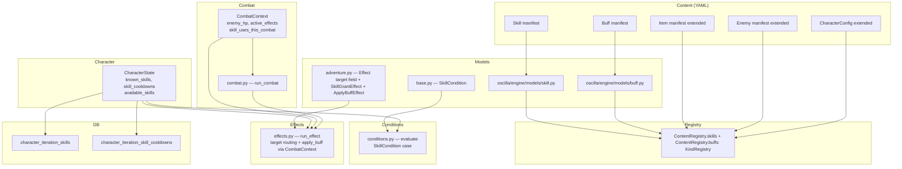

## Context

The engine currently has no mechanism for characters (or enemies) to perform active abilities. Adventures are purely YAML-scripted sequences; combat is a fixed Attack/Flee loop; items can carry use effects; but there is no concept of a learnable, activatable ability with costs, cooldowns, and targets. This blocks a wide class of game genres and rules systems that content authors need.

The codebase has solid foundations to build on:

- The discriminated `Effect` union already covers stat changes, heals, XP, items, and milestones.
- The condition evaluator (`oscilla/engine/conditions.py`) supports composable logic trees.
- `CharacterState` already has `milestones: Set[str]`, `stacks`, and `to_dict`/`from_dict` serialization.
- `ContentRegistry` already patterns `KindRegistry[T]` for new manifest kinds.
- `run_effect()` is the single dispatch point for all mechanical outcomes.
- `TUICallbacks` is a clean protocol; adding new callback methods follows the established pattern.

## Goals / Non-Goals

**Goals:**

- New `Skill` manifest kind loadable from YAML content packages.
- `CharacterState` tracks permanently learned skills and adventure-scoped cooldowns.
- `available_skills(registry)` computed for the full union: learned + equipped-item + held-item skills.
- `SkillGrantEffect` so adventures, items, and other content can teach skills.
- `SkillCondition(name, mode)` with `mode: available | learned` for content gating.
- `target: "player" | "enemy"` field on `StatChangeEffect`, `StatSetEffect`, and `HealEffect`.
- `CombatContext` ephemeral dataclass carrying live enemy state and per-combat tracking.
- "Use Skill" action in the combat turn loop; skills usable from a new Actions screen overworld.
- Turn-scoped and adventure-scoped cooldown tracking.
- Enemy `skills` list (fixed, spec-declared; no acquisition).
- Persistence: `known_skills` and `skill_cooldowns` added to the DB schema.
- Periodic/lingering effects (`ActiveCombatEffect`) ticked each combat round.
- New `Buff` manifest kind — a reusable, named, loadable buff/debuff that any skill, item, or adventure effect can apply by reference.
- `ApplyBuffEffect` so skills, items, and adventure content can apply named buffs to combat participants.
- Basic enemy skill use (simple per-turn logic; full AI decision trees are a future proposal).
- Item `grants_skills_equipped` and `grants_skills_held` fields.
- Item `grants_buffs_equipped` and `grants_buffs_held` — buff manifest names applied at combat start from equipped or held items.
- `CharacterConfig` `skill_resources` map (resource name → stat) and optional `skill_category_rules`.

**Non-Goals:**

- AI decision trees for enemy skill selection (separate proposal).
- Overworld skill invocation UI wiring in `TextualTUI` (Actions screen TUI integration is a separate task; this design covers the protocol additions and session entry point).
- Skill prerequisites / trees beyond what `SkillCondition` + the existing condition system provides.
- Crafting or item transformation skills (future proposal targeting the recipe system).

## Decisions

### D1: Skills are a first-class manifest kind, not extended items

**Decision:** New `kind: Skill` manifest with its own registry collection.

**Alternatives considered:**

- Extend `ItemSpec` to act as skills — rejected because items and skills have fundamentally different ownership semantics (`stacks`/`instances` vs. `known_skills`), different acquisition flows, and different cooldown patterns. Conflating them creates a semantic mess for content authors.

**Rationale:** Content authors need to write `kind: Skill` YAML files and place them anywhere in their content package tree. The existing manifest pattern (envelope + spec + KindRegistry) requires no new infrastructure concepts.

---

### D2: `target: "player" | "enemy"` on Stat/Heal effects, not separate effect types

**Decision:** Add `target: Literal["player", "enemy"] = "player"` to `StatChangeEffect`, `StatSetEffect`, and `HealEffect`.

**Alternatives considered:**

- New `EnemyDamageEffect` and `EnemyHealEffect` types — rejected because this proliferates the Effect union without adding expressiveness. Healing an enemy (cursed cleric build) would require yet another type.
- Magic string `stat: "@enemy.hp"` — rejected because it bypasses Pydantic validation and is fragile.

**Rationale:** A `target` field cleanly discriminates intent, is statically typed, is validated at load time, and lets existing effect types serve all contexts. The dispatcher checks `combat` is `None` when `target == "enemy"` and logs a warning + skips if called outside combat.

---

### D3: `CombatContext` is an ephemeral dataclass, never serialized directly

**Decision:** `CombatContext` holds `enemy_hp`, `enemy_ref`, `active_effects`, `skill_uses_this_combat`, and `turn_number` in memory only. Saveable state (enemy HP) continues to live in `active_adventure.step_state`.

**Alternatives considered:**

- Serialize `CombatContext` to the DB — rejected because the active effects list contains references to loaded `SkillSpec` objects, making it complex to round-trip. Enemy HP already persists via `step_state`; turn count resets on re-entry anyway.

**Rationale:** Existing `step_state` already persists `enemy_hp` across save/restore. `CombatContext` is constructed at `run_combat()` entry from `step_state`; enemy HP is written back to `step_state` each round as before. `active_effects` (periodic effects) are ephemeral — they reset when a combat is re-entered after restore, which is acceptable for the current scope.

---

### D4: `available_skills(registry)` is always a computed property

**Decision:** `CharacterState.available_skills(registry)` computes `known_skills ∪ equipped-item skills ∪ held-item skills` on each call. Nothing is cached.

**Alternatives considered:**

- Maintain a `_cached_available_skills` set and invalidate on inventory/equipment changes — rejected because invalidation is error-prone and the set is small enough that recomputing on each call is negligible.

**Rationale:** Items change frequently but the skill set during any given step is stable. Consistent with how `effective_stats(registry)` already works — same lazy-compute pattern.

---

### D5: Adventure-scope cooldowns live in `CharacterState.skill_cooldowns: Dict[str, int]`

**Decision:** Values represent remaining adventure count. Decremented at the start of each adventure. Turn-scope cooldowns live in `CombatContext.skill_uses_this_combat: Dict[str, int]`.

**Alternatives considered:**

- Hidden stats for cooldowns — rejected because it bloats the stat namespace visible to content authors and interferes with `StatBounds`.
- Single unified `skill_cooldowns` — rejected because turn-scope cooldowns don't survive between adventures and shouldn't be persisted.

**Rationale:** Two clearly-separated tracking stores match the two distinct cooldown semantics.

---

### D6: `SkillCondition` checks `available_skills` or `known_skills` based on `mode`

**Decision:** `SkillCondition` has `mode: Literal["available", "learned"] = "available"`. `available` uses `player.available_skills(registry)`, `learned` uses `player.known_skills` directly.

**Rationale:** Content authors need both questions: "Can the player do X right now?" (tool/item checks) vs. "Has the player invested in learning X?" (class advancement, story beats). Default is `available` which is inclusive and handles the most common case.

---

### D7: Enemy resources initialize from `EnemySpec.skill_resources` into `CombatContext`

**Decision:** Enemy resources are `Dict[str, int]` in `EnemySpec.skill_resources`. At combat start they are copied into `CombatContext.enemy_resources`. Not persisted.

**Rationale:** Enemies reset on each combat. Persisting enemy resources between combats serves no gameplay purpose and adds serialization complexity.

---

### D8: Periodic effects use `ActiveCombatEffect` in `CombatContext.active_effects`

**Decision:** Skills may declare a `periodic_effect: PeriodicEffect | None`. When a skill with a periodic effect is used, an `ActiveCombatEffect` is appended to `CombatContext.active_effects`. Each round, the combat loop ticks all active effects, dispatching their `per_turn_effects` through `run_effect()`, then decrements `remaining_turns` and removes expired entries.

**Rationale:** Reuses the existing effect dispatcher cleanly. All `per_turn_effects` are standard `Effect` objects with the new `target` field. No new dispatch infrastructure is needed.

---

### D9: DB persistence uses two new tables for `known_skills` and `skill_cooldowns`

**Decision:**

- `character_iteration_skills` — `(iteration_id, skill_ref)` PK — one row per learned skill.
- `character_iteration_skill_cooldowns` — `(iteration_id, skill_ref, remaining_adventures)` — one row per active cooldown.

**Alternatives considered:**

- JSON column on `character_iterations` — rejected per project conventions (no JSON columns unless explicitly required).
- Extend the existing milestone table — rejected; milestones and skills have different semantics and cooldowns add a second dimension milestones don't have.

**Rationale:** Normalized tables follow the established pattern of `character_iteration_milestones`, are queryable, and survive schema evolution without JSON drift.

---

### D10: `skill_category_rules` is entirely optional; engine ignores absent rules

**Decision:** `CharacterConfig.skill_category_rules` is a `List[SkillCategoryRule]` defaulting to `[]`. The engine only enforces rules when granting a skill via `SkillGrantEffect`. No rules → no enforcement.

**Rationale:** Most games won't need cross-category restrictions. The opt-in pattern lets simple games stay simple.

---

### D11: Enemy skills use a simple per-turn-count trigger for Phase 1

**Decision:** Each skill in `EnemySpec.skills` may declare `use_every_n_turns: int` (default 0 = never auto-use). At the end of each combat round (after player action), the combat loop checks turn count mod `use_every_n_turns` for each skill and fires it if due.

**Rationale:** Gives content authors immediate control over enemy pacing without a decision tree. The AI proposal will replace this selection logic without changing the skill-use dispatch.

---

### D12: Active periodic effects are identified by label for targeted removal

**Decision:** `PeriodicEffect` gains an optional `label: str` field (default `""`). When an `ActiveCombatEffect` is created from a `PeriodicEffect`, the label is copied onto it. A new `dispel` effect type — `DispelEffect(type, label, target)` — removes all `ActiveCombatEffect` entries matching both `label` and `target` from `CombatContext.active_effects`. Items, skills, and adventure effects can all fire `dispel` to immediately dispel a labelled buff or curse.

**Alternatives considered:**

- Not supporting mid-combat removal — rejected because it makes the buff/curse system feel unresponsive: an item that "puts out a fire" should actually extinguish the burn DoT, not just clear a flag.
- Removing by `source_skill` display name — rejected because display names can change and are not stable identifiers; a dedicated `label` field is an explicit contract between the skill and its counter-items.
- Removing by Skill manifest name — rejected because the same skill could be used to apply different labelled effects in different contexts. Labels are per-`PeriodicEffect` block, not per-skill.
- Persisting `active_effects` so removal survives save/restore — deferred; `active_effects` remain ephemeral (reset on combat re-entry). Within a single combat session removal is instant and correct.

**Rationale:** A stable, content-author-declared label is the minimal change that gives full first-class removal semantics without inventing a separate buff registry. Content pairings (e.g. `on-fire` label on Fireball's burn ↔ Water's `dispel`) are self-documenting and validated at load time.

---

### D13: Periodic effects carry passive combat modifiers alongside tick effects

**Decision:** `PeriodicEffect` gains a `modifiers: List[CombatModifier]` field (default `[]`). `CombatModifier` is a discriminated union of four types: `damage_reduction`, `damage_amplify`, `damage_reflect`, and `damage_vulnerability`. The `per_turn_effects` field becomes optional (default `[]`); a `model_validator` requires at least one of `per_turn_effects` or `modifiers` to be non-empty. `ActiveCombatEffect` mirrors `modifiers` from `PeriodicEffect` when the effect is created. The combat loop consults `ctx.active_effects` via new pure helpers — `_apply_damage_amplify`, `_apply_incoming_modifiers`, `_apply_reflect` — during basic attack arithmetic. Modifiers from all active effects stack additively. `DispelEffect` remains the removal mechanism for both modifier-only and tick effects.

**The four modifier types and their combat semantics:**

| Type                   | `target` meaning                                 | Applied during                                                           |
| ---------------------- | ------------------------------------------------ | ------------------------------------------------------------------------ |
| `damage_reduction`     | target absorbs N% less incoming damage           | Enemy attack phase — reduces `incoming`                                  |
| `damage_amplify`       | target deals N% more outgoing damage             | Player/enemy attack phase — scales `player_damage` or enemy basic attack |
| `damage_reflect`       | when target takes damage, N% bounces to attacker | After damage is applied — reduces `enemy_hp` or `player.hp`              |
| `damage_vulnerability` | target takes N% more incoming damage             | Enemy attack phase — stacks with (and opposes) `damage_reduction`        |

**Examples of what each enables (inspired by Terraria buff potions):**

- `damage_reduction` → Ironskin Potion (+8 defense → ~40% reduction), Endurance Potion (−10% damage)
- `damage_amplify` → Wrath Potion (+10% damage dealt), Battle Rage (player deals 2× for 2 turns)
- `damage_reflect` → Thorns Potion (attackers take damage), retaliatory auras
- `damage_vulnerability` → Weakness Curse (enemy debuff), Ichor debuff analog

**Alternatives considered:**

- Flat stat mutation per tick (e.g. `stat_change defense -5` repeated) — rejected because it permanently mutates `player.stats`; cleanup on expiry becomes mandatory and error-prone. Modifiers are ephemeral: they live only in `CombatContext.active_effects` and vanish when the effect expires or is dispelled.
- A flag-based `on_fire: bool` stat — rejected as the mechanism for signalling active burns. Flags on `player.stats` are used deliberately only when adventure content needs to branch on a condition that persists beyond combat. A burn that auto-expires in 3 turns should not leave a permanent stat mutation.
- Per-modifier target sharing `PeriodicEffect.target` — rejected; `CombatModifier` carries its own `target` so a single `PeriodicEffect` can declare mixed-target modifiers (unusual but valid, e.g. a mutual-curse that harms both sides).

**Rationale:** The Terraria buff taxonomy shows clearly that meaningful buffs divide into two non-overlapping families: discrete per-turn effects (DoT, HoT, resource regen) and passive arithmetic modifiers (damage scaling, reflection, reduction). Conflating them via discrete effects requires ticking a `stat_change` every round and reversing it on expiry — a fragile, stateful approach. A declarative `modifiers` list is stateless: the combat loop reads it, computes the scaled value, and throws away the intermediate. When the `ActiveCombatEffect` expires or is dispelled, the modifier simply stops being consulted.

---

### D14: Buffs are a first-class manifest kind; `apply_buff` is the single grant mechanism

**Decision:** A new `kind: Buff` manifest carries the full definition of a timed combat effect: `displayName`, `description`, `duration_turns`, `per_turn_effects`, and `modifiers`. Buff manifests are **target-agnostic** — the `target` (`"player"` | `"enemy"`) is declared on the `ApplyBuffEffect` call site, not on the manifest. This allows a single buff manifest (e.g. `thorns`) to be applied to either a player or an enemy depending on who casts it. The manifest name is the buff's stable identity — `DispelEffect.label` and `ActiveCombatEffect.label` both hold the manifest name. A new effect type `ApplyBuffEffect` (`type: apply_buff, buff_ref: <name>, target: <player|enemy>`) is added to the `Effect` union in `adventure.py`. `SkillSpec.periodic_effect` is **removed**; skills that grant buffs add an `apply_buff` entry to `use_effects` instead. This applies equally to items (potions), enemies, and adventure content — all use the same `apply_buff` mechanism without special-casing.

**What changes from D8/D12/D13:**

- `PeriodicEffect` (inline, embedded on `SkillSpec`) is removed. Its fields (`target`, `duration_turns`, `per_turn_effects`, `modifiers`, `label`) move to `BuffSpec`.
- `CombatModifier` union and its four subtypes move from `skill.py` to `buff.py`.
- `SkillSpec` no longer has `periodic_effect` or `validate_periodic_only_in_combat`.
- `ActiveCombatEffect.label` is set from `buff_manifest.metadata.name` when created via `apply_buff`.
- Combat loop helpers `_use_skill_in_combat` and `_enemy_skill_phase` no longer manually construct `ActiveCombatEffect`; construction moves entirely into the `run_effect` handler for `ApplyBuffEffect`.

**Alternatives considered:**

- Keep `PeriodicEffect` inline on `SkillSpec` and add a separate `buff_ref` field for item use — rejected because it creates two code paths for the same concept. A Thorns effect defined inline on a skill cannot be referenced by a Thorns Potion without duplication.
- A shared `label` pool at the content-package level (a side-channel mapping file) — rejected as unnecessary complexity. The manifest system already provides uniquely named, loadable resources; `Buff` fits that pattern exactly.
- Allow `apply_buff` to accept inline `PeriodicEffect`-like YAML as an anonymous buff — rejected because it defeats reusability and makes dispel targets ambiguous.

**Rationale:** Skills, items, and adventure steps are not the only contexts that might apply a buff. A boss entering a second phase might gain a rage buff; a trap might apply a poison; a spell cast by an NPC might shield the player. All of these already go through `run_effect`. Lifting `Buff` to a first-class manifest and routing all buff-granting through `ApplyBuffEffect` means any content node that can carry `use_effects` can grant or stack any named buff, with zero engine changes per new content type. The registry, loader, and dispel mechanism all gain Buff support once and the benefit accrues everywhere.



---

### D15: Buff variables allow per-call-site value overrides

**Decision:** `BuffSpec` gains a `variables: Dict[str, int] = {}` field declaring named parameters with default integer values. `CombatModifier.percent` fields accept `int | str` — a string value is a variable name resolved at `apply_buff` time against the merged variables dict. `ApplyBuffEffect` gains a `variables: Dict[str, int] = {}` field for per-call overrides. `grants_buffs_equipped`/`grants_buffs_held` on `ItemSpec` change from `List[str]` to `List[BuffGrant]` where `BuffGrant` carries a `buff_ref` and an optional `variables` override dict.

**What this enables:**

- A single `thorns` buff manifest with `variables: {reflect_percent: 30}` serves both a `thorns-sword` (default 30%) and a `master-thorns-sword` (override 60%) — no manifest duplication.
- Enemy debuffs scale with tier: a level-1 fireball applies `on-fire` with default `dot_damage: 5`; a boss fireball overrides `dot_damage: 20`.
- Variables are declared once on the `BuffSpec` with safe defaults; callers that don't pass overrides always get sensible behaviour.

**Resolution at apply time:**

1. Merge `buff_spec.variables` (defaults) with `effect.variables` (call-site overrides) into a single `resolved_vars` dict.
2. For each modifier in `spec.modifiers`: if `percent` is an `int`, use it directly; if it's a `str`, look it up in `resolved_vars`.
3. Build resolved copies of modifiers (concrete `int` percents) before storing in `ActiveCombatEffect`.

**Load-time validation additions:**

- String `percent` values in a `BuffSpec.modifiers` entry must reference a name declared in `BuffSpec.variables`. Unknown variable names raise a load error.
- Variable keys passed via `ApplyBuffEffect.variables` or `BuffGrant.variables` must be declared in the referenced buff's `variables` dict. Unknown override keys raise a load error.

**What does NOT use variables:**

- `duration_turns` — scoped to a future extension.
- `per_turn_effects` amounts — already covered by `HealEffect.amount` / `StatChangeEffect.amount` which are plain ints; a separate extension would be needed to parameterise those fields.

**Alternatives considered:**

- Template string substitution (e.g. `"$reflect_percent"` with `$` prefix) — rejected; the `int | str` union achieves the same without inventing a mini-template language. A plain identifier string is unambiguous because no valid percent value is a non-numeric string.
- Separate `ResolvedCombatModifier` type for `ActiveCombatEffect.modifiers` — rejected; after resolution the existing `CombatModifier` types naturally hold concrete int values since `int` is valid for `int | str`. No parallel type hierarchy is needed.
- Make variables optional at the manifest level (no declaration required, just accept any override key) — rejected; undeclared variable refs in modifiers can only be caught at runtime. Requiring declaration enables full load-time validation.

## Data Model Changes

### New: `oscilla/engine/models/skill.py`

```python
"""Skill manifest model — learnable, activatable character abilities."""

from __future__ import annotations

from typing import List, Literal

from pydantic import BaseModel, Field, model_validator

from oscilla.engine.models.adventure import Effect
from oscilla.engine.models.base import Condition, ManifestEnvelope


class SkillCost(BaseModel):
    """Resource cost paid when the skill is activated."""

    stat: str = Field(description="Stat name representing the resource pool (e.g. 'mana', 'psi').")
    amount: int = Field(ge=1, description="Amount deducted from the resource stat.")


class SkillCooldown(BaseModel):
    """Prevents a skill from being used too frequently."""

    scope: Literal["turn", "adventure"] = Field(
        description="'turn' resets each combat; 'adventure' persists across adventures."
    )
    count: int = Field(ge=1, description="Turns or adventures required between uses.")


class SkillSpec(BaseModel):
    displayName: str
    description: str = ""
    # Display/organisation category — purely informational unless skill_category_rules
    # in CharacterConfig introduce engine-side enforcement.
    category: str = ""
    # Contexts in which the skill may be activated.
    contexts: List[Literal["combat", "overworld"]] = Field(
        min_length=1,
        description="At least one context must be declared.",
    )
    # Condition gate checked before allowing activation (not just grant).
    requires: Condition | None = None
    # Resource consumed on each use.
    cost: SkillCost | None = None
    # Activation frequency limiter.
    cooldown: SkillCooldown | None = None
    # Effects applied once on activation. Use `apply_buff` here to grant timed combat buffs.
    use_effects: List[Effect] = []


class SkillManifest(ManifestEnvelope):
    kind: Literal["Skill"]
    spec: SkillSpec
```

---

### New: `oscilla/engine/models/buff.py`

```python
"""Buff manifest model — named, reusable timed combat effects."""

from __future__ import annotations

from typing import Annotated, List, Literal, Union

from pydantic import BaseModel, Field, model_validator

from oscilla.engine.models.adventure import Effect
from oscilla.engine.models.base import ManifestEnvelope


class DamageReductionModifier(BaseModel):
    """Reduces incoming damage to the named target by a percentage while active."""

    type: Literal["damage_reduction"]
    # int: applied directly (clamped 1–99 to prevent invulnerability exploits).
    # str: variable name resolved against merged variables at apply time.
    percent: int | str = Field(description="Percentage of incoming damage absorbed (1–99), or a buff variable name.")
    target: Literal["player", "enemy"] = Field(
        default="player",
        description="Who receives the damage reduction benefit.",
    )

    @field_validator("percent")
    @classmethod
    def _validate_percent(cls, v: int | str) -> int | str:
        if isinstance(v, int) and not (1 <= v <= 99):
            raise ValueError("percent must be 1–99 when specified as an integer")
        return v


class DamageAmplifyModifier(BaseModel):
    """Increases outgoing damage dealt by the named target by a percentage while active."""

    type: Literal["damage_amplify"]
    # int: applied directly (ge=1); str: variable name resolved at apply time.
    percent: int | str = Field(description="Percentage bonus added to outgoing damage, or a buff variable name.")
    target: Literal["player", "enemy"] = Field(
        default="player",
        description="Who deals amplified damage.",
    )

    @field_validator("percent")
    @classmethod
    def _validate_percent(cls, v: int | str) -> int | str:
        if isinstance(v, int) and v < 1:
            raise ValueError("percent must be >= 1 when specified as an integer")
        return v


class DamageReflectModifier(BaseModel):
    """Reflects a percentage of incoming damage back to the attacker while active."""

    type: Literal["damage_reflect"]
    # int: applied directly (1–100; 100% full reflection is intentional).
    # str: variable name resolved at apply time.
    percent: int | str = Field(description="Percentage of damage taken returned to attacker (1–100), or a buff variable name.")
    target: Literal["player", "enemy"] = Field(
        default="player",
        description="Who benefits from the reflection (who has the thorns).",
    )

    @field_validator("percent")
    @classmethod
    def _validate_percent(cls, v: int | str) -> int | str:
        if isinstance(v, int) and not (1 <= v <= 100):
            raise ValueError("percent must be 1–100 when specified as an integer")
        return v


class DamageVulnerabilityModifier(BaseModel):
    """Increases incoming damage received by the named target by a percentage while active."""

    type: Literal["damage_vulnerability"]
    # int: applied directly (ge=1); str: variable name resolved at apply time.
    percent: int | str = Field(description="Percentage of bonus damage taken (additive), or a buff variable name.")
    target: Literal["player", "enemy"] = Field(
        default="player",
        description="Who suffers increased incoming damage.",
    )

    @field_validator("percent")
    @classmethod
    def _validate_percent(cls, v: int | str) -> int | str:
        if isinstance(v, int) and v < 1:
            raise ValueError("percent must be >= 1 when specified as an integer")
        return v


# Discriminated union of all passive combat modifiers.
# Use `type` to declare which modifier is intended.
CombatModifier = Annotated[
    Union[
        DamageReductionModifier,
        DamageAmplifyModifier,
        DamageReflectModifier,
        DamageVulnerabilityModifier,
    ],
    Field(discriminator="type"),
]


class BuffSpec(BaseModel):
    """A named, reusable timed combat effect.

    Buffs are declarative: content authors write a `kind: Buff` manifest once and
    reference it by name from any skill, item, or adventure effect that should grant it.
    The manifest name is the buff's stable identity — it is used as the `label` on any
    resulting `ActiveCombatEffect`, and by `DispelEffect` to remove the effect early.

    Must declare at least one of `per_turn_effects` (discrete tick effects dispatched
    each round) or `modifiers` (passive damage-arithmetic adjustments). Both may be
    combined for effects such as a burn that deals tick damage *and* increases damage taken.
    """

    displayName: str
    description: str = ""
    # NOTE: No target field — target is specified on ApplyBuffEffect at use time,
    # allowing the same buff manifest to be applied to either player or enemy.
    duration_turns: int = Field(ge=1, description="Number of combat turns this buff persists.")
    per_turn_effects: List[Effect] = Field(
        default_factory=list,
        description=(
            "Effects dispatched at the start of each tick. "
            "May be empty when the buff is purely modifier-based (e.g. a shield or rage buff)."
        ),
    )
    modifiers: List[CombatModifier] = Field(
        default_factory=list,
        description=(
            "Passive modifiers applied to damage arithmetic while this buff is active. "
            "Unlike per_turn_effects, these are not dispatched as discrete effects — "
            "the combat loop queries them during attack and defence calculations. "
            "Modifier percent fields may be int or a variable name from `variables`."
        ),
    )
    variables: Dict[str, int] = Field(
        default_factory=dict,
        description=(
            "Named integer parameters with default values. "
            "Modifier percent fields may reference these by name instead of hardcoding a value. "
            "Call sites (ApplyBuffEffect, BuffGrant) may override individual keys."
        ),
    )

    @model_validator(mode="after")
    def require_tick_or_modifier(self) -> "BuffSpec":
        """At least one of per_turn_effects or modifiers must be non-empty."""
        if not self.per_turn_effects and not self.modifiers:
            raise ValueError("BuffSpec must declare at least one per_turn_effect or modifier.")
        return self

    @model_validator(mode="after")
    def validate_variable_refs(self) -> "BuffSpec":
        """Ensure all string percent refs in modifiers are declared in variables."""
        declared = set(self.variables.keys())
        for mod in self.modifiers:
            if isinstance(mod.percent, str) and mod.percent not in declared:
                raise ValueError(
                    f"Modifier references variable {mod.percent!r} which is not declared in variables."
                )
        return self


class BuffManifest(ManifestEnvelope):
    kind: Literal["Buff"]
    spec: BuffSpec
```

---

### Modified: `oscilla/engine/models/adventure.py` — Effect union

**Before (StatChangeEffect, StatSetEffect, HealEffect, and Effect union):**

```python
class HealEffect(BaseModel):
    type: Literal["heal"]
    # "full" restores the player to max_hp; a positive integer heals that exact amount.
    amount: int | Literal["full"] = "full"


class StatChangeEffect(BaseModel):
    type: Literal["stat_change"]
    stat: str = Field(description="Character stat name")
    amount: int = Field(description="Amount to add/subtract from stat; can be negative")


class StatSetEffect(BaseModel):
    type: Literal["stat_set"]
    stat: str = Field(description="Character stat name")
    value: int | bool | None = Field(description="New value for stat")


class UseItemEffect(BaseModel):
    type: Literal["use_item"]
    item: str = Field(description="Item manifest name to use")


Effect = Annotated[
    Union[
        XpGrantEffect,
        ItemDropEffect,
        MilestoneGrantEffect,
        EndAdventureEffect,
        HealEffect,
        StatChangeEffect,
        StatSetEffect,
        UseItemEffect,
    ],
    Field(discriminator="type"),
]
```

**After:**

```python
class HealEffect(BaseModel):
    type: Literal["heal"]
    # "full" restores the player to max_hp; a positive integer heals that exact amount.
    amount: int | Literal["full"] = "full"
    # When target is "enemy", requires CombatContext; heal amount is capped at enemy's max_hp
    # which is not tracked — so "full" on an enemy target is treated as a no-op with a warning.
    target: Literal["player", "enemy"] = "player"


class StatChangeEffect(BaseModel):
    type: Literal["stat_change"]
    stat: str = Field(description="Character stat name (player) or ignored when target is 'enemy'.")
    amount: int = Field(description="Amount to add/subtract; can be negative.")
    # When target is "enemy", stat is ignored and amount is applied directly to enemy_hp.
    target: Literal["player", "enemy"] = "player"


class StatSetEffect(BaseModel):
    type: Literal["stat_set"]
    stat: str = Field(description="Character stat name")
    value: int | bool | None = Field(description="New value for stat")
    # target "enemy" is not supported for stat_set — enemies have no named stats.
    # Setting this to "enemy" raises a load-time validation error.
    target: Literal["player"] = "player"


class UseItemEffect(BaseModel):
    type: Literal["use_item"]
    item: str = Field(description="Item manifest name to use")


class SkillGrantEffect(BaseModel):
    """Permanently teaches a named skill to the player."""

    type: Literal["skill_grant"]
    skill: str = Field(description="Skill manifest name to grant.")


class DispelEffect(BaseModel):
    """Remove all active periodic combat effects matching a given label.

    Matches against ActiveCombatEffect.label. Effects with an empty label are
    never matched (the empty string is explicitly not a wildcard).
    Outside of combat (combat=None) this effect is silently ignored.
    """

    type: Literal["dispel"]
    label: str = Field(min_length=1, description="Label string declared on the PeriodicEffect to remove.")
    target: Literal["player", "enemy"] = Field(
        default="player",
        description="Only effects targeting this participant are removed.",
    )


class ApplyBuffEffect(BaseModel):
    """Apply a named buff from the registry to a combat participant.

    Looks up `buff_ref` in `registry.buffs`, creates an `ActiveCombatEffect` from the
    `BuffSpec`, and appends it to `CombatContext.active_effects`. The buff manifest name
    becomes `ActiveCombatEffect.label` — the same identifier that `DispelEffect` targets.

    Outside of combat (`combat=None`) this effect is silently skipped with a log warning;
    buffs only make sense within the combat turn loop.
    """

    type: Literal["apply_buff"]
    buff_ref: str = Field(description="Buff manifest name to apply.")
    target: Literal["player", "enemy"] = Field(
        default="player",
        description=(
            "Combat participant this buff is applied to. "
            "Defaults to 'player' for self-buffs and enemy-inflicted debuffs; "
            "set to 'enemy' to apply a debuff to the enemy (e.g. a player skill that weakens the foe)."
        ),
    )
    variables: Dict[str, int] = Field(
        default_factory=dict,
        description=(
            "Per-call overrides for the buff's declared variables. "
            "Merged on top of BuffSpec.variables defaults at apply time. "
            "Unknown keys (not declared in the buff) raise a load-time validation error."
        ),
    )


Effect = Annotated[
    Union[
        XpGrantEffect,
        ItemDropEffect,
        MilestoneGrantEffect,
        EndAdventureEffect,
        HealEffect,
        StatChangeEffect,
        StatSetEffect,
        UseItemEffect,
        SkillGrantEffect,
        DispelEffect,
        ApplyBuffEffect,
    ],
    Field(discriminator="type"),
]
```

> **Call sites for `StatChangeEffect`, `StatSetEffect`, and `HealEffect`:** Pydantic model instantiation in tests and fixtures uses keyword arguments; adding `target` with a default of `"player"` is backward-compatible — no call sites need updating. YAML manifests omitting `target` also remain valid.

---

### Modified: `oscilla/engine/models/base.py` — condition union

**Before (SkillCondition absent, Condition union tail):**

```python
Condition = Annotated[
    Union[
        AllCondition,
        AnyCondition,
        NotCondition,
        LevelCondition,
        MilestoneCondition,
        ItemCondition,
        CharacterStatCondition,
        PrestigeCountCondition,
        ClassCondition,
        EnemiesDefeatedCondition,
        LocationsVisitedCondition,
        AdventuresCompletedCondition,
    ],
    Field(discriminator="type"),
]
```

**After:**

```python
class SkillCondition(BaseModel):
    type: Literal["skill"]
    name: str = Field(description="Skill manifest name to check.")
    mode: Literal["available", "learned"] = Field(
        default="available",
        description=(
            "'available' — checks known_skills ∪ item-granted skills (requires registry). "
            "'learned' — checks known_skills only (registry not required)."
        ),
    )


Condition = Annotated[
    Union[
        AllCondition,
        AnyCondition,
        NotCondition,
        LevelCondition,
        MilestoneCondition,
        ItemCondition,
        CharacterStatCondition,
        PrestigeCountCondition,
        ClassCondition,
        EnemiesDefeatedCondition,
        LocationsVisitedCondition,
        AdventuresCompletedCondition,
        SkillCondition,
    ],
    Field(discriminator="type"),
]
```

---

### Modified: `oscilla/engine/models/character_config.py`

**Before (`CharacterConfigSpec`):**

```python
class CharacterConfigSpec(BaseModel):
    public_stats: List[StatDefinition] = []
    hidden_stats: List[StatDefinition] = []
    equipment_slots: List[SlotDefinition] = []
```

**After:**

```python
class SkillResourceBinding(BaseModel):
    """Maps a human-readable resource name to a character stat and its max stat."""

    name: str = Field(description="Resource name used by SkillCost (e.g. 'mana', 'psi').")
    stat: str = Field(description="Stat name holding the current resource value.")
    max_stat: str = Field(description="Stat name holding the resource maximum.")


class SkillCategoryRule(BaseModel):
    """Optional engine-side governance for a skill category."""

    category: str
    max_known: int | None = Field(
        default=None,
        ge=1,
        description="Maximum number of skills in this category a character may learn. None = unlimited.",
    )
    exclusive_with: List[str] = Field(
        default=[],
        description="Category names whose known skills conflict with this category.",
    )


class CharacterConfigSpec(BaseModel):
    public_stats: List[StatDefinition] = []
    hidden_stats: List[StatDefinition] = []
    equipment_slots: List[SlotDefinition] = []
    # Maps resource names used by SkillCost to stat names in public/hidden_stats.
    # Validated at load time: stat and max_stat must reference declared stats.
    skill_resources: List[SkillResourceBinding] = []
    # Optional category governance — absent means no restrictions enforced.
    skill_category_rules: List[SkillCategoryRule] = []
```

---

### Modified: `oscilla/engine/models/item.py`

**Before (`ItemSpec`):**

```python
class ItemSpec(BaseModel):
    category: str
    displayName: str
    description: str = ""
    use_effects: List[Effect] = []
    consumed_on_use: bool = True
    equip: EquipSpec | None = None
    stackable: bool = True
    droppable: bool = True
    value: int = Field(default=0, ge=0)
```

**After:**

```python
class BuffGrant(BaseModel):
    """A reference to a Buff manifest with optional per-call variable overrides.

    Used in ItemSpec.grants_buffs_equipped and grants_buffs_held to allow the
    same buff manifest to be applied with item-specific parameters (e.g. a
    master-thorns-sword that reflects 60% instead of the default 30%).
    """

    buff_ref: str = Field(description="Buff manifest name to apply.")
    variables: Dict[str, int] = Field(
        default_factory=dict,
        description="Variable overrides applied on top of the buff's declared defaults.",
    )


class ItemSpec(BaseModel):
    category: str
    displayName: str
    description: str = ""
    use_effects: List[Effect] = []
    consumed_on_use: bool = True
    equip: EquipSpec | None = None
    stackable: bool = True
    droppable: bool = True
    value: int = Field(default=0, ge=0)
    # Skills granted only while this item occupies an equipment slot.
    # Cleared immediately when the item is unequipped.
    grants_skills_equipped: List[str] = []
    # Skills granted while this item is anywhere in inventory (stacks or instances),
    # equipped or not.
    grants_skills_held: List[str] = []
    # Buff grants applied at the start of each combat while this item occupies
    # an equipment slot. Buffs are re-applied fresh on each combat entry.
    # Use BuffGrant to supply per-item variable overrides (e.g. a stronger reflection %).
    grants_buffs_equipped: List[BuffGrant] = []
    # Buff grants applied at the start of each combat while this item is
    # anywhere in inventory (equipped or not).
    grants_buffs_held: List[BuffGrant] = []
```

---

### Modified: `oscilla/engine/models/enemy.py`

**Before (`EnemySpec`):**

```python
class EnemySpec(BaseModel):
    displayName: str
    description: str = ""
    hp: int = Field(ge=1)
    attack: int = Field(ge=0)
    defense: int = Field(ge=0)
    xp_reward: int = Field(ge=0)
    loot: List[LootEntry] = []
```

**After:**

```python
class EnemySkillEntry(BaseModel):
    """Declares a skill the enemy knows and when to auto-use it."""

    skill_ref: str = Field(description="Skill manifest name.")
    # 0 means the skill is never triggered automatically — only by future AI logic.
    use_every_n_turns: int = Field(
        default=0,
        ge=0,
        description="Trigger the skill every N turns (starting turn 1). 0 = AI-only.",
    )


class EnemySpec(BaseModel):
    displayName: str
    description: str = ""
    hp: int = Field(ge=1)
    attack: int = Field(ge=0)
    defense: int = Field(ge=0)
    xp_reward: int = Field(ge=0)
    loot: List[LootEntry] = []
    # Fixed skill list — enemies never acquire new skills.
    skills: List[EnemySkillEntry] = []
    # Initial resource values for skill costs (resource_name → starting value).
    # These are NOT persisted; reset at the start of each combat.
    skill_resources: Dict[str, int] = Field(default_factory=dict)
```

---

## Character State Changes

### `oscilla/engine/character.py` — New fields and methods

**Before (CharacterState field declarations, tail of `__init__` fields):**

```python
    active_adventure: AdventurePosition | None = None
    # Dynamic stats from CharacterConfig; int | bool | None (not Any).
    stats: Dict[str, int | bool | None] = field(default_factory=dict)
```

**After:**

```python
    active_adventure: AdventurePosition | None = None
    # Dynamic stats from CharacterConfig; int | bool | None (not Any).
    stats: Dict[str, int | bool | None] = field(default_factory=dict)
    # Skill refs permanently learned by the player.
    known_skills: Set[str] = field(default_factory=set)
    # Adventure-scope cooldowns: skill_ref → adventures remaining before reuse.
    # Decremented at adventure start; removed when value reaches 0.
    skill_cooldowns: Dict[str, int] = field(default_factory=dict)
```

**New `available_skills` method (add after `effective_stats`):**

```python
    def available_skills(self, registry: "ContentRegistry | None" = None) -> Set[str]:
        """Return the full set of skill refs the player can currently activate.

        Combines:
        1. Permanently learned skills (known_skills).
        2. Skills granted by currently equipped item instances (grants_skills_equipped).
        3. Skills granted by any held item — stacks or instances (grants_skills_held).

        Requires registry to resolve item specs. Without a registry only known_skills
        is returned, which is correct for context where items cannot be looked up.
        """
        result: Set[str] = set(self.known_skills)
        if registry is None:
            return result

        # Equipped-item skills: only items actually in an equipment slot.
        equipped_refs: Set[str] = {inst.item_ref for inst in self.instances
                                    if inst.instance_id in self.equipment.values()}
        for item_ref in equipped_refs:
            item = registry.items.get(item_ref)
            if item is not None:
                result.update(item.spec.grants_skills_equipped)

        # Held-item skills: any item in stacks or instances (equipped or not).
        for item_ref in self.stacks:
            item = registry.items.get(item_ref)
            if item is not None:
                result.update(item.spec.grants_skills_held)
        for inst in self.instances:
            item = registry.items.get(inst.item_ref)
            if item is not None:
                result.update(item.spec.grants_skills_held)

        return result

    def grant_skill(self, skill_ref: str, registry: "ContentRegistry | None" = None) -> bool:
        """Attempt to grant the player a skill. Returns True if the skill was newly learned.

        Enforces SkillCategoryRule restrictions (max_known, exclusive_with) when
        a registry with CharacterConfig is provided. If a rule blocks the grant,
        logs a warning and returns False without mutating state.

        Already-known skills are a no-op (returns False).
        """
        if skill_ref in self.known_skills:
            return False

        if registry is not None and registry.character_config is not None:
            skill = registry.skills.get(skill_ref)
            if skill is not None:
                category = skill.spec.category
                rules = {r.category: r for r in registry.character_config.spec.skill_category_rules}
                rule = rules.get(category)
                if rule is not None:
                    # Check exclusive_with: if the player already knows any skill from
                    # an exclusive category, block the grant.
                    for excl_cat in rule.exclusive_with:
                        excl_rule = rules.get(excl_cat)
                        if excl_rule is None:
                            continue
                        # Check if player has any skill in the exclusive category
                        for known in self.known_skills:
                            known_skill = registry.skills.get(known)
                            if known_skill is not None and known_skill.spec.category == excl_cat:
                                logger.warning(
                                    "grant_skill(%r) blocked: category %r is exclusive with %r "
                                    "and player already knows a %r skill.",
                                    skill_ref, category, excl_cat, excl_cat,
                                )
                                return False
                    # Check max_known: count existing skills in this category.
                    if rule.max_known is not None:
                        count = sum(
                            1 for known in self.known_skills
                            if (s := registry.skills.get(known)) is not None
                            and s.spec.category == category
                        )
                        if count >= rule.max_known:
                            logger.warning(
                                "grant_skill(%r) blocked: category %r already has %d/%d skills.",
                                skill_ref, category, count, rule.max_known,
                            )
                            return False

        self.known_skills.add(skill_ref)
        return True

    def tick_skill_cooldowns(self) -> None:
        """Decrement adventure-scoped cooldowns by one. Called at the start of each adventure.

        Removes entries that reach 0 so that skill_cooldowns only contains active cooldowns.
        """
        spent: List[str] = []
        for skill_ref, remaining in self.skill_cooldowns.items():
            new_val = remaining - 1
            if new_val <= 0:
                spent.append(skill_ref)
            else:
                self.skill_cooldowns[skill_ref] = new_val
        for skill_ref in spent:
            del self.skill_cooldowns[skill_ref]
```

**Before (`to_dict` return dict — tail):**

```python
            "active_adventure": active_adventure,
        }
```

**After:**

```python
            "active_adventure": active_adventure,
            "known_skills": sorted(self.known_skills),
            "skill_cooldowns": dict(self.skill_cooldowns),
        }
```

**Before (`from_dict` return statement):**

```python
        return cls(
            character_id=UUID(data["character_id"]),
            iteration=data["iteration"],
            name=data["name"],
            character_class=data.get("character_class"),
            level=data["level"],
            xp=data["xp"],
            hp=data["hp"],
            max_hp=data["max_hp"],
            current_location=data.get("current_location"),
            milestones=set(data.get("milestones", [])),
            stacks=dict(data.get("stacks", {})),
            instances=instances,
            equipment=equipment,
            active_quests=dict(data.get("active_quests", {})),
            completed_quests=set(data.get("completed_quests", [])),
            stats=reconciled_stats,
            statistics=statistics,
            active_adventure=active_adventure,
        )
```

**After:**

```python
        return cls(
            character_id=UUID(data["character_id"]),
            iteration=data["iteration"],
            name=data["name"],
            character_class=data.get("character_class"),
            level=data["level"],
            xp=data["xp"],
            hp=data["hp"],
            max_hp=data["max_hp"],
            current_location=data.get("current_location"),
            milestones=set(data.get("milestones", [])),
            stacks=dict(data.get("stacks", {})),
            instances=instances,
            equipment=equipment,
            active_quests=dict(data.get("active_quests", {})),
            completed_quests=set(data.get("completed_quests", [])),
            stats=reconciled_stats,
            statistics=statistics,
            active_adventure=active_adventure,
            known_skills=set(data.get("known_skills", [])),
            skill_cooldowns=dict(data.get("skill_cooldowns", {})),
        )
```

---

## Condition Evaluator Changes

### `oscilla/engine/conditions.py`

**Before (imports):**

```python
from oscilla.engine.models.base import (
    AdventuresCompletedCondition,
    AllCondition,
    AnyCondition,
    CharacterStatCondition,
    ClassCondition,
    Condition,
    EnemiesDefeatedCondition,
    ItemCondition,
    LevelCondition,
    LocationsVisitedCondition,
    MilestoneCondition,
    NotCondition,
    PrestigeCountCondition,
)
```

**After:**

```python
from oscilla.engine.models.base import (
    AdventuresCompletedCondition,
    AllCondition,
    AnyCondition,
    CharacterStatCondition,
    ClassCondition,
    Condition,
    EnemiesDefeatedCondition,
    ItemCondition,
    LevelCondition,
    LocationsVisitedCondition,
    MilestoneCondition,
    NotCondition,
    PrestigeCountCondition,
    SkillCondition,
)
```

**Before (evaluate function — tail of match block):**

```python
        # --- Statistics leaves ---
        case EnemiesDefeatedCondition(name=n) as c:
            return _numeric_compare(player.statistics.enemies_defeated.get(n, 0), c)
        case LocationsVisitedCondition(name=n) as c:
            return _numeric_compare(player.statistics.locations_visited.get(n, 0), c)
        case AdventuresCompletedCondition(name=n) as c:
            return _numeric_compare(player.statistics.adventures_completed.get(n, 0), c)

    raise ValueError(f"Unhandled condition type: {condition!r}")  # pragma: no cover
```

**After:**

```python
        # --- Statistics leaves ---
        case EnemiesDefeatedCondition(name=n) as c:
            return _numeric_compare(player.statistics.enemies_defeated.get(n, 0), c)
        case LocationsVisitedCondition(name=n) as c:
            return _numeric_compare(player.statistics.locations_visited.get(n, 0), c)
        case AdventuresCompletedCondition(name=n) as c:
            return _numeric_compare(player.statistics.adventures_completed.get(n, 0), c)

        # --- Skill leaves ---
        case SkillCondition(name=n, mode=mode):
            if mode == "learned":
                # Only permanently learned skills — registry not required.
                return n in player.known_skills
            else:
                # mode == "available": includes item-granted skills; requires registry.
                # Without a registry (e.g. some test contexts) falls back to known_skills only.
                return n in player.available_skills(registry)

    raise ValueError(f"Unhandled condition type: {condition!r}")  # pragma: no cover
```

---

## Effect Dispatcher Changes

### `oscilla/engine/steps/effects.py`

**New `CombatContext` dataclass (add to this file or a new `oscilla/engine/combat_context.py`):**

```python
"""CombatContext — ephemeral state for one in-progress combat encounter.

Never serialized. Constructed at run_combat() entry from step_state and
the enemy spec; destroyed when combat ends.
"""

from __future__ import annotations

from dataclasses import dataclass, field
from typing import TYPE_CHECKING, Dict, List, Literal

if TYPE_CHECKING:
    from oscilla.engine.models.adventure import Effect
    from oscilla.engine.models.buff import CombatModifier


@dataclass
class ActiveCombatEffect:
    """A periodic skill effect currently ticking on a combat participant."""

    source_skill: str  # display name — shown in status
    target: Literal["player", "enemy"]
    remaining_turns: int
    # Each entry is dispatched through run_effect() at the top of each round.
    per_turn_effects: List["Effect"]
    # Stable identifier copied from PeriodicEffect.label; used by DispelEffect.
    # Empty string means this effect cannot be targeted by dispel.
    label: str = ""
    # Passive modifiers copied from PeriodicEffect.modifiers; consulted by the combat
    # loop during damage arithmetic. Not dispatched as effects — simply read each round.
    modifiers: List["CombatModifier"] = field(default_factory=list)


@dataclass
class CombatContext:
    """Live state for a single combat encounter.

    enemy_hp mirrors active_adventure.step_state["enemy_hp"] — the combat loop
    writes back to step_state each round for persistence, but reads from here
    for performance and clarity.
    """

    enemy_hp: int
    enemy_ref: str
    # active_effects ticks down each round; entries removed when remaining_turns hits 0.
    active_effects: List[ActiveCombatEffect] = field(default_factory=list)
    # skill_ref → uses this combat; used for turn-scope cooldown enforcement.
    skill_uses_this_combat: Dict[str, int] = field(default_factory=dict)
    # Current turn number starting at 1.
    turn_number: int = 1
    # Enemy resource pool: resource_name → current value; initialized from EnemySpec.
    enemy_resources: Dict[str, int] = field(default_factory=dict)
```

**Before (`run_effect` signature and import block):**

```python
from oscilla.engine.models.adventure import (
    Effect,
    EndAdventureEffect,
    HealEffect,
    ItemDropEffect,
    MilestoneGrantEffect,
    StatChangeEffect,
    StatSetEffect,
    UseItemEffect,
    XpGrantEffect,
)
...

async def run_effect(
    effect: Effect,
    player: "CharacterState",
    registry: "ContentRegistry",
    tui: "TUICallbacks",
) -> None:
```

**After:**

```python
from oscilla.engine.models.adventure import (
    ApplyBuffEffect,
    Effect,
    EndAdventureEffect,
    HealEffect,
    ItemDropEffect,
    MilestoneGrantEffect,
    DispelEffect,
    SkillGrantEffect,
    StatChangeEffect,
    StatSetEffect,
    UseItemEffect,
    XpGrantEffect,
)
from oscilla.engine.combat_context import ActiveCombatEffect, CombatContext
...

async def run_effect(
    effect: Effect,
    player: "CharacterState",
    registry: "ContentRegistry",
    tui: "TUICallbacks",
    combat: "CombatContext | None" = None,
) -> None:
    """Dispatch a single effect to its handler.

    combat must be provided for any effect with target="enemy". When absent and
    target="enemy" is requested, a warning is logged and the effect is skipped
    rather than crashing — this can occur if a skill with combat-only effects is
    somehow invoked outside combat.
    """
```

**New cases inside `match effect:` (add after existing `UseItemEffect` case):**

```python
        case SkillGrantEffect(skill=skill_ref):
            granted = player.grant_skill(skill_ref=skill_ref, registry=registry)
            if granted:
                skill = registry.skills.get(skill_ref)
                name = skill.spec.displayName if skill is not None else skill_ref
                await tui.show_text(f"You learned: {name}!")
            # Already-known — silent no-op (grant_skill returns False)

        case DispelEffect(label=label, target=target):
            if combat is None:
                # Outside combat there are no active effects to remove.
                logger.debug("dispel(%r) called outside combat — no-op.", label)
                return
            before = len(combat.active_effects)
            combat.active_effects = [
                ae for ae in combat.active_effects
                if not (ae.label == label and ae.target == target)
            ]
            removed = before - len(combat.active_effects)
            if removed > 0:
                await tui.show_text(f"[green]{removed} effect(s) with label {label!r} dispelled.[/green]")
            else:
                logger.debug("dispel(%r): no matching active effects found.", label)

        case ApplyBuffEffect(buff_ref=buff_ref, target=buff_target, variables=call_vars):
            if combat is None:
                # Buffs only make sense inside the combat turn loop.
                logger.warning("apply_buff(%r) called outside combat — skipping.", buff_ref)
                return
            buff_manifest = registry.buffs.get(buff_ref)
            if buff_manifest is None:
                logger.error("apply_buff: buff ref %r not found in registry — skipping.", buff_ref)
                await tui.show_text(f"[red]Error: buff {buff_ref!r} not found.[/red]")
                return
            spec = buff_manifest.spec
            # Merge manifest variable defaults with call-site overrides.
            resolved_vars: Dict[str, int] = {**spec.variables, **call_vars}

            def _resolve_percent(v: int | str) -> int:
                """Resolve a modifier percent — either a literal int or a variable name."""
                if isinstance(v, int):
                    return v
                if v in resolved_vars:
                    return resolved_vars[v]
                # Should never reach here when load-time validation passes.
                logger.error("apply_buff: variable %r not in resolved_vars — using 0.", v)
                return 0

            # Build resolved modifier copies with concrete int percent values.
            resolved_modifiers = [
                mod.model_copy(update={"percent": _resolve_percent(mod.percent)})
                for mod in spec.modifiers
            ]

            # Buff manifest name is used as the stable label for DispelEffect matching.
            # Target comes from the effect call site, not the manifest.
            combat.active_effects.append(
                ActiveCombatEffect(
                    source_skill=buff_manifest.metadata.name,
                    target=buff_target,
                    remaining_turns=spec.duration_turns,
                    per_turn_effects=list(spec.per_turn_effects),
                    modifiers=resolved_modifiers,
                    label=buff_manifest.metadata.name,
                )
            )
            await tui.show_text(
                f"[bold]{spec.displayName}[/bold] applied for {spec.duration_turns} turn(s)."
            )

```

**Modified `StatChangeEffect` case:**

```python
        case StatChangeEffect(stat=stat, amount=amount, target=target):
            if target == "enemy":
                if combat is None:
                    logger.warning(
                        "stat_change with target='enemy' called outside combat — skipping effect."
                    )
                    return
                combat.enemy_hp += amount
                # Enemy HP floor is 0 — don't let heals go negative, don't let damage go past death.
                combat.enemy_hp = max(0, combat.enemy_hp)
                action = "damaged" if amount < 0 else "healed"
                await tui.show_text(f"Enemy {action} for {abs(amount)}. (Enemy HP: {combat.enemy_hp})")
                return
            # --- player target (original logic) ---
            if stat not in player.stats:
                await tui.show_text(f"[red]Error: stat {stat!r} not found[/red]")
                return
            old_value = player.stats[stat]
            if not isinstance(old_value, int) or isinstance(old_value, bool):
                await tui.show_text(f"[red]Error: cannot change non-numeric stat {stat!r}[/red]")
                return
            raw_new = old_value + amount
            lo, hi = _resolve_stat_bounds(stat=stat, registry=registry)
            new_value = max(lo, min(hi, raw_new))
            if new_value != raw_new:
                logger.warning(
                    "stat_change on %r: attempted %d, clamped to %d (bounds %d..%d).",
                    stat, raw_new, new_value, lo, hi,
                )
                await tui.show_text(
                    f"[yellow]Warning: stat {stat!r} clamped to {new_value} (attempted {raw_new}).[/yellow]"
                )
            player.set_stat(name=stat, value=new_value)
            await tui.show_text(f"Changed {stat}: {old_value} → {new_value}")

```

**Modified `HealEffect` case:**

```python
        case HealEffect(amount=amount, target=target):
            if target == "enemy":
                if combat is None:
                    logger.warning(
                        "heal with target='enemy' called outside combat — skipping effect."
                    )
                    return
                if amount == "full":
                    # Enemy max_hp is not tracked; log warning and skip.
                    logger.warning("heal target='enemy' with amount='full' is not supported — skipping.")
                    return
                combat.enemy_hp = max(0, combat.enemy_hp + int(amount))
                await tui.show_text(f"Enemy healed for {amount}. (Enemy HP: {combat.enemy_hp})")
                return
            # --- player target (original logic) ---
            before_hp = player.hp
            if amount == "full":
                player.hp = player.max_hp
            else:
                player.hp = min(player.hp + int(amount), player.max_hp)
            healed = player.hp - before_hp
            if healed > 0:
                await tui.show_text(f"Restored {healed} HP. (HP: {player.hp} / {player.max_hp})")
```

---

## Combat Loop Changes

### `oscilla/engine/steps/combat.py`

**Before (full file):**

```python
async def run_combat(
    step: CombatStep,
    player: "CharacterState",
    registry: "ContentRegistry",
    tui: TUICallbacks,
    run_outcome_branch: Callable[[OutcomeBranch], Awaitable[AdventureOutcome]],
    on_round_complete: Callable[[], Awaitable[None]] | None = None,
) -> AdventureOutcome:
    enemy = registry.enemies.require(step.enemy, "Enemy")

    if player.active_adventure and "enemy_hp" in player.active_adventure.step_state:
        enemy_hp: int = int(player.active_adventure.step_state["enemy_hp"] or 0)
    else:
        enemy_hp = enemy.spec.hp
        if player.active_adventure:
            player.active_adventure.step_state["enemy_hp"] = enemy_hp

    while True:
        await tui.show_combat_round(
            player_hp=player.hp,
            enemy_hp=enemy_hp,
            player_name=player.name,
            enemy_name=enemy.spec.displayName,
        )
        action = await tui.show_menu("Your move:", ["Attack", "Flee"])

        if action == 2:  # Flee
            await run_outcome_branch(step.on_flee)
            return AdventureOutcome.FLED

        # Player attacks
        strength = player.stats.get("strength", 10)
        player_damage = max(0, int(strength if isinstance(strength, (int, float)) else 10) - enemy.spec.defense)
        enemy_hp -= player_damage
        if player.active_adventure:
            player.active_adventure.step_state["enemy_hp"] = enemy_hp

        if enemy_hp > 0:
            dexterity = player.stats.get("dexterity", 10)
            mitigation = int(dexterity if isinstance(dexterity, (int, float)) else 10) // 5
            incoming = max(0, enemy.spec.attack - mitigation)
            player.hp = max(0, player.hp - incoming)

        if on_round_complete is not None:
            await on_round_complete()

        if enemy_hp <= 0:
            player.statistics.record_enemy_defeated(step.enemy)
            await run_outcome_branch(step.on_win)
            return AdventureOutcome.COMPLETED

        if player.hp <= 0:
            await run_outcome_branch(step.on_defeat)
            return AdventureOutcome.DEFEATED
```

**After:**

```python
"""Combat step handler — turn-based fight loop with skill support."""

from __future__ import annotations

from logging import getLogger
from typing import TYPE_CHECKING, Awaitable, Callable, List

from oscilla.engine.combat_context import ActiveCombatEffect, CombatContext
from oscilla.engine.models.adventure import CombatStep, Effect, OutcomeBranch
from oscilla.engine.pipeline import AdventureOutcome, TUICallbacks
from oscilla.engine.steps.effects import run_effect

if TYPE_CHECKING:
    from oscilla.engine.character import CharacterState
    from oscilla.engine.registry import ContentRegistry

logger = getLogger(__name__)


async def _tick_active_effects(
    ctx: CombatContext,
    player: "CharacterState",
    registry: "ContentRegistry",
    tui: TUICallbacks,
) -> None:
    """Fire per-turn effects for all active periodic effects, then expire finished ones.

    Called at the top of each combat round before the player acts.
    """
    expired: List[int] = []
    for i, ae in enumerate(ctx.active_effects):
        await tui.show_text(f"[italic]{ae.source_skill}[/italic] ticks ({ae.remaining_turns} turn(s) left).")
        for eff in ae.per_turn_effects:
            await run_effect(effect=eff, player=player, registry=registry, tui=tui, combat=ctx)
        ae.remaining_turns -= 1
        if ae.remaining_turns <= 0:
            expired.append(i)
    # Remove expired in reverse order to preserve indices.
    for i in reversed(expired):
        ctx.active_effects.pop(i)


def _apply_damage_amplify(base: int, target: Literal["player", "enemy"], ctx: CombatContext) -> int:
    """Scale outgoing damage by any damage_amplify modifiers active for target.

    All active damage_amplify modifiers for the named target are summed and applied
    as a single multiplicative bonus: base * (1 + total_percent / 100).
    """
    total = sum(
        m.percent
        for ae in ctx.active_effects
        for m in ae.modifiers
        if m.type == "damage_amplify" and m.target == target
    )
    if total <= 0:
        return base
    return int(base * (1 + total / 100))


def _apply_incoming_modifiers(base: int, target: Literal["player", "enemy"], ctx: CombatContext) -> int:
    """Apply damage_reduction and damage_vulnerability modifiers to incoming damage for target.

    Reductions and vulnerabilities are summed independently, then combined:
        factor = max(0.0,  1.0 - (total_reduction / 100) + (total_vulnerability / 100))
    If base > 0 the result is at minimum 1 (no hit is silently absorbed unless base was 0).
    """
    net_reduction = sum(
        m.percent
        for ae in ctx.active_effects
        for m in ae.modifiers
        if m.type == "damage_reduction" and m.target == target
    )
    net_vuln = sum(
        m.percent
        for ae in ctx.active_effects
        for m in ae.modifiers
        if m.type == "damage_vulnerability" and m.target == target
    )
    factor = max(0.0, 1.0 - net_reduction / 100 + net_vuln / 100)
    if base <= 0:
        return 0
    return max(1, int(base * factor))


async def _apply_reflect(
    taken: int,
    target: Literal["player", "enemy"],
    ctx: CombatContext,
    player: "CharacterState",
    tui: TUICallbacks,
) -> None:
    """Reflect a portion of damage taken back to the attacker.

    Sums all damage_reflect modifiers active for target and reflects that
    percentage of `taken` damage onto the opposing side. Minimum reflected
    damage is 1 when any reflection is active and taken > 0.
    """
    total_reflect = sum(
        m.percent
        for ae in ctx.active_effects
        for m in ae.modifiers
        if m.type == "damage_reflect" and m.target == target
    )
    if total_reflect <= 0 or taken <= 0:
        return
    reflected = max(1, int(taken * total_reflect / 100))
    if target == "player":
        # Player has thorns — attacker (enemy) takes the reflected damage.
        ctx.enemy_hp = max(0, ctx.enemy_hp - reflected)
        await tui.show_text(f"[yellow]Thorns! {reflected} damage reflected to the enemy.[/yellow]")
    else:
        # Enemy has thorns — attacker (player) takes the reflected damage.
        player.hp = max(0, player.hp - reflected)
        await tui.show_text(f"[yellow]{reflected} damage reflected back at you![/yellow]")
    skill_ref: str,
    ctx: CombatContext,
    player: "CharacterState",
    registry: "ContentRegistry",
    tui: TUICallbacks,
) -> bool:
    """Attempt to activate a skill during combat. Returns True if the skill fired.

    Validates:
    1. Skill exists in registry.
    2. Combat context is declared (always true when called from run_combat, but checked defensively).
    3. Cooldown (turn-scope and adventure-scope).
    4. Resource cost can be met.
    5. Activation condition (requires field) is satisfied.

    If any check fails, shows an error message and returns False without mutating state.
    """
    skill = registry.skills.get(skill_ref)
    if skill is None:
        await tui.show_text(f"[red]Error: skill {skill_ref!r} not found in registry.[/red]")
        return False

    spec = skill.spec

    # Turn-scope cooldown check.
    if spec.cooldown is not None and spec.cooldown.scope == "turn":
        last_used = ctx.skill_uses_this_combat.get(skill_ref, 0)
        if last_used > 0 and (ctx.turn_number - last_used) < spec.cooldown.count:
            remaining = spec.cooldown.count - (ctx.turn_number - last_used)
            await tui.show_text(
                f"[yellow]{spec.displayName} is on cooldown ({remaining} turn(s) remaining).[/yellow]"
            )
            return False

    # Adventure-scope cooldown check.
    if spec.cooldown is not None and spec.cooldown.scope == "adventure":
        remaining = player.skill_cooldowns.get(skill_ref, 0)
        if remaining > 0:
            await tui.show_text(
                f"[yellow]{spec.displayName} is on cooldown ({remaining} adventure(s) remaining).[/yellow]"
            )
            return False

    # Resource cost check.
    if spec.cost is not None:
        current = player.stats.get(spec.cost.stat, 0)
        if not isinstance(current, int) or isinstance(current, bool):
            await tui.show_text(f"[red]Error: resource stat {spec.cost.stat!r} is not numeric.[/red]")
            return False
        if current < spec.cost.amount:
            await tui.show_text(
                f"[red]Not enough {spec.cost.stat} to use {spec.displayName} "
                f"(need {spec.cost.amount}, have {current}).[/red]"
            )
            return False

    # Activation condition (requires) check.
    from oscilla.engine.conditions import evaluate
    if not evaluate(condition=spec.requires, player=player, registry=registry):
        await tui.show_text(f"[red]You cannot use {spec.displayName} right now.[/red]")
        return False

    # All checks passed — deduct resource cost.
    if spec.cost is not None:
        old = int(player.stats.get(spec.cost.stat, 0))
        player.set_stat(name=spec.cost.stat, value=old - spec.cost.amount)

    # Record use for cooldown tracking.
    if spec.cooldown is not None:
        if spec.cooldown.scope == "turn":
            ctx.skill_uses_this_combat[skill_ref] = ctx.turn_number
        else:  # adventure
            player.skill_cooldowns[skill_ref] = spec.cooldown.count

    # Dispatch immediate use_effects (including any apply_buff effects).
    await tui.show_text(f"You use [bold]{spec.displayName}[/bold]!")
    for eff in spec.use_effects:
        await run_effect(effect=eff, player=player, registry=registry, tui=tui, combat=ctx)

    return True


async def _enemy_skill_phase(
    ctx: CombatContext,
    player: "CharacterState",
    registry: "ContentRegistry",
    tui: TUICallbacks,
) -> None:
    """Check and fire any enemy skills whose use_every_n_turns threshold is met.

    Called at the end of each round, after the enemy's basic attack.
    Skills with use_every_n_turns=0 are never auto-fired; they await AI selection.
    """
    enemy = registry.enemies.require(ctx.enemy_ref, "Enemy")
    for skill_entry in enemy.spec.skills:
        n = skill_entry.use_every_n_turns
        if n == 0:
            continue
        if ctx.turn_number % n == 0:
            skill = registry.skills.get(skill_entry.skill_ref)
            if skill is None:
                logger.warning("Enemy skill ref %r not found in registry — skipping.", skill_entry.skill_ref)
                continue
            spec = skill.spec

            # Resource check for enemy.
            if spec.cost is not None:
                available = ctx.enemy_resources.get(spec.cost.stat, 0)
                if available < spec.cost.amount:
                    continue  # Not enough resource; skip silently.
                ctx.enemy_resources[spec.cost.stat] = available - spec.cost.amount

            await tui.show_text(f"[bold]{enemy.spec.displayName}[/bold] uses [italic]{spec.displayName}[/italic]!")
            for eff in spec.use_effects:
                await run_effect(effect=eff, player=player, registry=registry, tui=tui, combat=ctx)


async def run_combat(
    step: CombatStep,
    player: "CharacterState",
    registry: "ContentRegistry",
    tui: TUICallbacks,
    run_outcome_branch: Callable[[OutcomeBranch], Awaitable[AdventureOutcome]],
    on_round_complete: Callable[[], Awaitable[None]] | None = None,
) -> AdventureOutcome:
    """Execute the turn-based combat loop with skill support.

    Player acts first each round. Fleeing hands control to on_flee immediately.
    CombatContext is constructed here and passed to all sub-functions — it is
    never serialized. Enemy HP is still mirrored to step_state each round for
    persistence compatibility with the existing save/restore path.
    """
    enemy = registry.enemies.require(step.enemy, "Enemy")

    # Restore or initialize enemy HP.
    if player.active_adventure and "enemy_hp" in player.active_adventure.step_state:
        initial_hp: int = int(player.active_adventure.step_state["enemy_hp"] or 0)
    else:
        initial_hp = enemy.spec.hp
        if player.active_adventure:
            player.active_adventure.step_state["enemy_hp"] = initial_hp

    ctx = CombatContext(
        enemy_hp=initial_hp,
        enemy_ref=step.enemy,
        # Initialize enemy resources from their spec.
        enemy_resources=dict(enemy.spec.skill_resources),
    )

    # Apply combat-entry buffs granted by equipped and held items.
    equipped_refs: Set[str] = {inst.item_ref for inst in player.instances
                               if inst.instance_id in player.equipment.values()}
    for item_ref in equipped_refs:
        item_m = registry.items.get(item_ref)
        if item_m is not None:
            for grant in item_m.spec.grants_buffs_equipped:
                await run_effect(
                    # Items are player-owned; buffs from equipment always target the player.
                    effect=ApplyBuffEffect(
                        type="apply_buff",
                        buff_ref=grant.buff_ref,
                        target="player",
                        variables=grant.variables,
                    ),
                    player=player, registry=registry, tui=tui, combat=ctx,
                )
    held_refs: Set[str] = {inst.item_ref for inst in player.instances} | set(player.stacks.keys())
    for item_ref in held_refs:
        item_m = registry.items.get(item_ref)
        if item_m is not None:
            for grant in item_m.spec.grants_buffs_held:
                await run_effect(
                    # Items are player-owned; buffs from held inventory always target the player.
                    effect=ApplyBuffEffect(
                        type="apply_buff",
                        buff_ref=grant.buff_ref,
                        target="player",
                        variables=grant.variables,
                    ),
                    player=player, registry=registry, tui=tui, combat=ctx,
                )

    # Determine which skills the player can use in combat.
    combat_skills = [
        skill_ref for skill_ref in player.available_skills(registry=registry)
        if (s := registry.skills.get(skill_ref)) is not None and "combat" in s.spec.contexts
    ]

    while True:
        # Tick periodic effects at the top of each round.
        await _tick_active_effects(ctx=ctx, player=player, registry=registry, tui=tui)

        await tui.show_combat_round(
            player_hp=player.hp,
            enemy_hp=ctx.enemy_hp,
            player_name=player.name,
            enemy_name=enemy.spec.displayName,
        )

        # Build action menu: Attack always first, then skills, then Flee last.
        menu_options = ["Attack"]
        skill_indices: List[str] = []  # parallel to skill menu slots
        if combat_skills:
            for skill_ref in combat_skills:
                skill = registry.skills.get(skill_ref)
                if skill is not None:
                    menu_options.append(f"Skill: {skill.spec.displayName}")
                    skill_indices.append(skill_ref)
        menu_options.append("Flee")
        flee_index = len(menu_options)  # 1-based

        action = await tui.show_menu("Your move:", menu_options)

        if action == flee_index:
            await run_outcome_branch(step.on_flee)
            return AdventureOutcome.FLED

            if action == 1:
            # Standard attack.
            strength = player.stats.get("strength", 10)
            base_damage = max(0, int(strength if isinstance(strength, (int, float)) else 10) - enemy.spec.defense)
            # Apply any damage_amplify modifiers active on the player.
            player_damage = _apply_damage_amplify(base=base_damage, target="player", ctx=ctx)
            if player_damage > 0:
                await tui.show_text(f"You attack for {player_damage} damage!")
            ctx.enemy_hp = max(0, ctx.enemy_hp - player_damage)
        elif 2 <= action < flee_index:
            # Skill use: action 2 → skill_indices[0], etc.
            skill_ref = skill_indices[action - 2]
            await _use_skill_in_combat(
                skill_ref=skill_ref, ctx=ctx, player=player, registry=registry, tui=tui
            )

        # Persist enemy HP in step_state for save/restore.
        if player.active_adventure:
            player.active_adventure.step_state["enemy_hp"] = ctx.enemy_hp

        # Enemy retaliation — only when still alive.
        if ctx.enemy_hp > 0:
            dexterity = player.stats.get("dexterity", 10)
            mitigation = int(dexterity if isinstance(dexterity, (int, float)) else 10) // 5
            raw_incoming = max(0, enemy.spec.attack - mitigation)
            # Apply damage_reduction and damage_vulnerability modifiers active on the player.
            incoming = _apply_incoming_modifiers(base=raw_incoming, target="player", ctx=ctx)
            if incoming > 0:
                await tui.show_text(f"{enemy.spec.displayName} attacks for {incoming} damage!")
            player.hp = max(0, player.hp - incoming)
            # Reflect a portion of incoming damage back to the enemy if player has thorns.
            await _apply_reflect(taken=incoming, target="player", ctx=ctx, player=player, tui=tui)

        # Enemy skill phase (periodic / scheduled skill use).
        await _enemy_skill_phase(ctx=ctx, player=player, registry=registry, tui=tui)

        ctx.turn_number += 1

        if on_round_complete is not None:
            await on_round_complete()

        if ctx.enemy_hp <= 0:
            player.statistics.record_enemy_defeated(step.enemy)
            await run_outcome_branch(step.on_win)
            return AdventureOutcome.COMPLETED

        if player.hp <= 0:
            await run_outcome_branch(step.on_defeat)
            return AdventureOutcome.DEFEATED
```

---

## Registry Changes

### `oscilla/engine/registry.py`

**Before (`ContentRegistry.__init__`):**

```python
    def __init__(self) -> None:
        self.regions: KindRegistry[RegionManifest] = KindRegistry()
        self.locations: KindRegistry[LocationManifest] = KindRegistry()
        self.adventures: KindRegistry[AdventureManifest] = KindRegistry()
        self.enemies: KindRegistry[EnemyManifest] = KindRegistry()
        self.items: KindRegistry[ItemManifest] = KindRegistry()
        self.recipes: KindRegistry[RecipeManifest] = KindRegistry()
        self.quests: KindRegistry[QuestManifest] = KindRegistry()
        self.classes: KindRegistry[ClassManifest] = KindRegistry()
        self.game: GameManifest | None = None
        self.character_config: CharacterConfigManifest | None = None
```

**After:**

```python
    def __init__(self) -> None:
        self.regions: KindRegistry[RegionManifest] = KindRegistry()
        self.locations: KindRegistry[LocationManifest] = KindRegistry()
        self.adventures: KindRegistry[AdventureManifest] = KindRegistry()
        self.enemies: KindRegistry[EnemyManifest] = KindRegistry()
        self.items: KindRegistry[ItemManifest] = KindRegistry()
        self.recipes: KindRegistry[RecipeManifest] = KindRegistry()
        self.quests: KindRegistry[QuestManifest] = KindRegistry()
        self.classes: KindRegistry[ClassManifest] = KindRegistry()
        self.buffs: KindRegistry[BuffManifest] = KindRegistry()
        self.skills: KindRegistry[SkillManifest] = KindRegistry()
        self.game: GameManifest | None = None
        self.character_config: CharacterConfigManifest | None = None
```

Add `"Skill"` case to `ContentRegistry.build()`:

```python
                case "Skill":
                    registry.skills.register(cast(SkillManifest, m))
                case "Buff":
                    registry.buffs.register(cast(BuffManifest, m))
```

---

## Database Migration

**New migration file** (generated via `make create_migration MESSAGE="add skill system tables"`):

```python
"""add_skill_system_tables

Revision ID: <generated>
Revises: d4c9cbe28338
Create Date: 2026-03-30

"""
from alembic import op
import sqlalchemy as sa


revision = "<generated>"
down_revision = "d4c9cbe28338"
branch_labels = None
depends_on = None


def upgrade() -> None:
    op.create_table(
        "character_iteration_skills",
        sa.Column("iteration_id", sa.Uuid(), nullable=False),
        sa.Column("skill_ref", sa.String(), nullable=False),
        sa.ForeignKeyConstraint(["iteration_id"], ["character_iterations.id"]),
        sa.PrimaryKeyConstraint("iteration_id", "skill_ref"),
    )
    op.create_table(
        "character_iteration_skill_cooldowns",
        sa.Column("iteration_id", sa.Uuid(), nullable=False),
        sa.Column("skill_ref", sa.String(), nullable=False),
        sa.Column("remaining_adventures", sa.Integer(), nullable=False),
        sa.ForeignKeyConstraint(["iteration_id"], ["character_iterations.id"]),
        sa.PrimaryKeyConstraint("iteration_id", "skill_ref"),
    )


def downgrade() -> None:
    op.drop_table("character_iteration_skill_cooldowns")
    op.drop_table("character_iteration_skills")
```

### `oscilla/models/character_iteration.py` — new ORM models

```python
class CharacterIterationSkill(Base):
    """One row per skill permanently learned by the character in this iteration."""

    __tablename__ = "character_iteration_skills"

    iteration_id: Mapped[UUID] = mapped_column(ForeignKey("character_iterations.id"), primary_key=True, nullable=False)
    skill_ref: Mapped[str] = mapped_column(String, primary_key=True)

    iteration: Mapped["CharacterIterationRecord"] = relationship(
        "CharacterIterationRecord", back_populates="skill_rows"
    )


class CharacterIterationSkillCooldown(Base):
    """One row per active adventure-scope skill cooldown."""

    __tablename__ = "character_iteration_skill_cooldowns"

    iteration_id: Mapped[UUID] = mapped_column(ForeignKey("character_iterations.id"), primary_key=True, nullable=False)
    skill_ref: Mapped[str] = mapped_column(String, primary_key=True)
    remaining_adventures: Mapped[int] = mapped_column(Integer, nullable=False)

    iteration: Mapped["CharacterIterationRecord"] = relationship(
        "CharacterIterationRecord", back_populates="skill_cooldown_rows"
    )
```

Add relationships to `CharacterIterationRecord`:

```python
    skill_rows: Mapped[List["CharacterIterationSkill"]] = relationship(
        "CharacterIterationSkill", back_populates="iteration", cascade="all, delete-orphan"
    )
    skill_cooldown_rows: Mapped[List["CharacterIterationSkillCooldown"]] = relationship(
        "CharacterIterationSkillCooldown", back_populates="iteration", cascade="all, delete-orphan"
    )
```

### `oscilla/services/character.py` — persistence service updates

The character service reads/writes known_skills and skill_cooldowns alongside the existing milestone and stat patterns. Add these to the `save_character` and `load_character` functions following the existing milestone table approach.

---

## TUI Protocol Additions

### `oscilla/engine/pipeline.py` — `TUICallbacks`

**Add new method to the protocol:**

```python
    async def show_skill_menu(
        self,
        skills: List[Dict[str, Any]],
    ) -> int | None:
        """Display the Actions screen skill list and return the chosen skill index (0-based).

        Each dict contains: name (str), description (str), cost_label (str | None),
        cooldown_label (str | None), available (bool).

        Returns None if the player dismisses the screen without selecting.
        """
        ...
```

**MockTUI addition for tests** (`tests/engine/conftest.py`):

```python
    async def show_skill_menu(self, skills: List[Dict[str, Any]]) -> int | None:
        self.skill_menus.append(skills)
        return self._skill_menu_responses.pop(0) if self._skill_menu_responses else None
```

Initialize in `MockTUI.__init__`:

```python
        self.skill_menus: List[List[Dict[str, Any]]] = []
        self._skill_menu_responses: List[int | None] = list(skill_menu_responses or [])
```

---

## Loader Changes

### `oscilla/engine/loader.py` — additions

1. Import `SkillManifest` and `BuffManifest`; add `"Skill"` and `"Buff"` to `MANIFEST_REGISTRY`.
2. Add `_validate_skill_refs()` to cross-reference skill refs in items, enemies, and `SkillGrantEffect`.
3. Add `_validate_buff_refs()` to cross-reference buff refs in `ApplyBuffEffect` use-effects and item `grants_buffs_equipped`/`grants_buffs_held` fields.

**New validation function:**

```python
def _validate_skill_refs(manifests: List[ManifestEnvelope], errors: List[LoadError]) -> None:
    """Validate all skill references across manifests."""
    skill_names: Set[str] = {m.metadata.name for m in manifests if m.kind == "Skill"}

    for m in manifests:
        if m.kind == "Item":
            item = cast(ItemManifest, m)
            for ref in item.spec.grants_skills_equipped + item.spec.grants_skills_held:
                if ref not in skill_names:
                    errors.append(LoadError(
                        file=Path(f"<{m.metadata.name}>"),
                        message=f"grants_skills ref {ref!r} not found in Skill manifests",
                    ))

        elif m.kind == "Enemy":
            enemy = cast(EnemyManifest, m)
            for entry in enemy.spec.skills:
                if entry.skill_ref not in skill_names:
                    errors.append(LoadError(
                        file=Path(f"<{m.metadata.name}>"),
                        message=f"enemy skill ref {entry.skill_ref!r} not found in Skill manifests",
                    ))

        elif m.kind == "CharacterConfig":
            cc = cast(CharacterConfigManifest, m)
            stat_names = {s.name for s in cc.spec.public_stats + cc.spec.hidden_stats}
            for res in cc.spec.skill_resources:
                for stat_ref in (res.stat, res.max_stat):
                    if stat_ref not in stat_names:
                        errors.append(LoadError(
                            file=Path(f"<{m.metadata.name}>"),
                            message=f"skill_resource references unknown stat {stat_ref!r}",
                        ))
```

Call `_validate_skill_refs(manifests, errors)` and `_validate_buff_refs(manifests, errors)` at the end of `validate_references()`.

**New `_validate_buff_refs` function:**

```python
def _validate_buff_refs(manifests: List[ManifestEnvelope], errors: List[LoadError]) -> None:
    """Validate all buff references and variable overrides across manifests."""
    buff_names: Set[str] = {m.metadata.name for m in manifests if m.kind == "Buff"}
    # Pre-build a map of buff name → declared variable names for override validation.
    buff_variables: Dict[str, Set[str]] = {
        m.metadata.name: set(cast(BuffManifest, m).spec.variables.keys())
        for m in manifests if m.kind == "Buff"
    }

    def _check_apply_buff_effect(source_name: str, eff: ApplyBuffEffect) -> None:
        if eff.buff_ref not in buff_names:
            errors.append(LoadError(
                file=Path(f"<{source_name}>"),
                message=f"apply_buff ref {eff.buff_ref!r} not found in Buff manifests",
            ))
            return
        # Validate that override variable keys are declared by the buff.
        declared = buff_variables.get(eff.buff_ref, set())
        for key in eff.variables:
            if key not in declared:
                errors.append(LoadError(
                    file=Path(f"<{source_name}>"),
                    message=f"apply_buff variable key {key!r} not declared in buff {eff.buff_ref!r}",
                ))

    def _check_buff_grants(source_name: str, grants: List[BuffGrant]) -> None:
        for grant in grants:
            if grant.buff_ref not in buff_names:
                errors.append(LoadError(
                    file=Path(f"<{source_name}>"),
                    message=f"grants_buffs ref {grant.buff_ref!r} not found in Buff manifests",
                ))
                continue
            declared = buff_variables.get(grant.buff_ref, set())
            for key in grant.variables:
                if key not in declared:
                    errors.append(LoadError(
                        file=Path(f"<{source_name}>"),
                        message=f"grants_buffs variable key {key!r} not declared in buff {grant.buff_ref!r}",
                    ))

    for m in manifests:
        # Validate apply_buff refs and their variable overrides in use_effects lists.
        effects: List[Effect] = []
        if m.kind == "Skill":
            effects = cast(SkillManifest, m).spec.use_effects
        elif m.kind == "Item":
            effects = cast(ItemManifest, m).spec.use_effects
        for eff in effects:
            if isinstance(eff, ApplyBuffEffect):
                _check_apply_buff_effect(m.metadata.name, eff)

        # Validate grants_buffs fields on items (buff refs + variable keys).
        if m.kind == "Item":
            item = cast(ItemManifest, m)
            _check_buff_grants(m.metadata.name, item.spec.grants_buffs_equipped)
            _check_buff_grants(m.metadata.name, item.spec.grants_buffs_held)
```

---

## Sample Content

The following YAML examples cover all four `CombatModifier` types plus a burn DoT and its cure. Each buff is defined once as a first-class `kind: Buff` manifest, then applied by skills, items, or equipment. Together they form a playable skill set for a fire-mage enemy encounter, including a new Thorns Sword that passively grants the thorns buff every combat the player carries it.

---

### Buff — `on-fire` (DoT — `per_turn_effects`)

A 3-turn burn applied by the enemy Fireball skill. The buff manifest name `"on-fire"` is the stable identifier used by counter-items (`dispel` label must match exactly).

```yaml
apiVersion: oscilla/v1
kind: Buff
metadata:
  name: on-fire
spec:
  displayName: On Fire
  description: "Burning flames — deals 10 damage per turn."
  # No target field — target is declared on each ApplyBuffEffect call site.
  duration_turns: 3
  per_turn_effects:
    - type: heal
      amount: -10
      target: player
```

> **Note on `heal` with negative amount:** `HealEffect` operates directly on `player.hp`. It is the correct way to deal arbitrary HP damage from effects; the handler floors HP at `0` via `max(0, ...)`.

---

### Buff — `shielded` (`damage_reduction` modifier)

A pure modifier buff — no tick effects, `modifiers` alone satisfies the `require_tick_or_modifier` validator. Reduces all incoming player damage by 40%.

```yaml
apiVersion: oscilla/v1
kind: Buff
metadata:
  name: shielded
spec:
  displayName: Arcane Shield
  description: "A shimmering barrier that absorbs 40% of incoming damage."
  duration_turns: 3
  modifiers:
    - type: damage_reduction
      percent: 40
      target: player
```

During combat, `_apply_incoming_modifiers(base=raw_incoming, target="player", ctx=ctx)` reads this modifier and reduces the enemy's incoming attack by 40%.

---

### Buff — `battle-rage` (`damage_amplify` modifier)

Increases all outgoing player damage by 50% for 2 turns.

```yaml
apiVersion: oscilla/v1
kind: Buff
metadata:
  name: battle-rage
spec:
  displayName: Battle Rage
  description: "A surge of adrenaline that amplifies all attacks by 50%."
  duration_turns: 2
  modifiers:
    - type: damage_amplify
      percent: 50
      target: player
```

During the player's basic attack, `_apply_damage_amplify(base=base_damage, target="player", ctx=ctx)` reads this modifier and scales the attack by 1.5×.

---

### Buff — `weakened` (`damage_vulnerability` modifier)

A debuff applied by the enemy Weakness Curse. Makes the player take 25% more incoming damage.

```yaml
apiVersion: oscilla/v1
kind: Buff
metadata:
  name: weakened
spec:
  displayName: Weakened
  description: "A hex that rends your defenses, increasing all damage taken by 25%."
  duration_turns: 2
  modifiers:
    - type: damage_vulnerability
      percent: 25
      target: player
```

In `_apply_incoming_modifiers`, the 25% vulnerability is combined additively: `factor = max(0.0, 1.0 - reduction/100 + vulnerability/100)`. If `shielded` (40% reduction) and `weakened` (25% vulnerability) are both active, `factor = 0.85` — net 15% reduction.

---

### Buff — `thorns` (`damage_reflect` modifier)

Reflects 30% of all incoming damage back to the attacker for 3 turns. Because this is a first-class buff manifest, it can be granted by a skill, a potion, or a piece of equipment — all via `apply_buff`.

```yaml
apiVersion: oscilla/v1
kind: Buff
metadata:
  name: thorns
spec:
  displayName: Thorns
  description: "An aura that reflects a percentage of all damage back at attackers."
  duration_turns: 3
  variables:
    reflect_percent: 30
  modifiers:
    - type: damage_reflect
      percent: reflect_percent # resolved to 30 by default, or overridden at call site
      target: player
```

The `variables` block declares `reflect_percent` with a default of 30. Any `ApplyBuffEffect` or `BuffGrant` can override this — the resolved value is substituted when the `ActiveCombatEffect` is constructed. The buff manifest name is still the stable label for dispel targeting, regardless of which variable values were used.

---

### Skill — `enemy-fireball`

Deals 10 immediate impact damage, then applies the `on-fire` buff.

```yaml
apiVersion: oscilla/v1
kind: Skill
metadata:
  name: enemy-fireball
spec:
  displayName: Fireball
  description: "A blast of magical flame that burns for three turns."
  category: fire
  contexts:
    - combat
  cost:
    stat: mana
    amount: 20
  use_effects:
    # Immediate impact damage.
    - type: heal
      amount: -10
      target: player
    # Start the burn DoT (defined in the on-fire Buff manifest).
    # target defaults to "player" — the enemy applies this burn to the player.
    - type: apply_buff
      buff_ref: on-fire
```

---

### Skill — `player-arcane-shield`

Applies the `shielded` buff for 3 turns.

```yaml
apiVersion: oscilla/v1
kind: Skill
metadata:
  name: player-arcane-shield
spec:
  displayName: Arcane Shield
  description: "Conjure a shimmering barrier that absorbs 40% of incoming damage for 3 turns."
  category: magic
  contexts:
    - combat
  use_effects:
    - type: apply_buff
      buff_ref: shielded
```

---

### Skill — `player-battle-rage`

Applies the `battle-rage` buff. Costs 10 mana per use.

```yaml
apiVersion: oscilla/v1
kind: Skill
metadata:
  name: player-battle-rage
spec:
  displayName: Battle Rage
  description: "Channel raw fury to amplify all attacks by 50% for 2 turns."
  category: physical
  contexts:
    - combat
  cost:
    stat: mana
    amount: 10
  use_effects:
    - type: apply_buff
      buff_ref: battle-rage
```

---

### Skill — `enemy-weakness-curse`

Applies the `weakened` debuff. Cast by the fire-mage enemy.

```yaml
apiVersion: oscilla/v1
kind: Skill
metadata:
  name: enemy-weakness-curse
spec:
  displayName: Weakness Curse
  description: "A hex that rends the target's defenses for 2 turns."
  category: curse
  contexts:
    - combat
  cost:
    stat: mana
    amount: 15
  use_effects:
    - type: apply_buff
      buff_ref: weakened
```

---

### Skill — `player-thorns-aura`

Applies the `thorns` buff for 3 turns using a skill at the default 30% reflection. The same buff can also be passively granted by equipment (see below), demonstrating reuse across content types.

```yaml
apiVersion: oscilla/v1
kind: Skill
metadata:
  name: player-thorns-aura
spec:
  displayName: Thorns Aura
  description: "Surround yourself with retaliatory thorns that bounce 30% of damage."
  category: magic
  contexts:
    - combat
  use_effects:
    # target defaults to "player"; variables not specified, so buff defaults apply (30%).
    - type: apply_buff
      buff_ref: thorns
```

---

### Enemy — `fire-mage`

Uses Fireball every 3 turns and Weakness Curse every 4 turns from a shared mana pool.

```yaml
apiVersion: oscilla/v1
kind: Enemy
metadata:
  name: fire-mage
spec:
  displayName: Fire Mage
  description: "A sorcerer wreathed in heat-shimmer. Their hexes sap your strength."
  hp: 40
  attack: 6
  defense: 2
  xp_reward: 60
  loot:
    - item_ref: water
      chance: 0.5
    - item_ref: clarity-potion
      chance: 0.3
  skills:
    - skill_ref: enemy-fireball
      use_every_n_turns: 3
    - skill_ref: enemy-weakness-curse
      use_every_n_turns: 4
  skill_resources:
    mana: 80
```

With `mana: 80`, the mage can cast Fireball (20 mana) at most 4 times, Weakness Curse (15 mana) at most 5 times, or some combination.

---

### Item — `water`

Dispels the `on-fire` burn and heals 15 HP. The `dispel` label matches the buff manifest name exactly.

```yaml
apiVersion: oscilla/v1
kind: Item
metadata:
  name: water
spec:
  category: Consumable
  displayName: Water
  description: "A flask of cool water. Extinguishes burning and soothes the wound."
  consumed_on_use: true
  stackable: true
  use_effects:
    # Matches buff manifest name "on-fire".
    - type: dispel
      label: on-fire
      target: player
    - type: heal
      amount: 15
```

> **Outside combat:** When Water is used from the overworld Actions screen, `combat` is `None`. The `dispel` is silently skipped and the heal fires normally — no special-casing needed.

---

### Item — `clarity-potion`

Dispels the `weakened` debuff and heals 10 HP.

```yaml
apiVersion: oscilla/v1
kind: Item
metadata:
  name: clarity-potion
spec:
  category: Consumable
  displayName: Clarity Potion
  description: "A tonic that breaks hexes and clears the mind."
  consumed_on_use: true
  stackable: true
  use_effects:
    - type: dispel
      label: weakened
      target: player
    - type: heal
      amount: 10
```

---

### Item — `thorns-sword` (equipment with `grants_buffs_equipped`)

A melee weapon that passively grants the `thorns` buff at the start of every combat while equipped. The same `thorns` buff manifest used by the `player-thorns-aura` skill — no duplication, just two different grant paths.

```yaml
apiVersion: oscilla/v1
kind: Item
metadata:
  name: thorns-sword
spec:
  category: Weapon
  displayName: Thorns Sword
  description: "A blade wreathed in barbed aura. Reflects 30% of damage back at attackers."
  consumed_on_use: false
  stackable: false
  droppable: true
  equip:
    slot: weapon
  grants_buffs_equipped:
    - buff_ref: thorns
      # No variables override — uses the manifest default (reflect_percent: 30).
```

---

### Item — `master-thorns-sword` (variable override)

The same `thorns` buff manifest, but with `reflect_percent` overridden to 60. No new buff manifest is needed — the variable controls the resolved modifier at combat start.

```yaml
apiVersion: oscilla/v1
kind: Item
metadata:
  name: master-thorns-sword
spec:
  category: Weapon
  displayName: Master Thorns Sword
  description: "A masterwork blade crackling with barbs. Reflects 60% of damage back at attackers."
  consumed_on_use: false
  stackable: false
  droppable: true
  equip:
    slot: weapon
  grants_buffs_equipped:
    - buff_ref: thorns
      variables:
        reflect_percent: 60 # doubles the default reflection
```

At load time `_validate_buff_refs()` checks that `reflect_percent` is declared in `thorns.spec.variables` — unknown keys are a load error. At combat start, `run_combat()` dispatches `ApplyBuffEffect(buff_ref="thorns", target="player", variables={"reflect_percent": 60})`, the handler merges `{reflect_percent: 30}` with `{reflect_percent: 60}`, and the `ActiveCombatEffect` is stored with a concrete `percent=60` modifier.

> **`grants_buffs_held`:** Works identically but triggers from any inventory position (stack or instance), not just the equipment slot. Useful for passive trinkets or potions that grant a buff simply by being carried.

> **Variable inheritance:** `BuffGrant.variables` is merged on top of `BuffSpec.variables` defaults, so unspecified keys always use the buff manifest's safe defaults. There is no way to "unset" a variable — any missing key falls back to its default.

---

### How it plays out in combat

A representative 6-round exchange against the fire mage. The player is carrying Water and has the Thorns Sword equipped (granting `thorns` automatically at combat start).

| Round | Event                                                                  | Player HP | Enemy HP | Active effects on player                 |
| ----- | ---------------------------------------------------------------------- | --------- | -------- | ---------------------------------------- |
| 0     | **Combat start**: Thorns Sword applies `thorns`                        | —         | —        | `thorns` (3 turns)                       |
| 1     | Player uses **Arcane Shield**                                          | —         | —        | `thorns`, `shielded` (3 turns)           |
| 1     | Enemy basic attacks (6 raw → 4 after 40% reduction → 1 reflected)      | −4        | −1       | `thorns`, `shielded`                     |
| 2     | Player uses **Battle Rage**                                            | —         | —        | `thorns`, `shielded`, `battle-rage`      |
| 2     | Player basic attacks: 10 raw → 15 after 50% amplify                    | —         | −15      | —                                        |
| 2     | Enemy basic attacks: 6 raw → 4 after reduction → 1 reflected           | −4        | −1       | all three active                         |
| 3     | Tick: all effects decremented; `thorns` expires; `battle-rage` expires | —         | —        | `shielded` (1 turn)                      |
| 3     | Enemy fires **Fireball** (turn 3): −10 impact, applies `on-fire`       | −10       | —        | `shielded` (1 turn), `on-fire` (3 turns) |
| 3     | Enemy basic attacks: 6 raw → 4 after shield (no thorns remaining)      | −4        | —        | —                                        |
| 4     | Tick: burn −10, shield expires                                         | −10       | —        | `on-fire` (2 turns)                      |
| 4     | Player uses **Thorns Aura**                                            | —         | —        | `on-fire`, `thorns` (3 turns)            |
| 4     | Enemy attacks: 6 raw, 30% reflected → 2 back                           | −6        | −2       | `on-fire`, `thorns`                      |
| 5     | Player uses **Water**: dispels `on-fire`; +15 heal                     | +15       | —        | `thorns` (2 turns), burn cleared         |

**Key interactions illustrated:**

- `grants_buffs_equipped` (Thorns Sword) applies `thorns` passively at combat start — no skill slot used.
- `damage_reduction` (shield) reduces enemy hits by 40% while active.
- `damage_amplify` (battle rage) scales player basic attacks by 1.5× while active.
- `damage_reflect` (thorns) bounces 30% of received hits back to attacker (or 60% for Master Thorns Sword).
- The same `thorns` buff manifest is shared by both sword variants and the Thorns Aura skill — content reuse with zero duplication.
- Stacking: if `shielded` (40% reduction) and `weakened` (25% vulnerability) were both active, `_apply_incoming_modifiers` would compute `factor = 1.0 - 0.40 + 0.25 = 0.85` — net 15% reduction.
- `dispel` (water) removes the active DoT mid-combat; label matches buff manifest name exactly.

---

## Edge Cases

### Effect Dispatch Edge Cases

| Case                                              | Handling                                                                                          |
| ------------------------------------------------- | ------------------------------------------------------------------------------------------------- |
| `target="enemy"` with `combat=None`               | Log WARNING, skip effect, adventure continues                                                     |
| `target="enemy"` with `HealEffect(amount="full")` | Log WARNING, skip effect                                                                          |
| `SkillGrantEffect` for unknown skill ref          | No-op; skill added to `known_skills` regardless (ref may be from future content) — log INFO       |
| `SkillGrantEffect` blocked by category rule       | `grant_skill()` returns False, no TUI message (grant was attempted by content, not player choice) |
| `DispelEffect` with `combat=None`                 | Silent no-op (`logger.debug`); valid for overworld items like Water                               |
| `DispelEffect` with no matching active effects    | Silent no-op (`logger.debug`); not an error — the buff may already have expired                   |
| `DispelEffect` with `label=""`                    | Rejected at load time by `min_length=1` on the field; empty-label effects can never be targeted   |
| `ApplyBuffEffect` with unknown `buff_ref`         | Log ERROR, skip, continue; TUI shows a red error message — adventure does not crash               |
| `ApplyBuffEffect` outside combat                  | Log WARNING, skip silently — buffs have no meaning outside the combat turn loop                   |

### Combat Modifier Edge Cases

| Case                                                                                       | Handling                                                                                                                                                                                                        |
| ------------------------------------------------------------------------------------------ | --------------------------------------------------------------------------------------------------------------------------------------------------------------------------------------------------------------- |
| `damage_reduction` and `damage_vulnerability` both active simultaneously                   | Percentages are combined additively: `factor = 1.0 - reduction/100 + vulnerability/100`. Result is clamped to `max(0.0, factor)`. If base > 0, final damage is at least 1.                                      |
| `damage_amplify` with `base_damage=0` (attacker has 0 strength and enemy has high defense) | `_apply_damage_amplify` returns `int(0 * factor) = 0`; amplify has no effect on zero-damage hits                                                                                                                |
| `damage_reflect` percent ≥ 100                                                             | Allowed by design (Literal `le=100` on `DamageReflectModifier`); reflected damage equals or exceeds taken                                                                                                       |
| Multiple `damage_reflect` modifiers stacked on same target                                 | Percents summed; total may exceed 100. A 60% + 60% stack reflects 120% — more damage bounced than received. Use `le=100` per-modifier to prevent single-source excess; stacking is intentional for rare builds. |
| `BuffSpec` with neither `per_turn_effects` nor `modifiers`                                 | Rejected by `require_tick_or_modifier` model validator at load time with a clear `ValueError`                                                                                                                   |
| `ActiveCombatEffect` with no `per_turn_effects` (pure modifier effect)                     | `_tick_active_effects` skips the per-turn dispatch loop (empty list); still ticks the `remaining_turns` counter and removes on expiry — no special-casing needed                                                |

### Combat Edge Cases

| Case                                                              | Handling                                                                                                                                                                                                                                      |
| ----------------------------------------------------------------- | --------------------------------------------------------------------------------------------------------------------------------------------------------------------------------------------------------------------------------------------- |
| Skill not in registry at combat invocation                        | Show TUI error, return False, player can try again                                                                                                                                                                                            |
| Resource stat is bool / None type                                 | Show TUI error, block use                                                                                                                                                                                                                     |
| Enemy HP already 0 when periodic ticks                            | Periodic effects still fire (DoT on a dying enemy); win condition checked after all ticks                                                                                                                                                     |
| Turn-scope cooldown on a skill just used                          | Exact turn check: `turn_number - last_used < cooldown.count`                                                                                                                                                                                  |
| Player uses skill that reduces their own HP to 0 (cursed skill)   | After effects fire, check `player.hp <= 0` → on_defeat branch                                                                                                                                                                                 |
| All combat skills on cooldown                                     | Skill menu slots show cooldown remaining in display, player must Attack or Flee                                                                                                                                                               |
| `combat_skills` list empty                                        | "Use Skill" option is not added to menu — menu is just Attack, Flee                                                                                                                                                                           |
| `grants_buffs_equipped` buff not in registry at combat start      | `apply_buff` handler logs ERROR, skips, continues — same as any bad `ApplyBuffEffect` ref                                                                                                                                                     |
| `grants_buffs_held` applied for multiple held copies of same item | Each copy (stack count > 1 / multiple instances) triggers `apply_buff` once per entry — authors should avoid listing the same buff in both `grants_buffs_equipped` and `grants_buffs_held` for equippable items to prevent double-application |

### Skill Grant Edge Cases

| Case                                         | Handling                                                                         |
| -------------------------------------------- | -------------------------------------------------------------------------------- |
| Skill already known                          | `grant_skill()` returns False; silent no-op in both effect handler and adventure |
| max_known limit reached                      | Log WARNING, return False, no TUI message                                        |
| exclusive_with conflict                      | Log WARNING, return False, no TUI message                                        |
| SkillCondition mode=available, registry=None | Falls back to `known_skills` only; logs nothing (acceptable degradation)         |

### Serialization Edge Cases

| Case                                        | Handling                                                                     |
| ------------------------------------------- | ---------------------------------------------------------------------------- |
| `known_skills` key absent in saved dict     | Defaults to `set()` via `data.get("known_skills", [])`                       |
| `skill_cooldowns` key absent in saved dict  | Defaults to `{}` via `data.get("skill_cooldowns", {})`                       |
| Skill ref in `known_skills` not in registry | Kept in `known_skills` (content drift resilience; same policy as milestones) |
| Cooldown ref not in registry                | Kept in `skill_cooldowns` (same resilience policy)                           |

---

## Documentation Plan

| Document                            | Audience        | Location        | Topics                                                                                                                                                                                                                                                                          |
| ----------------------------------- | --------------- | --------------- | ------------------------------------------------------------------------------------------------------------------------------------------------------------------------------------------------------------------------------------------------------------------------------- |
| `docs/authors/skills.md`            | Content authors | `docs/authors/` | Skill manifest reference, Buff manifest reference, YAML examples (combat, overworld, DoT, mana-based, equipment buffs), `grants_skills_equipped`/`held` and `grants_buffs_equipped`/`held` on items, `skill_resources` in CharacterConfig, `skill_category_rules`, enemy skills |
| `docs/authors/content-authoring.md` | Content authors | Update          | Add Skills section linking to new doc; update manifest kind table                                                                                                                                                                                                               |
| `docs/dev/game-engine.md`           | Developers      | Update          | CombatContext lifecycle, available_skills() contract, cooldown tracking (turn vs adventure), SkillCondition modes, run_effect() combat parameter                                                                                                                                |
| `docs/authors/README.md`            | Content authors | Update          | Add row for `skills.md` in the table of contents                                                                                                                                                                                                                                |

---

## Testing Philosophy

### Tier 1: Unit Tests — Pure logic, no fixtures, no file I/O

These tests construct Pydantic models and dataclasses directly.

**File:** `tests/engine/test_skill_unit.py`

```python
"""Unit tests for skill system — model validation, condition evaluation, character state."""

from __future__ import annotations

import pytest

from oscilla.engine.character import CharacterState
from oscilla.engine.models.base import SkillCondition
from oscilla.engine.models.skill import PeriodicEffect, SkillCooldown, SkillCost, SkillSpec


# --- SkillSpec validation ---

def test_skill_spec_periodic_requires_combat_context() -> None:
    with pytest.raises(Exception, match="periodic_effect requires 'combat'"):
        SkillSpec(
            displayName="Detect Thoughts",
            contexts=["overworld"],
            periodic_effect=PeriodicEffect(
                duration_turns=3,
                per_turn_effects=[],
            ),
        )


def test_skill_spec_valid_combat_periodic() -> None:
    spec = SkillSpec(
        displayName="Poison Arrow",
        contexts=["combat"],
        periodic_effect=PeriodicEffect(
            duration_turns=3,
            per_turn_effects=[],
        ),
    )
    assert spec.periodic_effect is not None
    assert spec.periodic_effect.duration_turns == 3


def test_skill_spec_no_cost_no_cooldown() -> None:
    spec = SkillSpec(displayName="Shout", contexts=["combat"])
    assert spec.cost is None
    assert spec.cooldown is None


# --- SkillCondition ---

def test_skill_condition_defaults_to_available() -> None:
    cond = SkillCondition.model_validate({"type": "skill", "name": "fireball"})
    assert cond.mode == "available"


def test_skill_condition_learned_mode() -> None:
    cond = SkillCondition.model_validate({"type": "skill", "name": "fireball", "mode": "learned"})
    assert cond.mode == "learned"


# --- CharacterState.grant_skill ---

def _make_player() -> CharacterState:
    from uuid import uuid4
    return CharacterState(
        character_id=uuid4(),
        name="Tester",
        character_class=None,
        level=1,
        xp=0,
        hp=20,
        max_hp=20,
        iteration=0,
        current_location=None,
    )


def test_grant_skill_adds_to_known_skills() -> None:
    player = _make_player()
    result = player.grant_skill("fireball")
    assert result is True
    assert "fireball" in player.known_skills


def test_grant_skill_already_known_is_noop() -> None:
    player = _make_player()
    player.grant_skill("fireball")
    result = player.grant_skill("fireball")
    assert result is False
    assert len(player.known_skills) == 1


# --- available_skills without registry ---

def test_available_skills_no_registry_returns_known_skills() -> None:
    player = _make_player()
    player.known_skills.add("fireball")
    result = player.available_skills(registry=None)
    assert result == {"fireball"}


# --- tick_skill_cooldowns ---

def test_tick_skill_cooldowns_decrements() -> None:
    player = _make_player()
    player.skill_cooldowns["fireball"] = 3
    player.tick_skill_cooldowns()
    assert player.skill_cooldowns["fireball"] == 2


def test_tick_skill_cooldowns_removes_expired() -> None:
    player = _make_player()
    player.skill_cooldowns["fireball"] = 1
    player.tick_skill_cooldowns()
    assert "fireball" not in player.skill_cooldowns


def test_tick_skill_cooldowns_multiple() -> None:
    player = _make_player()
    player.skill_cooldowns["fireball"] = 1
    player.skill_cooldowns["icebolt"] = 3
    player.tick_skill_cooldowns()
    assert "fireball" not in player.skill_cooldowns
    assert player.skill_cooldowns["icebolt"] == 2


# --- Serialization roundtrip ---

def test_character_state_roundtrip_includes_skills() -> None:
    from oscilla.engine.models.character_config import (
        CharacterConfigManifest,
        CharacterConfigSpec,
    )
    from oscilla.engine.models.base import Metadata, ManifestEnvelope

    cc = CharacterConfigManifest.model_validate({
        "apiVersion": "oscilla/v1",
        "kind": "CharacterConfig",
        "metadata": {"name": "test"},
        "spec": {"public_stats": [], "hidden_stats": []},
    })

    player = _make_player()
    player.known_skills = {"fireball", "icebolt"}
    player.skill_cooldowns = {"fireball": 2}

    data = player.to_dict()
    assert set(data["known_skills"]) == {"fireball", "icebolt"}
    assert data["skill_cooldowns"] == {"fireball": 2}

    restored = CharacterState.from_dict(data=data, character_config=cc)
    assert restored.known_skills == {"fireball", "icebolt"}
    assert restored.skill_cooldowns == {"fireball": 2}
```

---

### Tier 2: Integration Tests — Fixtures, loader, pipeline

**New fixture directory:** `tests/fixtures/content/skill-combat/`

Required files:

- `test-game.yaml` (copy pattern from `minimal/`)
- `test-character-config.yaml` — includes `skill_resources: [{name: mana, stat: mana, max_stat: max_mana}]` and `public_stats` with `mana`, `max_mana`, `strength`, `dexterity`
- `test-enemy.yaml` — enemy with `skills: [{skill_ref: test-poison, use_every_n_turns: 2}]`
- `test-skill-fireball.yaml` — combat skill, mana cost 10, immediate +StatChangeEffect target=enemy
- `test-skill-poison.yaml` — combat skill, periodic_effect duration 3 turns
- `test-skill-overworld.yaml` — overworld context only, heal effect on player
- `test-combat.yaml` — adventure with a combat step referencing the test enemy
- `test-region-root.yaml` and `test-location.yaml`

**File:** `tests/engine/test_skill_integration.py`

```python
"""Integration tests for skill system — loader, combat pipeline, conditions."""

from __future__ import annotations

import pytest

from oscilla.engine.character import CharacterState
from oscilla.engine.conditions import evaluate
from oscilla.engine.models.base import SkillCondition
from oscilla.engine.registry import ContentRegistry
from oscilla.engine.steps.effects import run_effect
from oscilla.engine.models.adventure import SkillGrantEffect, StatChangeEffect

from tests.engine.conftest import MockTUI, FIXTURES


@pytest.fixture(scope="session")
def skill_registry() -> ContentRegistry:
    from oscilla.engine.loader import load
    return load(FIXTURES / "skill-combat")


@pytest.fixture
def skill_player(skill_registry: ContentRegistry) -> CharacterState:
    assert skill_registry.game is not None
    assert skill_registry.character_config is not None
    player = CharacterState.new_character(
        name="Mage",
        game_manifest=skill_registry.game,
        character_config=skill_registry.character_config,
    )
    # Pre-set mana to a known value.
    player.stats["mana"] = 50
    return player


# --- SkillGrantEffect via run_effect ---

@pytest.mark.asyncio
async def test_skill_grant_effect_teaches_skill(
    skill_player: CharacterState,
    skill_registry: ContentRegistry,
) -> None:
    tui = MockTUI()
    effect = SkillGrantEffect(type="skill_grant", skill="test-fireball")
    await run_effect(effect=effect, player=skill_player, registry=skill_registry, tui=tui)
    assert "test-fireball" in skill_player.known_skills
    assert any("learned" in t.lower() for t in tui.texts)


@pytest.mark.asyncio
async def test_skill_grant_effect_noop_when_known(
    skill_player: CharacterState,
    skill_registry: ContentRegistry,
) -> None:
    tui = MockTUI()
    skill_player.known_skills.add("test-fireball")
    effect = SkillGrantEffect(type="skill_grant", skill="test-fireball")
    initial_count = len(skill_player.known_skills)
    await run_effect(effect=effect, player=skill_player, registry=skill_registry, tui=tui)
    assert len(skill_player.known_skills) == initial_count


# --- SkillCondition evaluation ---

def test_skill_condition_available_checks_known(
    skill_player: CharacterState,
    skill_registry: ContentRegistry,
) -> None:
    skill_player.known_skills.add("test-fireball")
    cond = SkillCondition(type="skill", name="test-fireball", mode="available")
    assert evaluate(cond, skill_player, skill_registry) is True


def test_skill_condition_available_false_when_absent(
    skill_player: CharacterState,
    skill_registry: ContentRegistry,
) -> None:
    skill_player.known_skills.discard("test-fireball")
    cond = SkillCondition(type="skill", name="test-fireball", mode="available")
    assert evaluate(cond, skill_player, skill_registry) is False


def test_skill_condition_learned_ignores_item_grants(
    skill_player: CharacterState,
    skill_registry: ContentRegistry,
) -> None:
    # "test-fireball" is not in known_skills; item grants would add it in "available" mode
    # but "learned" mode must return False.
    skill_player.known_skills.discard("test-fireball")
    cond = SkillCondition(type="skill", name="test-fireball", mode="learned")
    assert evaluate(cond, skill_player, skill_registry) is False


# --- StatChangeEffect target=enemy ---

@pytest.mark.asyncio
async def test_stat_change_enemy_target_reduces_enemy_hp(
    skill_player: CharacterState,
    skill_registry: ContentRegistry,
) -> None:
    from oscilla.engine.combat_context import CombatContext
    tui = MockTUI()
    ctx = CombatContext(enemy_hp=50, enemy_ref="test-enemy")
    effect = StatChangeEffect(type="stat_change", stat="ignored", amount=-20, target="enemy")
    await run_effect(effect=effect, player=skill_player, registry=skill_registry, tui=tui, combat=ctx)
    assert ctx.enemy_hp == 30


@pytest.mark.asyncio
async def test_stat_change_enemy_target_no_combat_is_skipped(
    skill_player: CharacterState,
    skill_registry: ContentRegistry,
) -> None:
    tui = MockTUI()
    effect = StatChangeEffect(type="stat_change", stat="strength", amount=-20, target="enemy")
    # No combat context — effect should be skipped, player state unchanged.
    strength_before = skill_player.stats.get("strength")
    await run_effect(effect=effect, player=skill_player, registry=skill_registry, tui=tui, combat=None)
    assert skill_player.stats.get("strength") == strength_before


# --- Loader validates skill refs ---

def test_loader_rejects_item_with_unknown_skill_grant() -> None:
    from oscilla.engine.loader import load
    import pytest
    with pytest.raises(Exception, match="skill"):
        load(FIXTURES / "broken-refs")  # broken-refs fixture already exists; extend it
```

---

### Tier 3: Combat Pipeline Integration

**File:** `tests/engine/test_combat_skills.py`

```python
"""Tests for skill use inside the combat loop."""

from __future__ import annotations

import pytest

from oscilla.engine.character import CharacterState
from oscilla.engine.models.adventure import CombatStep, OutcomeBranch
from oscilla.engine.pipeline import AdventureOutcome
from oscilla.engine.steps.combat import run_combat

from tests.engine.conftest import MockTUI, FIXTURES


@pytest.fixture(scope="session")
def skill_combat_registry():
    from oscilla.engine.loader import load
    from oscilla.engine.registry import ContentRegistry
    return load(FIXTURES / "skill-combat")


@pytest.fixture
def mage_player(skill_combat_registry) -> CharacterState:
    assert skill_combat_registry.game is not None
    assert skill_combat_registry.character_config is not None
    player = CharacterState.new_character(
        name="Mage",
        game_manifest=skill_combat_registry.game,
        character_config=skill_combat_registry.character_config,
    )
    player.stats["mana"] = 50
    player.known_skills.add("test-fireball")
    return player


@pytest.mark.asyncio
async def test_combat_use_skill_deals_damage(mage_player, skill_combat_registry) -> None:
    """Player uses test-fireball skill; enemy HP should decrease by skill damage."""
    step = CombatStep(type="combat", enemy="test-enemy")
    # Menu: 2=Use Skill (fireball), then 1=Attack repeatedly to finish
    tui = MockTUI(menu_responses=[2, 1, 1, 1, 1, 1])

    async def noop_branch(branch: OutcomeBranch) -> AdventureOutcome:
        return AdventureOutcome.COMPLETED

    outcome = await run_combat(
        step=step,
        player=mage_player,
        registry=skill_combat_registry,
        tui=tui,
        run_outcome_branch=noop_branch,
    )
    # Skill use should appear in the TUI log.
    assert any("fireball" in t.lower() or "Fireball" in t for t in tui.texts)
    # Mana should be deducted.
    assert mage_player.stats.get("mana", 50) < 50


@pytest.mark.asyncio
async def test_combat_skill_turn_cooldown_blocks_reuse(mage_player, skill_combat_registry) -> None:
    """If fireball has a 3-turn cooldown, using it twice in quick succession should block the second use."""
    step = CombatStep(type="combat", enemy="test-enemy")
    # Select skill twice in succession (action 2: use skill)
    tui = MockTUI(menu_responses=[2, 2, 1, 1, 1, 1, 1])

    async def noop_branch(branch: OutcomeBranch) -> AdventureOutcome:
        return AdventureOutcome.COMPLETED

    await run_combat(
        step=step,
        player=mage_player,
        registry=skill_combat_registry,
        tui=tui,
        run_outcome_branch=noop_branch,
    )
    assert any("cooldown" in t.lower() for t in tui.texts)
```

---

## Risks / Trade-offs

| Risk                                                                                        | Mitigation                                                                                                      |
| ------------------------------------------------------------------------------------------- | --------------------------------------------------------------------------------------------------------------- |
| `run_effect()` signature change (new `combat` param) impacts many call sites                | `combat=None` default makes it backward-compatible; no existing call site needs updating                        |
| `CombatContext.active_effects` is not persisted; re-entering a saved mid-combat clears DoTs | Documented limitation; acceptable for current scope. Step_state could hold active_effects in a future iteration |
| `available_skills()` iterates all instances and stacks on each combat menu render           | Sets are small; no measurable impact. If content packages grow to thousands of items, memoize per-request       |
| Enemy skill validation requires Skill manifests to be loaded before Enemy manifests         | `validate_references()` runs after all manifests are loaded, so order is irrelevant                             |
| `skill_category_rules` logic in `grant_skill()` uses quadratic scan for exclusive_with      | At most a few dozen skills; not performance-sensitive                                                           |

## Migration Plan

1. Run `make create_migration MESSAGE="add skill system tables"` to generate the Alembic migration.
2. Edit generated migration to match the two-table schema shown above.
3. The migration is purely additive (two new tables); no existing data is modified.
4. Rollback: `downgrade()` drops the two new tables with no risk to existing data.
5. Existing `CharacterState.from_dict()` handles absent `known_skills`/`skill_cooldowns` keys by defaulting to empty — old saved games load cleanly without migration of existing rows.

## Open Questions

None — all design decisions were resolved during the explore phase.
