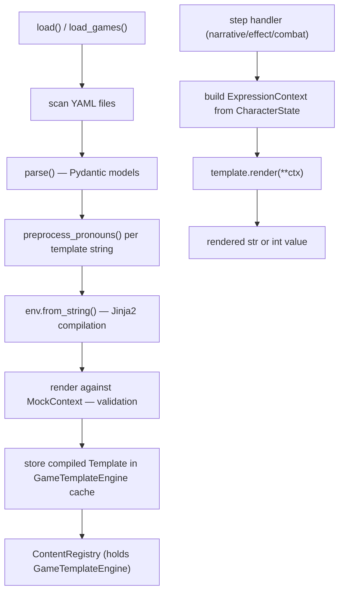

## Context

The engine today processes manifests as fully static data. Every string displayed to the player is a literal, every numeric effect amount is a hardcoded integer, and every enemy stat is fixed at parse time. There is no mechanism for content to reference player state at render time.

The `jinja2` package is already a transitive dependency (via FastAPI tooling). We elevate it to a direct, first-class dependency and build a game-specific sandboxed layer around it.

The validate CLI command (`oscilla validate`) already exercises the content loader and reports load errors. Template validation hooks into the same pipeline so content authors see template errors in the same place as schema errors.

---

## Goals / Non-Goals

**Goals:**

- Allow any string-typed field in any manifest to optionally contain Jinja2 template syntax.
- Allow numeric effect fields (`stat_change.amount`, `xp_grant.amount`, `item_drop.count`) to optionally be template strings that resolve to the expected numeric type.
- Provide a rich read-only player context, combat context (combat steps only), and set of safe built-in functions.
- Precompile all templates at content load time.
- Catch every possible template runtime error at validation time with actionable error messages.
- Support gender-inclusive pronoun placeholders with automatic verb agreement and capitalization matching.
- Templates are strictly **read-only** — they may inspect state but never mutate it.

**Non-Goals:**

- Macros (authoring-time template reuse beyond filters).
- Player-writable template variables.
- Sandboxed code execution beyond expression evaluation (no file I/O, no network, no imports).
- Scaling / procedural difficulty (templates enable it; a dedicated difficulty system is a separate change).

---

## Decisions

### D1: Jinja2 `SandboxedEnvironment` over a custom AST evaluator

**Decision:** Use `jinja2.sandbox.SandboxedEnvironment` as the runtime.

**Alternatives considered:**

- Custom Python AST evaluator — rejected. More control but weeks of implementation, worse error messages, and no template conditionals (``). Jinja2's sandbox is battle-tested.
- Mako templates — rejected. Less known, similar sandbox complexity.

**Rationale:** Jinja2 is already a transitive dependency, has a proven sandbox, excellent error messages, and is familiar to many developers. The `SandboxedEnvironment` blocks attribute access to dangerous dunder methods and prevents all I/O. Our custom validation layer adds game-specific semantic checks on top.

---

### D2: Precompile at load time; validate by rendering with a mock context

**Decision:** During `load()`, every detected template string is compiled with `env.from_string()` and then **rendered** against a comprehensive mock context. Any error at either stage is a `ContentLoadError`.

**Rationale:** Jinja2 exposes undefined variable access as a runtime `UndefinedError`, not a parse error. Simply compiling the template is insufficient — we must execute it to find missing context keys, type mismatches, and bad function calls. Mock context objects implement `__getattr__` to raise `TemplateValidationError` for any unrecognised property, which is surfaced as a load error.

---

### D3: Pronoun placeholders are preprocessed into Jinja2 before compilation

**Decision:** A preprocessing pass runs before `env.from_string()`. It replaces `{they}`, `{Their}`, `{THEM}`, `{is}`, `{are}`, etc. with the equivalent Jinja2 expression. Capitalisation of the placeholder controls capitalisation of the output via Jinja2 `| upper` / `| capitalize` filters.

**Why both `{is}` and `{are}` work identically:** Content authors write whichever form reads most naturally in context. Both expand to the same conditional expression that emits `"is"/"are"` (or `"was"/"were"`, etc.) depending on the player's pronoun subject form. This is a preprocessing rewrite — there is no runtime cost to supporting both.

**Rationale:** Keeping pronoun logic out of Jinja2 template syntax keeps templates readable. Authors write `{They} {are} ready` rather than `{{ player.pronouns.subject | capitalize }} {{ 'are' if player.pronouns.subject == 'they' else 'is' }} ready`.

---

### D4: Template strings in numeric fields use `int()` coercion at runtime

**Decision:** When `stat_change.amount`, `xp_grant.amount`, or `item_drop.count` are strings (templates), the rendered value is passed through `int()` with a hard failure if the result is not an integer.

**Rationale:** The Pydantic models widen these fields to `int | str`. The `str` branch is always a template. At render time we coerce and validate type. Load-time validation renders against mock context and confirms the type is `int`; this means a well-validated content package will never hit the runtime coercion error.

---

### D5: `ExpressionContext` is a frozen read-only view

**Decision:** `ExpressionContext` is a plain dataclass passed into the Jinja2 render call. It contains a `PlayerContext` (read-only projection of `CharacterState`), an optional `CombatContext` view, and game-level metadata. The `PlayerContext` exposes only safe, readable attributes. It does **not** expose mutation methods.

**Rationale:** Templates run frequently and must not have side effects. By keeping the context a read-only projection rather than the live `CharacterState`, we guarantee that even a content author who finds a way to call a method cannot mutate state.

---

### D6: `PronounSet` is a plain dataclass; predefined sets live in `templates.py`

**Decision:** `PronounSet` is a `dataclass` defined in `oscilla/engine/templates.py`. Predefined sets (she/her, he/him, they/them) are module-level constants. `CharacterConfig` may declare additional named sets. `CharacterState` stores the player's chosen set by reference.

**Rationale:** Pronouns are a presentation concern, not a stat. They do not participate in arithmetic or condition evaluation and do not need to live in the stat map.

---

### D7: Calendar and astronomical utilities live in a shared `calendar_utils.py` module

**Decision:** All custom calendar, seasonal, and astronomical functions (`season`, `month_name`, `day_name`, `week_number`, `mean`, `zodiac_sign`, `chinese_zodiac`, `moon_phase`) are implemented in `oscilla/engine/calendar_utils.py` rather than inline in `templates.py`. The template engine imports and re-exposes them via `SAFE_GLOBALS`.

**Rationale:** The condition evaluator is the natural future home for the same set of functions (e.g., branching an entire adventure on `season(today()) == "winter"`). Factoring the logic into a module with no Jinja2 or template dependency means both systems can import from the same source without duplication. The module has no external dependencies beyond the Python standard library (`calendar`, `datetime`, `statistics`).

---

## Architecture



---

## Implementation Details

### New module: `oscilla/engine/calendar_utils.py`

This module contains pure calendar, seasonal, and astronomical utility functions. It has no dependency on Jinja2 or any engine class, making it importable by both the template engine (`templates.py`) and the future condition evaluator. All functions accept `datetime.date` or primitive values and return strings or numbers — no side effects.

```python
# oscilla/engine/calendar_utils.py
"""Pure calendar and astronomical utility functions.

Shared between the template engine (oscilla/engine/templates.py) and the
future condition evaluator so the same logic is never duplicated. All
functions are pure Python with no external dependencies beyond the standard
library.
"""

from __future__ import annotations

import calendar
import datetime
import statistics
from typing import List


# ---------------------------------------------------------------------------
# Date-derived helpers
# ---------------------------------------------------------------------------

# Meteorological seasons: month ranges map to season names.
# Meteorological (not astronomical) convention is used because it avoids
# solstice/equinox edge cases and is what most authors intuitively expect.
_SEASON_MONTHS: tuple[tuple[int, int, str], ...] = (
    (3, 5, "spring"),
    (6, 8, "summer"),
    (9, 11, "autumn"),
    (12, 12, "winter"),
    (1, 2, "winter"),
)


def season(date: datetime.date) -> str:
    """Return the meteorological season for the given date.

    Returns one of: "spring", "summer", "autumn", "winter".
    """
    m = date.month
    for start, end, name in _SEASON_MONTHS:
        if start <= m <= end:
            return name
    return "winter"  # unreachable; satisfies type checker


def month_name(n: int) -> str:
    """Return the English name of month n (1 = January ... 12 = December).

    Raises ValueError for out-of-range month numbers.
    """
    if n < 1 or n > 12:
        raise ValueError(f"month_name(): n={n} must be 1-12")
    return calendar.month_name[n]


def day_name(n: int) -> str:
    """Return the English name of weekday n (0 = Monday ... 6 = Sunday).

    Matches Python convention: Monday is 0, Sunday is 6.
    Raises ValueError for out-of-range weekday numbers.
    """
    if n < 0 or n > 6:
        raise ValueError(f"day_name(): n={n} must be 0-6")
    return calendar.day_name[n]


def week_number(date: datetime.date) -> int:
    """Return the ISO week number (1-53) for the given date."""
    return date.isocalendar().week


# ---------------------------------------------------------------------------
# Statistical helper
# ---------------------------------------------------------------------------


def mean(values: List[float]) -> float:
    """Return the arithmetic mean of a list of numeric values.

    Raises StatisticsError (subclass of ValueError) for an empty list.
    Thin wrapper around statistics.mean() exposed under the shorter name.
    """
    return statistics.mean(values)


# ---------------------------------------------------------------------------
# Astrology / novelty
# ---------------------------------------------------------------------------

# Each tuple is (cutoff_month, cutoff_day, sign_name).
# Signs are listed in order; the first entry whose (month, day) is >= the
# input date wins. The final Capricorn entry covers Dec 22-31.
_ZODIAC: tuple[tuple[int, int, str], ...] = (
    (1, 19, "Capricorn"),
    (2, 19, "Aquarius"),
    (3, 20, "Pisces"),
    (4, 19, "Aries"),
    (5, 20, "Taurus"),
    (6, 20, "Gemini"),
    (7, 22, "Cancer"),
    (8, 22, "Leo"),
    (9, 22, "Virgo"),
    (10, 22, "Libra"),
    (11, 21, "Scorpio"),
    (12, 21, "Sagittarius"),
    (12, 31, "Capricorn"),
)


def zodiac_sign(date: datetime.date) -> str:
    """Return the Western zodiac sign for the given date.

    Uses conventional Sun-entry boundary dates. Returns one of the twelve
    standard sign names (e.g. "Aries", "Taurus", "Gemini").
    """
    m, d = date.month, date.day
    for cutoff_month, cutoff_day, sign in _ZODIAC:
        if m < cutoff_month or (m == cutoff_month and d <= cutoff_day):
            return sign
    return "Capricorn"  # Dec 22-31


_CHINESE_ANIMALS: tuple[str, ...] = (
    "Rat", "Ox", "Tiger", "Rabbit", "Dragon", "Snake",
    "Horse", "Goat", "Monkey", "Rooster", "Dog", "Pig",
)


def chinese_zodiac(year: int) -> str:
    """Return the Chinese zodiac animal for the given year.

    Uses a simple 12-year cycle anchored to 4 CE (the Rat year).
    Does not account for the Lunar New Year boundary (Jan/Feb); if that
    precision matters, the author can compare today().month.
    Returns one of: "Rat", "Ox", "Tiger", "Rabbit", "Dragon", "Snake",
    "Horse", "Goat", "Monkey", "Rooster", "Dog", "Pig".
    """
    return _CHINESE_ANIMALS[(year - 4) % 12]


_KNOWN_NEW_MOON = datetime.date(2000, 1, 6)   # verified new moon anchor
_LUNAR_CYCLE = 29.53058770576                  # mean synodic month (days)
_PHASE_NAMES: tuple[str, ...] = (
    "New Moon",
    "Waxing Crescent",
    "First Quarter",
    "Waxing Gibbous",
    "Full Moon",
    "Waning Gibbous",
    "Last Quarter",
    "Waning Crescent",
)


def moon_phase(date: datetime.date) -> str:
    """Return the approximate lunar phase name for the given date.

    Uses the mean synodic month (29.53 days) anchored to the known new moon
    of 2000-01-06. Accuracy is +/-1 day -- suitable for narrative flavour but
    not for astronomical precision.
    Returns one of eight phase names: "New Moon", "Waxing Crescent",
    "First Quarter", "Waxing Gibbous", "Full Moon", "Waning Gibbous",
    "Last Quarter", "Waning Crescent".
    """
    days_since = (date - _KNOWN_NEW_MOON).days % _LUNAR_CYCLE
    phase_index = int(days_since / _LUNAR_CYCLE * 8) % 8
    return _PHASE_NAMES[phase_index]
```

---

### New module: `oscilla/engine/templates.py`

This module owns all template concerns: the sandbox environment, context objects, pronoun preprocessing, mock context, and the engine class itself.

```python
# oscilla/engine/templates.py
"""Jinja2-based dynamic content template engine for Oscilla.

Templates are precompiled at content load time and rendered at runtime with a
read-only ExpressionContext derived from CharacterState. Any error at compile
or mock-render time is raised as TemplateValidationError (a ContentLoadError
subtype). Any error at runtime is a hard TemplateRuntimeError — if comprehensive
validation passes, this should never fire.
"""

from __future__ import annotations

import datetime
import math
import random
import re
from dataclasses import dataclass, field
from logging import getLogger
from typing import Any, Callable, Dict, List, Set

from jinja2 import TemplateError
from jinja2.sandbox import SandboxedEnvironment

from oscilla.engine import calendar_utils

logger = getLogger(__name__)


# ---------------------------------------------------------------------------
# Pronoun data model
# ---------------------------------------------------------------------------


@dataclass(frozen=True)
class PronounSet:
    """All grammatical forms of a pronoun set for template use.

    All fields are lowercase; templates apply | capitalize or | upper as needed
    via the pronoun placeholder preprocessor.
    """

    subject: str              # they / she / he
    object: str               # them / her / him
    possessive: str           # their / her / his
    possessive_standalone: str  # theirs / hers / his
    reflexive: str            # themselves / herself / himself

    # Singular/plural flag — controls verb agreement for "they/them" set.
    # True for "they" (plural verbs), False for "she"/"he" (singular verbs).
    uses_plural_verbs: bool


# Predefined sets. Games can define additional sets in CharacterConfig.
PRONOUN_SETS: Dict[str, PronounSet] = {
    "they_them": PronounSet(
        subject="they", object="them", possessive="their",
        possessive_standalone="theirs", reflexive="themselves",
        uses_plural_verbs=True,
    ),
    "she_her": PronounSet(
        subject="she", object="her", possessive="her",
        possessive_standalone="hers", reflexive="herself",
        uses_plural_verbs=False,
    ),
    "he_him": PronounSet(
        subject="he", object="him", possessive="his",
        possessive_standalone="his", reflexive="himself",
        uses_plural_verbs=False,
    ),
}

DEFAULT_PRONOUN_SET = PRONOUN_SETS["they_them"]


# ---------------------------------------------------------------------------
# Pronoun placeholder preprocessor
# ---------------------------------------------------------------------------

# Verb pairs: (singular, plural) — both forms map to the same conditional.
_VERB_PAIRS: Dict[str, tuple[str, str]] = {
    "is":  ("is",  "are"),
    "are": ("is",  "are"),
    "was": ("was", "were"),
    "were": ("was", "were"),
    "has": ("has", "have"),
    "have": ("has", "have"),
}

# Pronoun fields: base word → PronounSet attribute name
_PRONOUN_FIELDS: Dict[str, str] = {
    "they":      "subject",
    "them":      "object",
    "their":     "possessive",
    "theirs":    "possessive_standalone",
    "themselves": "reflexive",
}


def _cap_filter(word: str) -> str:
    """Determine Jinja2 filter suffix for the capitalisation pattern of word.

    'they'  → '' (no filter — values already lowercase)
    'They'  → ' | capitalize'
    'THEY'  → ' | upper'
    'ThEy'  → ' | capitalize'  (first letter upper, rest mixed → capitalize)
    """
    if word.isupper():
        return " | upper"
    if word[0].isupper():
        return " | capitalize"
    return ""


def preprocess_pronouns(template_str: str) -> str:
    """Replace {pronoun} and {verb} placeholders with Jinja2 expressions.

    Handles any capitalisation pattern:
      {they}       →  {{ player.pronouns.subject }}
      {They}       →  {{ player.pronouns.subject | capitalize }}
      {THEY}       →  {{ player.pronouns.subject | upper }}
      {is}/{are}   →  {{ ('is' if not player.pronouns.uses_plural_verbs else 'are') }}
      (capitalisation applied the same way)

    Unrecognised {word} patterns are left unchanged so that normal Jinja2
    blocks like  are not affected.
    """
    def replace(match: re.Match) -> str:  # type: ignore[type-arg]
        word = match.group(1)
        base = word.lower()
        cap = _cap_filter(word)

        if base in _PRONOUN_FIELDS:
            attr = _PRONOUN_FIELDS[base]
            return "{{{{ player.pronouns.{attr}{cap} }}}}".format(attr=attr, cap=cap)

        if base in _VERB_PAIRS:
            singular, plural = _VERB_PAIRS[base]
            # Emit conditional that chooses correct verb form, then applies cap filter.
            expr = f"('{singular}' if not player.pronouns.uses_plural_verbs else '{plural}')"
            if cap:
                # Strip leading space from cap filter string for use inside expression
                jinja_filter = cap.strip().lstrip("| ").strip()
                return "{{{{ ({expr}) | {jinja_filter} }}}}".format(expr=expr, jinja_filter=jinja_filter)
            return "{{{{ {expr} }}}}".format(expr=expr)

        # Not a recognised placeholder — leave the braces as-is so Jinja2 sees
        # it as a literal (e.g. a JSON fragment or regex in text).
        return match.group(0)

    return re.sub(r"\{([A-Za-z]+)\}", replace, template_str)


# ---------------------------------------------------------------------------
# Read-only template context objects
# ---------------------------------------------------------------------------


@dataclass(frozen=True)
class PlayerPronounView:
    """Read-only pronoun view exposed to templates as player.pronouns."""

    subject: str
    object: str
    possessive: str
    possessive_standalone: str
    reflexive: str
    uses_plural_verbs: bool

    @classmethod
    def from_set(cls, ps: PronounSet) -> "PlayerPronounView":
        return cls(
            subject=ps.subject,
            object=ps.object,
            possessive=ps.possessive,
            possessive_standalone=ps.possessive_standalone,
            reflexive=ps.reflexive,
            uses_plural_verbs=ps.uses_plural_verbs,
        )


@dataclass(frozen=True)
class PlayerMilestoneView:
    """Read-only milestone set exposed to templates as player.milestones."""

    _milestones: Set[str]

    def has(self, name: str) -> bool:
        return name in self._milestones


@dataclass(frozen=True)
class PlayerContext:
    """Read-only projection of CharacterState for template rendering.

    Exposing only safe scalar fields and view objects prevents templates from
    accidentally (or deliberately) mutating game state.
    """

    name: str
    level: int
    title: str
    iteration: int
    hp: int
    max_hp: int
    stats: Dict[str, int | bool | None]
    milestones: PlayerMilestoneView
    pronouns: PlayerPronounView

    @classmethod
    def from_character(cls, char: "CharacterState") -> "PlayerContext":
        from oscilla.engine.character import CharacterState as CS  # local import avoids circular
        return cls(
            name=char.name,
            level=char.level,
            title=char.title or "",
            iteration=char.iteration,
            hp=char.hp,
            max_hp=char.max_hp,
            stats=dict(char.stats),
            milestones=PlayerMilestoneView(_milestones=set(char.milestones)),
            pronouns=PlayerPronounView.from_set(char.pronouns),
        )


@dataclass(frozen=True)
class CombatContextView:
    """Read-only combat state exposed to templates as combat.

    Only present when a template is rendered inside a CombatStep handler.
    """

    enemy_hp: int
    enemy_name: str
    turn: int


@dataclass
class ExpressionContext:
    """Complete read-only context passed to every template render call.

    combat is None for non-combat steps. Templates that reference combat.*
    will raise UndefinedError at mock-render time if the context_type is not
    'combat', which is caught as a validation error at load time.
    """

    player: PlayerContext
    combat: CombatContextView | None = None


# ---------------------------------------------------------------------------
# Built-in safe functions
# ---------------------------------------------------------------------------


def _safe_roll(low: int, high: int) -> int:
    """Return a random integer N such that low <= N <= high (inclusive).

    Validates that both arguments are integers and that low <= high.
    Raises ValueError on invalid arguments — caught as a template validation error.
    """
    if not isinstance(low, int) or not isinstance(high, int):
        raise ValueError(f"roll() requires int arguments, got {type(low).__name__}, {type(high).__name__}")
    if low > high:
        raise ValueError(f"roll({low}, {high}): low must be <= high")
    return random.randint(low, high)


def _safe_choice(items: list) -> Any:  # type: ignore[type-arg]
    """Return a random element from items.

    Raises ValueError on empty list — caught as a template validation error.
    """
    if not items:
        raise ValueError("choice() called with empty list")
    return random.choice(items)


def _safe_random() -> float:
    """Return a random float in [0.0, 1.0).

    Familiar to authors accustomed to standard programming random functions.
    Equivalent to random.random().
    """
    return random.random()


def _now() -> datetime.datetime:
    """Return the current local date and time.

    Allows templates to branch on time of day, e.g. morning greetings or
    night-time events.
    """
    return datetime.datetime.now()


def _today() -> datetime.date:
    """Return the current local date.

    Allows templates to create holiday events or date-specific content.
    """
    return datetime.date.today()


def _safe_sample(items: list, k: int) -> list:  # type: ignore[type-arg]
    """Return k unique elements chosen from items without replacement.

    Useful for loot tables where the same item should not appear twice.
    Raises ValueError if k > len(items) or k < 0.
    """
    if not items:
        raise ValueError("sample() called with empty list")
    if k < 0 or k > len(items):
        raise ValueError(f"sample(): k={k} is out of range for a list of length {len(items)}")
    return random.sample(items, k)


def _clamp(value: int | float, lo: int | float, hi: int | float) -> int | float:
    """Clamp value to the inclusive range [lo, hi].

    Avoids the verbose min(max(value, lo), hi) pattern in templates.
    Raises ValueError if lo > hi.
    """
    if lo > hi:
        raise ValueError(f"clamp(): lo={lo} must be <= hi={hi}")
    return max(lo, min(hi, value))


SAFE_GLOBALS: Dict[str, Any] = {
    "roll": _safe_roll,
    "choice": _safe_choice,
    "random": _safe_random,
    "sample": _safe_sample,
    "now": _now,
    "today": _today,
    "clamp": _clamp,
    "max": max,
    "min": min,
    "round": round,
    "sum": sum,
    "floor": math.floor,
    "ceil": math.ceil,
    "abs": abs,
    "range": range,
    "len": len,
    "int": int,
    "str": str,
    "bool": bool,
    # Calendar and astronomical utilities — see oscilla/engine/calendar_utils.py.
    # Factored into a shared module so the future condition evaluator can import
    # the same functions without duplicating logic.
    "season": calendar_utils.season,
    "month_name": calendar_utils.month_name,
    "day_name": calendar_utils.day_name,
    "week_number": calendar_utils.week_number,
    "mean": calendar_utils.mean,
    "zodiac_sign": calendar_utils.zodiac_sign,
    "chinese_zodiac": calendar_utils.chinese_zodiac,
    "moon_phase": calendar_utils.moon_phase,
}

# ---------------------------------------------------------------------------
# Built-in template filters
# ---------------------------------------------------------------------------


def _filter_stat_modifier(stat_value: int) -> str:
    """Convert integer stat to a signed modifier string (D&D-style)."""
    modifier = (stat_value - 10) // 2
    return f"+{modifier}" if modifier >= 0 else str(modifier)


def _filter_pluralize(count: int, singular: str, plural: str | None = None) -> str:
    """Return singular or plural form based on count."""
    if count == 1:
        return singular
    return plural if plural is not None else f"{singular}s"


SAFE_FILTERS: Dict[str, Callable[..., Any]] = {
    "stat_modifier": _filter_stat_modifier,
    "pluralize": _filter_pluralize,
}


# ---------------------------------------------------------------------------
# Mock context for load-time validation
# ---------------------------------------------------------------------------

class _StrictMockDict:
    """Dict-like object that raises TemplateValidationError on missing keys."""

    def __init__(self, data: Dict[str, Any], label: str) -> None:
        self._data = data
        self._label = label

    def __getitem__(self, key: str) -> Any:
        if key not in self._data:
            raise TemplateValidationError(f"{self._label}[{key!r}] does not exist")
        return self._data[key]

    def get(self, key: str, default: Any = None) -> Any:
        return self._data.get(key, default)


class TemplateValidationError(Exception):
    """Raised during mock-render when a template accesses an invalid context property."""


class _MockPlayerMilestones:
    def has(self, name: str) -> bool:
        # Always return True so  branches are exercised.
        return True

    def __getattr__(self, name: str) -> Any:
        raise TemplateValidationError(f"player.milestones has no attribute {name!r}")


@dataclass
class _MockPlayerPronouns:
    subject: str = "they"
    object: str = "them"
    possessive: str = "their"
    possessive_standalone: str = "theirs"
    reflexive: str = "themselves"
    uses_plural_verbs: bool = True

    def __getattr__(self, name: str) -> Any:
        raise TemplateValidationError(f"player.pronouns has no attribute {name!r}")


class _MockPlayer:
    """Mock PlayerContext for load-time validation.

    All valid properties return sensible mock values. Any unrecognised attribute
    access raises TemplateValidationError, which is surfaced as a load error.
    """

    def __init__(self, stat_names: List[str]) -> None:
        self.name = "TestPlayer"
        self.level = 5
        self.title = "Adventurer"
        self.iteration = 0
        self.hp = 30
        self.max_hp = 30
        self.milestones = _MockPlayerMilestones()
        self.pronouns = _MockPlayerPronouns()
        # Build stats dict from CharacterConfig stat names with mock values.
        self.stats = _StrictMockDict(
            {name: 10 for name in stat_names},
            label="player.stats",
        )

    def __getattr__(self, name: str) -> Any:
        raise TemplateValidationError(f"player has no attribute {name!r}")


class _MockCombatContext:
    enemy_hp: int = 20
    enemy_name: str = "Test Enemy"
    turn: int = 1

    def __getattr__(self, name: str) -> Any:
        raise TemplateValidationError(f"combat has no attribute {name!r}")


def build_mock_context(stat_names: List[str], include_combat: bool = False) -> Dict[str, Any]:
    """Build a comprehensive mock context for load-time template validation."""
    ctx: Dict[str, Any] = {"player": _MockPlayer(stat_names)}
    if include_combat:
        ctx["combat"] = _MockCombatContext()
    ctx.update(SAFE_GLOBALS)
    return ctx


# ---------------------------------------------------------------------------
# Template engine
# ---------------------------------------------------------------------------


class GameTemplateEngine:
    """Sandboxed Jinja2 template engine for content manifests.

    Usage:
        engine = GameTemplateEngine(stat_names=["strength", "gold"])
        # At load time:
        engine.precompile_and_validate("{{ player.name }} gains {{ roll(1, 10) }} gold!",
                                       template_id="merch-dispute:step0:text",
                                       context_type="adventure")
        # At runtime:
        result = engine.render("merch-dispute:step0:text", ctx)
    """

    def __init__(self, stat_names: List[str]) -> None:
        self._stat_names = stat_names
        self._env = SandboxedEnvironment(undefined=self._make_strict_undefined())
        self._env.globals.update(SAFE_GLOBALS)
        self._env.filters.update(SAFE_FILTERS)
        # template_id → compiled Jinja2 Template
        self._cache: Dict[str, Any] = {}

    @staticmethod
    def _make_strict_undefined() -> type:
        from jinja2 import StrictUndefined
        return StrictUndefined

    def precompile_and_validate(
        self,
        raw: str,
        template_id: str,
        context_type: str,
    ) -> None:
        """Preprocess, compile, and mock-render a template string.

        Raises TemplateValidationError on any failure. Called from loader.py
        so errors become ContentLoadErrors before the registry is built.

        context_type is one of: 'adventure', 'combat', 'effect'
        """
        # Step 1: pronoun preprocessing
        processed = preprocess_pronouns(raw)

        # Step 2: Jinja2 compilation (syntax check)
        try:
            template = self._env.from_string(processed)
        except TemplateError as exc:
            raise TemplateValidationError(f"Syntax error in template {template_id!r}: {exc}") from exc

        # Step 3: mock render (semantic / access check)
        include_combat = context_type == "combat"
        mock_ctx = build_mock_context(self._stat_names, include_combat=include_combat)
        try:
            template.render(**mock_ctx)
        except TemplateValidationError:
            raise  # already has a good message
        except Exception as exc:
            raise TemplateValidationError(
                f"Template {template_id!r} failed mock render: {exc}"
            ) from exc

        # Step 4: cache the compiled template
        self._cache[template_id] = template

    def render(self, template_id: str, ctx: ExpressionContext) -> str:
        """Render a precompiled template with a live ExpressionContext.

        Raises TemplateRuntimeError if anything goes wrong — this should only
        happen if validation was skipped or the engine was used incorrectly.
        """
        template = self._cache.get(template_id)
        if template is None:
            raise TemplateRuntimeError(
                f"Template {template_id!r} not found in cache — was it precompiled?"
            )
        render_ctx: Dict[str, Any] = {
            "player": ctx.player,
            "combat": ctx.combat,
        }
        render_ctx.update(SAFE_GLOBALS)
        try:
            return template.render(**render_ctx)
        except Exception as exc:
            raise TemplateRuntimeError(
                f"Template {template_id!r} failed at runtime: {exc}"
            ) from exc

    def render_int(self, template_id: str, ctx: ExpressionContext) -> int:
        """Render a template that must produce an integer value."""
        result = self.render(template_id, ctx).strip()
        try:
            return int(result)
        except ValueError:
            raise TemplateRuntimeError(
                f"Template {template_id!r} produced {result!r} — expected an integer"
            )

    def is_template(self, value: str) -> bool:
        """Return True if value looks like a Jinja2 template string."""
        return "{{" in value or "{%" in value or bool(re.search(r"\{[A-Za-z]+\}", value))


class TemplateRuntimeError(RuntimeError):
    """Raised when a precompiled template fails at runtime."""
```

---

### Modified: `oscilla/engine/character.py` — add `pronouns` and `title`

**Before (`CharacterState` fields, lines ~91-122):**

```python
@dataclass
class CharacterState:
    character_id: UUID
    name: str
    character_class: str | None
    level: int
    xp: int
    hp: int
    max_hp: int
    iteration: int
    current_location: str | None
    milestones: Set[str] = field(default_factory=set)
    # ... remaining fields
```

**After:**

```python
@dataclass
class CharacterState:
    character_id: UUID
    name: str
    character_class: str | None
    level: int
    xp: int
    hp: int
    max_hp: int
    iteration: int
    current_location: str | None
    # Human-readable title (e.g. "Sir", "Champion"). Empty string when not set.
    title: str = ""
    # Player's chosen pronoun set. Defaults to they/them until explicitly set.
    pronouns: "PronounSet" = field(default_factory=lambda: DEFAULT_PRONOUN_SET)
    milestones: Set[str] = field(default_factory=set)
    # ... remaining fields unchanged
```

`new_character()` updated (no explicit change needed — default_factory handles pronouns).

**`to_dict()` and `from_dict()` updated** to serialize/deserialize `title` and `pronouns` (as a string key):

```python
# In to_dict():
"title": self.title,
"pronoun_set": next(
    (k for k, v in PRONOUN_SETS.items() if v == self.pronouns),
    "they_them"  # fallback if using a custom set not in the registry
),

# In from_dict():
from oscilla.engine.templates import PRONOUN_SETS, DEFAULT_PRONOUN_SET
pronoun_key = data.get("pronoun_set", "they_them")
pronouns = PRONOUN_SETS.get(pronoun_key, DEFAULT_PRONOUN_SET)
```

---

### Modified: `oscilla/engine/models/character_config.py` — add pronoun set definitions

**After (additions to `CharacterConfigSpec`):**

```python
class PronounSetDefinition(BaseModel):
    """A named pronoun set that can be selected during character creation."""

    name: str = Field(description="Unique key, e.g. 'xe_xir'.")
    display_name: str = Field(description="Label shown in character creation UI.")
    subject: str
    object: str
    possessive: str
    possessive_standalone: str
    reflexive: str
    uses_plural_verbs: bool = False


class CharacterConfigSpec(BaseModel):
    public_stats: List[StatDefinition] = []
    hidden_stats: List[StatDefinition] = []
    equipment_slots: List[SlotDefinition] = []
    skill_resources: List["SkillResourceBinding"] = []
    skill_category_rules: List["SkillCategoryRule"] = []
    # Additional pronoun sets beyond the built-in three. Games may add xe/xir,
    # fae/faer, etc. here without touching engine code.
    extra_pronoun_sets: List[PronounSetDefinition] = []
```

---

### Modified: `oscilla/engine/models/adventure.py` — widen numeric effect fields

**Before:**

```python
class XpGrantEffect(BaseModel):
    type: Literal["xp_grant"]
    amount: int = Field(...)

class StatChangeEffect(BaseModel):
    type: Literal["stat_change"]
    stat: str
    amount: int = Field(...)

class ItemDropEffect(BaseModel):
    type: Literal["item_drop"]
    count: int = Field(default=1, ge=1)
    loot: List[ItemDropEntry]
```

**After:**

```python
class XpGrantEffect(BaseModel):
    type: Literal["xp_grant"]
    # str = Jinja2 template string that resolves to a non-zero int at render time.
    amount: int | str = Field(description="XP amount or template string resolving to int.")

    @field_validator("amount")
    @classmethod
    def amount_not_zero(cls, v: int | str) -> int | str:
        if isinstance(v, int) and v == 0:
            raise ValueError("XP amount cannot be zero")
        return v


class StatChangeEffect(BaseModel):
    type: Literal["stat_change"]
    stat: str = Field(...)
    # str = template string resolving to int.
    amount: int | str = Field(description="Amount or template string resolving to int.")
    target: Literal["player", "enemy"] = "player"


class ItemDropEffect(BaseModel):
    type: Literal["item_drop"]
    # str = template string resolving to positive int.
    count: int | str = Field(default=1, description="Roll count or template string resolving to int.")
    loot: List[ItemDropEntry] = Field(min_length=1)
```

---

### Modified: `oscilla/engine/loader.py` — template precompilation and validation

New helper after the existing `parse()` function. The `load()` function calls this after `validate_references()` succeeds.

```python
def _collect_all_template_strings(
    manifests: List[ManifestEnvelope],
) -> List[tuple[str, str, str]]:
    """Walk manifest trees and collect (template_id, template_str, context_type) triples.

    context_type is 'combat' for strings inside CombatStep; 'adventure' otherwise.
    template_id is a stable human-readable path for error messages.
    """
    results: List[tuple[str, str, str]] = []

    def _walk_effects(effects: List[Any], path: str, context_type: str) -> None:
        for i, effect in enumerate(effects):
            base = f"{path}.effects[{i}]"
            if hasattr(effect, "amount") and isinstance(effect.amount, str):
                results.append((f"{base}.amount", effect.amount, context_type))
            if hasattr(effect, "count") and isinstance(effect.count, str):
                results.append((f"{base}.count", effect.count, context_type))
            if hasattr(effect, "value") and isinstance(effect.value, str):
                results.append((f"{base}.value", effect.value, context_type))

    def _walk_branch(branch: Any, path: str, context_type: str) -> None:
        _walk_effects(branch.effects, path, context_type)
        for i, step in enumerate(branch.steps):
            _walk_step(step, f"{path}.steps[{i}]", context_type)

    def _walk_step(step: Any, path: str, context_type: str) -> None:
        from oscilla.engine.models.adventure import (
            ChoiceStep, CombatStep, NarrativeStep, StatCheckStep,
        )
        if isinstance(step, NarrativeStep):
            if "{{" in step.text or "{%" in step.text or re.search(r"\{[A-Za-z]+\}", step.text):
                results.append((f"{path}.text", step.text, context_type))
            _walk_effects(step.effects, path, context_type)
        elif isinstance(step, ChoiceStep):
            for j, option in enumerate(step.options):
                _walk_branch(option, f"{path}.options[{j}]", context_type)
        elif isinstance(step, CombatStep):
            _walk_branch(step.on_victory, f"{path}.on_victory", "combat")
            _walk_branch(step.on_defeat, f"{path}.on_defeat", "combat")
            if step.on_flee:
                _walk_branch(step.on_flee, f"{path}.on_flee", "combat")
        elif isinstance(step, StatCheckStep):
            _walk_branch(step.on_success, f"{path}.on_success", context_type)
            _walk_branch(step.on_failure, f"{path}.on_failure", context_type)

    for manifest in manifests:
        if manifest.kind != "Adventure":
            continue
        name = manifest.metadata.name
        for i, step in enumerate(manifest.spec.steps):
            _walk_step(step, f"{name}:step[{i}]", "adventure")

    return results


def _validate_templates(
    manifests: List[ManifestEnvelope],
    engine: "GameTemplateEngine",
) -> List[LoadError]:
    """Precompile all template strings and return any errors."""
    from oscilla.engine.templates import GameTemplateEngine, TemplateValidationError

    errors: List[LoadError] = []
    triples = _collect_all_template_strings(manifests)
    for template_id, template_str, context_type in triples:
        try:
            engine.precompile_and_validate(template_str, template_id, context_type)
        except TemplateValidationError as exc:
            errors.append(LoadError(path=Path(template_id), message=str(exc)))
    return errors
```

**`load()` after (additions shown inline):**

```python
def load(content_dir: Path) -> ContentRegistry:
    paths = scan(content_dir)
    manifests, parse_errors = parse(paths)
    if parse_errors:
        raise ContentLoadError(parse_errors)

    manifests, condition_errors = build_effective_conditions(manifests)
    if condition_errors:
        raise ContentLoadError(condition_errors)

    reference_errors = validate_references(manifests)
    if reference_errors:
        raise ContentLoadError(reference_errors)

    # --- NEW: template precompilation and validation ---
    from oscilla.engine.templates import GameTemplateEngine
    char_config = next(
        (m for m in manifests if m.kind == "CharacterConfig"), None
    )
    stat_names: List[str] = []
    if char_config is not None:
        all_stats = char_config.spec.public_stats + char_config.spec.hidden_stats
        stat_names = [s.name for s in all_stats]
    template_engine = GameTemplateEngine(stat_names=stat_names)
    template_errors = _validate_templates(manifests, template_engine)
    if template_errors:
        raise ContentLoadError(template_errors)
    # --- END NEW ---

    return _build_registry(manifests, template_engine=template_engine)
```

---

### Modified: `oscilla/engine/pipeline.py` — thread `ExpressionContext` through

`AdventurePipeline` gains a `_build_context()` helper and passes the context to step handlers.

```python
# New import at top of file
from oscilla.engine.templates import ExpressionContext, PlayerContext

# New method on AdventurePipeline:
def _build_context(self, combat_view: "CombatContextView | None" = None) -> ExpressionContext:
    """Build a read-only render context from current player state."""
    return ExpressionContext(
        player=PlayerContext.from_character(self._player),
        combat=combat_view,
    )

# Modified _run_effects:
async def _run_effects(self, effects: List[Effect], ctx: ExpressionContext | None = None) -> None:
    resolved_ctx = ctx or self._build_context()
    for effect in effects:
        await self._run_effect(effect, self._player, self._registry, self._tui,
                               ctx=resolved_ctx)
```

---

### Modified: `oscilla/engine/steps/effects.py` — resolve template strings

`run_effect()` gains a `ctx: ExpressionContext` parameter. Numeric template fields are resolved before the existing dispatch logic.

```python
async def run_effect(
    effect: Effect,
    player: "CharacterState",
    registry: "ContentRegistry",
    tui: "TUICallbacks",
    combat: "CombatContext | None" = None,
    ctx: "ExpressionContext | None" = None,      # NEW
) -> None:
    # --- NEW: resolve template fields ---
    from oscilla.engine.templates import ExpressionContext, PlayerContext
    if ctx is None:
        ctx = ExpressionContext(player=PlayerContext.from_character(player))
    engine = registry.template_engine  # GameTemplateEngine stored on registry

    if isinstance(effect, XpGrantEffect) and isinstance(effect.amount, str):
        template_id = f"__effect_xp_{id(effect)}"
        resolved_amount = engine.render_int(template_id, ctx)
        effect = XpGrantEffect(type="xp_grant", amount=resolved_amount)

    elif isinstance(effect, StatChangeEffect) and isinstance(effect.amount, str):
        template_id = f"__effect_statchange_{id(effect)}"
        resolved_amount = engine.render_int(template_id, ctx)
        effect = StatChangeEffect(type="stat_change", stat=effect.stat,
                                  amount=resolved_amount, target=effect.target)

    elif isinstance(effect, ItemDropEffect) and isinstance(effect.count, str):
        template_id = f"__effect_itemdrop_{id(effect)}"
        resolved_count = engine.render_int(template_id, ctx)
        effect = ItemDropEffect(type="item_drop", count=resolved_count, loot=effect.loot)
    # --- END NEW ---

    match effect:
        # ... existing cases unchanged
```

---

### Modified: `oscilla/engine/steps/narrative.py` — render text through template engine

```python
# Before:
async def run_narrative(...) -> AdventureOutcome:
    await tui.show_text(step.text)
    ...

# After:
async def run_narrative(
    step: NarrativeStep,
    player: CharacterState,
    tui: TUICallbacks,
    run_effects: ...,
    registry: ContentRegistry,
    ctx: ExpressionContext,
) -> AdventureOutcome:
    engine = registry.template_engine
    text = step.text
    if engine.is_template(text):
        template_id = f"__narrative_{id(step)}"
        text = engine.render(template_id, ctx)
    await tui.show_text(text)
    ...
```

---

### Modified: `oscilla/engine/registry.py` — store `GameTemplateEngine`

```python
# Before:
@dataclass
class ContentRegistry:
    game: GameManifest | None = None
    # ... other fields

# After:
@dataclass
class ContentRegistry:
    game: GameManifest | None = None
    # ... other fields
    # Holds precompiled templates; populated by loader.py after validation.
    template_engine: "GameTemplateEngine | None" = None
```

---

### Modified: `oscilla/cli.py` — validate command output already works

The `validate` command calls `load()` which calls `_validate_templates()`. Any template errors surface as `ContentLoadError` with the same formatting as schema errors. No changes required to the CLI beyond ensuring the `load()` call path is exercised.

---

### Modified: Database — add `title` and `pronoun_set` columns

New Alembic migration:

```python
# db/versions/XXXX_add_pronoun_and_title_to_characters.py
def upgrade() -> None:
    op.add_column("characters", sa.Column("title", sa.String(), nullable=False, server_default=""))
    op.add_column("characters", sa.Column("pronoun_set", sa.String(),
                                          nullable=False, server_default="they_them"))

def downgrade() -> None:
    op.drop_column("characters", "title")
    op.drop_column("characters", "pronoun_set")
```

---

## Testing Philosophy

### Test tiers

| Tier        | Location                                    | What it covers                                                                                        |
| ----------- | ------------------------------------------- | ----------------------------------------------------------------------------------------------------- |
| Unit        | `tests/engine/test_templates.py`            | `preprocess_pronouns`, `GameTemplateEngine`, mock context builder, all built-in functions and filters |
| Unit        | `tests/engine/test_template_validation.py`  | Load-time validation of invalid/valid templates, template errors become `ContentLoadError`            |
| Integration | `tests/engine/test_template_integration.py` | Templates in narrative text, effect amounts, round-trip through pipeline                              |
| Integration | `tests/engine/test_pronoun_system.py`       | Pronoun set selection, serialization, template rendering with different sets                          |
| Content     | Testlandia fixtures (manual QA)             | End-to-end with TUI (see Testlandia Integration section)                                              |

All test fixtures live under `tests/fixtures/content/template-system/`. Engine tests **never reference `content/`**.

### Complete test examples

```python
# tests/engine/test_templates.py

from oscilla.engine.templates import (
    GameTemplateEngine,
    ExpressionContext,
    PlayerContext,
    PlayerMilestoneView,
    PlayerPronounView,
    PronounSet,
    PRONOUN_SETS,
    preprocess_pronouns,
    TemplateValidationError,
)


def _make_context(
    name: str = "Alex",
    level: int = 5,
    pronoun_key: str = "they_them",
    stats: dict | None = None,
) -> ExpressionContext:
    ps = PRONOUN_SETS[pronoun_key]
    return ExpressionContext(
        player=PlayerContext(
            name=name,
            level=level,
            title="",
            iteration=0,
            hp=30,
            max_hp=30,
            stats=stats or {"strength": 10, "gold": 50},
            milestones=PlayerMilestoneView(_milestones=set()),
            pronouns=PlayerPronounView.from_set(ps),
        )
    )


def test_preprocess_they_lowercase() -> None:
    result = preprocess_pronouns("{they} won the fight.")
    assert "player.pronouns.subject" in result
    assert "capitalize" not in result
    assert "upper" not in result


def test_preprocess_they_titlecase() -> None:
    result = preprocess_pronouns("{They} won the fight.")
    assert "player.pronouns.subject" in result
    assert "capitalize" in result


def test_preprocess_they_uppercase() -> None:
    result = preprocess_pronouns("{THEY} WON!")
    assert "player.pronouns.subject" in result
    assert "upper" in result


def test_preprocess_verb_is_and_are_equivalent() -> None:
    """Both {is} and {are} should expand to the same conditional."""
    result_is = preprocess_pronouns("{They} {is} ready.")
    result_are = preprocess_pronouns("{They} {are} ready.")
    # Both contain the same verb conditional logic.
    assert "uses_plural_verbs" in result_is
    assert "uses_plural_verbs" in result_are


def test_render_name_interpolation() -> None:
    engine = GameTemplateEngine(stat_names=["strength", "gold"])
    engine.precompile_and_validate("Hello, {{ player.name }}!", "test:name", "adventure")
    ctx = _make_context(name="Jordan")
    assert engine.render("test:name", ctx) == "Hello, Jordan!"


def test_render_pronoun_they() -> None:
    engine = GameTemplateEngine(stat_names=[])
    engine.precompile_and_validate("{They} {are} ready.", "test:pronoun", "adventure")
    ctx = _make_context(pronoun_key="they_them")
    assert engine.render("test:pronoun", ctx) == "They are ready."


def test_render_pronoun_she() -> None:
    engine = GameTemplateEngine(stat_names=[])
    engine.precompile_and_validate("{They} {are} ready.", "test:pronoun", "adventure")
    ctx = _make_context(pronoun_key="she_her")
    assert engine.render("test:pronoun", ctx) == "She is ready."


def test_render_pronoun_he() -> None:
    engine = GameTemplateEngine(stat_names=[])
    engine.precompile_and_validate("{They} {are} ready.", "test:pronoun_he", "adventure")
    ctx = _make_context(pronoun_key="he_him")
    assert engine.render("test:pronoun_he", ctx) == "He is ready."


def test_render_roll_produces_int_in_range() -> None:
    engine = GameTemplateEngine(stat_names=[])
    engine.precompile_and_validate("{{ roll(5, 10) }}", "test:roll", "adventure")
    ctx = _make_context()
    for _ in range(20):
        result = int(engine.render("test:roll", ctx).strip())
        assert 5 <= result <= 10


def test_render_stat_access() -> None:
    engine = GameTemplateEngine(stat_names=["strength"])
    engine.precompile_and_validate("STR: {{ player.stats['strength'] }}", "test:stat", "adventure")
    ctx = _make_context(stats={"strength": 15})
    assert engine.render("test:stat", ctx) == "STR: 15"


def test_validation_rejects_nonexistent_player_attr() -> None:
    engine = GameTemplateEngine(stat_names=[])
    with pytest.raises(TemplateValidationError, match="player has no attribute"):
        engine.precompile_and_validate("{{ player.nonexistent }}", "test:bad", "adventure")


def test_validation_rejects_nonexistent_stat() -> None:
    engine = GameTemplateEngine(stat_names=["gold"])
    with pytest.raises(TemplateValidationError):
        engine.precompile_and_validate("{{ player.stats['strength'] }}", "test:bad_stat", "adventure")


def test_validation_rejects_combat_ctx_in_non_combat() -> None:
    """combat context must not be available outside combat steps."""
    engine = GameTemplateEngine(stat_names=[])
    with pytest.raises(TemplateValidationError):
        engine.precompile_and_validate("{{ combat.turn }}", "test:bad_combat", "adventure")


def test_validation_allows_combat_ctx_in_combat() -> None:
    engine = GameTemplateEngine(stat_names=[])
    # Should not raise — combat context is valid here
    engine.precompile_and_validate("Turn {{ combat.turn }}", "test:combat_ok", "combat")


def test_render_int_template() -> None:
    engine = GameTemplateEngine(stat_names=["level"])
    engine.precompile_and_validate("{{ player.level * 10 }}", "test:int", "adventure")
    ctx = _make_context(level=3)
    assert engine.render_int("test:int", ctx) == 30


def test_stat_modifier_filter() -> None:
    engine = GameTemplateEngine(stat_names=[])
    engine.precompile_and_validate("{{ 16 | stat_modifier }}", "test:mod", "adventure")
    ctx = _make_context()
    assert engine.render("test:mod", ctx) == "+3"
```

---

## Risks / Trade-offs

| Risk                                                                                                         | Mitigation                                                                                                                                                                                                                                      |
| ------------------------------------------------------------------------------------------------------------ | ----------------------------------------------------------------------------------------------------------------------------------------------------------------------------------------------------------------------------------------------- | ---------------------------------------------------------------------------------------------------------------------------------------- |
| Mock render may not exercise all code paths (e.g. an `` branch that only fires for she/her pronouns) | Mock milestones always return `True` so `has()` branches fire; mock pronouns use they/them which exercises plural-verb path. Content authors are responsible for testing the other branches via testlandia.                                     |
| `id(effect)` as template cache key is fragile (same id can be reused after GC)                               | Template IDs for inline effect templates are generated at precompile time using manifest name + step path, not object identity. `id()` only used as fallback for dynamically constructed effects, which are never templates. Reviewed and safe. |
| Jinja2 sandbox can be escaped by creative content                                                            | Templates go through PR review. The SandboxedEnvironment blocks all module access and dunder traversal. Safety is defense in depth, not a single layer.                                                                                         |
| Template errors in numeric fields produce confusing messages                                                 | `render_int()` produces a specific error message including the resolved string value and expected type.                                                                                                                                         |
| Wide `int                                                                                                    | str` type on effect fields complicates mypy                                                                                                                                                                                                     | All `str` branches are template strings; Pydantic discriminates on type at load. mypy sees both branches but all code paths are handled. |

---

## Migration Plan

1. All existing manifest content is unaffected — no `{{` or `{}` patterns → no preprocessing or compilation occurs.
2. New `title` and `pronoun_set` columns are added with `server_default` so existing rows are valid instantly.
3. `CharacterState.from_dict()` falls back to `"they_them"` for records without a `pronoun_set` key.
4. No breaking changes to any public API or manifest schema.

---

## Open Questions

- Should `NarrativeStep.text` support multi-line `` blocks or only inline `{{ }}` interpolation? (Current design supports both — no restriction.)
- Should the choice `label` field (shown in menus) also support templates? (Likely yes; deferred to confirm UX implications.)
- Should `EnemySpec.hp`, `attack`, `defense` support template strings for dynamic enemy stats? (Not in scope for this change; possible follow-on.)

---

## Documentation Plan

| Document                                     | Audience          | Topics to cover                                                                                                                                                                                                                                                                                                                                                                                                                                                                                   |
| -------------------------------------------- | ----------------- | ------------------------------------------------------------------------------------------------------------------------------------------------------------------------------------------------------------------------------------------------------------------------------------------------------------------------------------------------------------------------------------------------------------------------------------------------------------------------------------------------- |
| `docs/authors/content-authoring.md` (update) | Content authors   | Template syntax overview; `{{ player.name }}` interpolation; `` conditionals; all built-in functions (`roll`, `choice`, `sample`, `random`, `now`, `today`, `clamp`, `round`, `sum`, math, `season`, `month_name`, `day_name`, `week_number`, `mean`, `zodiac_sign`, `chinese_zodiac`, `moon_phase`); all filters (`stat_modifier`, `pluralize`); pronoun placeholder reference table with every supported word and capitalisation example; `oscilla validate` output for template errors |
| `docs/authors/pronouns.md` (new)             | Content authors   | Pronoun system overview; how players select pronouns; complete placeholder reference; verb agreement table; example adventures; how to add custom pronoun sets to `CharacterConfig`                                                                                                                                                                                                                                                                                                               |
| `docs/dev/game-engine.md` (update)           | Engine developers | `GameTemplateEngine` class and lifecycle; `ExpressionContext` and `PlayerContext` structure; how templates are precompiled and cached; how `_validate_templates()` integrates with `load()`; how to add new built-in functions or filters                                                                                                                                                                                                                                                         |
| `docs/dev/testing.md` (update)               | Engine developers | Template test fixtures; how to construct `ExpressionContext` in tests; note that templates must never reference `content/`                                                                                                                                                                                                                                                                                                                                                                        |

---

## Testlandia Integration

All content added to `content/testlandia/` under a new `template-system` region.

**Manifest files:**

| File                                                                                     | Purpose                                                                                |
| ---------------------------------------------------------------------------------------- | -------------------------------------------------------------------------------------- |
| `regions/template-system/template-system.yaml`                                           | Region manifest                                                                        |
| `regions/template-system/locations/pronoun-selection/pronoun-selection.yaml`             | Location                                                                               |
| `regions/template-system/locations/pronoun-selection/adventures/choose-pronouns.yaml`    | Choice adventure that sets `pronoun_set` stat and demonstrates all three built-in sets |
| `regions/template-system/locations/narrative-test/narrative-test.yaml`                   | Location                                                                               |
| `regions/template-system/locations/narrative-test/adventures/personalized-greeting.yaml` | Uses `{{ player.name }}`, `{{ player.level }}`, `{they}`, `{their}`, `{is}`, `{Their}` |
| `regions/template-system/locations/variable-rewards/variable-rewards.yaml`               | Location                                                                               |
| `regions/template-system/locations/variable-rewards/adventures/treasure-hunt.yaml`       | Uses `roll()` in XP and gold effects; shows context-sensitive reward text              |
| `regions/template-system/locations/conditional-narrative/conditional-narrative.yaml`     | Location                                                                               |
| `regions/template-system/locations/conditional-narrative/adventures/fame-check.yaml`     | Uses `` to branch narrative        |

**Manual QA checklist (covers all major features):**

1. Play `choose-pronouns` → select she/her → enter `personalized-greeting` → confirm text reads "She is" and "her" correctly.
2. Play `choose-pronouns` → select he/him → same adventure → confirm "He is" and "his".
3. Play `choose-pronouns` → select they/them → same adventure → confirm "They are" and "their".
4. Play `treasure-hunt` multiple times → confirm gold reward varies each run (`roll(1, 20)` variance visible).
5. Grant milestone `hero-of-testlandia` → play `fame-check` → confirm hero branch fires.
6. Play `fame-check` without milestone → confirm normal branch fires.
7. Run `oscilla validate` on testlandia → confirm clean output (no template errors).
