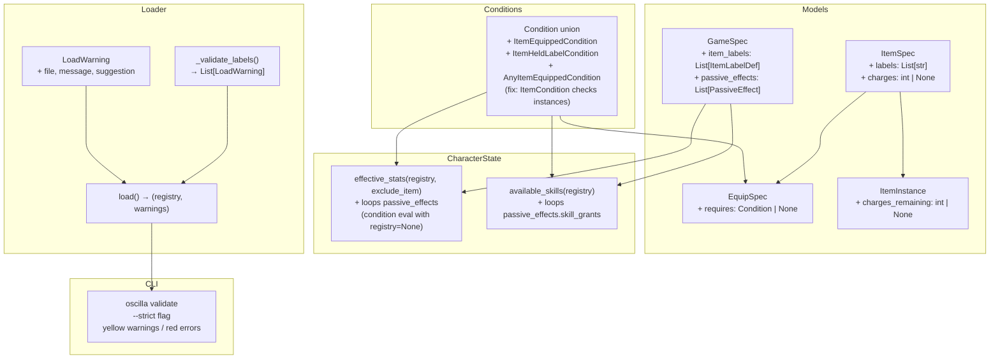

## Context

The item system today supports equippable items with flat stat modifiers and consumables with use effects. Four adjacent roadmap features — item labels, item requirements, item charges, and conditional passive effects — have each been deferred because they seemed independent. On inspection they share almost all their implementation surface:

- Each needs new condition predicates (`item_equipped`, `item_held_label`, `any_item_equipped`).
- Each adds fields to `ItemSpec`, `EquipSpec`, `ItemInstance`, or `GameSpec`.
- Each produces cross-reference validation that the loader must check.

Implementing all four together avoids touching `models/base.py`, `conditions.py`, and `loader.py` multiple times. The total change is smaller than the sum of four separate changes.

A fifth concern — load warnings — is prerequisite infrastructure. The label validation design calls for a warning (undeclared label is a likely typo but the game still runs), and no warning tier currently exists. `LoadWarning` is added in this same change rather than as a separate prerequisite because it is small (~20 lines) and used only by label validation in v1.

---

## Goals / Non-Goals

**Goals:**

- Add `item_equipped`, `item_held_label`, and `any_item_equipped` condition predicates, usable everywhere conditions appear.
- Fix a latent bug: `ItemCondition` (type: `item`) currently ignores non-stackable instances.
- Add `labels: List[str]` to `ItemSpec` and author-defined `item_labels` to `GameSpec`.
- Add `requires: Condition | None` to `EquipSpec`; enforce in TUI equip action using the full condition system. Any condition type is valid in `requires`. `CharacterStatCondition` within a `requires` tree evaluates against either base stats (`stat_source: base`) or effective stats (`stat_source: effective`, the default); effective stat evaluation automatically excludes the item being tested to prevent circular self-justification.
- Add `charges: int | None` to `ItemSpec` and `charges_remaining: int | None` to `ItemInstance`; decrement in `UseItemEffect`.
- Add `passive_effects` to `GameSpec`: condition-gated stat modifiers and skill grants evaluated continuously in `effective_stats()` and `available_skills()`.
- Add a `LoadWarning` tier to the loader: non-fatal, structured, with an optional `suggestion` field for fix hints shown in `oscilla validate` output.
- Expose warnings in `oscilla validate` (yellow output); add `--strict` flag to promote warnings to errors.
- Render item labels in `InventoryScreen`: show colored label badges next to item names using `ItemLabelDef.color`; sort items within a category tab by `sort_priority` (ascending) then alphabetically by `displayName`.
- Update `design-philosophy.md` to document the validation warning tier.
- Update `docs/authors/content-authoring.md` with all four new authoring features.

**Non-Goals:**

- Per-item passive effects (item presence as implicit condition) — game-level `passive_effects` in `game.yaml` covers all use cases via `item_held_label`/`item_equipped` conditions.
- Charges on stackable items — charge tracking is per-instance state; stackable items cannot have per-instance data.
- `consumed_on_use` + `charges` on the same item — mutually exclusive consumption systems; a load error.

---

## Decisions

### D1: Three new condition predicates in the shared `Condition` union

**Decision:** Add `ItemEquippedCondition` (type `item_equipped`, field `name: str`), `ItemHeldLabelCondition` (type `item_held_label`, field `label: str`), and `AnyItemEquippedCondition` (type `any_item_equipped`, field `label: str`) to the `Condition` discriminated union in `models/base.py`.

**Alternatives considered:**

- A single generic `item_query` condition with sub-fields — rejected. The discriminated union design already used by every other predicate provides better YAML normalisation, cleaner `match` dispatch in `evaluate()`, and unambiguous error messages.
- A separate `equipped_item_condition` top-level system — rejected. The design philosophy is explicit: new predicates belong in the condition evaluator so they work everywhere conditions appear, at no authoring cost.

**Rationale:** Following the existing pattern costs nothing and gives all three predicates full access to `not`, `all`, `any` composition for free. Negations like "not carrying any cursed items" are expressed as:

```yaml
not:
  item_held_label: cursed
```

No bespoke "does not have" syntax is needed. Full real-world examples using all three predicates:

```yaml
# True if the named non-stackable item is currently equipped
condition:
  item_equipped: rangers-cloak

# True if the player holds any item tagged legendary (stack or instance)
condition:
  item_held_label: legendary

# True if any equipped item is tagged cursed
condition:
  any_item_equipped: cursed

# Compound: player has a legendary item equipped AND is not carrying a cursed one
condition:
  all:
    - any_item_equipped: legendary
    - not:
        item_held_label: cursed
```

---

### D2: YAML normaliser for the new predicates

**Decision:** The three new types follow the existing `_LEAF_MAPPINGS` pattern where a bare key maps to a `{type, name/label}` dict.

| YAML (bare)                     | Normalised form                                |
| ------------------------------- | ---------------------------------------------- |
| `item_equipped: rangers-cloak`  | `{type: item_equipped, name: rangers-cloak}`   |
| `item_held_label: cursed`       | `{type: item_held_label, label: cursed}`       |
| `any_item_equipped: ranger-bow` | `{type: any_item_equipped, label: ranger-bow}` |

**Rationale:** Consistent with all other single-value leaf conditions. Authors see a minimal, readable syntax.

Full-syntax equivalents (for schema linters or explicit authoring):

```yaml
# Shorthand (preferred)
condition:
  item_equipped: rangers-cloak

# Explicit form
condition:
  type: item_equipped
  name: rangers-cloak
```

Both parse identically; the normalizer converts the shorthand into the explicit form before Pydantic validation.

---

### D3: `item_equipped` checks both stacks and instances

**Decision:** `ItemEquippedCondition` evaluates true if the named item occupies any equipment slot. Equippable items are non-stackable by the existing validator, so only `instances` need to be checked. The `equipment` dict maps slot → `instance_id`; the evaluator checks whether any `ItemInstance` with the named `item_ref` has its `instance_id` in `player.equipment.values()`.

This also motivates the **`ItemCondition` bug fix** in the same sweep: the existing `item` condition only checks `player.stacks` and silently misses non-stackable instances. The fix makes it check both:

**Before:**

```python
case ItemCondition(name=n):
    return player.stacks.get(n, 0) > 0
```

**After:**

```python
case ItemCondition(name=n):
    in_stacks = player.stacks.get(n, 0) > 0
    in_instances = any(inst.item_ref == n for inst in player.instances)
    return in_stacks or in_instances
```

---

### D3a: `CharacterStatCondition` gains a `stat_source` field; `evaluate()` gains an `exclude_item` context parameter

**Decision:** `CharacterStatCondition` grows a `stat_source: Literal["base", "effective"] = "effective"` field. The `evaluate()` function grows an `exclude_item: str | None = None` parameter. `CharacterState.effective_stats()` grows a matching `exclude_item: str | None = None` parameter.

| `stat_source`           | What is compared                                                                                                                          |
| ----------------------- | ----------------------------------------------------------------------------------------------------------------------------------------- |
| `"effective"` (default) | `player.effective_stats(registry, exclude_item=exclude_item)` — full gear and passive bonuses, minus any contribution from the named item |
| `"base"`                | `player.stats` — raw character stats only, regardless of equipped items or passive effects                                                |

**Why expose `stat_source` as an author field:**

Two common authoring patterns conflict if only one mode is available:

- "Must have Strength 10 from gear or training" → `stat_source: effective` (default). Gear synergies apply; a Ring of Strength counts.
- "Must have 8 BASE Constitution (character creation floor)" → `stat_source: base`. Gear augmentation cannot bypass this requirement.

Making the choice explicit in YAML lets game authors express both kinds of gates cleanly.

**`exclude_item` context parameter:**

When the engine evaluates `requires` for item X, it passes `exclude_item=item_ref` into `evaluate()`. This flows through to every `CharacterStatCondition` node in the tree that is using `stat_source: effective`: `player.effective_stats()` is called with `exclude_item=item_ref`, which skips that item's `stat_modifiers` contribution. Result: item X cannot use its own bonuses to satisfy its own `requires` condition.

This is the **self-justification guard**. Without it, an item that grants `+5 strength` and requires `strength >= 15` would appear satisfiable by a player with base strength 12 if the item is already equipped — but would fail for a player who hasn't yet equipped it, creating an inconsistent equip/unequip experience.

**`effective_stats(exclude_item=...)` implementation:**

When `exclude_item` is set, the equipment bonus loop skips any `ItemInstance` whose `item_ref` matches `exclude_item`:

```python
def effective_stats(
    self,
    registry: "ContentRegistry | None" = None,
    exclude_item: str | None = None,
) -> Dict[str, int | float | bool]:
    result = dict(self.stats)

    if registry is None:
        return result

    for instance in self.instances:
        item = registry.items.get(instance.item_ref)
        # Skip the excluded item's stat contributions.
        if item is None or instance.item_ref == exclude_item:
            continue
        equipped_slots = set(self.equipment.values())
        if item.spec.equip and instance.instance_id in equipped_slots:
            for mod in item.spec.equip.stat_modifiers:
                ...
```

**YAML authoring example** — two requirements on the same item using different stat sources:

```yaml
# items/enchanted-armor.yaml
name: enchanted-armor
kind: item
spec:
  displayName: Enchanted Armor
  category: armor
  stackable: false
  equip:
    slots:
      - body
    requires:
      all:
        # Hard floor: must have at least 8 base Constitution (gear cannot bypass this)
        - character_stat:
            name: constitution
            gte: 8
            stat_source: base
        # Soft floor: effective Strength >= 12 (a Ring of Strength counts)
        - character_stat:
            name: strength
            gte: 12
            # stat_source: effective  ← default; comment is optional
    stat_modifiers:
      - stat: defense
        amount: 6
```

**Alternatives considered:**

- Infer `stat_source` from context (base in passive, effective in requires) — rejected. Implicit behaviour makes it hard for authors to understand why a condition behaves differently in different contexts. Explicit is better.
- Always use effective stats with no exclusion — rejected. Circular self-justification produces confusing and inconsistent results for gear with both bonuses and requirements.
- A separate `BaseStat` condition type — rejected. Adding a second stat condition type for what is a single parameter change fragments the condition vocabulary and makes composition harder.

---

### D4: `requires` lifecycle — equip check, cascade unequip, and session-load preservation

**YAML authoring example** for an item with an equip requirement:

```yaml
# items/vorpal-blade.yaml
name: vorpal-blade
kind: item
spec:
  displayName: Vorpal Blade
  category: weapon
  stackable: false
  labels:
    - legendary
  equip:
    slots:
      - main_hand
    requires:
      character_stat:
        name: strength
        gte: 15
    stat_modifiers:
      - stat: attack
        amount: 8
```

A compound requirement (strength AND a milestone):

```yaml
requires:
  all:
    - character_stat:
        name: strength
        gte: 15
    - milestone: trained-in-blades
```

A ring that enables the sword via a stat bonus:

```yaml
# items/ring-of-strength.yaml
name: ring-of-strength
kind: item
spec:
  displayName: Ring of Strength
  category: accessory
  stackable: false
  equip:
    slots:
      - ring
    stat_modifiers:
      - stat: strength
        amount: 5
```

**Decision overview:** `requires` is enforced at three distinct moments, each with a different policy.

#### At equip time

`EquipSpec.requires` is evaluated by calling `evaluate(condition, player, registry=registry, exclude_item=item_ref)`. Passing `exclude_item=item_ref` ensures that any `CharacterStatCondition` using `stat_source: effective` (the default) calls `player.effective_stats(registry, exclude_item=item_ref)`, which applies bonuses from already-equipped items and active passive effects but strips out the item under consideration from its own stat computation. This prevents circular self-justification: an item that provides `+5 strength` cannot use its own bonus to satisfy a `strength >= 15` requirement.

Because the item being equipped is not yet in the equipment set, `item_equipped` and label-based predicates for that item are already naturally false so no additional guards are needed for those predicate types. The `exclude_item` guard matters only for stat modifier contributions.

**Rationale:** A player who has a Ring of Strength equipped should be able to satisfy a sword's strength requirement. The check mirrors what the player sees on screen. Authors who want a hard "raw stats only" floor use `stat_source: base` on the relevant `character_stat` node — see D3a.

#### During active play — cascade unequip

Whenever an event could cause an equipped item's `requires` to become false, the engine SHALL re-validate all currently equipped items' `requires` conditions and auto-unequip any that now fail. Two triggers:

1. **Unequip action**: After successfully unequipping item B, re-validate all remaining equipped items by calling `evaluate(c.equip.requires, player, registry=registry, exclude_item=c.name)` for each equipped item C. Any item C whose condition now evaluates false is automatically unequipped. Passing `exclude_item=c.name` during re-validation ensures C's own stat bonuses cannot mask a legitimate requirement failure. The TUI shows a notification listing each cascade-unequipped item and the condition that was no longer satisfied.
2. **Stat-changing engine step**: After any engine effect that modifies `player.stats` (e.g., `stat_set`, `stat_modify`), re-evaluate all equipped items using the same `evaluate(..., exclude_item=c.name)` pattern. Same cascade-and-notify behavior.

The cascade is one level deep: after cascade-unequipping C, the engine re-validates again (in case C was providing stat bonuses to D). This repeats until no more items fail — a fixed-point loop. Circular mutual dependencies (A requires B's bonus and B requires A's bonus) cannot arise because items must be equipped one at a time.

**Why auto-unequip rather than blocking:** Blocking the unequip of item B because item C depends on its stat bonus would be deeply unintuitive — players expect they can always remove any item. Auto-cascade with a clear notification is the established convention in gear-driven games and keeps game state consistent at all times.

#### At session load — preserve and warn

When player state is restored from persistence, the engine cannot safely take game actions (such as forcing an unequip). Equipped items whose `requires` conditions are no longer satisfied SHALL remain equipped. A `WARNING` is logged per invalid item. The TUI status panel SHALL surface each inconsistency with a visible indicator, prompting the player to manually resolve it at their leisure. No state mutation occurs.

---

### D5: `LoadWarning` as a separate dataclass with a `suggestion` field

**Decision:** `LoadWarning` is a new `@dataclass` in `loader.py` alongside `LoadError`. It has `file: Path`, `message: str`, and `suggestion: str = ""`. The `load()` function signature changes from `→ ContentRegistry` to `→ Tuple[ContentRegistry, List[LoadWarning]]`. `load_games()` similarly returns `Tuple[Dict[str, ContentRegistry], Dict[str, List[LoadWarning]]]`.

**Before:**

```python
def load(content_dir: Path) -> ContentRegistry:
    ...
    return registry
```

**After:**

```python
def load(content_dir: Path) -> Tuple[ContentRegistry, List[LoadWarning]]:
    ...
    return registry, warnings
```

**Alternatives considered:**

- Add a `severity` field to `LoadError` — rejected. `LoadError` is already raised inside `ContentLoadError`; widening it to carry warnings would force all callers to distinguish severity after catching an exception. A separate class keeps the fail-fast error path unchanged.
- Return warnings via a mutable list passed in as a parameter — rejected. Stateful accumulation objects make call sites harder to read.

**`--strict` flag in `oscilla validate`:** When `--strict` is passed, any `LoadWarning` collected from `load()` is treated as an error: `validate` exits with code 1 and prints warnings in red alongside errors. Without `--strict`, warnings are printed in yellow and exit code is still 0.

**`suggestion` field:** The `suggestion` string is a human-readable fix hint shown directly in `oscilla validate` output. The `LoadWarning.__str__()` method appends the suggestion after an em dash when non-empty, so every warning in the terminal includes the fix hint automatically. Example:

```python
LoadWarning(
    file=Path("items/vorpal-blade.yaml"),
    message="label 'legendery' is not declared in item_labels",
    suggestion="Did you mean 'legendary'? Add it to item_labels in game.yaml or fix the spelling on the item.",
)
```

Terminal output:

```
⚠ my-game: 1 warning(s):
  • items/vorpal-blade.yaml: label 'legendery' is not declared in item_labels — Did you mean 'legendary'? Add it to item_labels in game.yaml or fix the spelling on the item.
```

### D6: Undeclared labels produce a `LoadWarning`, not a `LoadError`

**YAML authoring examples:**

```yaml
# game.yaml — declares the vocabulary
item_labels:
  - name: legendary
    color: gold
    sort_priority: 1
  - name: cursed
    color: red
    sort_priority: 2

# items/vorpal-blade.yaml — correct: label declared above
spec:
  labels:
    - legendary

# items/broken-wand.yaml — triggers LoadWarning: 'legendery' is not in item_labels
spec:
  labels:
    - legendery   # typo

# items/weird-rock.yaml — triggers LoadWarning: 'ancient' is not in item_labels
spec:
  labels:
    - ancient     # forgot to declare in game.yaml
```

`oscilla validate` output for the above:

```
⚠ my-game: 2 warning(s):
  • items/broken-wand.yaml: label 'legendery' is not declared in item_labels — Did you mean 'legendary'? ...
  • items/weird-rock.yaml: label 'ancient' is not declared in item_labels — Add it to item_labels in game.yaml ...
```

**Rationale:** Labels that lack display metadata are functionally harmless — they can still be referenced in conditions (`item_held_label`) and templates. The warning catches likely typos while following the "opt-in complexity" design principle: packages that don't declare `item_labels` at all have zero boilerplate requirement.

**What is still an error:** An `item_held_label` or `any_item_equipped` condition referencing a label that no item in the package actually carries — this is always a content logic error (a gating condition that can never be true). This is a `LoadWarning` too, with a clear message. Blocking it as an error would be too strict since future items might carry the label.

---

### D7: Passive effects live in `GameSpec` only (v1)

**Decision:** `passive_effects: List[PassiveEffect]` is added to `GameSpec`. A `PassiveEffect` has `name: str`, `condition: Condition`, `stat_modifiers: List[StatModifier]`, and `skill_grants: List[str]`. There is no per-item `passive_effects` field in v1.

**Alternatives considered:**

- Per-item passive effects where item presence in inventory is the implicit outer condition — appealing but adds a second location for passive effect declarations. Authors can replicate the behaviour with `item_held_label` or `item_equipped` conditions in game-level passives.
- A separate `PassiveEffect` manifest kind — rejected. Game-level passive effects are global settings that belong in `game.yaml` alongside `item_labels`, not as individual YAML files.

**Evaluation in `effective_stats()`:** The method already receives an optional `registry`. When `passive_effects` are present in the game manifest, each one whose `condition` evaluates true (using `registry=None` to avoid recursion — see D8) contributes its `stat_modifiers` to the accumulated result.

**Evaluation in `available_skills()`:** The same loop adds `skill_grants` from true-condition passive effects to the result set.

**YAML authoring example for `game.yaml`:**

```yaml
item_labels:
  - name: legendary
    color: gold
    sort_priority: 1
  - name: cursed
    color: red
    sort_priority: 2

passive_effects:
  # Holding any legendary item: bonus to charisma
  - name: legendary-presence
    condition:
      item_held_label: legendary
    stat_modifiers:
      - stat: charisma
        amount: 3

  # Wearing a cursed item: unlock the "curse-breaker" skill
  - name: curse-bearer
    condition:
      any_item_equipped: cursed
    skill_grants:
      - curse-breaker

  # High-level characters: passive stat bonus regardless of items
  - name: veteran-toughness
    condition:
      level:
        gte: 10
    stat_modifiers:
      - stat: max_hp
        amount: 25
```

---

### D8: Passive effect conditions evaluated without registry (base stats only)

**Decision:** Inside `effective_stats()` and `available_skills()`, passive effect conditions are evaluated by calling `evaluate(condition, player, registry=None)`.

**Rationale:** Preventing infinite recursion. If passive effect conditions were evaluated using `effective_stats()` (registry provided), the evaluation of `effective_stats()` would call `evaluate()` which would call `effective_stats()` again. Evaluating against base stats only is a clean, predictable rule: passive effects activate based on milestones, base stats, equipped item identity, labels, and held items — all of which are resolvable without `effective_stats()`.

**`stat_source` in passive conditions:** Because passive evaluation passes `registry=None`, any `CharacterStatCondition` inside a passive effect condition will always use `player.stats` (base stats), regardless of the `stat_source` field. A condition with `stat_source: effective` in a passive context silently degrades to base-stats behavior. The loader SHALL emit a `LoadWarning` when it detects a `character_stat` condition with `stat_source: effective` inside a `passive_effects` entry, because the author's intent cannot be honored.

**Exception:** `item_equipped`, `item_held_label`, and `any_item_equipped` conditions are resolvable directly from `player.equipment`, `player.instances`, and `player.stacks` without needing `effective_stats()`, so they work correctly even with `registry=None` passed to `evaluate()`. The `registry` parameter in `evaluate()` is only needed for `CharacterStatCondition` to call `effective_stats()` — a path we deliberately skip here.

**YAML example illustrating what works and what does not in passive conditions:**

```yaml
passive_effects:
  # ✓ Works: item predicates resolve from player state, no effective_stats() needed
  - name: ring-power
    condition:
      item_equipped: ring-of-strength
    stat_modifiers:
      - stat: strength
        amount: 5

  # ✓ Works: milestone is a direct player state lookup
  - name: veteran-bonus
    condition:
      milestone: veteran
    stat_modifiers:
      - stat: max_hp
        amount: 20

  # ✓ Works: base stat threshold (uses player.stats, not effective_stats)
  #   Note: stat_source defaults to "effective" but passive evaluation passes
  #   registry=None, so base stats are always used here regardless.
  #   Write stat_source: base explicitly for clarity.
  - name: strong-and-mighty
    condition:
      character_stat:
        name: strength
        gte: 18
        stat_source: base # explicit; "effective" would silently degrade to the same
    stat_modifiers:
      - stat: attack
        amount: 4

  # ⚠ Warning at load time: stat_source: effective inside a passive condition
  #   cannot be honored because passive conditions are evaluated with registry=None.
  #   The condition will silently use base stats instead. Use stat_source: base.
  - name: also-broken
    condition:
      character_stat:
        name: power
        gte: 20
        stat_source: effective # emits LoadWarning; will behave as stat_source: base

  # ⚠ Warning at load time: item_held_label inside a passive condition
  #   will always return False because it needs registry to look up labels,
  #   but passive conditions are evaluated with registry=None.
  # Use item_equipped instead, or file a feature request.
  - name: broken-effect
    condition:
      item_held_label: legendary # emits LoadWarning; will never activate
    stat_modifiers:
      - stat: luck
        amount: 10
```

---

### D9: Charges exclusively for non-stackable, non-`consumed_on_use` items

**YAML authoring examples:**

```yaml
# items/magic-wand.yaml — charged item: 5 uses, not consumed on last use (charges handles removal)
name: magic-wand
kind: item
spec:
  displayName: Magic Wand
  category: consumable
  stackable: false        # required: charges are per-instance state
  consumed_on_use: false  # required: charges handles removal; consumed_on_use would conflict
  charges: 5
  use_effects:
    - type: stat_modify
      stat: mana
      amount: -10

# items/health-potion.yaml — non-charged consumable: removed on use (unchanged behavior)
name: health-potion
kind: item
spec:
  displayName: Health Potion
  category: consumable
  stackable: true
  consumed_on_use: true   # item removed after single use
  use_effects:
    - type: stat_modify
      stat: hp
      amount: 30

# INVALID — load error: cannot set both charges and consumed_on_use: true
spec:
  stackable: false
  consumed_on_use: true   # ✗ conflicts with charges
  charges: 3
```

### D10: TUI label rendering uses Rich markup with per-label color; sort is by `sort_priority` then name

**Decision:** In `InventoryScreen.compose()`, after resolving an item's display name, the label badges are appended to the Rich markup string using the `color` field from matching `ItemLabelDef` entries in `registry.game.spec.item_labels`. If an item carries a label that has no color (or is not in `item_labels` at all), the badge is rendered in a neutral dim style. Items within each category tab are sorted by the minimum `sort_priority` among all their labels (or `float("inf")` when unlabeled), then alphabetically by `displayName` as a tiebreaker.

**Rationale:** Labels without colors would otherwise be invisible at rendering time, silently penalizing authors who forget to set `color`. A dim fallback makes the label visible for debugging while the `oscilla validate` warning explains the missing metadata. Sorting by `sort_priority` gives authors direct control over which items appear at the top of each tab — useful for featured or legendary gear.

**Badge format:** Each label is rendered inline as `[color] label_name [/color]` (Rich markup). Typical result for a legendary sword with label metadata from `game.yaml`:

```yaml
# game.yaml
item_labels:
  - name: legendary
    color: gold
    sort_priority: 1
  - name: cursed
    color: red
    sort_priority: 2
```

Inventory row rendered for an item with `labels: [legendary, cursed]`:

```
[bold]Vorpal Blade[/bold] [gold]legendary[/gold] [red]cursed[/red]
```

Inventory row for an item with `labels: [ancient]` where `ancient` is not in `item_labels` (dim fallback):

```
[bold]Ancient Tome[/bold] [dim]ancient[/dim]
```

The item-name label widget already uses `WIDTH: 1fr` so the badges flow inline without layout changes.

**Registry access in `InventoryScreen`:** The `_registry` parameter is already present on the screen; no new constructor changes are required.

**Decision:** `ItemSpec.charges: int | None = None`. A `model_validator` on `ItemSpec` raises a `ValueError` if both `charges` is set and `consumed_on_use: true`, and another if both `charges` is set and `stackable: true`. `ItemInstance.charges_remaining: int | None = None`, populated from `item.spec.charges` at item grant time.

**Charge decrement in `UseItemEffect`:** After applying `use_effects`, if the instance has `charges_remaining` set, decrement by 1. If `charges_remaining` reaches 0, remove the instance from inventory. The `consumed_on_use` path is bypassed entirely when `charges` is set.

**Before (relevant portion of `UseItemEffect` handler):**

```python
# Consume the item if configured
if item.spec.consumed_on_use:
    if item.spec.stackable:
        player.remove_item(ref=item_ref, quantity=1)
    else:
        instance = next((inst for inst in player.instances if inst.item_ref == item_ref), None)
        if instance is not None:
            player.remove_instance(instance_id=instance.instance_id)
```

**After:**

```python
# Charge-based items: decrement and remove on exhaustion.
# consumed_on_use + charges is a load-time error, so only one path executes.
if instance is not None and instance.charges_remaining is not None:
    instance.charges_remaining -= 1
    if instance.charges_remaining <= 0:
        player.remove_instance(instance_id=instance.instance_id)
elif item.spec.consumed_on_use:
    if item.spec.stackable:
        player.remove_item(ref=item_ref, quantity=1)
    else:
        if instance is not None:
            player.remove_instance(instance_id=instance.instance_id)
```

**Serialization:** `charges_remaining` is an `int | None` persisted in `ItemInstance.to_dict()` / `from_dict()`. Existing instances without `charges_remaining` deserialize correctly because `None` is the default.

---

## Architecture



---

## Implementation Details

### New models: `ItemEquippedCondition`, `ItemHeldLabelCondition`, `AnyItemEquippedCondition`

**Before** (end of condition models in `models/base.py`):

```python
class PronounsCondition(BaseModel):
    type: Literal["pronouns"]
    set: str

Condition = Annotated[
    Union[
        AllCondition,
        AnyCondition,
        NotCondition,
        LevelCondition,
        MilestoneCondition,
        ItemCondition,
        CharacterStatCondition,
        PrestigeCountCondition,
        ClassCondition,
        EnemiesDefeatedCondition,
        LocationsVisitedCondition,
        AdventuresCompletedCondition,
        SkillCondition,
        PronounsCondition,
    ],
    Field(discriminator="type"),
]
```

**After:**

```python
class PronounsCondition(BaseModel):
    type: Literal["pronouns"]
    set: str


class ItemEquippedCondition(BaseModel):
    type: Literal["item_equipped"]
    name: str  # item manifest name; true if item is in any equipment slot


class ItemHeldLabelCondition(BaseModel):
    type: Literal["item_held_label"]
    label: str  # true if any item in stacks or instances carries this label


class AnyItemEquippedCondition(BaseModel):
    type: Literal["any_item_equipped"]
    label: str  # true if any currently equipped item carries this label


Condition = Annotated[
    Union[
        AllCondition,
        AnyCondition,
        NotCondition,
        LevelCondition,
        MilestoneCondition,
        ItemCondition,
        CharacterStatCondition,
        PrestigeCountCondition,
        ClassCondition,
        EnemiesDefeatedCondition,
        LocationsVisitedCondition,
        AdventuresCompletedCondition,
        SkillCondition,
        PronounsCondition,
        ItemEquippedCondition,
        ItemHeldLabelCondition,
        AnyItemEquippedCondition,
    ],
    Field(discriminator="type"),
]
```

**YAML normaliser additions** in `_LEAF_MAPPINGS`:

```python
_LEAF_MAPPINGS: dict[str, tuple[str, str]] = {
    # ... existing entries ...
    "item_equipped": ("item_equipped", "name"),
    "item_held_label": ("item_held_label", "label"),
    "any_item_equipped": ("any_item_equipped", "label"),
}
```

### Updated `CharacterStatCondition` in `models/base.py`

**Before:**

```python
class CharacterStatCondition(BaseModel):
    type: Literal["character_stat"]
    name: str
    gt: int | float | None = None
    gte: int | float | None = None
    lt: int | float | None = None
    lte: int | float | None = None
    eq: int | float | None = None
    mod: ModComparison | None = None

    @model_validator(mode="after")
    def require_comparator(self) -> "CharacterStatCondition":
        if all(v is None for v in [self.gt, self.gte, self.lt, self.lte, self.eq, self.mod]):
            raise ValueError("character_stat condition must specify at least one of: gt, gte, lt, lte, eq, mod")
        return self
```

**After:**

```python
class CharacterStatCondition(BaseModel):
    type: Literal["character_stat"]
    name: str
    gt: int | float | None = None
    gte: int | float | None = None
    lt: int | float | None = None
    lte: int | float | None = None
    eq: int | float | None = None
    mod: ModComparison | None = None
    # "effective" (default): uses player.effective_stats(), respecting gear and passive bonuses.
    # "base": uses player.stats directly — gear cannot satisfy this requirement.
    stat_source: Literal["base", "effective"] = "effective"

    @model_validator(mode="after")
    def require_comparator(self) -> "CharacterStatCondition":
        if all(v is None for v in [self.gt, self.gte, self.lt, self.lte, self.eq, self.mod]):
            raise ValueError("character_stat condition must specify at least one of: gt, gte, lt, lte, eq, mod")
        return self
```

### Updated `evaluate()` signature and `CharacterStatCondition` case in `conditions.py`

**Before (`evaluate` signature):**

```python
def evaluate(
    condition: Condition | None,
    player: "CharacterState",
    registry: "ContentRegistry | None" = None,
) -> bool:
```

**After:**

```python
def evaluate(
    condition: Condition | None,
    player: "CharacterState",
    registry: "ContentRegistry | None" = None,
    exclude_item: str | None = None,
) -> bool:
    """Evaluate a condition tree against the given player state.

    Pass registry to enable equipment-aware stat evaluation via effective_stats().
    Pass exclude_item to strip a specific item's stat contributions from effective_stats()
    calculations — used when validating an item's own requires condition (self-justification guard).
    """
```

All recursive calls inside `evaluate()` must forward `exclude_item`:

```python
case AllCondition(conditions=children):
    return all(evaluate(c, player, registry, exclude_item) for c in children)
case AnyCondition(conditions=children):
    return any(evaluate(c, player, registry, exclude_item) for c in children)
case NotCondition(condition=child):
    return not evaluate(child, player, registry, exclude_item)
```

**Before (`CharacterStatCondition` case):**

```python
case CharacterStatCondition(name=n) as c:
    # Use effective_stats when registry available to include equipment bonuses
    stats = player.effective_stats(registry=registry) if registry is not None else player.stats
    value = stats.get(n, 0)
```

**After:**

```python
case CharacterStatCondition(name=n) as c:
    if c.stat_source == "base" or registry is None:
        stats = player.stats
    else:
        # Pass exclude_item so self-requires checks strip the item's own bonuses.
        stats = player.effective_stats(registry=registry, exclude_item=exclude_item)
    value = stats.get(n, 0)
```

### Updated `models/item.py`

**Before:**

```python
class EquipSpec(BaseModel):
    slots: List[str] = Field(min_length=1)
    stat_modifiers: List[StatModifier] = []


class ItemSpec(BaseModel):
    category: str
    displayName: str
    description: str = ""
    use_effects: List[Effect] = []
    consumed_on_use: bool = True
    equip: EquipSpec | None = None
    stackable: bool = True
    droppable: bool = True
    value: int = Field(default=0, ge=0)
    grants_skills_equipped: List[str] = []
    grants_skills_held: List[str] = []
    grants_buffs_equipped: List[BuffGrant] = []
    grants_buffs_held: List[BuffGrant] = []

    @model_validator(mode="after")
    def validate_stackable_equip(self) -> "ItemSpec":
        if self.stackable and self.equip is not None:
            raise ValueError(
                "An item cannot be both stackable and equippable. Set stackable: false to use an equip spec."
            )
        return self
```

**After:**

```python
class EquipSpec(BaseModel):
    slots: List[str] = Field(min_length=1)
    stat_modifiers: List[StatModifier] = []
    # Condition evaluated against full effective stats at equip time.
    requires: "Condition | None" = None


class ItemSpec(BaseModel):
    category: str
    displayName: str
    description: str = ""
    use_effects: List[Effect] = []
    consumed_on_use: bool = True
    equip: EquipSpec | None = None
    stackable: bool = True
    droppable: bool = True
    value: int = Field(default=0, ge=0)
    labels: List[str] = []
    # charges: int | None — per-instance use counter; mutually exclusive with consumed_on_use and stackable.
    charges: int | None = Field(default=None, ge=1)
    grants_skills_equipped: List[str] = []
    grants_skills_held: List[str] = []
    grants_buffs_equipped: List[BuffGrant] = []
    grants_buffs_held: List[BuffGrant] = []

    @model_validator(mode="after")
    def validate_stackable_equip(self) -> "ItemSpec":
        if self.stackable and self.equip is not None:
            raise ValueError(
                "An item cannot be both stackable and equippable. Set stackable: false to use an equip spec."
            )
        if self.charges is not None and self.consumed_on_use:
            raise ValueError(
                "An item cannot use both 'charges' and 'consumed_on_use: true'. "
                "Set 'consumed_on_use: false' or remove 'charges'."
            )
        if self.charges is not None and self.stackable:
            raise ValueError(
                "An item with 'charges' must be non-stackable (charges are per-instance state). "
                "Set 'stackable: false'."
            )
        return self
```

**`ItemInstance` update** in `character.py`:

```python
@dataclass
class ItemInstance:
    instance_id: UUID
    item_ref: str
    modifiers: Dict[str, int | float] = field(default_factory=dict)
    # Remaining uses for charged items. None means the item has no charge tracking.
    charges_remaining: int | None = None
```

### Updated `models/game.py`

**Before:**

```python
class GameSpec(BaseModel):
    displayName: str
    description: str = ""
    xp_thresholds: List[int] = Field(min_length=1)
    hp_formula: HpFormula
    base_adventure_count: int | None = None
```

**After:**

```python
class ItemLabelDef(BaseModel):
    name: str
    color: str = ""         # Rich color string, e.g. "gold", "#FFD700"; empty = no special color
    sort_priority: int = 0  # Lower = shown first; items with same priority sort alphabetically


class PassiveEffect(BaseModel):
    name: str
    condition: "Condition"
    stat_modifiers: List[StatModifier] = []
    skill_grants: List[str] = []


class GameSpec(BaseModel):
    displayName: str
    description: str = ""
    xp_thresholds: List[int] = Field(min_length=1)
    hp_formula: HpFormula
    base_adventure_count: int | None = None
    # Author-defined label vocabulary for items; display rules only.
    item_labels: List[ItemLabelDef] = []
    # Global passive effects evaluated continuously against character state.
    passive_effects: List[PassiveEffect] = []
```

Note: `PassiveEffect` uses a forward reference to `Condition` because `Condition` is defined in `models/base.py`. The `GameManifest.model_rebuild()` call is needed after the `Condition` type is defined.

### Updated `conditions.py`

**Before (ItemCondition case):**

```python
case ItemCondition(name=n):
    return player.stacks.get(n, 0) > 0
```

**After (ItemCondition + three new cases):**

```python
case ItemCondition(name=n):
    # Fix: non-stackable instances were previously ignored.
    in_stacks = player.stacks.get(n, 0) > 0
    in_instances = any(inst.item_ref == n for inst in player.instances)
    return in_stacks or in_instances

case ItemEquippedCondition(name=n):
    # True if the named item occupies any equipment slot.
    equipped_iids = set(player.equipment.values())
    return any(
        inst.item_ref == n and inst.instance_id in equipped_iids
        for inst in player.instances
    )

case ItemHeldLabelCondition(label=lbl):
    # True if any item in stacks or instances carries the given label.
    # Registry is required to look up item specs; without it we cannot evaluate.
    if registry is None:
        logger.warning(
            "item_held_label condition requires a registry to evaluate; returning False."
        )
        return False
    for item_ref in player.stacks:
        item = registry.items.get(item_ref)
        if item is not None and lbl in item.spec.labels:
            return True
    for inst in player.instances:
        item = registry.items.get(inst.item_ref)
        if item is not None and lbl in item.spec.labels:
            return True
    return False

case AnyItemEquippedCondition(label=lbl):
    # True if any currently equipped item carries the given label.
    if registry is None:
        logger.warning(
            "any_item_equipped condition requires a registry to evaluate; returning False."
        )
        return False
    equipped_iids = set(player.equipment.values())
    for inst in player.instances:
        if inst.instance_id not in equipped_iids:
            continue
        item = registry.items.get(inst.item_ref)
        if item is not None and lbl in item.spec.labels:
            return True
    return False
```

**Important:** `item_held_label` and `any_item_equipped` require a registry to resolve item specs. When `registry=None` they log a warning and return `False`. This is consistent with how `SkillCondition` with `mode: available` behaves without a registry.

### Updated `character.py` — `effective_stats()` and `available_skills()`

**Before `effective_stats()` signature:**

```python
def effective_stats(
    self,
    registry: "ContentRegistry | None" = None,
) -> Dict[str, int | float | bool]:
```

**After:**

```python
def effective_stats(
    self,
    registry: "ContentRegistry | None" = None,
    exclude_item: str | None = None,
) -> Dict[str, int | float | bool]:
    """Return the player's stats after applying all equipment bonuses and passive effects.

    Pass exclude_item to strip a specific item's contributions from the result.
    Used by the requires evaluator to prevent circular self-justification.
    """
```

The equipment bonus loop skips any `ItemInstance` whose `item_ref` matches `exclude_item`:

```python
for instance in self.instances:
    item = registry.items.get(instance.item_ref)
    if item is None or instance.item_ref == exclude_item:
        continue  # Skip excluded item's stat contributions
    ...
```

**Before `effective_stats()` return (passive effects section added after):**

```python
        # Apply per-instance modifiers on top
        for stat, amount in instance.modifiers.items():
            current = result.get(stat, 0)
            if isinstance(current, int) and not isinstance(current, bool):
                result[stat] = int(current + amount)

    return result
```

**After (passive effects loop appended before `return`):**

```python
        # Apply per-instance modifiers on top
        for stat, amount in instance.modifiers.items():
            current = result.get(stat, 0)
            if isinstance(current, int) and not isinstance(current, bool):
                result[stat] = int(current + amount)

    # Apply passive effects whose conditions evaluate true.
    # Conditions are evaluated with registry=None (base stats only) to prevent
    # infinite recursion: effective_stats → evaluate → effective_stats.
    if registry is not None and registry.game is not None:
        for pe in registry.game.spec.passive_effects:
            if evaluate(pe.condition, self, registry=None):
                for modifier in pe.stat_modifiers:
                    current = result.get(modifier.stat, 0)
                    if isinstance(current, int) and not isinstance(current, bool):
                        result[modifier.stat] = int(current + modifier.amount)

    return result
```

**Before `available_skills()` return:**

```python
        for inst in self.instances:
            item = registry.items.get(inst.item_ref)
            if item is not None:
                result.update(item.spec.grants_skills_held)

        return result
```

**After:**

```python
        for inst in self.instances:
            item = registry.items.get(inst.item_ref)
            if item is not None:
                result.update(item.spec.grants_skills_held)

        # Skills from passive effects whose conditions evaluate true.
        # Same registry=None guard as effective_stats().
        if registry.game is not None:
            for pe in registry.game.spec.passive_effects:
                if evaluate(pe.condition, self, registry=None):
                    result.update(pe.skill_grants)

        return result
```

### New `LoadWarning` and updated `load()` in `loader.py`

**New dataclass (alongside `LoadError`):**

```python
@dataclass
class LoadWarning:
    file: Path
    message: str
    # Human-readable fix hint for AI tooling and developer guidance.
    suggestion: str = ""

    def __str__(self) -> str:
        base = f"{self.file}: {self.message}"
        if self.suggestion:
            return f"{base} — {self.suggestion}"
        return base
```

**New validation function:**

The Levenshtein helper lives in `oscilla/engine/string_utils.py` as the public function `levenshtein(a, b) -> int` so it is reusable across the engine. `loader.py` imports it directly.

```python
from oscilla.engine.string_utils import levenshtein


def _validate_labels(manifests: List[ManifestEnvelope]) -> List[LoadWarning]:
    """Warn when item labels are used but not declared in item_labels."""
    from oscilla.engine.models.game import GameManifest
    from oscilla.engine.models.item import ItemManifest

    warnings: List[LoadWarning] = []
    game = next((m for m in manifests if isinstance(m, GameManifest)), None)
    declared = {lbl.name for lbl in game.spec.item_labels} if game is not None else set()

    for m in manifests:
        if not isinstance(m, ItemManifest):
            continue
        for label in m.spec.labels:
            if label not in declared:
                # Find the closest declared label by Levenshtein distance.
                # Threshold of 2 catches single-character typos and common
                # transpositions (e.g. "legendery" → "legendary", distance 1).
                close = min(declared, key=lambda d: levenshtein(label, d), default=None)
                if close is not None and levenshtein(label, close) <= 2:
                    suggestion = f"Did you mean {close!r}? Fix the spelling on the item or add {label!r} to item_labels in game.yaml."
                else:
                    suggestion = "Add it to item_labels in game.yaml or remove it from the item."
                warnings.append(
                    LoadWarning(
                        file=Path(f"<{m.metadata.name}>"),
                        message=f"label {label!r} is not declared in item_labels",
                        suggestion=suggestion,
                    )
                )
    return warnings
```

**Updated `load()` signature:**

```python
def load(content_dir: Path) -> Tuple[ContentRegistry, List[LoadWarning]]:
    """Orchestrate scan → parse → validate_references → build_effective_conditions → template validation.

    Returns (registry, warnings). Raises ContentLoadError if any hard errors are found.
    Warnings are non-fatal: the registry is valid and the game can run.
    """
    ...
    warnings: List[LoadWarning] = []
    warnings.extend(_validate_labels(manifests))
    ...
    return registry, warnings
```

**Updated `load_games()` signature:**

```python
def load_games(library_root: Path) -> Tuple[Dict[str, ContentRegistry], Dict[str, List[LoadWarning]]]:
    """Load all game packages. Returns (games_dict, warnings_by_package)."""
```

**Call sites that use `load()` directly** (outside `validate` and `load_games`): there are two — `cli.py` (both the `play` and `validate` commands) and the `load_games` function itself. Each must be updated to unpack the tuple.

### Updated `oscilla validate` CLI

**Before:**

```python
try:
    registry = load(game_path)
except ContentLoadError as exc:
    ...
    raise SystemExit(1)
```

**After:**

```python
try:
    registry, warnings = load(game_path)
except ContentLoadError as exc:
    _console.print(f"[bold red]✗ {game_name}: {len(exc.errors)} error(s) found:[/bold red]\n")
    for error in exc.errors:
        _console.print(f"  [red]•[/red] {error}")
    raise SystemExit(1)

if warnings:
    _console.print(f"[bold yellow]⚠ {game_name}: {len(warnings)} warning(s):[/bold yellow]\n")
    for w in warnings:
        _console.print(f"  [yellow]•[/yellow] {w}")
    if strict:
        raise SystemExit(1)
```

**`--strict` flag addition:**

```python
def validate(
    game_name: Annotated[str | None, typer.Option("--game", "-g", help="Validate only this game package.")] = None,
    strict: Annotated[bool, typer.Option("--strict", help="Treat warnings as errors. Exits with code 1 if any warnings are found.")] = False,
) -> None:
```

**`item_grant` effect populates `charges_remaining`** in `effects.py`: when a charged item is granted, `charges_remaining` is set from `item.spec.charges`.

**Before (relevant portion of `ItemDropEffect` / item_grant logic):**

```python
if item.spec.stackable:
    player.add_item(ref=item_ref, quantity=quantity)
else:
    for _ in range(quantity):
        player.add_instance(item_ref=item_ref)
```

**After:**

```python
if item.spec.stackable:
    player.add_item(ref=item_ref, quantity=quantity)
else:
    for _ in range(quantity):
        # Populate charges_remaining from the item spec at grant time.
        player.add_instance(item_ref=item_ref, charges_remaining=item.spec.charges)
```

This requires `add_instance` in `CharacterState` to accept `charges_remaining: int | None = None`:

**Before:**

```python
def add_instance(self, item_ref: str) -> ItemInstance:
    instance = ItemInstance(instance_id=uuid4(), item_ref=item_ref)
    self.instances.append(instance)
    return instance
```

**After:**

```python
def add_instance(self, item_ref: str, charges_remaining: int | None = None) -> ItemInstance:
    instance = ItemInstance(
        instance_id=uuid4(),
        item_ref=item_ref,
        charges_remaining=charges_remaining,
    )
    self.instances.append(instance)
    return instance
```

---

## Edge Cases

### `effective_stats()` and `available_skills()` with passive effects

| Situation                                                                    | Handling                                                                                                                    |
| ---------------------------------------------------------------------------- | --------------------------------------------------------------------------------------------------------------------------- |
| `registry` is `None`                                                         | Passive effects loop is skipped entirely; result is base stats / known skills only                                          |
| `registry.game` is `None`                                                    | Same: passive effects loop skipped                                                                                          |
| Passive effect `condition` references a label condition with `registry=None` | `item_held_label` and `any_item_equipped` return `False` (logged warning) — effect does not activate                        |
| Passive effect `stat_modifiers` reference an unknown stat                    | Silently ignored (`result.get(modifier.stat, 0)` returns 0; stat not mutated) — caught at load time by reference validation |
| Two passive effects both modify the same stat                                | Both applied additively, same as equipped item modifiers                                                                    |

### Charges

| Situation                                                          | Handling                                                                                           |
| ------------------------------------------------------------------ | -------------------------------------------------------------------------------------------------- |
| `charges_remaining` is `None` on instance                          | Not a charged item; `consumed_on_use` path applies as before                                       |
| `charges_remaining` reaches 0                                      | Instance removed immediately after use                                                             |
| Existing serialized `ItemInstance` without `charges_remaining` key | Deserializes to `None` (default); treated as uncharged                                             |
| `UseItemEffect` targets a non-stackable charged item by `item_ref` | First matching instance is used (consistent with existing non-stackable `UseItemEffect` behaviour) |

### Load warnings

| Situation                                        | Handling                                                                              |
| ------------------------------------------------ | ------------------------------------------------------------------------------------- |
| `item_labels` not declared in `game.yaml`        | `declared` set is empty; every label on every item produces a `LoadWarning`           |
| Same undeclared label used on 10 items           | 10 separate warnings, one per item manifest                                           |
| `--strict` with no warnings                      | Exit code 0, no output change                                                         |
| `load()` caller ignores the warning return value | Python allows this; warning is silently discarded. Only `validate` CLI surfaces them. |

---

## Call Site Audit

Every call site for `load()` must be updated to unpack `(registry, warnings)`:

| File                       | Location                           | Change needed                                           |
| -------------------------- | ---------------------------------- | ------------------------------------------------------- |
| `oscilla/cli.py`           | `validate()` command               | Unpack tuple; display warnings; honour `--strict`       |
| `oscilla/cli.py`           | `play()` / game start              | Unpack tuple; log warnings at `WARNING` level; continue |
| `oscilla/engine/loader.py` | `load_games()`                     | Unpack tuple; accumulate per-package warnings           |
| `tests/`                   | Any test calling `load()` directly | Unpack tuple                                            |

---

## Documentation Plan

### `docs/dev/design-philosophy.md`

**Audience:** Engine contributors and advanced content authors.
**Change:** Add a new section **"Content Validation as Author Support"** after the "Three Authoring Systems" section. It must cover:

- The hard error / warning distinction and the rationale for each tier.
- The `suggestion` field on `LoadWarning` and how `__str__` surfaces it inline in `oscilla validate` output.
- The `--strict` flag as a CI-friendly mechanism that authors can opt into.
- The guiding principle: the `validate` command should catch the class of mistakes that are "safe to run but almost certainly wrong."

### `docs/authors/content-authoring.md`

**Audience:** Content authors writing YAML manifests.
**Changes (new sections or expansions):**

- **Item Labels**: How to declare `item_labels` in `game.yaml`, how to attach `labels` to items, how to use `item_held_label` and `any_item_equipped` in conditions, what the warning means when a label is undeclared.
- **Item Requirements**: How to add `requires:` to an `equip` spec, which condition types are supported, and the note that base stats (not equipped stats) are used for evaluation.
- **Item Charges**: How `charges` works, the `stackable: false` requirement, and the `consumed_on_use: false` requirement.
- **Passive Effects**: How to declare `passive_effects` in `game.yaml`, what fields are supported, condition authoring tips (e.g., `not: {item_held_label: cursed}` for "no cursed items"), and the base-stats-only caveat for condition evaluation.
- **Undeclared Label Warnings**: What the warning output looks like, how to fix it.

---

## Testing Philosophy

### Tier 1: Unit tests — condition evaluator (`tests/engine/test_conditions.py`)

These tests construct `CharacterState` and `ContentRegistry` instances directly in Python without loading YAML. They verify every new case branch in `evaluate()`.

**Required fixtures:** A minimal `ContentRegistry` stub with one or two `ItemManifest` objects having known `labels`. `CharacterState` constructed directly.

**Behaviours verified:**

```python
def test_item_equipped_condition_true() -> None:
    """item_equipped returns True when the named item is in an equipment slot."""
    registry = _make_registry(items={"iron-sword": ItemSpec(category="weapon", displayName="Iron Sword", stackable=False, ...)})
    state = _make_character()
    instance = state.add_instance(item_ref="iron-sword")
    state.equip_instance(instance.instance_id, slots=["main_hand"])
    condition = ItemEquippedCondition(type="item_equipped", name="iron-sword")
    assert evaluate(condition, state, registry) is True

def test_item_equipped_condition_false_unequipped() -> None:
    """item_equipped returns False when the item is held but not equipped."""
    ...
    # instance added but NOT equipped
    assert evaluate(condition, state, registry) is False

def test_item_held_label_true_in_stacks() -> None:
    """item_held_label matches a labeled stackable item in stacks."""
    registry = _make_registry(items={"herb": ItemSpec(category="consumable", displayName="Herb", labels=["nature"], ...)})
    state = _make_character()
    state.add_item(ref="herb", quantity=1)
    condition = ItemHeldLabelCondition(type="item_held_label", label="nature")
    assert evaluate(condition, state, registry) is True

def test_item_held_label_true_in_instances() -> None:
    """item_held_label matches a labeled non-stackable item instance."""
    ...

def test_item_held_label_false_no_match() -> None:
    """item_held_label returns False when no held item has the label."""
    ...

def test_any_item_equipped_true() -> None:
    """any_item_equipped returns True when an equipped item has the label."""
    ...

def test_any_item_equipped_false_held_not_equipped() -> None:
    """any_item_equipped returns False when the labeled item is held but unequipped."""
    ...

def test_item_condition_checks_instances() -> None:
    """ItemCondition (type: item) returns True for non-stackable instances (bug fix)."""
    registry = _make_registry(items={"torch": ItemSpec(category="tool", displayName="Torch", stackable=False, ...)})
    state = _make_character()
    state.add_instance(item_ref="torch")
    condition = ItemCondition(type="item", name="torch")
    assert evaluate(condition, state, registry) is True  # would have been False before fix

def test_not_condition_with_label() -> None:
    """not: {item_held_label: cursed} is False when player holds a cursed item."""
    ...
```

### Tier 2: Unit tests — `effective_stats()` and `available_skills()` with passive effects (`tests/engine/test_character.py`)

```python
def test_effective_stats_passive_effect_applied() -> None:
    """Passive effect with matching condition contributes stat modifiers."""
    passive = PassiveEffect(
        name="ranger-focus",
        condition=ItemEquippedCondition(type="item_equipped", name="rangers-cloak"),
        stat_modifiers=[StatModifier(stat="dexterity", amount=5)],
        skill_grants=[],
    )
    registry = _make_registry_with_passive(passive, items={"rangers-cloak": ...})
    state = _make_character(stats={"dexterity": 10})
    instance = state.add_instance(item_ref="rangers-cloak")
    state.equip_instance(instance.instance_id, slots=["body"])
    assert state.effective_stats(registry)["dexterity"] == 15

def test_effective_stats_passive_effect_not_applied_when_condition_false() -> None:
    """Passive effect is not applied when condition is not met."""
    ...
    # cloak not equipped
    assert state.effective_stats(registry)["dexterity"] == 10

def test_available_skills_passive_skill_grant() -> None:
    """Passive effect grants a skill when condition is true."""
    ...

def test_effective_stats_no_registry_skips_passives() -> None:
    """Without registry, passive effects are not evaluated."""
    ...
    assert state.effective_stats(registry=None)["dexterity"] == 10
```

### Tier 3: Unit tests — `ItemSpec` validators (`tests/engine/test_models.py`)

```python
def test_charges_and_consumed_on_use_is_error() -> None:
    with pytest.raises(ValidationError, match="charges.*consumed_on_use"):
        ItemSpec(category="tool", displayName="X", stackable=False, charges=3, consumed_on_use=True)

def test_charges_and_stackable_is_error() -> None:
    with pytest.raises(ValidationError, match="charges.*stackable"):
        ItemSpec(category="potion", displayName="X", stackable=True, charges=3)

def test_charges_valid() -> None:
    spec = ItemSpec(category="tool", displayName="X", stackable=False, charges=5, consumed_on_use=False)
    assert spec.charges == 5
```

### Tier 4: Unit tests — charges decrement (`tests/engine/test_effects.py`)

```python
async def test_use_item_decrements_charges() -> None:
    """Using a charged item decrements charges_remaining."""
    ...
    assert instance.charges_remaining == 4  # started at 5

async def test_use_item_removes_at_zero_charges() -> None:
    """Using the last charge removes the instance."""
    ...
    # instance with charges_remaining=1
    assert len(state.instances) == 0
```

### Tier 5: Loader warning tests (`tests/engine/test_loader.py`)

```python
def test_undeclared_label_produces_warning(tmp_path: Path) -> None:
    """A label on an item not in item_labels produces a LoadWarning, not an error."""
    # Write minimal game.yaml (no item_labels) + item with labels=["undeclared"]
    ...
    registry, warnings = load(tmp_path)
    assert len(warnings) == 1
    assert "undeclared" in warnings[0].message
    assert warnings[0].suggestion != ""

def test_declared_label_produces_no_warning(tmp_path: Path) -> None:
    """A label declared in item_labels produces no warning."""
    ...
    registry, warnings = load(tmp_path)
    assert warnings == []

def test_load_returns_tuple() -> None:
    """load() return type is Tuple[ContentRegistry, List[LoadWarning]]."""
    ...
    result = load(tmp_path)
    assert isinstance(result, tuple)
    assert len(result) == 2
```

### Tier 6: Serialization roundtrip (`tests/engine/test_character.py`)

```python
def test_item_instance_charges_roundtrip() -> None:
    """charges_remaining is preserved across to_dict() / from_dict()."""
    state = _make_character()
    instance = state.add_instance(item_ref="torch", charges_remaining=3)
    data = state.to_dict()
    loaded = CharacterState.from_dict(data)
    restored = next(i for i in loaded.instances if i.item_ref == "torch")
    assert restored.charges_remaining == 3

def test_item_instance_no_charges_roundtrip() -> None:
    """Instances without charges deserialize with charges_remaining=None."""
    ...
```

### Fixture strategy

All unit tests use in-Python construction of `ItemSpec`, `EquipSpec`, `ItemInstance`, `CharacterState`, `ContentRegistry`, and condition models. No YAML loading required for unit tests. Loader-level tests write minimal YAML to `tmp_path` (pytest's built-in fixture).

No test may reference `content/testlandia/` or `content/the-example-kingdom/` — engine tests are structurally independent of content packages.

---

## Testlandia Integration

### Purpose

Manual QA via gameplay. These additions give a developer something discoverable and playable that exercises every new feature. All new content goes in `content/testlandia/`.

### Files to create or modify

**`content/testlandia/game.yaml`** — add `item_labels` and `passive_effects`:

```yaml
item_labels:
  - name: enchanted
    color: blue
    sort_priority: 1
  - name: cursed
    color: red
    sort_priority: 2
  - name: ranger-set
    color: green
    sort_priority: 3

passive_effects:
  - name: ranger-focus
    condition:
      all:
        - item_equipped: test-rangers-cloak
        - any_item_equipped: ranger-set
    stat_modifiers:
      - stat: dexterity
        amount: 5
    skill_grants: []
  - name: cursed-burden
    condition:
      item_held_label: cursed
    stat_modifiers:
      - stat: strength
        amount: -2
```

**New item manifests** (in a new directory `content/testlandia/items/`):

- `test-rangers-cloak.yaml` — equippable body slot item with label `ranger-set`; no `requires`; used to trigger `ranger-focus` passive
- `test-rangers-bow.yaml` — equippable ranged slot item with label `ranger-set`; tests `any_item_equipped` matching by label
- `test-strength-sword.yaml` — equippable item with `requires: {character_stat: {name: strength, gte: 10}}`; tests equip requirement
- `test-arcane-lantern.yaml` — non-stackable, `charges: 5`, `consumed_on_use: false`; use effect adds light stat; tests charge decrement
- `test-cursed-ring.yaml` — equippable item with label `cursed`; triggers `cursed-burden` passive

**New adventure manifests** — add to testlandia to exercise all paths manually:

- `content/testlandia/adventures/test-item-shop.yaml` — a simple adventure that grants one of each test item to the player; serves as the starting point for QA
- `content/testlandia/adventures/test-passive-effects.yaml` — narrative adventure with a stat-check step that verifies ranger-focus dexterity bonus is active (requires equipping both cloak and bow first)
- `content/testlandia/adventures/test-charges.yaml` — adventure that prompts player to use the arcane lantern multiple times; demonstrates charge countdown

**`content/testlandia/character_config.yaml`** — ensure `dexterity` stat exists (add if missing); ensure `light` stat exists for lantern QA.

### Manual QA checklist

1. Start testlandia, run `test-item-shop` adventure → receive all test items in inventory.
2. Equip `test-cursed-ring` → `strength` drops by 2 (cursed-burden passive active). Unequip → `strength` returns to base.
3. Equip `test-rangers-cloak` only → `dexterity` unchanged (ranger-focus needs both cloak AND a ranger-set bow).
4. Also equip `test-rangers-bow` → `dexterity` +5 (ranger-focus now active).
5. Try to equip `test-strength-sword` with `strength < 10` → equip blocked with message.
6. Use `test-arcane-lantern` five times → charge display decrements; on 5th use, lantern disappears from inventory.
7. Run `oscilla validate testlandia` → zero errors; zero warnings (all labels declared).
8. Rename `enchanted` label reference on an item to `enchantd` → `oscilla validate testlandia` shows a yellow warning with a fix suggestion; `--strict` flag exits with code 1.

---

## Risks / Trade-offs

**`load()` API is a breaking change for callers.** Every call site must unpack `(registry, warnings)`. The change is mechanical but touches tests, CLI, and any external code that calls `load()` directly. Risk: low (it's a one-person project); mitigation: the call site audit table above enumerates every known site.

**Passive effect conditions evaluated without registry.** Label-based conditions (`item_held_label`, `any_item_equipped`) inside passive effects will always return `False` because they require a registry. This is a design limitation documented in D8. Mitigation: document clearly in `content-authoring.md`; raise a `LoadWarning` at load time if a passive effect's condition contains `item_held_label` or `any_item_equipped` (since these can never activate via the base-stats-only path).

**`EquipSpec` forward-references `Condition`.** `EquipSpec` is defined in `models/item.py` which currently does not import from `models/base.py`. A `TYPE_CHECKING` guard plus `model_rebuild()` call handles this, same pattern as existing forward refs. Risk: mypy needs to see the annotation; the `from __future__ import annotations` import resolves this.

**`GameManifest` forward-references `Condition`.** `PassiveEffect` inside `models/game.py` requires `Condition` from `models/base.py`. Same `model_rebuild()` pattern applies.
