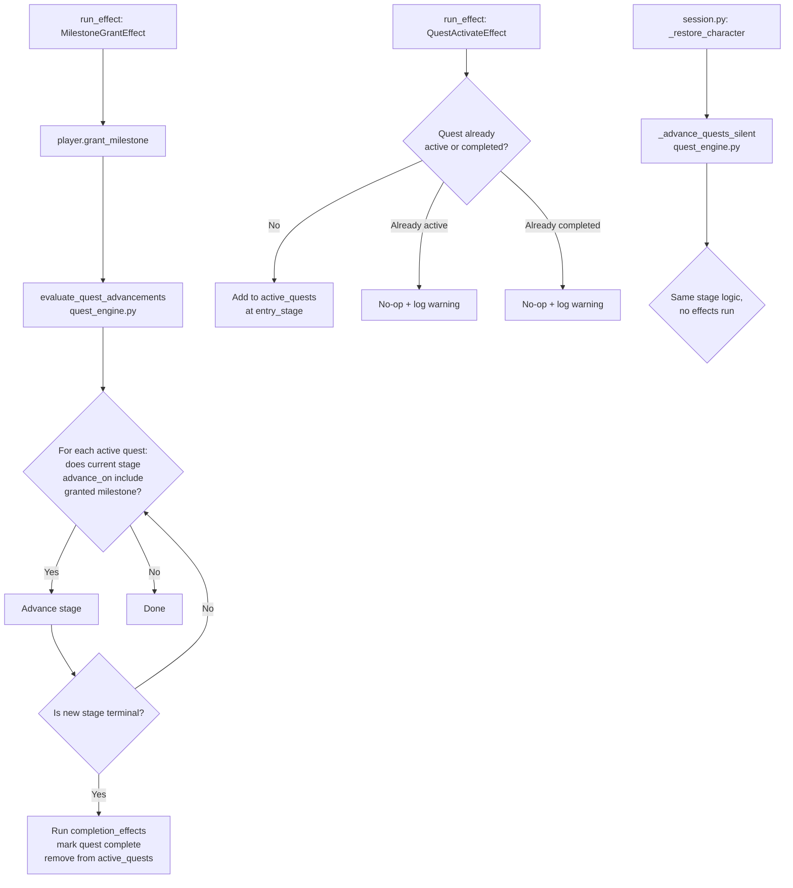
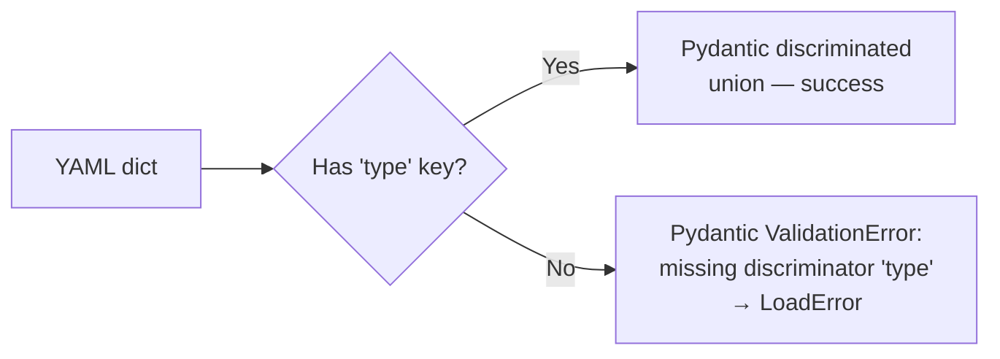
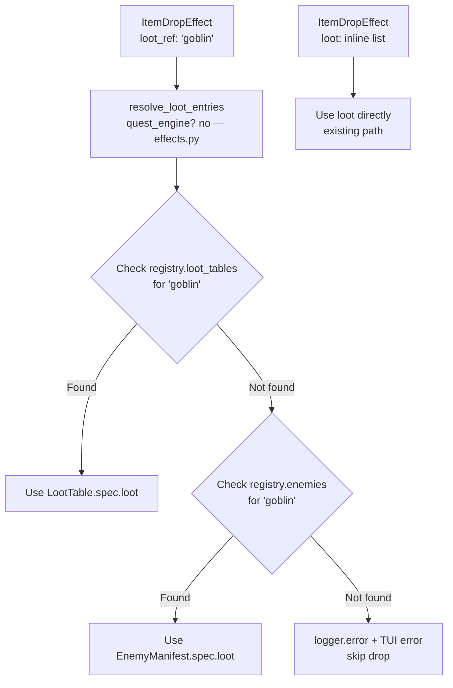

# Design: Tech Debt Q1

## Context

Four independent tech debt items are addressed together because they share a common theme: they are places where the engine claims to support a feature but does not deliver it, or where authoring surfaces are needlessly inconsistent. Each item is scoped to a specific layer of the engine with minimal cross-cutting. None changes how the TUI looks or how game logic is authored at a narrative level.

**Current state before this change:**

| Item                   | Problem                                                                                                                                                                                 |
| ---------------------- | --------------------------------------------------------------------------------------------------------------------------------------------------------------------------------------- |
| Quest activation       | Quests can be modeled but never progress; `advance_on` is parsed but not evaluated; no `quest_activate` effect exists                                                                   |
| Condition shorthand    | Two authoring syntaxes produce identical models; one is documented in some files and the other is not; `normalise_condition()` maintains dead translation logic                         |
| Loot tables            | `EnemySpec.loot` is a model field that is never read by any effect handler; `LootEntry` and `ItemDropEntry` are separate classes with no reconciliation; no cross-reference is possible |
| `base_adventure_count` | Field exists in model and both content packages, reads as `None` everywhere, and is never consumed by the engine                                                                        |

---

## Goals / Non-Goals

**Goals:**

- Make quest stages advance when their trigger milestones are granted, and fire effects when a terminal stage is reached
- Make `quest_activate` an explicit effect type so adventures can start quests
- Remove condition shorthand from the parser and hard-error on bare-key conditions
- Unify loot schemas and wire enemy loot to the effect dispatcher via `loot_ref`
- Introduce a standalone `LootTable` manifest kind
- Remove `base_adventure_count` entirely

**Non-Goals:**

- Quest UI panels or progress screens — not part of this change
- Quest conditions on pool selection (quest stage predicates are a separate roadmap item)
- Repeatable quest mechanics
- Weighted multi-roll loot or conditional loot entries (separate roadmap items)

---

## Decisions

### Decision 1 — Quest Activation Engine

#### Architecture



#### New file: `oscilla/engine/quest_engine.py`

This module owns all quest progression logic. It is imported by `effects.py` and `session.py` but does not import from them, avoiding circular dependencies.

```python
"""Quest progression engine — stage advancement and completion handling."""

from __future__ import annotations

from logging import getLogger
from typing import TYPE_CHECKING

if TYPE_CHECKING:
    from oscilla.engine.character import CharacterState
    from oscilla.engine.pipeline import TUICallbacks
    from oscilla.engine.registry import ContentRegistry

logger = getLogger(__name__)


def _advance_quests_silent(player: "CharacterState", registry: "ContentRegistry") -> None:
    """Sync, no-effect advancement used on character load.

    Re-evaluates every active quest against the player's current milestone set.
    Advances stages and marks quests complete without running any completion_effects.
    This corrects state that may be out of sync due to the milestone being granted
    before the quest was activated, or due to bugs in previous sessions.
    """
    if not player.active_quests:
        return

    # Work on a copy — we may complete quests mid-iteration.
    to_advance = dict(player.active_quests)
    for quest_ref, stage_name in list(to_advance.items()):
        quest_manifest = registry.quests.get(quest_ref)
        if quest_manifest is None:
            logger.warning("Active quest %r not found in registry — skipping advancement.", quest_ref)
            continue
        stage_map = {s.name: s for s in quest_manifest.spec.stages}
        current_stage_name = stage_name

        # Walk forward as far as milestones allow (handles chained immediate advancements
        # when multiple advance_on milestones are already held at load time).
        while True:
            stage = stage_map.get(current_stage_name)
            if stage is None:
                logger.error("Quest %r references unknown stage %r — stopping advancement.", quest_ref, current_stage_name)
                break
            if stage.terminal:
                # Quest is already at terminal — mark complete, remove from active.
                player.active_quests.pop(quest_ref, None)
                player.completed_quests.add(quest_ref)
                break
            # Check if any advance_on milestone is satisfied.
            triggered = next((m for m in stage.advance_on if player.has_milestone(m)), None)
            if triggered is None:
                break  # No advancement possible yet.
            next_stage_name = stage.next_stage
            if next_stage_name is None:
                # Model validator should prevent this, but guard defensively.
                logger.error("Quest %r stage %r has no next_stage but is not terminal.", quest_ref, current_stage_name)
                break
            logger.debug("Quest %r: silent advance %r → %r (milestone %r).", quest_ref, current_stage_name, next_stage_name, triggered)
            player.active_quests[quest_ref] = next_stage_name
            current_stage_name = next_stage_name


async def evaluate_quest_advancements(
    player: "CharacterState",
    registry: "ContentRegistry",
    tui: "TUICallbacks",
) -> None:
    """Async, full-effect advancement used after milestone_grant at runtime.

    Evaluates all active quests against the player's current milestone set,
    advances stages, and executes completion_effects on terminal stages.
    Multiple chained advancements (where the moved-to stage also has its
    advance_on milestone already held) are followed in a single call.
    """
    from oscilla.engine.steps.effects import run_effect  # local import avoids circular dep

    if not player.active_quests:
        return

    to_advance = dict(player.active_quests)
    for quest_ref, stage_name in list(to_advance.items()):
        quest_manifest = registry.quests.get(quest_ref)
        if quest_manifest is None:
            logger.warning("Active quest %r not found in registry — skipping advancement.", quest_ref)
            continue
        stage_map = {s.name: s for s in quest_manifest.spec.stages}
        current_stage_name = stage_name

        while True:
            stage = stage_map.get(current_stage_name)
            if stage is None:
                logger.error("Quest %r references unknown stage %r — stopping.", quest_ref, current_stage_name)
                break
            if stage.terminal:
                # Run completion effects, then mark complete.
                player.active_quests.pop(quest_ref, None)
                player.completed_quests.add(quest_ref)
                display_name = quest_manifest.spec.displayName
                await tui.show_text(f"[bold green]Quest complete: {display_name}[/bold green]")
                for effect in stage.completion_effects:
                    await run_effect(effect=effect, player=player, registry=registry, tui=tui)
                break
            triggered = next((m for m in stage.advance_on if player.has_milestone(m)), None)
            if triggered is None:
                break
            next_stage_name = stage.next_stage
            if next_stage_name is None:
                logger.error("Quest %r stage %r has no next_stage but is not terminal.", quest_ref, current_stage_name)
                break
            logger.debug("Quest %r: advance %r → %r (milestone %r).", quest_ref, current_stage_name, next_stage_name, triggered)
            player.active_quests[quest_ref] = next_stage_name
            current_stage_name = next_stage_name
```

#### Modified: `oscilla/engine/models/quest.py`

**Before:**

```python
class QuestStage(BaseModel):
    name: str
    description: str = ""
    advance_on: Set[str] = set()  # milestone names that trigger advancement
    next_stage: str | None = None  # None only for terminal stages
    terminal: bool = False  # True = quest complete at this stage
```

**After:**

```python
class QuestStage(BaseModel):
    name: str
    description: str = ""
    advance_on: Set[str] = set()  # milestone names that trigger advancement
    next_stage: str | None = None  # None only for terminal stages
    terminal: bool = False  # True = quest complete at this stage
    # Effects fired when this stage is reached AND it is terminal.
    # Enforced by model_validator: non-terminal stages must have an empty list.
    completion_effects: List["Effect"] = []
```

Also add to model_validator `validate_stage_graph`:

**Before (inside `validate_stage_graph`):**

```python
            if stage.terminal:
                if stage.next_stage is not None:
                    raise ValueError(f"Stage {stage.name!r} is terminal but has next_stage={stage.next_stage!r}")
                if stage.advance_on:
                    raise ValueError(f"Stage {stage.name!r} is terminal but has advance_on={stage.advance_on!r}")
```

**After:**

```python
            if stage.terminal:
                if stage.next_stage is not None:
                    raise ValueError(f"Stage {stage.name!r} is terminal but has next_stage={stage.next_stage!r}")
                if stage.advance_on:
                    raise ValueError(f"Stage {stage.name!r} is terminal but has advance_on={stage.advance_on!r}")
            else:
                # Non-terminal stages must not declare completion_effects — those only
                # fire when the quest is done; putting effects on intermediate stages
                # would mislead authors into thinking they fire at mid-stage entrance.
                if stage.completion_effects:
                    raise ValueError(
                        f"Stage {stage.name!r} is not terminal but has completion_effects. "
                        "completion_effects are only valid on terminal stages."
                    )
```

Also add `model_rebuild()` at module bottom:

```python
# Resolve forward reference to Effect after full module load.
from oscilla.engine.models.adventure import Effect  # noqa: E402
QuestStage.model_rebuild()
```

#### New effect model: `QuestActivateEffect` in `oscilla/engine/models/adventure.py`

**Before (Effect union):**

```python
Effect = Annotated[
    Union[
        XpGrantEffect,
        ItemDropEffect,
        MilestoneGrantEffect,
        EndAdventureEffect,
        HealEffect,
        StatChangeEffect,
        StatSetEffect,
        UseItemEffect,
        SkillGrantEffect,
        DispelEffect,
        ApplyBuffEffect,
        SetPronounsEffect,
    ],
    Field(discriminator="type"),
]
```

**After — add new class before Effect union:**

```python
class QuestActivateEffect(BaseModel):
    type: Literal["quest_activate"]
    quest_ref: str = Field(description="Name of the Quest manifest to activate.")
```

**After (Effect union):**

```python
Effect = Annotated[
    Union[
        XpGrantEffect,
        ItemDropEffect,
        MilestoneGrantEffect,
        EndAdventureEffect,
        HealEffect,
        StatChangeEffect,
        StatSetEffect,
        UseItemEffect,
        SkillGrantEffect,
        DispelEffect,
        ApplyBuffEffect,
        SetPronounsEffect,
        QuestActivateEffect,
    ],
    Field(discriminator="type"),
]
```

Also add `QuestActivateEffect` to the imports at the top of `effects.py`.

#### Modified: `oscilla/engine/steps/effects.py` — `run_effect`

Add an import and two new cases in the match block.

**New import:**

```python
from oscilla.engine.models.adventure import (
    ApplyBuffEffect,
    DispelEffect,
    Effect,
    EndAdventureEffect,
    HealEffect,
    ItemDropEffect,
    MilestoneGrantEffect,
    QuestActivateEffect,   # ← new
    SetPronounsEffect,
    SkillGrantEffect,
    StatChangeEffect,
    StatSetEffect,
    UseItemEffect,
    XpGrantEffect,
)
```

**Modified `MilestoneGrantEffect` case (before):**

```python
        case MilestoneGrantEffect(milestone=milestone):
            player.grant_milestone(milestone)
```

**After:**

```python
        case MilestoneGrantEffect(milestone=milestone):
            player.grant_milestone(milestone)
            # Quest stage advancement is evaluated after every milestone grant.
            # This is the primary runtime trigger for quest progression.
            from oscilla.engine.quest_engine import evaluate_quest_advancements
            await evaluate_quest_advancements(player=player, registry=registry, tui=tui)
```

**New `QuestActivateEffect` case (after `MilestoneGrantEffect`):**

```python
        case QuestActivateEffect(quest_ref=quest_ref):
            if quest_ref in player.completed_quests:
                logger.warning("quest_activate: %r is already completed — no-op.", quest_ref)
                return
            if quest_ref in player.active_quests:
                logger.warning("quest_activate: %r is already active — no-op.", quest_ref)
                return
            quest_manifest = registry.quests.get(quest_ref)
            if quest_manifest is None:
                logger.error("quest_activate: quest %r not found in registry — skipping.", quest_ref)
                await tui.show_text(f"[red]Error: quest {quest_ref!r} not found.[/red]")
                return
            entry_stage = quest_manifest.spec.entry_stage
            player.active_quests[quest_ref] = entry_stage
            display_name = quest_manifest.spec.displayName
            await tui.show_text(f"[bold]Quest started:[/bold] {display_name}")
            # Immediately evaluate advancement — the entry stage might already be
            # satisfiable if the player already holds any advance_on milestones.
            from oscilla.engine.quest_engine import evaluate_quest_advancements
            await evaluate_quest_advancements(player=player, registry=registry, tui=tui)
```

#### Modified: `oscilla/engine/session.py` — `_restore_character`

Find where character state is loaded and add a call to `_advance_quests_silent` before the session proceeds.

**Before (schematic — identify the exact restoration path):**

```python
# In session.py, _restore_character or equivalent:
state = CharacterState.from_dict(data)
```

**After:**

```python
from oscilla.engine.quest_engine import _advance_quests_silent

state = CharacterState.from_dict(data)
# Re-evaluate quest state on every load. This corrects desync that can occur
# when a quest is activated after its trigger milestones were already granted,
# or when content is updated between sessions. No effects are run — those are
# one-time rewards already reflected in the saved character data.
_advance_quests_silent(player=state, registry=registry)
```

#### Edge cases

| Case                                                      | Handling                                                                                                          |
| --------------------------------------------------------- | ----------------------------------------------------------------------------------------------------------------- |
| `quest_activate` on an already-active quest               | `logger.warning`, silent no-op, no state change                                                                   |
| `quest_activate` on a completed quest                     | `logger.warning`, silent no-op                                                                                    |
| `quest_activate` with unknown `quest_ref`                 | `logger.error`, TUI red error message, no state change                                                            |
| `advance_on` milestone already held at activation time    | `evaluate_quest_advancements` called immediately after activation; quest advances in same tick                    |
| Multiple chained advancements                             | Inner `while True` loop follows the chain until it either hits a stage blocked on a milestone or reaches terminal |
| Terminal stage has unknown `completion_effects` item      | `run_effect` handles unknown effect types gracefully via match fallthrough (logs warning)                         |
| Quest stage name in `active_quests` not found in registry | `logger.warning`, advancement skipped                                                                             |
| Stage name in `active_quests` not found in stage map      | `logger.error`, advancement stopped                                                                               |
| `completion_effects` on non-terminal stage                | Pydantic model validator raises `ValueError` at load time                                                         |

---

### Decision 2 — Condition Shorthand Removal

#### Architecture

The `normalise_condition()` translator in `base.py` sits between YAML parsing and Pydantic model construction. Its removal means the raw dict reaches Pydantic's discriminated union validator directly. If the `type` key is absent, Pydantic raises a `ValidationError` with a message about the missing discriminator field — this becomes the hard error.



#### Modified: `oscilla/engine/models/base.py`

**Remove entirely:**

```python
_LEAF_MAPPINGS: dict[str, tuple[str, str]] = {
    # key → (type_value, value_key_in_model)
    "level": ("level", "value"),
    "milestone": ("milestone", "name"),
    "item": ("item", "name"),
    "class": ("class", "name"),
    "pronouns": ("pronouns", "set"),
    "item_equipped": ("item_equipped", "name"),
    "item_held_label": ("item_held_label", "label"),
    "any_item_equipped": ("any_item_equipped", "label"),
}

# Keys whose value is already the full sub-dict (not a scalar)
_DICT_LEAVES: set[str] = {
    "character_stat",
    "iteration",
    "enemies_defeated",
    "locations_visited",
    "adventures_completed",
    "skill",
}

# Branch keys whose sub-conditions need recursive normalisation
_BRANCH_KEYS: set[str] = {"all", "any", "not"}


def normalise_condition(raw: object) -> Dict[str, object]:
    ...  # entire function body removed
```

#### Modified: `oscilla/engine/loader.py`

Remove the `normalise_condition` import and every call site.

**Before (import):**

```python
from oscilla.engine.models.base import AllCondition, Condition, ManifestEnvelope, normalise_condition
```

**After:**

```python
from oscilla.engine.models.base import AllCondition, Condition, ManifestEnvelope
```

**Remove `_normalise_manifest_conditions` entirely** (this function and all its calls). Pydantic validation of the raw dict replaces it.

**Before (schematic of one call site in `parse`):**

```python
        raw = _normalise_manifest_conditions(raw)
        envelope = ManifestEnvelope.model_validate(raw)
```

**After:**

```python
        envelope = ManifestEnvelope.model_validate(raw)
```

Also remove `_normalise_step`, `_normalise_branch`, and the `_normalise_manifest_conditions` call in the parse loop. Pydantic's nested validators on the manifest models handle the `Condition` union with no normalization needed, provided the YAML uses the explicit `type:` form.

#### Content migration

**Before** (`content/the-example-kingdom/regions/wilderness/wilderness.yaml`):

```yaml
unlock:
  level: 3
```

**After:**

```yaml
unlock:
  type: level
  value: 3
```

#### Edge cases

| Case                                                         | Handling                                                                                           |
| ------------------------------------------------------------ | -------------------------------------------------------------------------------------------------- |
| Bare-key condition `{level: 3}`                              | Pydantic discriminated union raises `ValidationError` — loader wraps in `LoadError` with file path |
| Bare-key nested inside `all`/`any`                           | Same — the nested list element fails Pydantic validation with field path                           |
| Already-explicit `{type: level, value: 3}`                   | Unchanged; Pydantic accepts it as before                                                           |
| `advance_on` in quest stages (plain strings, not conditions) | Unaffected — `advance_on` is `Set[str]`, not `List[Condition]`                                     |

---

### Decision 3 — Shared Loot Tables and Enemy Loot Reference

#### Architecture



#### New file: `oscilla/engine/models/loot_table.py`

```python
"""LootTable manifest model — named, reusable loot definitions."""

from typing import List, Literal

from pydantic import BaseModel, Field

from oscilla.engine.models.base import ManifestEnvelope


class LootEntry(BaseModel):
    """A single weighted entry in a loot table.

    `quantity` controls how many of the item are added when this entry is
    selected. Weight is relative to other entries in the same table.
    """
    item: str
    weight: int = Field(ge=1)
    quantity: int = Field(default=1, ge=1)


class LootTableSpec(BaseModel):
    displayName: str
    description: str = ""
    loot: List[LootEntry] = Field(min_length=1)


class LootTableManifest(ManifestEnvelope):
    kind: Literal["LootTable"]
    spec: LootTableSpec
```

#### Unified `LootEntry` — three locations to update

The same `LootEntry` class from `loot_table.py` replaces both `ItemDropEntry` (in `adventure.py`) and `LootEntry` (in `enemy.py`).

**Modified: `oscilla/engine/models/adventure.py`**

**Before:**

```python
class ItemDropEntry(BaseModel):
    item: str
    weight: int = Field(ge=1)


class ItemDropEffect(BaseModel):
    type: Literal["item_drop"]
    # str = template string resolving to a positive int.
    count: int | str = Field(default=1, description="Roll count or template string resolving to int.")
    loot: List[ItemDropEntry] = Field(min_length=1)
```

**After:**

```python
from oscilla.engine.models.loot_table import LootEntry  # replaces ItemDropEntry


class ItemDropEffect(BaseModel):
    type: Literal["item_drop"]
    # str = template string resolving to a positive int.
    count: int | str = Field(default=1, description="Roll count or template string resolving to int.")
    # Exactly one of loot or loot_ref must be set. Enforced by model_validator.
    loot: List[LootEntry] | None = None
    loot_ref: str | None = Field(
        default=None,
        description=(
            "Reference to a named LootTable manifest or an Enemy manifest name. "
            "Mutually exclusive with loot."
        ),
    )

    @model_validator(mode="after")
    def exactly_one_loot_source(self) -> "ItemDropEffect":
        has_inline = self.loot is not None and len(self.loot) > 0
        has_ref = self.loot_ref is not None
        if has_inline and has_ref:
            raise ValueError("ItemDropEffect: specify either 'loot' or 'loot_ref', not both.")
        if not has_inline and not has_ref:
            raise ValueError("ItemDropEffect: must specify either 'loot' (inline list) or 'loot_ref'.")
        return self
```

**Modified: `oscilla/engine/models/enemy.py`**

**Before:**

```python
class LootEntry(BaseModel):
    item: str
    weight: int = Field(ge=1)
```

**After (remove local class, import from loot_table):**

```python
from oscilla.engine.models.loot_table import LootEntry  # noqa: F401 — re-exported for callers
```

`EnemySpec.loot` stays as `List[LootEntry]` — the type is now sourced from `loot_table.py`.

#### Modified: `oscilla/engine/registry.py`

**Before (ContentRegistry fields):**

```python
        self.enemies: KindRegistry[EnemyManifest] = KindRegistry()
        self.items: KindRegistry[ItemManifest] = KindRegistry()
        ...
```

**After (add loot_tables):**

```python
        self.enemies: KindRegistry[EnemyManifest] = KindRegistry()
        self.items: KindRegistry[ItemManifest] = KindRegistry()
        self.loot_tables: KindRegistry[LootTableManifest] = KindRegistry()
        ...
```

**Add to the kind dispatch match block:**

```python
                case "LootTable":
                    registry.loot_tables.register(cast(LootTableManifest, m))
```

**New helper on `ContentRegistry`:**

```python
    def resolve_loot_entries(self, loot_ref: str) -> List[LootEntry] | None:
        """Resolve a loot_ref to its entries.

        Resolution order:
        1. Check registry.loot_tables for a named LootTable manifest.
        2. Check registry.enemies — enemy loot is implicitly a named table.

        Returns None if the ref is not found in either registry.
        """
        from oscilla.engine.models.loot_table import LootEntry  # avoid circular at module level

        loot_table = self.loot_tables.get(loot_ref)
        if loot_table is not None:
            return loot_table.spec.loot

        enemy = self.enemies.get(loot_ref)
        if enemy is not None:
            return enemy.spec.loot if enemy.spec.loot else None

        return None
```

#### Modified: `oscilla/engine/steps/effects.py`

New helper and modified `ItemDropEffect` case:

**New helper `_resolve_and_drop_items`:**

```python
def _resolve_loot_list(
    effect: ItemDropEffect,
    registry: "ContentRegistry",
) -> "List[LootEntry]":
    """Return the effective loot entry list for an ItemDropEffect.

    Precondition: the loader has already validated that every loot_ref resolves
    to a known table or enemy (_validate_loot_refs). An unresolvable ref here
    indicates a programming error or a hot-reload race — assert rather than
    silently skip.
    """
    from oscilla.engine.models.loot_table import LootEntry

    if effect.loot is not None:
        return effect.loot
    # loot_ref path — guaranteed resolvable by load-time validation.
    assert effect.loot_ref is not None
    entries = registry.resolve_loot_entries(effect.loot_ref)
    assert entries is not None, (
        f"loot_ref {effect.loot_ref!r} not found at runtime — "
        "this should have been caught by _validate_loot_refs at load time."
    )
    return entries
```

**Modified `ItemDropEffect` case (before):**

```python
        case ItemDropEffect(count=count, loot=loot):
            assert isinstance(count, int), f"Unexpected non-int item drop count after template resolution: {count!r}"
            items = [entry.item for entry in loot]
            weights = [entry.weight for entry in loot]
            chosen_items = random.choices(population=items, weights=weights, k=count)
            for item_ref in chosen_items:
                player.add_item(ref=item_ref, quantity=1, registry=registry)
            item_counts: Counter[str] = Counter(chosen_items)
            parts = []
            for item_ref, qty in item_counts.items():
                item = registry.items.get(item_ref)
                name = item.spec.displayName if item is not None else item_ref
                parts.append(f"{name} \u00d7 {qty}" if qty > 1 else name)
            await tui.show_text(f"You found: {', '.join(parts)}")
```

**After:**

```python
        case ItemDropEffect(count=count) if isinstance(count, int):
            loot_entries = _resolve_loot_list(effect=effect, registry=registry)
            items = [entry.item for entry in loot_entries]
            weights = [entry.weight for entry in loot_entries]
            quantities = [entry.quantity for entry in loot_entries]
            # Roll independently count times with replacement.
            indices = random.choices(population=range(len(items)), weights=weights, k=count)
            chosen: List[tuple[str, int]] = [(items[i], quantities[i]) for i in indices]
            for item_ref, qty in chosen:
                player.add_item(ref=item_ref, quantity=qty, registry=registry)
            # Announce grouped finds.
            item_totals: Counter[str] = Counter()
            for item_ref, qty in chosen:
                item_totals[item_ref] += qty
            parts = []
            for item_ref, total_qty in item_totals.items():
                item = registry.items.get(item_ref)
                name = item.spec.displayName if item is not None else item_ref
                parts.append(f"{name} \u00d7 {total_qty}" if total_qty > 1 else name)
            await tui.show_text(f"You found: {', '.join(parts)}")
```

Also update the template resolution block at the top of `run_effect` to handle the `loot_ref` case (no need to re-create effect — `loot` may be None when `loot_ref` is set):

**Before:**

```python
        elif isinstance(effect, ItemDropEffect) and isinstance(effect.count, str):
            template_id = f"__effect_itemdrop_{id(effect)}"
            resolved_count = engine.render_int(template_id, ctx)
            effect = ItemDropEffect(type="item_drop", count=resolved_count, loot=effect.loot)
```

**After:**

```python
        elif isinstance(effect, ItemDropEffect) and isinstance(effect.count, str):
            template_id = f"__effect_itemdrop_{id(effect)}"
            resolved_count = engine.render_int(template_id, ctx)
            # Preserve whichever loot source was declared (inline or ref).
            effect = ItemDropEffect(
                type="item_drop",
                count=resolved_count,
                loot=effect.loot,
                loot_ref=effect.loot_ref,
            )
```

#### Modified: `oscilla/engine/loader.py` — cross-reference validation

Add `loot_ref` validation after all manifests are loaded (in the second pass, alongside existing cross-reference checks):

```python
def _validate_loot_refs(registry: ContentRegistry) -> List[LoadError]:
    """Verify every loot_ref in ItemDropEffect resolves to a known table or enemy."""
    errors: List[LoadError] = []
    for adv_manifest in registry.adventures.all():
        for step in _iter_all_steps(adv_manifest.spec.steps):
            for effect in _iter_step_effects(step):
                if not isinstance(effect, ItemDropEffect):
                    continue
                if effect.loot_ref is None:
                    continue
                entries = registry.resolve_loot_entries(effect.loot_ref)
                if entries is None:
                    errors.append(
                        LoadError(
                            path=adv_manifest.metadata.name,
                            message=f"loot_ref {effect.loot_ref!r} not found in loot_tables or enemies registry.",
                        )
                    )
    return errors
```

Also register `LootTable` in the `kind` dispatch inside `parse`:

```python
                case "LootTable":
                    manifests.append(LootTableManifest.model_validate(raw))
```

#### Edge cases

| Case                                                  | Handling                                                                          |
| ----------------------------------------------------- | --------------------------------------------------------------------------------- |
| `loot_ref` pointing to unknown table/enemy            | Load-time `LoadError` from `_validate_loot_refs`; content package fails to load   |
| Enemy with empty `loot: []` referenced via `loot_ref` | `resolve_loot_entries` returns `None` for empty list; treated same as unknown ref |
| Both `loot` and `loot_ref` declared                   | Pydantic model validator raises `ValueError` at load time                         |
| Neither `loot` nor `loot_ref` declared                | Pydantic model validator raises `ValueError` at load time                         |
| `loot_ref` with `quantity > 1` entry                  | `add_item` called with the entry's `quantity`; TUI announces total quantity       |
| Inline `loot` entries — existing content              | Unchanged; `ItemDropEffect.loot` still valid when `loot_ref` is None              |

---

### Decision 4 — Remove `base_adventure_count`

This field has been in `GameSpec` since early development. It was never wired to any runtime logic, both content packages set it to `None`, and no documentation references it. Removing it is purely additive from a correctness standpoint.

#### Modified: `oscilla/engine/models/game.py`

**Before:**

```python
class GameSpec(BaseModel):
    displayName: str
    description: str = ""
    xp_thresholds: List[int] = Field(min_length=1)
    hp_formula: HpFormula
    base_adventure_count: int | None = None  # null = unlimited
    item_labels: List[ItemLabelDef] = []
    passive_effects: List[PassiveEffect] = []
```

**After:**

```python
class GameSpec(BaseModel):
    displayName: str
    description: str = ""
    xp_thresholds: List[int] = Field(min_length=1)
    hp_formula: HpFormula
    item_labels: List[ItemLabelDef] = []
    passive_effects: List[PassiveEffect] = []
```

#### Content: both `game.yaml` files

**Before** (both `testlandia/game.yaml` and `the-example-kingdom/game.yaml`):

```yaml
spec:
  ...
  base_adventure_count:
```

**After:** remove the `base_adventure_count:` line entirely.

No migration needed — Pydantic with `extra="ignore"` on the validator would silently accept the extra field, but to avoid lint/DapperData warnings the field should also be removed from content.

---

## Documentation Philosophy

This change touches three distinct author-facing surfaces (condition syntax, quests, loot) and one developer-facing subsystem (quest engine). Documentation is split by audience: `docs/authors/` for content authors, `docs/dev/` for engine contributors.

### Author documentation

The condition shorthand removal is a **breaking change for existing content authors**. The author docs must reflect the explicit-only syntax everywhere — no shorthand examples anywhere in the suite, even in passing. The change to `conditions.md` is the canonical reference update; `world-building.md` and `adventures.md` need audits to eliminate any surviving shorthands.

Quest activation introduces a new authoring concept (`quest_activate` effect, `completion_effects`, stage graph rules) with no predecessor in the existing docs. `quests.md` needs a full worked example, not just a field reference — authors need to see how an adventure chains into a quest and how a terminal stage fires effects. The worked example should mirror the testlandia integration fixture so both docs and tests reinforce each other.

The loot changes add `loot_ref` and `quantity` — two new fields on existing manifests. `items.md` needs prose explaining the resolution order (named table first, then enemy), the mutual exclusion with inline `loot`, and a complete example using both a `LootTable` manifest and a `loot_ref` reference.

### Developer documentation

`docs/dev/game-engine.md` is the primary developer reference for the engine layer. It needs a dedicated **Quest Engine** subsection covering `quest_engine.py`, the two advancement functions and when each is called, and the call sites in `effects.py` and `session.py`. The `LootTable` kind and `loot_ref` resolution order should be documented alongside the existing item drop documentation.

### Document inventory

| Document                         | Audience        | Action | Topics to Cover                                                                                                                                                                                                            |
| -------------------------------- | --------------- | ------ | -------------------------------------------------------------------------------------------------------------------------------------------------------------------------------------------------------------------------- |
| `docs/authors/conditions.md`     | Content authors | Update | Remove all shorthand examples; add a callout that `type:` is required; show only explicit form throughout                                                                                                                  |
| `docs/authors/world-building.md` | Content authors | Update | Audit `unlock:` examples; replace any `{level: 3}` shorthand with explicit form; confirm all condition examples are explicit                                                                                               |
| `docs/authors/adventures.md`     | Content authors | Update | Audit `requires:` examples; replace any shorthands; add `quest_activate` effect documentation with YAML example                                                                                                            |
| `docs/authors/quests.md`         | Content authors | Create | Full quest authoring reference: manifest structure, stages, `advance_on` (Set semantics — duplicates silently ignored), `completion_effects`, `quest_activate` effect, stage graph rules, worked multi-stage example       |
| `docs/authors/items.md`          | Content authors | Update | Document `loot_ref` on `item_drop`; explain named `LootTable` manifests; explain enemy-name references and resolution order; document `quantity` field on loot entries                                                     |
| `docs/authors/README.md`         | Content authors | Update | Add `quests.md` entry to table of contents                                                                                                                                                                                 |
| `docs/dev/game-engine.md`        | Developers      | Update | Quest activation engine section: `quest_engine.py` purpose, `_advance_quests_silent` vs `evaluate_quest_advancements`, call sites in `effects.py` and `session.py`; `LootTable` registry kind; shorthand removal rationale |
| `docs/dev/README.md`             | Developers      | Audit  | Verify table of contents is complete and accurate after changes                                                                                                                                                            |

---

## Testing Philosophy

### Test tiers

| Tier                        | What it covers                                                                                           | Tools                                                                      |
| --------------------------- | -------------------------------------------------------------------------------------------------------- | -------------------------------------------------------------------------- |
| Unit — model validation     | Pydantic schema rules: `completion_effects` on non-terminal rejected, `loot`/`loot_ref` mutual exclusion | `pytest`, direct model instantiation                                       |
| Unit — quest engine         | `_advance_quests_silent` and `evaluate_quest_advancements` logic in isolation                            | `pytest`, `AsyncMock` TUI, direct `CharacterState` construction            |
| Unit — effect dispatch      | `quest_activate`, `milestone_grant`→advancement, `item_drop` with `loot_ref`                             | `pytest`, `AsyncMock` TUI, minimal fixture registry                        |
| Unit — loader               | Shorthand condition hard error, `loot_ref` cross-reference validation, `LootTable` kind parsed           | `pytest`, inline YAML strings                                              |
| Integration — full pipeline | Quest starts, advances through two stages, fires completion effects; loot_ref resolves end-to-end        | `pytest`, `mock_tui` fixture, fixture content in `tests/fixtures/content/` |

### Required fixtures

```python
# tests/conftest.py additions

@pytest.fixture
def minimal_quest_registry() -> ContentRegistry:
    """Registry with a two-stage quest (stage-a → stage-b terminal) for unit tests."""
    from oscilla.engine.models.quest import QuestManifest, QuestSpec, QuestStage
    from oscilla.engine.models.adventure import MilestoneGrantEffect
    registry = ContentRegistry.__new__(ContentRegistry)
    registry.__init__()
    quest = QuestManifest.model_validate({
        "apiVersion": "oscilla/v1",
        "kind": "Quest",
        "metadata": {"name": "test-quest"},
        "spec": {
            "displayName": "Test Quest",
            "entry_stage": "stage-a",
            "stages": [
                {"name": "stage-a", "advance_on": ["quest-a-done"], "next_stage": "stage-b"},
                {
                    "name": "stage-b",
                    "terminal": True,
                    "completion_effects": [
                        {"type": "milestone_grant", "milestone": "quest-complete"}
                    ],
                },
            ],
        },
    })
    registry.quests.register(quest)
    return registry
```

### Complete test examples

```python
# tests/engine/test_quest_engine.py

import pytest
from unittest.mock import AsyncMock

from oscilla.engine.character import CharacterState
from oscilla.engine.quest_engine import _advance_quests_silent, evaluate_quest_advancements


def make_player(**kwargs: object) -> CharacterState:
    """Construct a minimal CharacterState for quest tests."""
    return CharacterState(
        name="Tester",
        pronouns=None,
        character_class=None,
        stats={},
        **kwargs,
    )


def test_silent_advance_moves_stage(minimal_quest_registry: "ContentRegistry") -> None:
    player = make_player()
    player.active_quests = {"test-quest": "stage-a"}
    player.milestones.add("quest-a-done")

    _advance_quests_silent(player=player, registry=minimal_quest_registry)

    # Stage-b is terminal — quest should now be completed, not active.
    assert "test-quest" not in player.active_quests
    assert "test-quest" in player.completed_quests


def test_silent_advance_no_milestone_no_change(minimal_quest_registry: "ContentRegistry") -> None:
    player = make_player()
    player.active_quests = {"test-quest": "stage-a"}
    # No milestone granted — quest should not advance.

    _advance_quests_silent(player=player, registry=minimal_quest_registry)

    assert player.active_quests == {"test-quest": "stage-a"}
    assert "test-quest" not in player.completed_quests


@pytest.mark.asyncio
async def test_evaluate_advancements_fires_completion_effects(
    minimal_quest_registry: "ContentRegistry",
) -> None:
    player = make_player()
    player.active_quests = {"test-quest": "stage-a"}
    player.milestones.add("quest-a-done")
    tui = AsyncMock()

    await evaluate_quest_advancements(player=player, registry=minimal_quest_registry, tui=tui)

    # Completion effect was milestone_grant("quest-complete").
    assert "quest-complete" in player.milestones
    assert "test-quest" in player.completed_quests
    # TUI was notified of quest completion.
    tui.show_text.assert_called()
    shown = " ".join(str(call.args[0]) for call in tui.show_text.call_args_list)
    assert "Test Quest" in shown
```

```python
# tests/engine/test_effects_quest.py

import pytest
from unittest.mock import AsyncMock

from oscilla.engine.models.adventure import QuestActivateEffect
from oscilla.engine.steps.effects import run_effect


@pytest.mark.asyncio
async def test_quest_activate_unknown_ref(minimal_quest_registry: "ContentRegistry") -> None:
    from oscilla.engine.character import CharacterState
    player = CharacterState(name="Tester", pronouns=None, character_class=None, stats={})
    tui = AsyncMock()
    effect = QuestActivateEffect(type="quest_activate", quest_ref="nonexistent-quest")

    await run_effect(effect=effect, player=player, registry=minimal_quest_registry, tui=tui)

    assert player.active_quests == {}
    tui.show_text.assert_called()
    assert "not found" in str(tui.show_text.call_args_list[-1])


@pytest.mark.asyncio
async def test_quest_activate_already_active(minimal_quest_registry: "ContentRegistry") -> None:
    from oscilla.engine.character import CharacterState
    player = CharacterState(name="Tester", pronouns=None, character_class=None, stats={})
    player.active_quests = {"test-quest": "stage-a"}
    tui = AsyncMock()
    effect = QuestActivateEffect(type="quest_activate", quest_ref="test-quest")

    await run_effect(effect=effect, player=player, registry=minimal_quest_registry, tui=tui)

    # Remains at stage-a, no duplicate activation.
    assert player.active_quests == {"test-quest": "stage-a"}
```

```python
# tests/engine/test_loot_ref.py

import pytest
from unittest.mock import AsyncMock

from oscilla.engine.models.adventure import ItemDropEffect
from oscilla.engine.steps.effects import run_effect
from oscilla.engine.registry import ContentRegistry


def make_loot_registry() -> ContentRegistry:
    """Registry with a LootTable and an Enemy for loot_ref resolution tests."""
    from oscilla.engine.models.loot_table import LootTableManifest, LootEntry
    from oscilla.engine.models.enemy import EnemyManifest

    registry = ContentRegistry.__new__(ContentRegistry)
    registry.__init__()

    loot_table = LootTableManifest.model_validate({
        "apiVersion": "oscilla/v1",
        "kind": "LootTable",
        "metadata": {"name": "test-loot"},
        "spec": {
            "displayName": "Test Loot",
            "loot": [{"item": "test-item", "weight": 1, "quantity": 2}],
        },
    })
    registry.loot_tables.register(loot_table)
    return registry


@pytest.mark.asyncio
async def test_item_drop_loot_ref_resolves(make_loot_registry: ContentRegistry) -> None:
    from oscilla.engine.character import CharacterState
    player = CharacterState(name="Tester", pronouns=None, character_class=None, stats={})
    tui = AsyncMock()
    effect = ItemDropEffect(type="item_drop", count=1, loot_ref="test-loot")

    await run_effect(effect=effect, player=player, registry=make_loot_registry, tui=tui)

    # Item should be in inventory with quantity 2.
    assert player.stacks.get("test-item", 0) == 2


def test_item_drop_both_loot_and_loot_ref_raises() -> None:
    import pytest
    from pydantic import ValidationError
    with pytest.raises(ValidationError, match="specify either"):
        ItemDropEffect(
            type="item_drop",
            count=1,
            loot=[{"item": "x", "weight": 1}],
            loot_ref="test-loot",
        )
```

```python
# tests/engine/test_loader_condition_shorthand.py

import pytest
from oscilla.engine.loader import parse
from pathlib import Path
import tempfile, textwrap


def test_bare_key_condition_is_hard_error(tmp_path: Path) -> None:
    """A manifest with shorthand condition syntax must produce a LoadError, not silently load."""
    manifest = tmp_path / "bad.yaml"
    manifest.write_text(textwrap.dedent("""
        apiVersion: oscilla/v1
        kind: Region
        metadata:
          name: test-region
        spec:
          displayName: Test
          unlock:
            level: 3
    """))

    manifests, errors = parse([manifest])

    assert len(manifests) == 0
    assert len(errors) == 1
    assert "type" in errors[0].message.lower() or "discriminator" in errors[0].message.lower()
```

---

## Testlandia Integration

All files below are new additions to `content/testlandia/`.

### Quest engine QA

**`content/testlandia/quests/test-quest.yaml`**

```yaml
apiVersion: oscilla/v1
kind: Quest
metadata:
  name: test-quest
spec:
  displayName: "Test Quest"
  description: "Two-stage quest for QA. Activated by test-quest-start, completed by test-quest-finish."
  entry_stage: stage-one
  stages:
    - name: stage-one
      description: "Talk to the keeper."
      advance_on:
        - test-quest-stage-one-done
      next_stage: stage-two
    - name: stage-two
      description: "Retrieve the artifact."
      advance_on:
        - test-quest-stage-two-done
      next_stage: stage-complete
    - name: stage-complete
      description: "Quest completed."
      terminal: true
      completion_effects:
        - type: item_drop
          count: 1
          loot_ref: test-loot
        - type: milestone_grant
          milestone: test-quest-complete
```

**`content/testlandia/loot-tables/test-loot.yaml`**

```yaml
apiVersion: oscilla/v1
kind: LootTable
metadata:
  name: test-loot
spec:
  displayName: "Test Loot Table"
  description: "Used by test-quest completion and loot_ref QA."
  loot:
    - item: test-item
      weight: 10
      quantity: 1
    - item: test-rare-item
      weight: 1
      quantity: 1
```

**`content/testlandia/adventures/test-quest-start.yaml`**

```yaml
apiVersion: oscilla/v1
kind: Adventure
metadata:
  name: test-quest-start
spec:
  displayName: "Start Test Quest"
  description: "Activates the test quest and immediately completes stage one."
  steps:
    - type: narrative
      text: "You begin the test quest."
    - type: narrative
      text: "The quest activates now."
    - type: passive_effects
      effects:
        - type: quest_activate
          quest_ref: test-quest
        - type: milestone_grant
          milestone: test-quest-stage-one-done
```

**`content/testlandia/adventures/test-quest-finish.yaml`**

```yaml
apiVersion: oscilla/v1
kind: Adventure
metadata:
  name: test-quest-finish
spec:
  displayName: "Finish Test Quest"
  description: "Completes the second stage of the test quest, triggering completion effects."
  steps:
    - type: narrative
      text: "You deliver the artifact."
    - type: passive_effects
      effects:
        - type: milestone_grant
          milestone: test-quest-stage-two-done
```

**Manual QA scenario:**

1. Start a new character in testlandia.
2. Run `test-quest-start` — confirm "Quest started: Test Quest" appears, then immediately "Quest stage advanced" (or silent advance notification).
3. Check active quests — confirm quest is now at `stage-two`.
4. Run `test-quest-finish` — confirm "Quest complete: Test Quest" appears and a loot item from `test-loot` is added to inventory.
5. Confirm `test-quest-complete` milestone is set.

### Loot table QA

The completion effects above use `loot_ref: test-loot`, providing direct QA of the `loot_ref` path. To also test direct enemy loot reference, any new enemy added to testlandia (e.g. `test-enemy`) with a non-empty `loot:` list can be referenced from an `item_drop` effect as `loot_ref: test-enemy`.

### Condition shorthand QA

No runtime QA content is needed — the shorthand is a hard load error. Developers can verify by temporarily adding `unlock: {level: 3}` to any testlandia manifest and confirming the engine refuses to start, printing a clear validation error.

### `base_adventure_count` removal

The `base_adventure_count:` line is removed from `content/testlandia/game.yaml`. The engine loads cleanly without it.

---

## Risks / Trade-offs

| Risk                                                               | Likelihood                                                                              | Mitigation                                                                                                                                 |
| ------------------------------------------------------------------ | --------------------------------------------------------------------------------------- | ------------------------------------------------------------------------------------------------------------------------------------------ |
| Condition shorthand removal breaks existing community content      | Low (field was never documented as the preferred form; only one use in bundled content) | Hard error has clear message; `--strict` flag is unchanged; migration is mechanical                                                        |
| Quest completion effects run twice if same milestone granted twice | Low (milestone grant is idempotent — `milestones.add` is a set)                         | The `while True` loop in advancement checks `advance_on`, not just existence; once advanced, stage no longer references the same milestone |
| `loot_ref` to enemy with empty loot list silently skips drop       | Medium (authors may not realize empty loot = error path)                                | `resolve_loot_entries` returns `None` for empty enemy loot; loader cross-reference validation catches this at load time                    |
| Circular import via `quest_engine.py` importing `run_effect`       | Avoided                                                                                 | Local import inside `evaluate_quest_advancements` function body defers import until call time, same pattern used elsewhere in effects.py   |
| `ItemDropEffect` schema change breaks deserialized saved states    | Not applicable                                                                          | Effects are not persisted; they live only in manifest YAML and are re-parsed on load                                                       |
