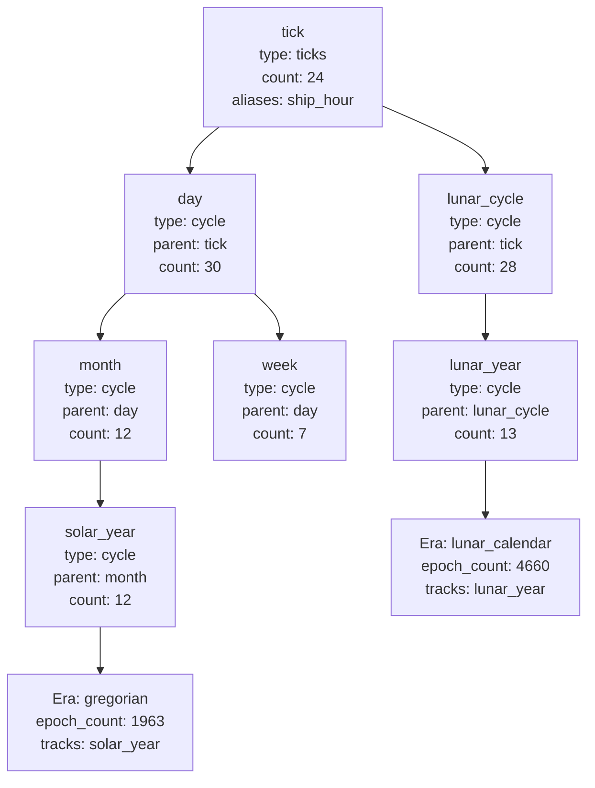

# Design: In-Game Time System

## Context

Games without a real-world tie-in — dungeon crawlers, fantasy epics, space operas, historical simulators — have no way to express the passage of in-game time. The engine provides `calendar_utils.py` for real-world calendar conditions, but has no concept of a game clock, in-game seasons, or narrative eras that advance as a character plays.

The roadmap item "In-Game Time System" calls for an opt-in system that allows each game to define its own calendar structure. The key design constraint from that item is that the system must be invisible to games that don't use it: existing games must continue working with zero changes.

**Current state before this change:**

| Element                                             | Current State                         |
| --------------------------------------------------- | ------------------------------------- |
| `game.yaml` time config                             | Not present                           |
| In-game tick counters                               | Not present                           |
| Condition predicates for in-game time               | Not present                           |
| `adjust_game_ticks` effect                          | Not present                           |
| `ingame_time` template variable                     | Not present                           |
| `cooldown_adventures` repeat control                | Present; tick-unaware                 |
| `adventure_last_completed_at_total` character state | Present; counts adventures, not ticks |

---

## Goals / Non-Goals

**Goals:**

- Opt-in `time:` block in `game.yaml` that defines the game's calendar as a directed acyclic graph of named cycles.
- A single root cycle (one tick = one base unit) with derived cycles branching from any node by name.
- Root cycle supports `aliases` so multiple narrative names can refer to the same underlying unit.
- Named eras that track a cycle counter, with condition-based activation so eras can have bounded lifespans.
- Named epoch: the calendar position (expressed as cycle label or index values) corresponding to tick zero.
- Dual clock: monotone `internal_ticks` (never directly adjusted, used for cooldowns and effect expiry) and adjustable `game_ticks` (narrative time, used for calendar display and calendar-based conditions).
- Both clocks reset to zero on new iteration. Both advance together by the same tick cost on adventure completion.
- `adjust_game_ticks` effect on adventures: delta-adjusts `game_ticks` only; subject to `pre_epoch_behavior`.
- Three new condition predicates: `game_calendar_time_is` (numeric on either clock), `game_calendar_cycle_is` (named cycle label), `game_calendar_era_is` (era active/inactive state).
- `ingame_time` object in the template `ExpressionContext` exposing both clocks, all cycle labels, and era state.
- Unify repeat controls: new `cooldown_ticks` (internal clock, default) and `cooldown_game_ticks` (game clock); deprecate `cooldown_adventures` with a load warning that maps it to `cooldown_ticks`.
- Database migration: two new BigInteger columns on `CharacterIterationRecord`; a new `character_iteration_era_state` child table; and a renamed column on `character_iteration_adventure_state`.

**Non-Goals:**

- Absolute `set_game_ticks` effect (deferred to roadmap).
- Backward-counting eras (BC/AD style; deferred to roadmap).
- Multiple independent root cycles per game.
- Gregorian calendar accuracy (use existing `calendar_utils.py` for real-world time; this system is for invented/stylized calendars).
- Any TUI changes beyond what naturally falls out of template exposure (deferred to roadmap).

---

## Decisions

### Decision 1 — Dual Clock: `internal_ticks` and `game_ticks`

**Decision**: Two integer tick counters live on `CharacterIterationRecord` and `CharacterState`. `internal_ticks` is monotone — it only ever increments, never adjusts, and resets to zero on new iteration. `game_ticks` is the narrative clock — it also advances on adventure completion, but can be delta-adjusted by the `adjust_game_ticks` effect.

**Rationale**: A game that allows time manipulation (a time-travel adventure, a "rewind" mechanic, an event that permanently moves the calendar forward by a season) would break effect timeouts and cooldowns if only a single mutable clock existed. The internal clock provides a reliable, tamper-proof basis for "how much time has genuinely passed in this run." The game clock is the narrative display clock that authors can adjust. Both reset on new iteration because both represent "time elapsed in this run."

**Alternative considered**: A single mutable clock with a separate "elapsed tick count" derived field. Rejected — keeping two explicit named fields is clearer and less error-prone.

### Decision 2 — Cycle DAG with Typed Discriminants

**Decision**: Cycles are declared as a list of discriminated-union objects. There are two types:

- `type: ticks` — the root cycle; `count` is the number of labels in the display (e.g. 24 for hours in a day); `aliases` is an optional list of alternative names that resolve to this cycle. Exactly one root cycle is allowed per game.
- `type: cycle` — a derived cycle; `parent` names another declared cycle (by name or alias); `count` is how many of the parent unit make one of this unit.

This mirrors the existing discriminated-union pattern used throughout `models/base.py` and `models/adventure.py`.

**Rationale**: The `type` discriminant field avoids dynamic field names (no `weeks: 4` dict keys that depend on the cycle taxonomy). All cycles are equal citizens — there is no separate "parallel cycles" concept. A moon phase cycle and a season cycle are both just cycles; the only difference is whether an era tracks them.

**Alternative considered**: A flat list with a `period: ticks` vs `period: {type: cycle, name: X, count: N}` distinction. Rejected — it splits period declaration across two different shapes and is less consistent with the rest of the codebase.

### Decision 3 — Root Cycle Aliases Eliminate Multi-Root Complexity

**Decision**: The root cycle (type `ticks`) accepts an optional `aliases: List[str]` field. Any alias name resolves to the root cycle for purposes of `parent` references, epoch specifications, and condition `cycle` fields.

**Rationale**: In a game with both a "ship's clock" and a "station clock" narrative framing but a single underlying tick unit, aliases allow the author to write `parent: ship_hour` and `parent: station_hour` and have both resolve correctly without creating two truly independent time systems.

### Decision 4 — Epoch is a Named Position, Not a Raw Tick Offset

**Decision**: The `epoch:` block is a mapping of cycle name → value (label string or 1-based integer index). It specifies where in the cycle structure tick zero falls. The engine pre-computes `epoch_tick_offset` at load time: the internal tick distance from the start of the outer-most cycle to the epoch position. This offset is added to `game_ticks` before computing cycle positions.

**Rationale**: An author writing a JFK assassination game wants to say "November 22, 1963" — not "tick 87,648." Named epoch positions are human-readable and directly correspond to the labels the author defined. If only `game_ticks` and `internal_ticks` are needed (no cycle structure), the epoch is not required.

**Example**: With cycles `hour(24) → day(30) → month(12)` and `epoch: {month: March, day: 15}`, if each hour is one tick, the offset is `(2 * 30 * 24) + (14 * 24) = 1776 ticks`. When `game_ticks = 0`, the engine reads cycle positions as if it were at tick 1776 in the repeating structure.

### Decision 5 — Eras Use a Latch Model: One-Shot Start and End Conditions

**Decision**: Each era has two optional condition fields: `start_condition` and `end_condition`. Both use the standard condition evaluator, but each fires at most once per character iteration:

- When `start_condition` is absent, the era activates at tick 0 and is treated as always-started.
- When `start_condition` is present, the engine evaluates it after each tick advancement. The first time it returns true, the era activates: `player.era_started_at_ticks[era.name]` is set to the current `game_ticks`. It is never re-evaluated after that.
- When `end_condition` is present and the era is active, the engine evaluates it after each tick advancement. The first time it returns true, the era deactivates: `player.era_ended_at_ticks[era.name]` is set to the current `game_ticks`. It is never re-evaluated after that.
- **An era that has ended can never restart in the same iteration.** Once `era_ended_at_ticks[era.name]` is set, `update_era_states()` skips that era entirely — `start_condition` is not re-evaluated even if it would return true again. This is the fundamental distinction between an era and a cycle: an era happens at most once per iteration.
- An era with neither condition is always active for the entire iteration.

This evaluation is performed by a new `update_era_states()` function called in `pipeline.py` **after** both tick counters advance on adventure completion.

**Rationale**: A re-evaluated condition model produces era counts that are relative to tick 0, not to the activation point. That is almost never what an author intends — when a new era starts, they expect "Year 1" to appear, not "Year 298." The latch model makes the count semantics unambiguous: the era counter always starts at `epoch_count` the moment the era activates, and advances from there regardless of what the underlying game clock reads.

The no-restart rule prevents a pathological case where an era's start condition becomes true again after the era ends (e.g., a milestone condition that is always true). Authors who genuinely need a repeating named period should model it as a cycle with labels, not as an era.

The condition evaluator remains the universal gate — an author still expresses "the empire begins at year 10" as a `game_calendar_time_is` condition; they express "the empire ends when the emperor dies" as a milestone condition. The only change is that the engine records the exact tick of first activation rather than re-polling every tick.

**Era state fields on `CharacterState`**: Two new dicts, `era_started_at_ticks: Dict[str, int]` and `era_ended_at_ticks: Dict[str, int]`, are added to the character state. Both are serialized in `to_dict` / `from_dict` with a default of `{}`. They are reset on new iteration because both clocks reset to 0.

### Decision 6 — Era Uses `epoch_count` and `{count}` Template Variable

**Decision**: The starting counter value for an era is named `epoch_count`. The format string uses `{count}` as the template variable. Neither uses `year` because the tracked cycle might be `lunar_year`, `reign`, `age`, or any other author-defined name.

`epoch_count` is the counter value at the **moment the era activates** — i.e., the value displayed as `{count}` on the very first tick the era is active. For a `start_condition`-less era (always active), that is tick 0. For a conditioned era, it is whatever `game_ticks` value triggers the start condition.

**Rationale**: Hard-coding "year" as a concept would violate the design philosophy's "author-defined vocabulary" principle. The era tracks whatever cycle is named in `tracks`; that cycle has no intrinsic connection to the concept of a year. By tying `epoch_count` to the activation tick rather than tick 0, the author can simply write `epoch_count: 1` and always get "Year 1" on activation — no arithmetic calibration required.

### Decision 7 — `cooldown_adventures` Deprecated, Maps to `cooldown_ticks`

**Decision**: `cooldown_adventures` on `AdventureSpec` is deprecated. At manifest load time, if `cooldown_adventures` is set, a load warning is emitted and its value is assigned to `cooldown_ticks`. The field is not removed from the Pydantic model (yet) to maintain backward compatibility.

**Rationale**: When the time system is not configured, `ticks_per_adventure` defaults to 1 and `internal_ticks` increments by 1 per adventure. Therefore `cooldown_ticks: N` is semantically identical to the old `cooldown_adventures: N` for all games without explicit time configuration. Existing content does not break; authors are gently migrated to the new field name.

**Character state**: `adventure_last_completed_at_total` is renamed to `adventure_last_completed_at_ticks` and records the `internal_ticks` value at last completion. The `from_dict` deserializer accepts both the old key (for backward compatibility) and the new key.

### Decision 8 — `pre_epoch_behavior` Governs `game_ticks` Floor

**Decision**: `GameTimeSpec` carries a `pre_epoch_behavior: Literal["clamp", "allow"] = "clamp"` field. When `clamp`, `adjust_game_ticks` effects that would push `game_ticks` below zero are silently clamped at zero. When `allow`, negative `game_ticks` are permitted and cycle positions are computed with the epoch offset applied (so the calendar continues backward from the epoch).

**Rationale**: Most authors writing a time-manipulation adventure do not intend for the game clock to go negative; clamping is the safe default. Authors of games with explicit "time travel to before the epoch" mechanics can opt in.

### Decision 9 — Eras Require a Declared Cycle

**Decision**: The `EraSpec.tracks` field must reference a cycle declared in `time.cycles`. There is no `ticks_per_year` escape hatch. A game that wants an era counter must declare at least a minimal cycle chain — even a single root cycle with `count: 1` is sufficient (one tick = one unit of that cycle).

**Rationale**: A `ticks_per_year` fallback would duplicate the role of the cycle DAG with a bespoke, weakly-typed integer. The cycle system already provides exactly this: a named unit with a known tick-to-unit ratio. An author who only needs "Year 4660 of the realm" without hours or seasons simply writes one root cycle and one derived cycle for years — no extra concept is introduced.

---

## Architecture

### Cycle DAG: Data Flow



### Tick Resolution: Computing Cycle Position

At any `game_ticks` value T', the effective tick for display is `T_eff = T' + epoch_offset`. For any cycle C with a computed `ticks_per_cycle` (the product of `count` values from root to C), the current position index within the cycle is:

```
position_within_cycle = (T_eff // ticks_per_own_unit) % cycle.count
```

Where `ticks_per_own_unit` is the product of all ancestor `count` values (the number of ticks in one of C's own units). If `labels` is defined, the current label is `labels[position_within_cycle]`. If not, the display is `f"{cycle.name} {position_within_cycle + 1}"`.

### The `InGameTimeResolver`

A new helper class `InGameTimeResolver` is instantiated with the loaded `GameTimeSpec` (from the registry) and pre-computed `epoch_offset`. It provides:

```python
@dataclass
class CycleState:
    name: str
    position: int      # 0-based index within the cycle
    label: str         # label or "Name N" if unlabeled

@dataclass
class EraState:
    name: str
    count: int         # epoch_count + completed full cycles since era start
    active: bool

class InGameTimeResolver:
    def __init__(self, spec: GameTimeSpec, epoch_offset: int) -> None: ...

    def resolve(
        self,
        game_ticks: int,
        internal_ticks: int,
        player: CharacterState,
        registry: ContentRegistry | None,
    ) -> InGameTimeView: ...
```

`InGameTimeView` is an immutable dataclass with all resolved state, used by both the template engine and the condition evaluator. The resolver is constructed once per registry load and attached to the registry for reuse across all evaluations.

---

## Implementation

### New File: `oscilla/engine/models/time.py`

All new Pydantic models for the time system live in a dedicated module to keep `game.py` tractable.

````python
"""In-game time system manifest models.

All models are Pydantic BaseModel subclasses following the same conventions
as the rest of oscilla/engine/models/. Loaded via GameSpec.time.
"""

from __future__ import annotations

from typing import Annotated, List, Literal, Union

from pydantic import BaseModel, Field, model_validator


class RootCycleSpec(BaseModel):
    """The base tick unit. Exactly one root cycle is allowed per game.

    count: number of display labels (e.g. 24 for an hour cycle with named hours).
    aliases: additional names that resolve to this cycle in parent references,
             epoch specifications, and condition cycle fields.
    labels: optional display names. Must have exactly count entries if supplied.
    """

    type: Literal["ticks"]
    name: str
    count: int = Field(ge=1)
    aliases: List[str] = Field(default_factory=list)
    labels: List[str] = Field(default_factory=list)

    @model_validator(mode="after")
    def validate_labels(self) -> "RootCycleSpec":
        if self.labels and len(self.labels) != self.count:
            raise ValueError(
                f"RootCycleSpec {self.name!r}: labels list has {len(self.labels)} entries "
                f"but count is {self.count}. They must match exactly."
            )
        return self


class DerivedCycleSpec(BaseModel):
    """A cycle derived from a parent cycle.

    parent: name or alias of the parent cycle.
    count: how many parent units make one of this unit (e.g. 7 days per week).
    labels: optional display names. Must have exactly count entries if supplied.
    """

    type: Literal["cycle"]
    name: str
    parent: str
    count: int = Field(ge=1)
    labels: List[str] = Field(default_factory=list)

    @model_validator(mode="after")
    def validate_labels(self) -> "DerivedCycleSpec":
        if self.labels and len(self.labels) != self.count:
            raise ValueError(
                f"DerivedCycleSpec {self.name!r}: labels list has {len(self.labels)} entries "
                f"but count is {self.count}. They must match exactly."
            )
        return self


CycleSpec = Annotated[Union[RootCycleSpec, DerivedCycleSpec], Field(discriminator="type")]


class EraSpec(BaseModel):
    """A named counter that tracks the number of completed cycles of a given type.

    name: unique identifier for this era (used in conditions and templates).
    format: Python str.format-style string with a {count} variable.
            Example: "{count} AC" produces "298 AC".
    epoch_count: the counter value at the moment of era activation (the first tick
                 the era is active). For always-active eras (no start_condition),
                 this is the value at tick 0. Default: 1.
    tracks: the cycle name whose completions increment the counter.
            Must reference a cycle declared in time.cycles.
    start_condition: fires at most once. When first true, the era activates and
                     current game_ticks is recorded as era_started_at_ticks.
                     When absent, the era is always active from tick 0.
    end_condition: fires at most once after the era activates. When first true,
                   the era deactivates and current game_ticks is recorded as
                   era_ended_at_ticks. When absent, the era never ends.
    """

    name: str
    format: str = Field(description='Format string with {count} variable. Example: "{count} AC"')
    epoch_count: int = Field(default=1)
    tracks: str
    start_condition: "Condition | None" = None  # type: ignore[name-defined]  # forward ref
    end_condition: "Condition | None" = None  # type: ignore[name-defined]  # forward ref


class GameTimeSpec(BaseModel):
    """Top-level in-game time configuration block in game.yaml spec.time.

    epoch is a plain mapping of cycle-name (or alias) to label string or 1-based
    integer index. YAML authors write it as flat keys:

        epoch:
          month: March
          day: 15

    Pydantic parses this naturally as dict[str, int | str]. Semantic validation
    resolves cycle names and validates label values.
    """

    ticks_per_adventure: int = Field(default=1, ge=1)
    base_unit: str = Field(default="tick", description="Display label for one tick.")
    pre_epoch_behavior: Literal["clamp", "allow"] = "clamp"
    cycles: List[CycleSpec] = Field(default_factory=list)
    # Flat mapping of cycle-name → label or 1-based integer. Empty dict = no epoch shift.
    epoch: dict[str, int | str] = Field(default_factory=dict)
    eras: List[EraSpec] = Field(default_factory=list)

### Modified File: `oscilla/engine/models/game.py`

**Before:**

```python
class GameSpec(BaseModel):
    displayName: str
    description: str = ""
    xp_thresholds: List[int] = Field(min_length=1)
    hp_formula: HpFormula
    item_labels: List[ItemLabelDef] = []
    passive_effects: List[PassiveEffect] = []
    outcomes: List[str] = Field(default_factory=list)
    season_hemisphere: Literal["northern", "southern"] = "northern"
    timezone: str | None = None
````

**After:**

```python
from oscilla.engine.models.time import GameTimeSpec

class GameSpec(BaseModel):
    displayName: str
    description: str = ""
    xp_thresholds: List[int] = Field(min_length=1)
    hp_formula: HpFormula
    item_labels: List[ItemLabelDef] = []
    passive_effects: List[PassiveEffect] = []
    outcomes: List[str] = Field(default_factory=list)
    season_hemisphere: Literal["northern", "southern"] = "northern"
    timezone: str | None = None
    # Optional in-game time system. When absent, all ingame_time features
    # are disabled and existing behaviour is fully preserved.
    time: GameTimeSpec | None = None
```

### Modified File: `oscilla/engine/models/adventure.py`

Add `ticks` field to `AdventureSpec`. Add `cooldown_ticks` and `cooldown_game_ticks`. Deprecate `cooldown_adventures`.

**Before (relevant section):**

```python
class AdventureSpec(BaseModel):
    displayName: str
    description: str = ""
    requires: Condition | None = None
    steps: List[Step]
    repeatable: bool = Field(default=True, description="Set to False to make this a one-shot adventure.")
    max_completions: int | None = Field(default=None, description="Hard cap on total completions this iteration.")
    cooldown_days: int | None = Field(default=None, description="Calendar days that must pass between runs.")
    cooldown_adventures: int | None = Field(
        default=None,
        description="Total adventures completed that must pass since last run.",
    )
```

**After:**

```python
class AdventureSpec(BaseModel):
    displayName: str
    description: str = ""
    requires: Condition | None = None
    steps: List[Step]
    # Tick cost for this adventure. Defaults to game.time.ticks_per_adventure when time
    # is configured, or 1 when time is not configured.
    ticks: int | None = Field(default=None, ge=1, description="Tick cost for this adventure.")
    # Repeat controls.
    repeatable: bool = Field(default=True, description="Set to False to make this a one-shot adventure.")
    max_completions: int | None = Field(default=None, description="Hard cap on total completions this iteration.")
    cooldown_days: int | None = Field(default=None, description="Calendar days that must pass between runs.")
    # cooldown_adventures is deprecated. Use cooldown_ticks instead.
    # At load time, cooldown_adventures is mapped to cooldown_ticks with a warning.
    cooldown_adventures: int | None = Field(
        default=None,
        description="Deprecated. Use cooldown_ticks instead.",
        exclude=True,
    )
    cooldown_ticks: int | None = Field(
        default=None,
        description="internal_ticks that must pass since last completion (default clock for cooldowns).",
    )
    cooldown_game_ticks: int | None = Field(
        default=None,
        description="game_ticks that must pass since last completion.",
    )

    @model_validator(mode="after")
    def migrate_deprecated_cooldown_adventures(self) -> "AdventureSpec":
        """Map deprecated cooldown_adventures to cooldown_ticks with a load warning."""
        if self.cooldown_adventures is not None:
            import logging
            logging.getLogger(__name__).warning(
                "Adventure uses deprecated 'cooldown_adventures' — use 'cooldown_ticks' instead. "
                "Mapping %d → cooldown_ticks.",
                self.cooldown_adventures,
            )
            if self.cooldown_ticks is None:
                self.cooldown_ticks = self.cooldown_adventures
            self.cooldown_adventures = None
        return self
```

**New effect model** (add to the `Effect` union in `models/adventure.py`):

```python
class AdjustGameTicksEffect(BaseModel):
    """Adjust the character's game_ticks by a signed integer delta.

    Positive delta moves the game clock forward; negative moves it backward.
    The internal_ticks counter is never affected by this effect.
    Clamping at zero is controlled by game.time.pre_epoch_behavior.
    """

    type: Literal["adjust_game_ticks"]
    delta: int = Field(description="Signed integer tick adjustment. May be negative.")
```

### Modified File: `oscilla/engine/models/base.py`

Add three new condition model classes and register them in the `Condition` union.

**New classes (add after `TimeBetweenCondition`):**

```python
class GameCalendarTimeCondition(BaseModel):
    """Numeric comparison against internal_ticks or game_ticks.

    clock: "internal" (default) uses internal_ticks — the monotone clock.
           "game" uses game_ticks — the narrative clock, adjustable by effects.

    At least one of gt/gte/lt/lte/eq/mod must be set.
    Only valid when game.time is configured; evaluates False with a warning otherwise.
    """

    type: Literal["game_calendar_time_is"]
    clock: Literal["internal", "game"] = "internal"
    gt: int | None = None
    gte: int | None = None
    lt: int | None = None
    lte: int | None = None
    eq: int | None = None
    mod: "NumericMod | None" = None  # same NumericMod from PrestigeCountCondition

    @model_validator(mode="after")
    def at_least_one_comparator(self) -> "GameCalendarTimeCondition":
        if all(
            v is None for v in (self.gt, self.gte, self.lt, self.lte, self.eq, self.mod)
        ):
            raise ValueError(
                "game_calendar_time_is condition must specify at least one of: gt, gte, lt, lte, eq, mod"
            )
        return self


class GameCalendarCycleCondition(BaseModel):
    """Tests the current label of any named cycle (primary or parallel) against a value.

    cycle: the cycle name or alias to query.
    value: the expected label string. Validated against declared labels at load time
           by the semantic validator.

    Only valid when game.time defines the named cycle; evaluates False with a warning otherwise.
    """

    type: Literal["game_calendar_cycle_is"]
    cycle: str
    value: str


class GameCalendarEraCondition(BaseModel):
    """Tests whether a named era is currently active or inactive.

    era: the era name to query.
    state: "active" (default) evaluates to True when the era's condition is met.
           "inactive" is the logical negation.

    Only valid when game.time defines the named era; evaluates False with a warning otherwise.
    """

    type: Literal["game_calendar_era_is"]
    era: str
    state: Literal["active", "inactive"] = "active"
```

**Updated `Condition` union** — add the three new types to `Condition` (before `AllCondition`):

```python
Condition = Annotated[
    Union[
        # ... all existing types ...
        GameCalendarTimeCondition,
        GameCalendarCycleCondition,
        GameCalendarEraCondition,
        AllCondition,
        AnyCondition,
        NotCondition,
    ],
    Field(discriminator="type"),
]
```

### New File: `oscilla/engine/ingame_time.py`

The `InGameTimeResolver` and `InGameTimeView` live here, isolated from character state.

```python
"""In-game time resolver.

Converts raw tick counters (internal_ticks, game_ticks) into human-readable
calendar state using the game's configured time system.

The resolver is constructed once per registry load. It holds the pre-computed
epoch_offset (number of ticks to add to game_ticks before computing cycle
positions) and the resolved ticks_per_cycle map.
"""

from __future__ import annotations

from dataclasses import dataclass, field
from logging import getLogger
from typing import TYPE_CHECKING, Dict, List

if TYPE_CHECKING:
    from oscilla.engine.character import CharacterState
    from oscilla.engine.models.time import CycleSpec, EraSpec, GameTimeSpec, RootCycleSpec, DerivedCycleSpec
    from oscilla.engine.registry import ContentRegistry

logger = getLogger(__name__)


@dataclass(frozen=True)
class CycleState:
    """Resolved state for a single cycle at a given tick value."""

    name: str
    position: int   # 0-based index within the cycle
    label: str      # display label; "Name N" if no labels declared


@dataclass(frozen=True)
class EraState:
    """Resolved state for a single era at a given tick value."""

    name: str
    # epoch_count + completed full tracked cycles since era activation.
    # Equals epoch_count on the first tick the era is active.
    # Not meaningful when active is False and the era has never started.
    count: int
    active: bool


@dataclass(frozen=True)
class InGameTimeView:
    """Fully resolved in-game time state for a single tick snapshot.

    Exposed as ingame_time in the template ExpressionContext.
    Used by the condition evaluator for all three game_calendar_* predicates.
    """

    internal_ticks: int
    game_ticks: int
    cycles: Dict[str, CycleState] = field(default_factory=dict)
    eras: Dict[str, EraState] = field(default_factory=dict)

    def cycle(self, name: str) -> CycleState | None:
        """Return the CycleState for the given name, resolving aliases."""
        return self.cycles.get(name)

    def era(self, name: str) -> EraState | None:
        """Return the EraState for the given era name."""
        return self.eras.get(name)


class InGameTimeResolver:
    """Converts tick counters to InGameTimeView using a pre-analyzed GameTimeSpec.

    Constructed once at registry load time. All heavy cycle-graph computation
    (ticks_per_cycle, epoch_offset, alias resolution) is done in __init__ so
    that resolve() is pure arithmetic with no lookups.
    """

    def __init__(self, spec: "GameTimeSpec", epoch_offset: int) -> None:
        self._spec = spec
        self._epoch_offset = epoch_offset
        # Map every cycle name (and alias) to its canonical CycleSpec.
        self._by_name: Dict[str, "CycleSpec"] = {}
        for cycle in spec.cycles:
            self._by_name[cycle.name] = cycle
            if hasattr(cycle, "aliases"):
                for alias in cycle.aliases:  # type: ignore[union-attr]
                    self._by_name[alias] = cycle
        # Pre-compute ticks_per_cycle for every cycle.
        # ticks_per_unit[name] = number of root ticks in one unit of that cycle.
        self._ticks_per_unit: Dict[str, int] = {}
        for cycle in spec.cycles:
            self._ticks_per_unit[cycle.name] = self._compute_ticks_per_unit(cycle.name)

    def _compute_ticks_per_unit(self, name: str) -> int:
        """Recursively compute how many ticks make one unit of the named cycle."""
        cycle = self._by_name.get(name)
        if cycle is None:
            raise ValueError(f"Unknown cycle {name!r}")
        if cycle.type == "ticks":
            # Root cycle: 1 tick = 1 unit of this cycle.
            # count is the number of labels, not the tick-per-unit for this level.
            return 1
        # DerivedCycleSpec: one unit = parent.count × parent.ticks_per_unit
        parent = self._by_name[cycle.parent]  # type: ignore[union-attr]
        parent_ticks = self._compute_ticks_per_unit(parent.name)
        # ticks per unit of THIS cycle = count * ticks_per_unit_of_parent
        return cycle.count * parent_ticks  # type: ignore[union-attr]

    def _cycle_label(self, cycle_name: str, effective_ticks: int) -> CycleState:
        from oscilla.engine.models.time import DerivedCycleSpec, RootCycleSpec
        cycle = self._by_name[cycle_name]
        # Canonical cycle name for output (not alias)
        canonical = cycle.name
        # ticks per unit of the parent level determines the "ones digit" for this cycle
        if cycle.type == "ticks":
            # For root cycle, position is simply ticks modulo its count
            ticks_per_parent = 1
        else:
            parent = self._by_name[cycle.parent]  # type: ignore[union-attr]
            ticks_per_parent = self._ticks_per_unit[parent.name]
        position = (effective_ticks // ticks_per_parent) % cycle.count
        labels = cycle.labels if cycle.labels else []
        if labels:
            label = labels[position]
        else:
            label = f"{canonical} {position + 1}"
        return CycleState(name=canonical, position=position, label=label)

    def resolve(
        self,
        game_ticks: int,
        internal_ticks: int,
        player: "CharacterState",
        registry: "ContentRegistry | None",
    ) -> InGameTimeView:
        """Resolve both clocks into a full InGameTimeView."""
        effective_game = game_ticks + self._epoch_offset

        cycles: Dict[str, CycleState] = {}
        for cycle in self._spec.cycles:
            state = self._cycle_label(cycle.name, effective_game)
            cycles[cycle.name] = state
            # Also register under aliases for direct lookup
            if hasattr(cycle, "aliases"):
                for alias in cycle.aliases:  # type: ignore[union-attr]
                    cycles[alias] = state

        eras: Dict[str, EraState] = {}
        for era in self._spec.eras:
            # Determine activation tick. Always-active eras (no start_condition) are
            # treated as started at tick 0; conditioned eras look up the latch dict.
            if era.start_condition is None:
                started_at: int | None = 0
            else:
                started_at = player.era_started_at_ticks.get(era.name)

            ended = era.name in player.era_ended_at_ticks
            active = started_at is not None and not ended

            if started_at is not None:
                # Count: epoch_count + full tracked cycles completed since activation.
                # era.tracks is guaranteed to be a declared cycle by the semantic validator.
                ticks_per_tracked = self._ticks_per_unit[era.tracks]
                count = era.epoch_count + ((game_ticks - started_at) // ticks_per_tracked)
            else:
                # Era has not yet started; count is not displayable but we still populate.
                count = era.epoch_count

            eras[era.name] = EraState(name=era.name, count=count, active=active)

        return InGameTimeView(
            internal_ticks=internal_ticks,
            game_ticks=game_ticks,
            cycles=cycles,
            eras=eras,
        )
```

### Modified File: `oscilla/engine/character.py`

**Add `internal_ticks` and `game_ticks` to `CharacterState`:**

**Before (from the `adventure_last_completed_at_total` section):**

```python
    # Repeat-control tracking: ISO date (YYYY-MM-DD) when each adventure was last completed.
    adventure_last_completed_on: Dict[str, str] = field(default_factory=dict)
    # Total adventures_completed sum at the time each adventure was last completed.
    adventure_last_completed_at_total: Dict[str, int] = field(default_factory=dict)
```

**After:**

```python
    # Repeat-control tracking: ISO date (YYYY-MM-DD) when each adventure was last completed.
    adventure_last_completed_on: Dict[str, str] = field(default_factory=dict)
    # internal_ticks value at the time each adventure was last completed.
    # Replaces the deprecated adventure_last_completed_at_total (adventure count).
    adventure_last_completed_at_ticks: Dict[str, int] = field(default_factory=dict)
    # In-game tick counters. Both reset to 0 on new iteration.
    # internal_ticks: monotone; only advances on adventure completion; never adjusted by effects.
    # game_ticks: narrative clock; advances on completion; adjustable by adjust_game_ticks effect.
    internal_ticks: int = 0
    game_ticks: int = 0
    # Era activation/deactivation latch dicts. Keyed by era name; value is game_ticks when
    # the era's start_condition (or end_condition) first evaluated true. Populated by
    # update_era_states() in pipeline.py after each tick advancement. Reset on new iteration.
    era_started_at_ticks: Dict[str, int] = field(default_factory=dict)
    era_ended_at_ticks: Dict[str, int] = field(default_factory=dict)
```

**Update `is_adventure_eligible`:**

**Before:**

```python
    def is_adventure_eligible(
        self,
        adventure_ref: str,
        spec: "AdventureSpec",
        today: "date",
    ) -> bool:
        ...
        # cooldown_adventures (total adventures completed since last run)
        if spec.cooldown_adventures is not None:
            last_total = self.adventure_last_completed_at_total.get(adventure_ref)
            if last_total is not None:
                total_now = sum(self.statistics.adventures_completed.values())
                if total_now - last_total < spec.cooldown_adventures:
                    return False

        return True
```

**After:**

```python
    def is_adventure_eligible(
        self,
        adventure_ref: str,
        spec: "AdventureSpec",
        today: "date",
    ) -> bool:
        ...
        # cooldown_ticks (internal_ticks elapsed since last run — default tick-based cooldown)
        if spec.cooldown_ticks is not None:
            last_ticks = self.adventure_last_completed_at_ticks.get(adventure_ref)
            if last_ticks is not None:
                if self.internal_ticks - last_ticks < spec.cooldown_ticks:
                    return False

        # cooldown_game_ticks (game_ticks elapsed since last run — narrative clock cooldown)
        if spec.cooldown_game_ticks is not None:
            last_game_ticks = self.adventure_last_completed_at_ticks.get(
                f"__game__{adventure_ref}"
            )
            if last_game_ticks is not None:
                if self.game_ticks - last_game_ticks < spec.cooldown_game_ticks:
                    return False

        return True
```

> **Note**: `game_ticks` cooldown tracking uses a prefixed key `__game__{adventure_ref}` in `adventure_last_completed_at_ticks` to avoid introducing a second parallel dict. A dedicated `adventure_last_completed_at_game_ticks: Dict[str, int]` dict is an equally valid alternative — prefer it if the namespace pollution of the prefix is considered too implicit. The task author should choose one during implementation and document the decision.

**Update serialization** (the `to_dict` method):

**Before:**

```python
            "adventure_last_completed_on": dict(self.adventure_last_completed_on),
            "adventure_last_completed_at_total": dict(self.adventure_last_completed_at_total),
```

**After:**

```python
            "adventure_last_completed_on": dict(self.adventure_last_completed_on),
            "adventure_last_completed_at_ticks": dict(self.adventure_last_completed_at_ticks),
            "internal_ticks": self.internal_ticks,
            "game_ticks": self.game_ticks,
            "era_started_at_ticks": dict(self.era_started_at_ticks),
            "era_ended_at_ticks": dict(self.era_ended_at_ticks),
```

**Update deserialization** (the `from_dict` classmethod):

**Before:**

```python
            adventure_last_completed_on=dict(data.get("adventure_last_completed_on", {})),
            adventure_last_completed_at_total=dict(data.get("adventure_last_completed_at_total", {})),
```

**After:**

```python
            adventure_last_completed_on=dict(data.get("adventure_last_completed_on", {})),
            # Accept both old key (adventure_last_completed_at_total) and new key for backward compat.
            adventure_last_completed_at_ticks=dict(
                data.get("adventure_last_completed_at_ticks")
                or data.get("adventure_last_completed_at_total", {})
            ),
            internal_ticks=int(data.get("internal_ticks", 0)),
            game_ticks=int(data.get("game_ticks", 0)),
            era_started_at_ticks=dict(data.get("era_started_at_ticks", {})),
            era_ended_at_ticks=dict(data.get("era_ended_at_ticks", {})),
```

### Modified File: `oscilla/models/character_iteration.py`

**Change 1 — add tick counter columns to `CharacterIterationRecord`.**

Add two BigInteger columns after `version`. They default to 0 so existing rows remain valid.

**Before (after the `version` column):**

```python
    version: Mapped[int] = mapped_column(Integer, nullable=False, default=0)

    # Session soft-lock — detects and recovers from dead processes (see design D11).
```

**After:**

```python
    version: Mapped[int] = mapped_column(Integer, nullable=False, default=0)

    # In-game tick counters. Both reset to 0 on new iteration.
    # Stored as BigInteger to accommodate games with very high tick rates or long runs.
    internal_ticks: Mapped[int] = mapped_column(BigInteger, nullable=False, default=0)
    game_ticks: Mapped[int] = mapped_column(BigInteger, nullable=False, default=0)

    # Session soft-lock — detects and recovers from dead processes (see design D11).
```

Also add the new `era_state_rows` relationship alongside the other child relationships:

```python
    era_state_rows: Mapped[List["CharacterIterationEraState"]] = relationship(
        "CharacterIterationEraState", back_populates="iteration", cascade="all, delete-orphan"
    )
```

**Change 2 — rename column on `CharacterIterationAdventureState`.**

Rename `last_completed_at_total` to `last_completed_at_ticks` and change its meaning from "total adventures completed" to "`internal_ticks` at last completion." Existing rows default to `NULL` (unchanged behaviour — `NULL` means the adventure has never been completed this iteration).

**Before:**

```python
class CharacterIterationAdventureState(Base):
    """One row per adventure that has been completed at least once this iteration.

    last_completed_on is the ISO-8601 date string (YYYY-MM-DD) of the most
    recent completion — used for cooldown_days checks.
    last_completed_at_total is the total adventures_completed count at the time
    of the most recent completion — used for cooldown_adventures checks.
    """

    __tablename__ = "character_iteration_adventure_state"

    iteration_id: Mapped[UUID] = mapped_column(ForeignKey("character_iterations.id"), primary_key=True, nullable=False)
    adventure_ref: Mapped[str] = mapped_column(String, primary_key=True)
    last_completed_on: Mapped[str | None] = mapped_column(String, nullable=True)
    last_completed_at_total: Mapped[int | None] = mapped_column(Integer, nullable=True)
```

**After:**

```python
class CharacterIterationAdventureState(Base):
    """One row per adventure that has been completed at least once this iteration.

    last_completed_on is the ISO-8601 date string (YYYY-MM-DD) of the most
    recent completion — used for cooldown_days checks.
    last_completed_at_ticks is the internal_ticks value at the time of the most
    recent completion — used for cooldown_ticks and cooldown_game_ticks checks.
    """

    __tablename__ = "character_iteration_adventure_state"

    iteration_id: Mapped[UUID] = mapped_column(ForeignKey("character_iterations.id"), primary_key=True, nullable=False)
    adventure_ref: Mapped[str] = mapped_column(String, primary_key=True)
    last_completed_on: Mapped[str | None] = mapped_column(String, nullable=True)
    last_completed_at_ticks: Mapped[int | None] = mapped_column(BigInteger, nullable=True)
```

**Change 3 — add `CharacterIterationEraState` child table.**

One row per era that has been started or ended this iteration. Both tick columns are nullable: `started_at_game_ticks` is NULL until the era activates; `ended_at_game_ticks` is NULL until it deactivates. For always-active eras (no `start_condition`), `started_at_game_ticks` is stored as 0.

```python
class CharacterIterationEraState(Base):
    """One row per era that has activated or deactivated this iteration.

    started_at_game_ticks: game_ticks at the moment the era's start_condition
        first evaluated true (or 0 for always-active eras). NULL if the era
        has not yet started.
    ended_at_game_ticks: game_ticks at the moment the era's end_condition first
        evaluated true. NULL if the era has not yet ended (or has no end_condition).
    """

    __tablename__ = "character_iteration_era_state"

    iteration_id: Mapped[UUID] = mapped_column(
        ForeignKey("character_iterations.id"), primary_key=True, nullable=False
    )
    era_name: Mapped[str] = mapped_column(String, primary_key=True)
    started_at_game_ticks: Mapped[int | None] = mapped_column(BigInteger, nullable=True)
    ended_at_game_ticks: Mapped[int | None] = mapped_column(BigInteger, nullable=True)

    iteration: Mapped["CharacterIterationRecord"] = relationship(
        "CharacterIterationRecord", back_populates="era_state_rows"
    )
```

### Modified File: `oscilla/services/character.py`

**Update `save_character()`** to write the two new tick counter columns, the renamed adventure state column, and any initial era state rows (ordinarily none at character creation, but the pattern must be consistent):

- Set `internal_ticks=state.internal_ticks` and `game_ticks=state.game_ticks` on the `CharacterIterationRecord` constructor call.
- When inserting `CharacterIterationAdventureState` rows, write `last_completed_at_ticks` instead of `last_completed_at_total`.
- For each era name in `state.era_started_at_ticks`, insert a `CharacterIterationEraState` row with `started_at_game_ticks` set; set `ended_at_game_ticks` if the era also appears in `state.era_ended_at_ticks`.

**Update `load_character()`**:

- Add `selectinload(CharacterIterationRecord.era_state_rows)` to the eager-load options.
- Read `iteration.internal_ticks` and `iteration.game_ticks` directly from the `CharacterIterationRecord`.
- Build `adventure_last_completed_at_ticks` from `adventure_state_rows` using `last_completed_at_ticks` (not `last_completed_at_total`).
- Build `era_started_at_ticks` and `era_ended_at_ticks` dicts from `era_state_rows`:

```python
era_started_at_ticks: Dict[str, int] = {
    row.era_name: row.started_at_game_ticks
    for row in iteration.era_state_rows
    if row.started_at_game_ticks is not None
}
era_ended_at_ticks: Dict[str, int] = {
    row.era_name: row.ended_at_game_ticks
    for row in iteration.era_state_rows
    if row.ended_at_game_ticks is not None
}
```

- Include `internal_ticks`, `game_ticks`, `era_started_at_ticks`, and `era_ended_at_ticks` in the `data` dict passed to `CharacterState.from_dict()`.

**Add `update_character_tick_state()`** — a new targeted update function (following the pattern of other targeted updaters in `character.py`) called by the pipeline service after each adventure completes:

```python
async def update_character_tick_state(
    session: AsyncSession,
    character_id: UUID,
    iteration_id: UUID,
    internal_ticks: int,
    game_ticks: int,
    adventure_last_completed_at_ticks: Dict[str, int],
    era_started_at_ticks: Dict[str, int],
    era_ended_at_ticks: Dict[str, int],
) -> None:
    """Persist tick counters, adventure cooldown ticks, and era latch state.

    Called after every adventure completion. Uses upsert-style logic for child
    rows to avoid racing with concurrent writes: adventure_state and era_state
    rows are merged (INSERT … ON CONFLICT DO UPDATE) rather than deleted and
    re-inserted.
    """
```

The implementation updates `internal_ticks` and `game_ticks` on `CharacterIterationRecord`, upserts `CharacterIterationAdventureState` rows for the adventure that just completed, and upserts `CharacterIterationEraState` rows for any eras whose latch dicts changed.

### New File: `db/versions/<hash>_add_ingame_time_tables.py`

Generated via `make create_migration MESSAGE="add ingame time tables"`. This single migration covers all three database changes:

1. `ALTER TABLE character_iterations ADD COLUMN internal_ticks BIGINT NOT NULL DEFAULT 0`
2. `ALTER TABLE character_iterations ADD COLUMN game_ticks BIGINT NOT NULL DEFAULT 0`
3. `ALTER TABLE character_iteration_adventure_state RENAME COLUMN last_completed_at_total TO last_completed_at_ticks` (SQLite does not support `RENAME COLUMN` before 3.25; use `ALTER TABLE … ADD COLUMN last_completed_at_ticks BIGINT; UPDATE … SET last_completed_at_ticks = last_completed_at_total;` for compatibility)
4. `CREATE TABLE character_iteration_era_state (iteration_id UUID NOT NULL REFERENCES character_iterations(id), era_name VARCHAR NOT NULL, started_at_game_ticks BIGINT, ended_at_game_ticks BIGINT, PRIMARY KEY (iteration_id, era_name))`

Downgrade reverses all four operations in reverse order.

### Modified File: `oscilla/engine/conditions.py`

Add imports for the three new condition types and three new `case` branches.

**Add to imports:**

```python
from oscilla.engine.models.base import (
    ...
    GameCalendarCycleCondition,
    GameCalendarEraCondition,
    GameCalendarTimeCondition,
)
```

**New `case` branches** (add before the `raise ValueError` at the end of `evaluate()`):

```python
        case GameCalendarTimeCondition() as c:
            # Evaluate False with warning when time system is not configured.
            if registry is None or registry.game is None or registry.game.spec.time is None:
                logger.warning(
                    "game_calendar_time_is condition evaluated without a configured time system — returning False."
                )
                return False
            resolver = registry.ingame_time_resolver
            if resolver is None:
                return False
            view = resolver.resolve(
                game_ticks=player.game_ticks,
                internal_ticks=player.internal_ticks,
                player=player,
                registry=registry,
            )
            tick_value = view.internal_ticks if c.clock == "internal" else view.game_ticks
            return _numeric_compare(tick_value, c)

        case GameCalendarCycleCondition(cycle=cycle_name, value=expected_value):
            if registry is None or registry.game is None or registry.game.spec.time is None:
                logger.warning(
                    "game_calendar_cycle_is condition on %r evaluated without time system — returning False.",
                    cycle_name,
                )
                return False
            resolver = registry.ingame_time_resolver
            if resolver is None:
                return False
            view = resolver.resolve(
                game_ticks=player.game_ticks,
                internal_ticks=player.internal_ticks,
                player=player,
                registry=registry,
            )
            state = view.cycle(cycle_name)
            if state is None:
                logger.warning(
                    "game_calendar_cycle_is: cycle %r not found in time system — returning False.",
                    cycle_name,
                )
                return False
            return state.label == expected_value

        case GameCalendarEraCondition(era=era_name, state=expected_state):
            if registry is None or registry.game is None or registry.game.spec.time is None:
                logger.warning(
                    "game_calendar_era_is condition on %r evaluated without time system — returning False.",
                    era_name,
                )
                return False
            resolver = registry.ingame_time_resolver
            if resolver is None:
                return False
            view = resolver.resolve(
                game_ticks=player.game_ticks,
                internal_ticks=player.internal_ticks,
                player=player,
                registry=registry,
            )
            era_state = view.era(era_name)
            if era_state is None:
                logger.warning(
                    "game_calendar_era_is: era %r not found — returning False.",
                    era_name,
                )
                return False
            is_active = era_state.active
            return is_active if expected_state == "active" else not is_active
```

### New Function: `update_era_states()` in `oscilla/engine/ingame_time.py`

Called by `pipeline.py` after both tick counters advance. Evaluates each era's start/end conditions exactly once per activation/deactivation:

```python
def update_era_states(
    player: "CharacterState",
    spec: "GameTimeSpec",
    registry: "ContentRegistry",
) -> None:
    """Evaluate era start/end conditions and latch activation ticks into player state.

    Must be called after tick counters have been updated for the current adventure.
    Each condition fires at most once per iteration — once a condition triggers, the
    corresponding dict entry is set and the condition is never re-evaluated.
    """
    from oscilla.engine.conditions import evaluate

    for era in spec.eras:
        ended = era.name in player.era_ended_at_ticks
        if ended:
            # Era has permanently ended this iteration — never restart, even if
            # start_condition would now evaluate true. Eras happen at most once.
            continue

        started = era.start_condition is None or era.name in player.era_started_at_ticks

        if not started and era.start_condition is not None:
            if evaluate(era.start_condition, player=player, registry=registry):
                player.era_started_at_ticks[era.name] = player.game_ticks
        elif started and era.end_condition is not None:
            if evaluate(era.end_condition, player=player, registry=registry):
                player.era_ended_at_ticks[era.name] = player.game_ticks
```

### Modified File: `oscilla/engine/pipeline.py`

**Advance both clocks on adventure completion** (in the section that calls `record_adventure_completed`):

**Before:**

```python
            self._player.statistics.record_adventure_completed(adventure_ref)
```

**After:**

```python
            self._player.statistics.record_adventure_completed(adventure_ref)
            # Advance both tick counters by the adventure's tick cost.
            tick_cost = self._resolve_tick_cost(adventure_ref)
            self._player.internal_ticks += tick_cost
            self._player.game_ticks += tick_cost
            # Record the internal_ticks snapshot for cooldown evaluation.
            self._player.adventure_last_completed_at_ticks[adventure_ref] = self._player.internal_ticks
            # Evaluate era start/end conditions and latch activation ticks.
            if self._registry.game is not None and self._registry.game.spec.time is not None:
                from oscilla.engine.ingame_time import update_era_states
                update_era_states(
                    player=self._player,
                    spec=self._registry.game.spec.time,
                    registry=self._registry,
                )
```

**Add `_resolve_tick_cost` helper to the pipeline class:**

```python
    def _resolve_tick_cost(self, adventure_ref: str) -> int:
        """Return the tick cost for the current adventure.

        Prefers the adventure's own ticks field; falls back to game.time.ticks_per_adventure;
        falls back to 1 when no time system is configured.
        """
        spec = self._registry.adventures.get(adventure_ref)
        if spec is not None and spec.ticks is not None:
            return spec.ticks
        if self._registry.game is not None and self._registry.game.spec.time is not None:
            return self._registry.game.spec.time.ticks_per_adventure
        return 1
```

**Add `adjust_game_ticks` effect handler** (in the effect dispatch):

```python
        case AdjustGameTicksEffect(delta=delta):
            if self._registry.game is None or self._registry.game.spec.time is None:
                logger.warning(
                    "adjust_game_ticks effect applied with no time system configured — ignoring."
                )
                return
            pre_epoch = self._registry.game.spec.time.pre_epoch_behavior
            new_ticks = self._player.game_ticks + delta
            if pre_epoch == "clamp":
                new_ticks = max(0, new_ticks)
            self._player.game_ticks = new_ticks
```

### Modified File: `oscilla/engine/templates.py`

Add `ingame_time` field to `ExpressionContext`.

**Before:**

```python
@dataclass
class ExpressionContext:
    player: PlayerContext
    combat: CombatContextView | None = None
    game: GameContext = field(default_factory=GameContext)
```

**After:**

```python
@dataclass
class ExpressionContext:
    player: PlayerContext
    combat: CombatContextView | None = None
    game: GameContext = field(default_factory=GameContext)
    # None when time system is not configured. Templates must guard with .
    ingame_time: "InGameTimeView | None" = None
```

The `ingame_time` field is populated in `pipeline.py` when building the expression context, only when `registry.game.spec.time is not None`.

### Modified File: `oscilla/engine/semantic_validator.py`

Add a `_validate_time_spec` method called from the main `validate()` method. The method enforces:

1. **Exactly one root cycle** (`type: ticks`). Zero or two+ raise a `ValidationError`.
2. **No circular parent references** — DFS from each cycle must not re-visit itself.
3. **All `parent` names resolve** — each `DerivedCycleSpec.parent` must be a declared cycle name or alias.
4. **No duplicate names or aliases** across all cycles.
5. **Labels list length = count** when labels are supplied (already enforced by Pydantic model validators, but re-checked here for user-friendly error messages).
6. **Epoch values in range** — each key in `epoch` must be a declared cycle name or alias; each value must be either a valid label (if labels are declared) or a 1-based integer ≤ cycle.count.
7. **Era `tracks` references declared cycles.**
8. **`game_calendar_cycle_is` conditions reference declared cycles; values match declared labels.**
9. **`game_calendar_era_is` conditions reference declared eras.**

### Modified File: `oscilla/engine/registry.py`

Add `ingame_time_resolver: InGameTimeResolver | None` field. Initialize it after loading `game.yaml`:

**Before (in registry construction, after game manifest is loaded):**

```python
        self.game = game_manifest
```

**After:**

```python
        self.game = game_manifest
        # Build the resolver once; None when time is not configured.
        self._ingame_time_resolver: InGameTimeResolver | None = None
        if game_manifest is not None and game_manifest.spec.time is not None:
            from oscilla.engine.ingame_time import InGameTimeResolver
            from oscilla.engine.loader import compute_epoch_offset
            epoch_offset = compute_epoch_offset(game_manifest.spec.time)
            self._ingame_time_resolver = InGameTimeResolver(
                spec=game_manifest.spec.time,
                epoch_offset=epoch_offset,
            )

    @property
    def ingame_time_resolver(self) -> "InGameTimeResolver | None":
        return self._ingame_time_resolver
```

### New Function: `oscilla/engine/loader.py`

Add `compute_epoch_offset(spec: GameTimeSpec) -> int`:

```python
def compute_epoch_offset(spec: "GameTimeSpec") -> int:
    """Compute the tick offset corresponding to the epoch's named position.

    The offset is added to game_ticks before computing cycle positions, so that
    tick 0 displays as the epoch's named position rather than the start of the
    first cycle.

    Returns 0 when no epoch positions are declared or when no cycles are configured.
    """
    if not spec.cycles or not spec.epoch:
        return 0

    # Build ticks_per_unit map (mirrors InGameTimeResolver but without a full instance)
    by_name: Dict[str, CycleSpec] = {}
    for cycle in spec.cycles:
        by_name[cycle.name] = cycle
        if hasattr(cycle, "aliases"):
            for alias in cycle.aliases:
                by_name[alias] = cycle

    def ticks_per_unit(name: str) -> int:
        c = by_name[name]
        if c.type == "ticks":
            return 1
        parent = by_name[c.parent]
        return c.count * ticks_per_unit(parent.name)

    offset = 0
    for cycle_name, value in spec.epoch.items():
        cycle = by_name.get(cycle_name)
        if cycle is None:
            continue
        # Resolve value to 0-based index
        if isinstance(value, str):
            labels = cycle.labels if cycle.labels else []
            idx = labels.index(value) if value in labels else 0
        else:
            idx = max(0, int(value) - 1)  # 1-based input → 0-based index
        # Contribution: idx * ticks_per_own_unit_of_parent
        if cycle.type == "ticks":
            tpu_parent = 1
        else:
            tpu_parent = ticks_per_unit(by_name[cycle.parent].name)
        offset += idx * tpu_parent

    return offset
```

---

## Migration Plan

1. Run `make create_migration MESSAGE="add ingame tick counters"` to generate the Alembic migration. Review the generated file; confirm it adds two `BIGINT DEFAULT 0 NOT NULL` columns to `character_iterations` and that the downgrade removes them.
2. Both columns default to 0 — no data transformation. The migration is backward compatible (columns are additive).
3. `adventure_last_completed_at_total` in the JSON blob of `CharacterIterationRecord.stats_blob` (if applicable) is handled by the `from_dict` fallback key lookup — no migration of JSON data is needed.
4. Rollback: the downgrade migration drops both columns. Character state deserialization falls back to 0 for missing keys, so in-progress games will "reset" their tick counters on rollback — acceptable for a development-phase system.

---

## Documentation Plan

| Document                                      | Audience          | Topics                                                                                                                                                                                                                                                                                                                                                               |
| --------------------------------------------- | ----------------- | -------------------------------------------------------------------------------------------------------------------------------------------------------------------------------------------------------------------------------------------------------------------------------------------------------------------------------------------------------------------- |
| `docs/authors/ingame-time.md` (new)           | Content authors   | What the time system is; when to use it; full `game.yaml time:` schema reference with annotated examples; cycle DAG authoring guide; era definition with condition examples; epoch configuration; per-adventure ticks; repeat control migration from `cooldown_adventures`; template access via `ingame_time`; condition predicate reference for all three new types |
| `docs/authors/game-configuration.md` (update) | Content authors   | Add `time:` to the game configuration reference table; link to the new ingame-time guide                                                                                                                                                                                                                                                                             |
| `docs/dev/game-engine.md` (update)            | Engine developers | Add "Dual Clock Model" section explaining `internal_ticks` vs `game_ticks`, reset behavior, tick advancement in the pipeline, and the `InGameTimeResolver` architecture                                                                                                                                                                                              |
| `docs/dev/database.md` (update)               | Engine developers | Document the two new `character_iterations` columns                                                                                                                                                                                                                                                                                                                  |

---

## Testing Philosophy

### Unit Tests: `tests/engine/test_ingame_time.py`

Direct tests of `InGameTimeResolver` and `compute_epoch_offset` in isolation. No YAML loading. Construct `GameTimeSpec` objects directly in Python.

```python
def test_root_cycle_label_at_tick_zero() -> None:
    spec = GameTimeSpec(
        cycles=[RootCycleSpec(type="ticks", name="hour", count=24,
                              labels=["Dawn","Morning","Midday","Afternoon","Evening",
                                      "Dusk","Night","Midnight","Hour 9","Hour 10",
                                      "Hour 11","Noon","Hour 13","Hour 14","Hour 15",
                                      "Hour 16","Hour 17","Hour 18","Hour 19","Hour 20",
                                      "Hour 21","Hour 22","Hour 23","Midnight 2"])],
    )
    resolver = InGameTimeResolver(spec=spec, epoch_offset=0)
    view = resolver.resolve(game_ticks=0, internal_ticks=0, player=_mock_player(), registry=None)
    assert view.cycles["hour"].label == "Dawn"

def test_derived_cycle_advances_correctly() -> None:
    # 24-tick hours, 8 hours per day
    spec = GameTimeSpec(
        cycles=[
            RootCycleSpec(type="ticks", name="hour", count=24, labels=[f"H{i}" for i in range(24)]),
            DerivedCycleSpec(type="cycle", name="day", parent="hour", count=8),
        ]
    )
    resolver = InGameTimeResolver(spec=spec, epoch_offset=0)
    view = resolver.resolve(game_ticks=1, internal_ticks=1, player=_mock_player(), registry=None)
    # Tick 1 is hour 1, still day 0
    assert view.cycles["day"].position == 0
    view2 = resolver.resolve(game_ticks=24, internal_ticks=24, player=_mock_player(), registry=None)
    # Tick 24 is hour 0 of day 1
    assert view2.cycles["day"].position == 1

def test_epoch_offset_shifts_display() -> None:
    # epoch: {hour: H2} means tick 0 should display as H2
    spec = GameTimeSpec(
        cycles=[RootCycleSpec(type="ticks", name="hour", count=24,
                              labels=[f"H{i}" for i in range(24)])],
        epoch={"hour": "H2"},
    )
    offset = compute_epoch_offset(spec)
    resolver = InGameTimeResolver(spec=spec, epoch_offset=offset)
    view = resolver.resolve(game_ticks=0, internal_ticks=0, player=_mock_player(), registry=None)
    assert view.cycles["hour"].label == "H2"

def test_era_count_increments_with_ticks() -> None:
    # Era has no start_condition so it activates at tick 0 (started_at = 0).
    # epoch_count=1 + floor((365 - 0) / 365) = 1 + 1 = 2
    spec = GameTimeSpec(
        cycles=[
            RootCycleSpec(type="ticks", name="hour", count=1),
            DerivedCycleSpec(type="cycle", name="year", parent="hour", count=365),
        ],
        eras=[EraSpec(name="CE", format="{count} CE", epoch_count=1, tracks="year")],
    )
    resolver = InGameTimeResolver(spec=spec, epoch_offset=0)
    view = resolver.resolve(game_ticks=365, internal_ticks=365, player=_mock_player(), registry=None)
    assert view.eras["CE"].count == 2

def test_era_count_starts_at_epoch_count_on_activation() -> None:
    # Era activates at game_ticks=365 (start_condition fires there).
    # epoch_count=1 + floor((365 - 365) / 365) = 1 (Year 1 on the tick of activation).
    spec = GameTimeSpec(
        cycles=[
            RootCycleSpec(type="ticks", name="hour", count=1),
            DerivedCycleSpec(type="cycle", name="year", parent="hour", count=365),
        ],
        eras=[
            EraSpec(
                name="NewEra",
                format="Year {count}",
                epoch_count=1,
                tracks="year",
                start_condition=GameCalendarTimeCondition(
                    type="game_calendar_time_is", clock="game", gte=365
                ),
            )
        ],
    )
    resolver = InGameTimeResolver(spec=spec, epoch_offset=0)
    # Build a player whose era was activated at tick 365
    player = _mock_player()
    player.era_started_at_ticks["NewEra"] = 365
    view = resolver.resolve(game_ticks=365, internal_ticks=365, player=player, registry=None)
    assert view.eras["NewEra"].count == 1
    assert view.eras["NewEra"].active is True

def test_era_not_yet_active_before_start_condition() -> None:
    spec = GameTimeSpec(
        cycles=[
            RootCycleSpec(type="ticks", name="hour", count=1),
            DerivedCycleSpec(type="cycle", name="year", parent="hour", count=365),
        ],
        eras=[
            EraSpec(
                name="NewEra",
                format="Year {count}",
                epoch_count=1,
                tracks="year",
                start_condition=GameCalendarTimeCondition(
                    type="game_calendar_time_is", clock="game", gte=365
                ),
            )
        ],
    )
    resolver = InGameTimeResolver(spec=spec, epoch_offset=0)
    player = _mock_player()  # era_started_at_ticks is empty
    view = resolver.resolve(game_ticks=100, internal_ticks=100, player=player, registry=None)
    assert view.eras["NewEra"].active is False

def test_alias_resolves_to_root_cycle() -> None:
    spec = GameTimeSpec(
        cycles=[
            RootCycleSpec(type="ticks", name="hour", count=24, aliases=["ship_hour"]),
            DerivedCycleSpec(type="cycle", name="ship_day", parent="ship_hour", count=24),
        ]
    )
    resolver = InGameTimeResolver(spec=spec, epoch_offset=0)
    view = resolver.resolve(game_ticks=24, internal_ticks=24, player=_mock_player(), registry=None)
    assert view.cycles["ship_day"].position == 1
```

Mock player helper (in `tests/engine/test_ingame_time.py`):

```python
def _mock_player() -> CharacterState:
    from tests.conftest import _make_minimal_character_state
    return _make_minimal_character_state()
```

### Unit Tests: `tests/engine/test_conditions_ingame_time.py`

Tests for the three new condition predicates in `conditions.py`. Construct `GameTimeSpec` and a minimal registry fixture.

```python
def test_game_calendar_time_is_internal_gte(registry_with_time: ContentRegistry) -> None:
    player = _make_player(internal_ticks=50, game_ticks=50)
    cond = GameCalendarTimeCondition(type="game_calendar_time_is", clock="internal", gte=40)
    assert evaluate(cond, player, registry=registry_with_time) is True

def test_game_calendar_time_is_internal_gte_fails(registry_with_time: ContentRegistry) -> None:
    player = _make_player(internal_ticks=30, game_ticks=30)
    cond = GameCalendarTimeCondition(type="game_calendar_time_is", clock="internal", gte=40)
    assert evaluate(cond, player, registry=registry_with_time) is False

def test_game_calendar_time_is_no_time_config_returns_false_with_warning(
    caplog: pytest.LogCaptureFixture,
) -> None:
    player = _make_player(internal_ticks=50, game_ticks=50)
    cond = GameCalendarTimeCondition(type="game_calendar_time_is", clock="internal", gte=1)
    # Registry with no time configured
    result = evaluate(cond, player, registry=None)
    assert result is False
    assert "game_calendar_time_is" in caplog.text

def test_game_calendar_cycle_is_matches(registry_with_time: ContentRegistry) -> None:
    # Set game_ticks so the cycle is at label "Spring"
    player = _make_player(internal_ticks=0, game_ticks=0)
    cond = GameCalendarCycleCondition(type="game_calendar_cycle_is", cycle="season", value="Spring")
    assert evaluate(cond, player, registry=registry_with_time) is True

def test_game_calendar_era_is_active(registry_with_time: ContentRegistry) -> None:
    player = _make_player(internal_ticks=100, game_ticks=100)
    cond = GameCalendarEraCondition(type="game_calendar_era_is", era="test_era", state="active")
    assert evaluate(cond, player, registry=registry_with_time) is True
```

Fixture `registry_with_time` is defined in `tests/conftest.py` as a minimal `ContentRegistry` loaded from `tests/fixtures/content/ingame-time/` containing only a game manifest with a simple time configuration.

### Unit Tests: `tests/engine/test_adventure_ticks.py`

Tests for tick advancement in the pipeline and `is_adventure_eligible` repeat controls.

```python
def test_both_clocks_advance_on_completion(pipeline_with_time: AdventurePipeline) -> None:
    initial_internal = pipeline_with_time.player.internal_ticks
    initial_game = pipeline_with_time.player.game_ticks
    pipeline_with_time.complete_adventure("test-adventure")
    assert pipeline_with_time.player.internal_ticks == initial_internal + 1
    assert pipeline_with_time.player.game_ticks == initial_game + 1

def test_adjust_game_ticks_does_not_affect_internal(pipeline_with_time: AdventurePipeline) -> None:
    pipeline_with_time.player.game_ticks = 100
    pipeline_with_time.player.internal_ticks = 100
    pipeline_with_time.apply_effect(AdjustGameTicksEffect(type="adjust_game_ticks", delta=-50))
    assert pipeline_with_time.player.game_ticks == 50
    assert pipeline_with_time.player.internal_ticks == 100

def test_adjust_game_ticks_clamps_at_zero_by_default(pipeline_with_time: AdventurePipeline) -> None:
    pipeline_with_time.player.game_ticks = 5
    pipeline_with_time.apply_effect(AdjustGameTicksEffect(type="adjust_game_ticks", delta=-100))
    assert pipeline_with_time.player.game_ticks == 0

def test_cooldown_ticks_blocks_replay(player_with_ticks: CharacterState, spec_with_cooldown_ticks: AdventureSpec) -> None:
    player_with_ticks.internal_ticks = 10
    player_with_ticks.adventure_last_completed_at_ticks["test-adv"] = 5
    assert player_with_ticks.is_adventure_eligible("test-adv", spec_with_cooldown_ticks, today=date.today()) is False

def test_cooldown_ticks_passes_after_enough_ticks(player_with_ticks: CharacterState, spec_with_cooldown_ticks: AdventureSpec) -> None:
    player_with_ticks.internal_ticks = 20
    player_with_ticks.adventure_last_completed_at_ticks["test-adv"] = 5
    assert player_with_ticks.is_adventure_eligible("test-adv", spec_with_cooldown_ticks, today=date.today()) is True
```

### Integration Tests: `tests/engine/test_ingame_time_integration.py`

Uses the `tests/fixtures/content/ingame-time/` fixture set. Loads the full registry from fixture YAML, runs adventures through the pipeline, and asserts state.

### Testlandia Integration

The `content/testlandia/` development environment is updated with a `time:` block in `game.yaml` and six new test adventures. See the **Testlandia Integration** section below.

---

## Testlandia Integration

The testlandia content package is updated to allow manual QA of all major time system features.

**`content/testlandia/game.yaml`** — Add to `spec:`:

```yaml
time:
  ticks_per_adventure: 1
  base_unit: hour
  pre_epoch_behavior: clamp
  cycles:
    - type: ticks
      name: hour
      count: 24
      labels:
        - Dawn
        - Early Morning
        - Morning
        - Late Morning
        - Midday
        - Early Afternoon
        - Afternoon
        - Late Afternoon
        - Dusk
        - Early Evening
        - Evening
        - Late Evening
        - Midnight
        - "Hour 14"
        - "Hour 15"
        - "Hour 16"
        - "Hour 17"
        - "Hour 18"
        - "Hour 19"
        - "Hour 20"
        - "Hour 21"
        - "Hour 22"
        - "Hour 23"
        - "Pre-Dawn"
    - type: cycle
      name: season
      parent: hour
      count: 4
      labels: [Spring, Summer, Autumn, Winter]
    - type: cycle
      name: lunar_cycle
      parent: hour
      count: 28
      labels:
        - New Moon
        - Waxing Crescent
        - First Quarter
        - Waxing Gibbous
        - Full Moon
        - Waning Gibbous
        - Last Quarter
        - Waning Crescent
  epoch:
    season: Spring
  eras:
    - name: testlandia_era
      format: "Year {count} of the Realm"
      epoch_count: 1
      tracks: season
    - name: moon_age
      format: "Moon Age {count}"
      epoch_count: 1
      tracks: lunar_cycle
      condition:
        type: game_calendar_time_is
        clock: game
        gte: 56
```

**New adventures** in `content/testlandia/regions/test-region/`:

- `test-wait-for-season.yaml`: Gated on `game_calendar_cycle_is: {cycle: season, value: Summer}`.
- `test-time-advances.yaml`: `ticks: 10`. Step text displays `{{ ingame_time.game_ticks }}` and current season.
- `test-turn-back-the-clock.yaml`: Applies `adjust_game_ticks: {delta: -10}`. Shows before/after `game_ticks`.
- `test-new-era-unlocked.yaml`: Gated on `game_calendar_era_is: {era: moon_age, state: active}`.
- `test-count-the-days.yaml`: Two steps — one gated on `game_calendar_time_is: {clock: internal, gte: 5}`, one on `{clock: game, lt: 100}`.
- `test-time-display.yaml`: Always available; shows full time state — `{{ ingame_time.internal_ticks }}`, `{{ ingame_time.game_ticks }}`, `{{ ingame_time.cycles.season.label }}`, `{{ ingame_time.eras.testlandia_era.count }}`.

---

## Risks / Trade-offs

| Risk                                                                                                                                                                        | Mitigation                                                                                                                                                                            |
| --------------------------------------------------------------------------------------------------------------------------------------------------------------------------- | ------------------------------------------------------------------------------------------------------------------------------------------------------------------------------------- |
| Cycle DAG validation complexity — cycles that reference each other by alias can produce subtle validation errors                                                            | The semantic validator runs DFS cycle detection before any other check; aliases are resolved to canonical names before DFS                                                            |
| `game_ticks` manipulation creates unintuitive cooldown behavior (time-travel bypasses `cooldown_game_ticks`)                                                                | This is documented as intentional; `cooldown_ticks` (internal clock) is the default for exactly this reason                                                                           |
| Era condition evaluation calls `evaluate()` recursively during `InGameTimeResolver.resolve()`, which itself may be called during condition evaluation                       | Evaluate era conditions only when the condition predicate is `game_calendar_era_is`; era activation is not re-evaluated during cycle position computation. This breaks the recursion. |
| Authors writing `cooldown_adventures` get a load warning but no hard error — they may not notice                                                                            | The load warning uses `logger.warning` which is visible in both dev and production logs; deprecation is mentioned prominently in the author documentation                             |
| `internal_ticks` and `game_ticks` start at 0 on new iteration regardless of epoch — this is correct but may surprise authors who expect the epoch to set the starting count | The epoch is a display-only concept for tick 0; the author documentation explicitly states "epoch is what tick 0 looks like, not what tick 0 is"                                      |
