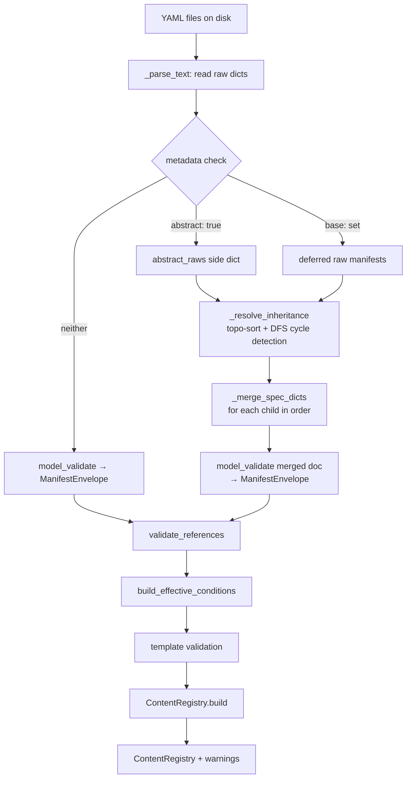

# Design: Content Inheritance / Prototypes

## Context

Every content package with variant entity families today repeats YAML blocks across every member. A goblin enemy family shares the same loot table, description structure, and combat behavior, but there is no mechanism to declare those once and override just the variant-specific fields. The same problem applies to weapon tiers (identical damage formulas, different scaling values), location clusters (identical entrance conditions, different flavor text), and quest chains (identical prerequisite structure, different stat checks).

The engine's Pydantic models validate each manifest in isolation, with no awareness that a child manifest may be intentionally incomplete because it relies on a base for the missing fields. The `parse()` function hands fully-validated `ManifestEnvelope` objects to the rest of the pipeline, which means the inheritance hook must intercept at the raw-dict level, before Pydantic runs, to correctly validate the merged result.

Two additional gaps motivate this change. First, formula strings (`damage_die * player["strength"]`) must currently hardcode any numeric parameters they need — there is no way to attach author-defined values to a manifest and read them from the formula. Second, the `ExpressionContext` and `CombatFormulaContext` dataclasses have no mechanism to expose the current manifest's own data to its own templates, which forces authors to repeat constants in every formula that should be derived from manifest-level properties.

This change adds three interlocking capabilities: manifest inheritance (`metadata.base`/`metadata.abstract`), per-manifest `properties` dictionaries, and a `this` variable in formula and template contexts that exposes those properties.

---

## Goals / Non-Goals

**Goals:**

- Allow any manifest to declare `metadata.base: <name>` to inherit all unspecified `spec` fields from another manifest of the same kind.
- Allow any manifest to declare `metadata.abstract: true` to mark itself as a template-only base that is never registered in `ContentRegistry`.
- Support chained inheritance (grandchildren, great-grandchildren) with topological sort at load time.
- Detect and hard-error on circular inheritance chains at load time, with the full chain named in the error.
- Detect and hard-error on missing base references at load time.
- Provide a `properties: Dict[str, int | float | str | bool]` field on all spec models via a new `BaseSpec` parent class.
- Expose `this` in `CombatFormulaContext` and `ExpressionContext`, populated from the current manifest's `properties` dict.
- Support list and dict field extension with a `+` suffix on field names in child manifests (`grants_skills_equipped+:`, `equip+:`).
- Post-process the generated JSON Schema to inject `foo+` sibling definitions for all list and dict fields, preventing false editor validation errors.
- Add a permissive abstract arm to the union schema so abstract manifests with incomplete `spec` pass JSON Schema validation.

**Non-Goals:**

- Cross-kind inheritance (an `Enemy` cannot inherit from an `Item`).
- Cross-package inheritance (names are scoped to the content package they are declared in).
- Deep-recursive value merging (the `+` suffix recurses through nested dicts to find more `+` keys, but does not blindly merge every nested value — only keys explicitly marked with `+` are extended; unmarked keys still replace).
- Runtime polymorphism — abstract manifests exist only at load time and are discarded after resolution.
- `properties` supporting non-scalar types (objects, arrays, nested structures).
- `this` being writable from template expressions.

---

## Decisions

### D1: Hybrid parse approach — raw-dict merge before Pydantic validation

Pydantic validates required fields at `model_validate` time. A child manifest that intentionally omits required fields (because its base supplies them) will fail Pydantic validation before the inheritance resolver can see it.

The options were:

- **Option A (raw-dict pre-merge):** merge child's raw spec dict with base's raw spec dict, then Pydantic-validate the merged result.
- **Option B (Pydantic model merge):** Pydantic-validate each manifest independently (with `None` defaults for all fields), then merge Pydantic model instances.

Option B requires every spec field to become optional at the model level (degrading the schema as a correctness tool) and requires custom per-type merge logic that must be updated whenever a new field is added to any spec model.

**Decision:** Option A. Abstract manifests bypass Pydantic entirely and are stored as raw dicts during the inheritance pre-pass. Concrete manifests that declare `metadata.base` are also stored as raw dicts, deferred until their base is resolved. Once a child's raw spec has been merged with its resolved base's raw spec, the merged result is Pydantic-validated in the normal way. This keeps spec models clean (all required fields remain required) and merge logic in one place.

### D2: `base` and `abstract` in `metadata`, not `spec`

Inheritance metadata is structural — it describes the manifest as an artifact rather than the entity the manifest represents. Placing `base` and `abstract` inside `spec` would pollute the spec model with loader-only fields and require every spec class to carry fields it does not otherwise use.

**Decision:** Both fields live in `Metadata`:

- `abstract: bool = False`
- `base: str | None = None`

`abstract: true` marks a manifest as a pure template. `base: goblin-base` names the same-kind manifest from which to inherit.

### D3: Same-kind inheritance only

Cross-kind inheritance introduces ambiguity when merging spec structures that have different required fields and different semantic purposes. An `Enemy` and an `Item` share no spec fields; merging them would produce an invalid model regardless of the merge algorithm.

**Decision:** The inheritance resolver enforces that `child.kind == base.kind`. Mismatches raise a `ContentLoadError` at load time.

### D4: `BaseSpec` parent class for all spec models

A single shared parent for all spec models provides the `properties` field uniformly and gives a clean extension point for future cross-cutting spec metadata.

**Decision:** New `BaseSpec(BaseModel)` class in `oscilla/engine/models/base.py` with:

```python
class BaseSpec(BaseModel):
    properties: Dict[str, int | float | str | bool] = Field(
        default_factory=dict,
        description="Static author-defined values available as 'this' in formula and template contexts.",
    )
```

All existing spec classes (`EnemySpec`, `ItemSpec`, `AdventureSpec`, etc.) change their parent from `BaseModel` to `BaseSpec`. This includes `GameSpec` and `CharacterConfigSpec` for forward-looking consistency, even though no current feature uses `this` in those contexts.

### D5: `properties` is scalar-only

Non-scalar values (lists, nested objects) in `properties` would require the `this` context to be typed as `Any` in formulas, losing static analysis and making formula validation harder. Authors who need complex per-manifest data should model it explicitly in the spec instead.

**Decision:** `properties: Dict[str, int | float | str | bool]`. The `this` variable in formula contexts is typed identically and can be subscripted with string keys in Jinja2 templates: `{{ this.get('damage_die', 4) }}`.

### D6: `this` available in all formula and template contexts

Restricting `this` to specific contexts would require authors to know which contexts support it. Given that any manifest can carry `properties`, every context that touches a manifest can populate `this` from it.

**Decision:** Both `CombatFormulaContext` and `ExpressionContext` gain `this: Dict[str, int | float | str | bool]`. The `render_formula()` and template render functions expose `this` in the Jinja2 namespace. For `ExpressionContext`, `this` is populated from the adventure manifest's own `properties`. For `CombatFormulaContext`, `this` is populated from the triggering manifest's `properties` (item, skill, or enemy, depending on what triggers the formula). Load-time mock rendering populates a mock `this` from the manifest's own `properties` dict.

### D7: `+` suffix for list/dict extension (recursive)

YAML field names can include `+`. Authors can write `grants_skills_equipped+:` to append to the base manifest's `grants_skills_equipped` list rather than replace it. The merge algorithm strips the `+` from the key before producing the final merged spec.

When a `+` key holds a dict value, the merge recurses into that dict so nested `+` keys are also respected. For example, `equip+: {stat_modifiers+: [...]}` correctly extends the nested `stat_modifiers` list inside the equip block. This means `+` works at any nesting depth.

**Decision:** The merge function recurses on dict-typed `+` keys:

```python
elif isinstance(value, dict) and isinstance(base_val, dict):
    # Recurse: the child dict may itself contain '+' keys.
    result[base_key] = _merge_spec_dicts(base_val, value)
```

If an author writes a `+` key with no corresponding base value, the child value is used as-is and the key is normalized (the `+` is stripped). Type mismatches (child is list, base is dict) also fall back to the child value.

### D8: Abstract manifests stored in side dict, never registered

Abstract manifests exist only to be merged into children. Registering them in `ContentRegistry` would allow the game to try to instantiate or reference them as real entities, which would produce nonsensical results (an abstract enemy with no `displayName` or stats).

**Decision:** The inheritance pre-pass (`_resolve_inheritance()`) maintains `abstract_raws: Dict[Tuple[str, str], Dict[str, Any]]` keyed by `(kind, name)`. Abstract manifests are never passed to `model_validate` in full form and never appear in the final `List[ManifestEnvelope]` returned by `parse()`. They are referenced only by the merge algorithm and are discarded once all children are resolved.

Concrete manifests (no `metadata.abstract: true`) can also serve as bases; they are Pydantic-validated normally AND stored as resolved raw spec dicts that children can reference.

### D9: `validate_base_refs()` as a hard error

A missing base reference is always a content authoring error. Unlike labels (where a missing label triggers a warning), a manifest that declares `base: nonexistent` will always produce an entity whose fields are incomplete in unpredictable ways.

**Decision:** The inheritance pre-pass itself raises `ContentLoadError` on missing base refs rather than deferring to a separate validation pass. The error identifies the child manifest and the missing name: `"metadata.base references unknown goblin-base (kind: Enemy)"`.

### D10: Circular dep detection via DFS in topo-sort

The topo-sort algorithm itself detects cycles naturally via the "currently on the DFS stack" test. This is the same approach used by `_check_circular_region_parents()` in `semantic_validator.py`.

**Decision:** The topo-sort function `_topo_sort_inheritance()` tracks a `visiting` set. If a node to be visited is already in `visiting`, a cycle is detected. The error includes the full cycle path: `"circular inheritance in Enemy 'a': a → b → a"`.

### D11: JSON Schema — abstract permissive arm + `foo+` sibling injection

Authors who use abstract manifests get red-squiggle errors in their editor because their abstract manifest omits required `spec` fields. Authors who use `+` extension fields get red-squiggle errors because `grants_skills_equipped+` is not in the schema.

Both problems can be fixed by post-processing the generated schema in `schema_export.py` after `model_json_schema()` runs:

1. **Abstract arm:** At the top of the union `oneOf`, add a special arm that matches when `metadata.abstract` is `true`. This arm uses `"additionalProperties": true` on `spec` and does not enforce required `spec` fields. All concrete-manifest arms remain unchanged.

2. **`+` field injection:** For each spec in the schema, walk all property definitions. For any property whose type is `array` or `object` (equivalently, any field with type `array` or with a `$ref` that resolves to an object), inject a sibling `<fieldname>+` property with the same type definition and an additional description note: `"(extends the inherited list/dict rather than replacing it)"`.

**Decision:** Both post-processing steps are implemented in `export_union_schema()` in `schema_export.py`. The resulting schema has no false negatives for valid inheritance syntax.

---

## Implementation

### `oscilla/engine/models/base.py` — before / after

**Before:**

```python
class Metadata(BaseModel):
    name: str = Field(description="Unique identifier for this entity within its kind.")


class ManifestEnvelope(BaseModel):
    apiVersion: Literal["oscilla/v1"]
    kind: str
    metadata: Metadata
    spec: object
```

**After:**

```python
class Metadata(BaseModel):
    name: str = Field(description="Unique identifier for this entity within its kind.")
    abstract: bool = Field(
        default=False,
        description="If true, this manifest is a template-only base and will not be registered at runtime.",
    )
    base: str | None = Field(
        default=None,
        description="Name of another same-kind manifest to inherit unspecified spec fields from.",
    )


class BaseSpec(BaseModel):
    """Parent class for all spec models. Provides the properties dict for manifest-level constants."""

    properties: Dict[str, int | float | str | bool] = Field(
        default_factory=dict,
        description="Static manifest-level values available as 'this' in formula and template contexts.",
    )


class ManifestEnvelope(BaseModel):
    apiVersion: Literal["oscilla/v1"]
    kind: str
    metadata: Metadata
    spec: object
```

### `oscilla/engine/models/enemy.py` — parent class change

Every spec class changes its parent from `BaseModel` to `BaseSpec`. The `EnemySpec` change is shown as representative:

**Before:**

```python
class EnemySpec(BaseModel):
    displayName: str
    ...
```

**After:**

```python
class EnemySpec(BaseSpec):
    displayName: str
    ...
```

The same change applies to: `ItemSpec`, `AdventureSpec`, `ArchetypeSpec`, `BuffSpec`, `SkillSpec`, `LocationSpec`, `RegionSpec`, `QuestSpec`, `RecipeSpec`, `LootTableSpec`, `GameSpec`, `CharacterConfigSpec`, `CombatSystemSpec`, and `CustomConditionSpec`.

### `oscilla/engine/templates.py` — `this` in contexts

**Before:**

```python
@dataclass
class ExpressionContext:
    player: PlayerContext
    combat: CombatContextView | None = None
    game: GameContext = field(default_factory=GameContext)
    ingame_time: "InGameTimeView | None" = None


@dataclass
class CombatFormulaContext:
    player: Dict[str, int]
    enemy_stats: Dict[str, int]
    combat_stats: Dict[str, int]
    turn_number: int
```

**After:**

```python
@dataclass
class ExpressionContext:
    player: PlayerContext
    combat: CombatContextView | None = None
    game: GameContext = field(default_factory=GameContext)
    ingame_time: "InGameTimeView | None" = None
    # Properties from the current manifest (adventure, item, etc.). Empty when not applicable.
    this: Dict[str, int | float | str | bool] = field(default_factory=dict)


@dataclass
class CombatFormulaContext:
    player: Dict[str, int]
    enemy_stats: Dict[str, int]
    combat_stats: Dict[str, int]
    turn_number: int
    # Properties from the triggering manifest (item, skill, or enemy). Empty when not applicable.
    this: Dict[str, int | float | str | bool] = field(default_factory=dict)
```

The `render_formula()` function gains one line to expose `this` in the Jinja2 render context:

**Before:**

```python
render_ctx["player"] = ctx.player
render_ctx["enemy_stats"] = ctx.enemy_stats
render_ctx["combat_stats"] = ctx.combat_stats
render_ctx["turn_number"] = ctx.turn_number
```

**After:**

```python
render_ctx["player"] = ctx.player
render_ctx["enemy_stats"] = ctx.enemy_stats
render_ctx["combat_stats"] = ctx.combat_stats
render_ctx["turn_number"] = ctx.turn_number
render_ctx["this"] = ctx.this
```

The `GameTemplateEngine.render()` method also gains `render_ctx["this"] = ctx.this` to expose `this` in adventure step templates.

The `build_mock_context()` function gains a `manifest_properties: Dict[str, int | float | str | bool] | None = None` parameter and populates `ctx["this"]` from it when provided. When building mock contexts during load-time template validation, the manifest's own `spec.properties` dict is passed in as the mock `this`.

### `oscilla/engine/loader.py` — new inheritance pre-pass

The raw-manifest dataclass and the four new functions are inserted. Only the key new structures are shown; `_run_pipeline()` itself is not changed.

```python
from dataclasses import dataclass as _dataclass


@_dataclass
class _RawManifest:
    """A YAML doc that has been parsed but not yet Pydantic-validated."""
    kind: str
    name: str
    abstract: bool
    base: str | None
    raw: Dict[str, Any]
    source: Path
```

**`_topo_sort_inheritance()`** — topological sort with cycle detection:

```python
def _topo_sort_inheritance(
    deferred: List[_RawManifest],
    abstract_raws: Dict[Tuple[str, str], Dict[str, Any]],
    concrete_raws: Dict[Tuple[str, str], Dict[str, Any]],
) -> Tuple[List[_RawManifest], List[LoadError]]:
    """Return deferred manifests in dependency order (bases before children).

    Errors accumulate for: missing base refs, mismatched kinds, circular chains.
    """
    errors: List[LoadError] = []
    by_key: Dict[Tuple[str, str], _RawManifest] = {(m.kind, m.name): m for m in deferred}

    # Pre-compute the set of all known manifest names (across all kinds) for
    # precise error messages when a base ref exists but under the wrong kind.
    all_known_names: Set[str] = set()
    for _, n in abstract_raws:
        all_known_names.add(n)
    for _, n in concrete_raws:
        all_known_names.add(n)
    for _, n in by_key:
        all_known_names.add(n)

    order: List[_RawManifest] = []
    visited: Set[Tuple[str, str]] = set()
    visiting: Set[Tuple[str, str]] = set()

    def visit(key: Tuple[str, str], chain: List[str]) -> None:
        if key in visited:
            return
        if key in visiting:
            cycle = " → ".join(chain + [key[1]])
            errors.append(LoadError(
                file=Path(f"<{key[1]}>"),
                message=f"circular inheritance in {key[0]} {key[1]!r}: {cycle}",
            ))
            return
        manifest = by_key.get(key)
        if manifest is None:
            return  # Already-validated concrete base, not in deferred
        visiting.add(key)
        assert manifest.base is not None
        base_key = (manifest.kind, manifest.base)
        # Check if the base exists under the correct kind.
        base_found = (
            base_key in abstract_raws
            or base_key in concrete_raws
            or base_key in by_key
        )
        if not base_found:
            if manifest.base in all_known_names:
                # Base exists but under a different kind — give a precise error.
                errors.append(LoadError(
                    file=manifest.source,
                    message=(
                        f"metadata.base references {manifest.base!r} which is not a {manifest.kind} "
                        f"(kind mismatch)"
                    ),
                ))
            else:
                errors.append(LoadError(
                    file=manifest.source,
                    message=(
                        f"metadata.base references unknown {manifest.base!r} "
                        f"(kind: {manifest.kind})"
                    ),
                ))
        else:
            visit(base_key, chain + [key[1]])
        visiting.remove(key)
        visited.add(key)
        order.append(manifest)

    for m in deferred:
        visit((m.kind, m.name), [])

    return order, errors
```

**`_merge_spec_dicts()`** — recursive raw spec dict merge:

```python
def _merge_spec_dicts(
    base_spec: Dict[str, Any],
    child_spec: Dict[str, Any],
) -> Dict[str, Any]:
    """Merge child spec fields onto base spec fields, recursively.

    Keys ending with '+' extend the base list or dict rather than replacing it.
    The '+' is stripped from the key in the output. When a '+' key holds a dict,
    the merge recurses into that dict so nested '+' keys are also respected —
    e.g. ``equip+: {stat_modifiers+: [...]}`` correctly extends the nested list.

    Type mismatches on '+' keys fall back to the child value.
    """
    result: Dict[str, Any] = dict(base_spec)
    for key, value in child_spec.items():
        if key.endswith("+"):
            base_key = key[:-1]
            base_val = result.get(base_key)
            if isinstance(value, list) and isinstance(base_val, list):
                result[base_key] = base_val + value
            elif isinstance(value, dict) and isinstance(base_val, dict):
                # Recurse: the child dict may itself contain '+' keys.
                result[base_key] = _merge_spec_dicts(base_val, value)
            else:
                result[base_key] = value
        else:
            result[key] = value
    return result
```

**`_resolve_inheritance()`** — the pre-pass that produces a final `List[ManifestEnvelope]`:

```python
def _resolve_inheritance(
    immediate: List[ManifestEnvelope],
    deferred: List[_RawManifest],
    abstract_raws: Dict[Tuple[str, str], Dict[str, Any]],
) -> Tuple[List[ManifestEnvelope], List[LoadError], List[LoadWarning]]:
    """Merge and Pydantic-validate all deferred (inheriting) manifests.

    Returns (resolved_manifests, errors, warnings). Warnings include unused
    abstract manifests that were never referenced as a base.

    abstract_raws: mapping of (kind, name) → raw spec dict for abstract manifests.
    immediate: already-validated manifests (no base, not abstract) — used as concrete bases.
    """
    errors: List[LoadError] = []
    warnings: List[LoadWarning] = []

    # Track which abstract manifests are actually used as a base.
    used_abstracts: Set[Tuple[str, str]] = set()

    # Build lookup of already-validated concrete manifest spec dicts for use as bases.
    # Use model_dump(mode="python") for a clean dict of field values, not __dict__
    # which is a Pydantic v2 implementation detail that may include internals.
    concrete_raws: Dict[Tuple[str, str], Dict[str, Any]] = {
        (m.kind, m.metadata.name): m.spec.model_dump(mode="python")  # type: ignore[union-attr]
        for m in immediate
        if hasattr(m, "spec") and m.spec is not None
    }

    ordered, sort_errors = _topo_sort_inheritance(deferred, abstract_raws, concrete_raws)
    if sort_errors:
        return [], sort_errors, []

    resolved: List[ManifestEnvelope] = []
    # resolved_raws tracks newly-resolved children as concrete bases for their own children.
    resolved_raws: Dict[Tuple[str, str], Dict[str, Any]] = {}

    for raw_manifest in ordered:
        assert raw_manifest.base is not None
        base_key = (raw_manifest.kind, raw_manifest.base)

        # Look up base spec raw from abstract_raws, concrete_raws, or newly resolved.
        if base_key in abstract_raws:
            used_abstracts.add(base_key)
        base_spec_raw: Dict[str, Any] = (
            abstract_raws.get(base_key)
            or resolved_raws.get(base_key)
            or concrete_raws.get(base_key)
            or {}
        )

        child_spec_raw: Dict[str, Any] = raw_manifest.raw.get("spec") or {}
        merged_spec = _merge_spec_dicts(base_spec_raw, child_spec_raw)

        merged_raw = {
            "apiVersion": raw_manifest.raw.get("apiVersion"),
            "kind": raw_manifest.kind,
            "metadata": raw_manifest.raw.get("metadata"),
            "spec": merged_spec,
        }

        model_cls = MANIFEST_REGISTRY.get(raw_manifest.kind)
        if model_cls is None:
            # Already caught during raw parse; skip.
            continue
        try:
            envelope = model_cls.model_validate(merged_raw)
        except ValidationError as exc:
            for err in exc.errors():
                loc = " → ".join(str(x) for x in err["loc"])
                errors.append(LoadError(
                    file=raw_manifest.source,
                    message=f"{loc}: {err['msg']}",
                ))
            continue

        # Abstract manifests are never registered; they only serve as bases.
        # Concrete manifests are both registered and available as bases.
        if raw_manifest.abstract:
            abstract_raws[(raw_manifest.kind, raw_manifest.name)] = merged_spec
        else:
            resolved.append(envelope)
            resolved_raws[(raw_manifest.kind, raw_manifest.name)] = merged_spec

    # Warn about abstract manifests that were never referenced as a base.
    for abs_key in abstract_raws:
        if abs_key not in used_abstracts:
            warnings.append(LoadWarning(
                file=None,
                message=(
                    f"abstract {abs_key[0]} {abs_key[1]!r} is never referenced "
                    f"as a base by any other manifest"
                ),
                suggestion="Remove the manifest or set metadata.abstract: false if it should be a real entity.",
            ))

    return resolved, errors, warnings
```

**`_parse_text()` — full implementation with categorization logic:**

```python
def _parse_text(
    text: str,
    source: Path,
) -> Tuple[List[ManifestEnvelope], List[_RawManifest], Dict[Tuple[str, str], Dict[str, Any]], List[LoadError]]:
    """Parse all YAML documents from a string, categorizing by inheritance role.

    Returns four outputs:
    - immediate: manifests with no base and not abstract (validated now)
    - deferred: manifests declaring metadata.base (validated after merge)
    - abstract_raws: abstract manifest spec dicts keyed by (kind, name)
    - errors: any parse or validation errors
    """
    immediate: List[ManifestEnvelope] = []
    deferred: List[_RawManifest] = []
    abstract_raws: Dict[Tuple[str, str], Dict[str, Any]] = {}
    errors: List[LoadError] = []

    try:
        docs = list(_yaml.load_all(text))
    except YAMLError as exc:
        errors.append(LoadError(file=source, message=f"YAML parse error: {exc}"))
        return immediate, deferred, abstract_raws, errors

    for doc_index, raw in enumerate(docs):
        label = f"{source} [doc {doc_index + 1}]" if len(docs) > 1 else str(source)

        if not isinstance(raw, dict):
            errors.append(LoadError(file=source, message=f"{label}: Manifest must be a YAML mapping"))
            continue

        kind = raw.get("kind", "<missing>")
        model_cls = MANIFEST_REGISTRY.get(str(kind))
        if model_cls is None:
            errors.append(LoadError(file=source, message=f"{label}: Unknown kind: {kind!r}"))
            continue

        # Extract metadata for categorization before Pydantic validation.
        metadata_raw = raw.get("metadata", {})
        if not isinstance(metadata_raw, dict):
            errors.append(LoadError(file=source, message=f"{label}: metadata must be a mapping"))
            continue

        name = metadata_raw.get("name")
        if not isinstance(name, str):
            errors.append(LoadError(file=source, message=f"{label}: metadata.name must be a string"))
            continue

        is_abstract = bool(metadata_raw.get("abstract", False))
        base_ref = metadata_raw.get("base")
        if isinstance(base_ref, str):
            base_ref = base_ref  # keep as str
        else:
            base_ref = None

        # Categorize: abstract → side dict; has base → deferred; else → immediate.
        key = (str(kind), name)
        if is_abstract:
            if key in abstract_raws:
                errors.append(LoadError(
                    file=source,
                    message=f"{label}: duplicate abstract manifest {key[1]!r} (kind: {kind})",
                ))
                continue
            if key in {
                (m.kind, m.metadata.name) for m in immediate
                if hasattr(m, "metadata") and m.metadata is not None
            }:
                errors.append(LoadError(
                    file=source,
                    message=(
                        f"{label}: abstract manifest {name!r} (kind: {kind}) "
                        f"collides with concrete manifest of the same name"
                    ),
                ))
                continue
            abstract_raws[key] = raw.get("spec") or {}
        elif base_ref:
            deferred.append(_RawManifest(
                kind=str(kind),
                name=name,
                abstract=False,
                base=base_ref,
                raw=raw,
                source=Path(label),
            ))
        else:
            try:
                immediate.append(model_cls.model_validate(raw))
            except ValidationError as exc:
                for err in exc.errors():
                    loc = " → ".join(str(x) for x in err["loc"])
                    errors.append(LoadError(file=source, message=f"{label}: {loc}: {err['msg']}"))

    return immediate, deferred, abstract_raws, errors
```

**`parse()` — updated to call `_resolve_inheritance()`:**

```python
def parse(paths: List[Path]) -> Tuple[List[ManifestEnvelope], List[LoadError], List[LoadWarning]]:
    immediate: List[ManifestEnvelope] = []
    deferred: List[_RawManifest] = []
    abstract_raws: Dict[Tuple[str, str], Dict[str, Any]] = {}
    errors: List[LoadError] = []
    warnings: List[LoadWarning] = []

    for path in paths:
        try:
            text = path.read_text(encoding="utf-8")
        except OSError as exc:
            errors.append(LoadError(file=path, message=f"File read error: {exc}"))
            continue
        p_immediate, p_deferred, p_abstracts, p_errors = _parse_text(text, source=path)
        immediate.extend(p_immediate)
        deferred.extend(p_deferred)
        abstract_raws.update(p_abstracts)
        errors.extend(p_errors)

    if deferred:
        resolved, inheritance_errors, inheritance_warnings = _resolve_inheritance(
            immediate, deferred, abstract_raws
        )
        immediate.extend(resolved)
        errors.extend(inheritance_errors)
        warnings.extend(inheritance_warnings)

    return immediate, errors, warnings
```

**`load_from_text()` — updated to stitch-and-resolve:**

```python
def load_from_text(
    text: str,
    skip_references: bool = False,
) -> Tuple["ContentRegistry", List[LoadWarning]]:
    immediate, deferred, abstract_raws, parse_errors = _parse_text(text, source=Path("<stdin>"))
    parse_warnings: List[LoadWarning] = []

    if deferred:
        resolved, inheritance_errors, inheritance_warnings = _resolve_inheritance(
            immediate, deferred, abstract_raws
        )
        immediate.extend(resolved)
        parse_errors.extend(inheritance_errors)
        parse_warnings.extend(inheritance_warnings)

    registry, pipeline_warnings = _run_pipeline(
        manifests=immediate, parse_errors=parse_errors, skip_references=skip_references
    )
    return registry, parse_warnings + pipeline_warnings
```

**`load_from_disk()` — updated analogously:**

```python
def load_from_disk(content_path: Path) -> Tuple["ContentRegistry", List[LoadWarning]]:
    if content_path.is_file():
        paths = [content_path]
    else:
        paths = scan(content_path)
    manifests, parse_errors, parse_warnings = parse(paths)
    registry, pipeline_warnings = _run_pipeline(
        manifests=manifests, parse_errors=parse_errors, skip_references=False
    )
    return registry, parse_warnings + pipeline_warnings
```

### Pipeline diagram



---

## Edge Cases

1. **Abstract manifest with `base`:** A manifest may be both `abstract: true` and declare `metadata.base`. It is stored in the `abstract_raws` side dict after merging with its own base. Its resolved spec can then serve as a base for concrete children.

2. **`+` key with no base value:** The child value is used as-is; the `+` is stripped from the key. No error.

3. **`+` key type mismatch (child is list, base is dict):** Child value wins. The merged output uses the child value under the normalized key.

4. **Nested `+` keys (e.g., `equip+: {stat_modifiers+: [...]}`):** The merge recurses into dict-typed `+` values, so nested `+` keys are properly resolved. An author can write `equip+: {stat_modifiers+: [{stat: hp, amount: 2}]}` to extend the base's `stat_modifiers` list within the equip block without repeating `slots` or `combat_damage_formulas`.

5. **Chain depth > 2:** Resolved correctly by topo-sort. The order guarantee ensures a grandchild's base (a child) is resolved before the grandchild is processed.

6. **Concrete manifest used as a base:** Allowed. Its raw spec is available in `concrete_raws` for any deferred child to merge with.

7. **`properties` in `+` extend syntax (`properties+:`):** Merges the child's `properties` dict on top of the base's `properties` dict (recursive merge, so nested `+` keys within `properties` are also respected — though `properties` values are scalar-only, so this is a forward-compatibility guarantee).

8. **Abstract manifest's `metadata.name` collision with a concrete manifest of the same kind:** Raises a `ContentLoadError` — it is ambiguous which manifest a child's `metadata.base` refers to, and shadowing an abstract with a concrete (or vice versa) would silently confuse the resolver.

9. **`this` when properties is empty:** `this` is an empty dict. `this.get('foo', default_value)` in formulas returns the default. No errors.

10. **`this` in load-time formula mock rendering:** The manifest's own `properties` dict (from the raw spec before any merging) is used as the mock `this`. For inherited manifests, the merged `properties` (after merging with base) is used, ensuring that default property values from the base are visible during formula validation.

11. **Concrete manifest declared as a base that itself has errors:** The inheritance resolver processes deferred manifests in topo order. If the Pydantic validation of a parent fails and it was also a base for other children, those children's resolutions also fail (the resolved_raws entry is never written). Each failure is reported independently.

---

## Testing Philosophy

Tests verify the inheritance contract at three levels:

1. **Unit — `_merge_spec_dicts()`:** Pure function, directly tested with raw dicts. Covers: replace semantics, `+` list extend, `+` dict recursive merge (nested `+` keys), `+` type mismatch, `+` with no base value, properties `+` extend, `equip+: {stat_modifiers+: [...]}` pattern.

2. **Integration — `load_from_text()`:** Full loader with minimal multi-document YAML strings. Covers: simple single-level inheritance, chained inheritance, abstract base (not in registry), concrete base (in registry), missing base ref (error), circular chain (error), `this` in formula expressions, `+` extend on list fields.

3. **Template — `this` context:** Formula render tests verify that `this.get('damage_die', 4)` returns the correct value from a `CombatFormulaContext` with a non-empty `this`. Mock render tests in `GameTemplateEngine` verify that abstract specs and concrete inherited specs both produce valid load-time mock `this` dicts.

```python
def test_basic_inheritance_loads() -> None:
    yaml = """
apiVersion: oscilla/v1
kind: Enemy
metadata:
  name: goblin-base
  abstract: true
spec:
  displayName: Goblin
  stats:
    hp: 10
---
apiVersion: oscilla/v1
kind: Enemy
metadata:
  name: goblin-scout
  base: goblin-base
spec:
  displayName: Goblin Scout
"""
    registry, _ = load_from_text(yaml, skip_references=True)
    assert "goblin-scout" in {e.metadata.name for e in registry.enemies.values()}
    assert "goblin-base" not in {e.metadata.name for e in registry.enemies.values()}


def test_abstract_not_in_registry() -> None:
    yaml = """
apiVersion: oscilla/v1
kind: Enemy
metadata:
  name: goblin-base
  abstract: true
spec:
  displayName: Goblin
  stats:
    hp: 10
---
apiVersion: oscilla/v1
kind: Enemy
metadata:
  name: goblin-scout
  base: goblin-base
spec:
  displayName: Goblin Scout
"""
    registry, _ = load_from_text(yaml, skip_references=True)
    assert "goblin-base" not in registry.enemies


def test_circular_inheritance_raises() -> None:
    yaml = """
apiVersion: oscilla/v1
kind: Enemy
metadata:
  name: enemy-a
  abstract: true
  base: enemy-b
spec:
  displayName: A
  stats: {hp: 10}
---
apiVersion: oscilla/v1
kind: Enemy
metadata:
  name: enemy-b
  abstract: true
  base: enemy-a
spec:
  displayName: B
  stats: {hp: 10}
"""
    with pytest.raises(ContentLoadError) as exc_info:
        load_from_text(yaml, skip_references=True)
    assert "circular inheritance" in str(exc_info.value).lower()


def test_this_in_formula() -> None:
    ctx = CombatFormulaContext(
        player={"strength": 5},
        enemy_stats={"hp": 10},
        combat_stats={},
        turn_number=1,
        this={"damage_die": 6},
    )
    result = render_formula("{{ this.get('damage_die', 4) * player['strength'] }}", ctx)
    assert result == 30  # 6 * 5


def test_list_extend_syntax() -> None:
    yaml = """
apiVersion: oscilla/v1
kind: Item
metadata:
  name: base-sword
  abstract: true
spec:
  displayName: Sword
  value: 10
  grants_skills_equipped:
    - parry
---
apiVersion: oscilla/v1
kind: Item
metadata:
  name: master-sword
  base: base-sword
spec:
  displayName: Master Sword
  value: 500
  grants_skills_equipped+:
    - riposte
"""
    registry, _ = load_from_text(yaml, skip_references=True)
    item = registry.items["master-sword"]
    assert item.spec.grants_skills_equipped == ["parry", "riposte"]
```

---

## Testlandia Integration

Two new families are added to the testlandia content package to serve as manual QA tools:

### Goblin Enemy Family (`content/testlandia/enemies/`)

```yaml
# enemies/goblins.yaml
apiVersion: oscilla/v1
kind: Enemy
metadata:
  name: goblin-base
  abstract: true
spec:
  displayName: Goblin
  description: "A small but cunning creature."
  stats:
    hp: 8
    attack: 4
    defense: 2
  loot: []
  properties:
    xp_reward: 5
---
apiVersion: oscilla/v1
kind: Enemy
metadata:
  name: goblin-scout
  base: goblin-base
spec:
  displayName: Goblin Scout
  stats:
    hp: 8
    attack: 5
    defense: 2
  properties:
    xp_reward: 8
---
apiVersion: oscilla/v1
kind: Enemy
metadata:
  name: goblin-chief
  base: goblin-base
spec:
  displayName: Goblin Chief
  stats:
    hp: 20
    attack: 8
    defense: 5
  properties:
    xp_reward: 25
---
apiVersion: oscilla/v1
kind: Enemy
metadata:
  name: goblin-king
  base: goblin-chief
spec:
  displayName: Goblin King
  description: "The mightiest goblin. His crown gleams with stolen gems."
  stats:
    hp: 40
    attack: 14
    defense: 9
  properties:
    xp_reward: 75
```

The `goblin-king` inherits from `goblin-chief` (itself a child of `goblin-base`), demonstrating three-level chained inheritance.

### Sword Item Family (`content/testlandia/items/weapons/`)

```yaml
# items/weapons/swords.yaml
apiVersion: oscilla/v1
kind: Item
metadata:
  name: sword-base
  abstract: true
spec:
  displayName: Sword
  value: 0
  stackable: false
  grants_skills_equipped:
    - basic-slash
  equip:
    slots:
      - main_hand
    combat_damage_formulas:
      - formula: "{{ this.get('damage_die', 4) + player.get('strength', 0) // 4 }}"
        target: enemy_hp
---
apiVersion: oscilla/v1
kind: Item
metadata:
  name: iron-sword
  base: sword-base
spec:
  displayName: Iron Sword
  value: 50
  properties:
    damage_die: 4
---
apiVersion: oscilla/v1
kind: Item
metadata:
  name: steel-sword
  base: sword-base
spec:
  displayName: Steel Sword
  value: 150
  properties:
    damage_die: 6
---
apiVersion: oscilla/v1
kind: Item
metadata:
  name: silver-sword
  base: sword-base
spec:
  displayName: Silver Sword
  value: 400
  properties:
    damage_die: 10
  grants_skills_equipped+:
    - silver-strike
```

The `silver-sword` demonstrates `+` extend syntax: it adds `silver-strike` to the `grants_skills_equipped` list inherited from `sword-base` without repeating `basic-slash`.

### QA Adventure

An existing or new testlandia adventure is updated (or created) to:

1. Grant an `iron-sword` to the player at the start.
2. Present a series of combats against `goblin-scout`, `goblin-chief`, and `goblin-king` in order.
3. Offer an upgrade to `steel-sword` or `silver-sword` mid-adventure via a choice step.

This makes all inheritance features playable in a single manual test run.

---

## Documentation Plan

- **`docs/authors/manifest-inheritance.md`** — new guide covering: `metadata.base` and `metadata.abstract` syntax; `properties` and `this`; `+` extend syntax with examples for lists and dicts; chained inheritance rules; abstract manifest behavior; load-time errors (missing base ref, circular chain).
- **`docs/authors/README.md`** — table of contents updated to reference the new guide.

---

## Risks / Trade-offs

### Parse complexity increase

`_parse_text()` previously had a single responsibility: iterate YAML docs, call `model_validate`. It now must categorize docs (immediate / deferred / abstract) and the resolution step introduces topological sort logic. The extra code is well-isolated in new private functions, but the parse path is harder to reason about for new contributors.

**Mitigation:** The four-output signature of `_parse_text()` is clearly documented. `_resolve_inheritance()` is a standalone function with comprehensive unit tests. The pipeline diagram in this design doc provides a visual reference.

### Abstract manifests are never validated by Pydantic

An abstract manifest with a typo in a field name will not error. It will silently be ignored in the merge (unknown keys pass through in the raw dict and will fail Pydantic only when a child validates the merged result). This means an abstract-only typo may not produce an error until a child is actually present.

**Mitigation:** The JSON Schema (with the abstract permissive arm) still validates the known fields it does declare. Editor tooling will flag fields that don't match the spec. The permissive arm is intentionally limited: `spec` is `additionalProperties: true` but `apiVersion`, `kind`, and `metadata.name` remain required.

### `this` is empty when no properties are set

Authors who forget to set `properties` get `{}` as their `this`. Formulas that use `this.get('key', default)` work correctly (returning the default), but formulas that subscript `this['key']` directly will raise a `UndefinedError` at load-time mock render, which produces a `ContentLoadError`. This is a good outcome — it catches the error early — but authors must know to use `.get()` defensively.

**Mitigation:** The author documentation highlights this pattern and shows both the defensive and the direct form.

### Inherited manifests lose their individual "required field" guarantee during development

While iterating on a new abstract manifest family, a concrete child may temporarily leave required fields in the base unset (e.g., the author is still writing the base). The error will appear as a Pydantic validation error on the merged result, which correctly identifies the child file but the missing field may actually be absent from the base. This can be slightly confusing.

**Mitigation:** The error message format includes the child manifest's source path and the missing field, which gives authors enough context to trace where the gap is.

---

## Final Review Notes

**Review 2 findings (April 25, 2026):**

1. **`_resolve_inheritance()` early return missing empty warnings list** — Fixed: `return [], sort_errors` → `return [], sort_errors, []`
2. **`GameTemplateEngine.render()` needs `this` in render context** — Added to implementation section
3. **`build_mock_context()` signature needs `manifest_properties` parameter** — Added to implementation section with explicit parameter type
